# 如何辨别热销变体 (Amazon卖家) - P1 - 亚马逊运营的日常 - BV1uCsaecE2i

我们上一支影片说到利用这个卖家经灵的关键词选品找到了细分市场，最后选择出了合适的款式来放售。我前几个月就是在忙这个嘛，就是在做选品，然后搞工厂，然后上架发货开始卖这样子。

然后我跟大家分享了一个这个一个月大概1万美金的一个新品。那你找到了10个这样子的产品，你一年就是。百万美金的卖家不是什么大卖，但是好歹也是有挺不错的收入了。好吧。

那今天来跟大家分享在选品的时候可能常见的一一些误区，以及我挺常用的一个功能。

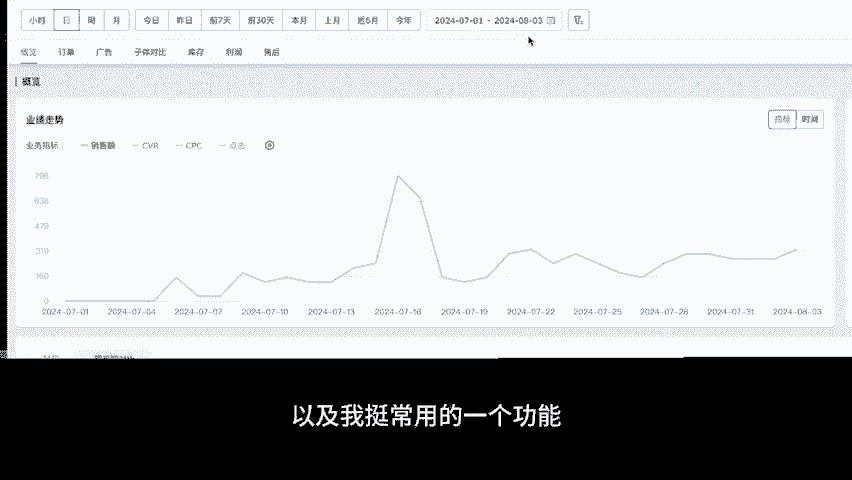

我们在做市场调查的时候，譬如说以这个产品为例嘛。

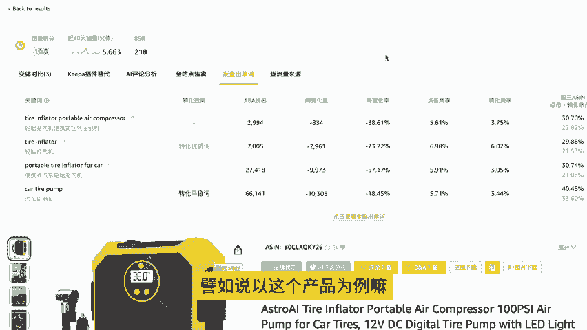

我我看到这是个潜力的一个新品。然后我经过了研究，想卖这个，但是呢它有很多不同的这个颜色跟尺寸。那我。我如果一开始四个是四个变体都卖，两两个尺寸，两个颜色嘛，四个变体我都卖。

我需要的备货跟货款肯定是会非常非常高。我有可能资金周转不过来。所以这时候我应该怎么备货，甚至是说我我备货数量，我下单数量是不是都要一样，还是我应该怎么样去去配比这个比例啊，先跟大家分享的怎么做。

我们这边是用这个卖家精灵有一个变体比对比，在这边可以快速看到他三个，他他的全部的变体。

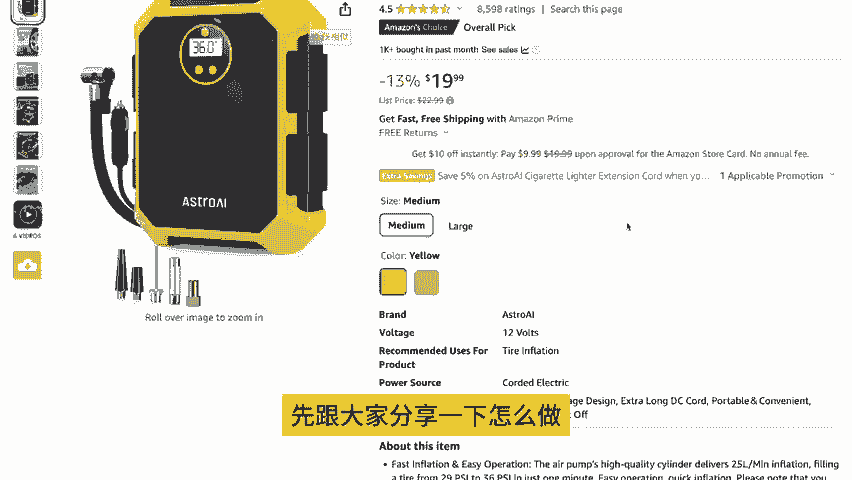

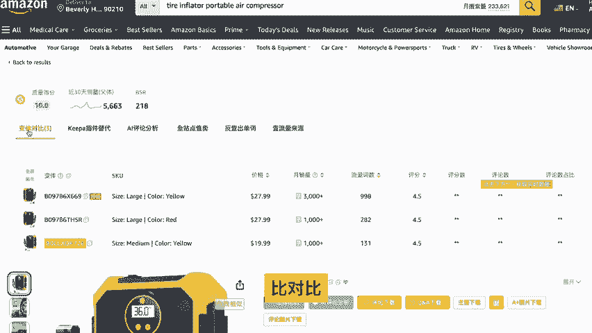

子销量就是他每一个子销量的这个这个呃它近30天的一个销量。那你可以很明显整这边就可以看出。

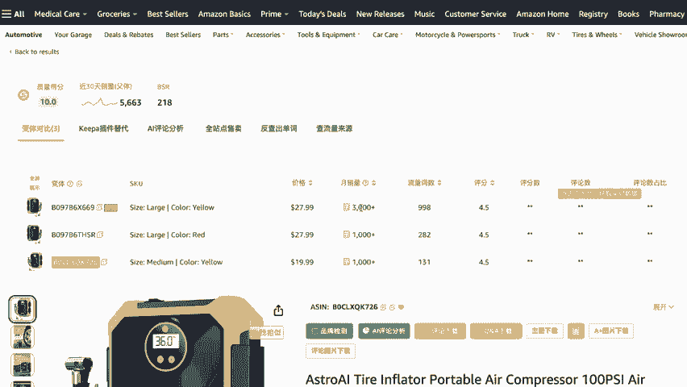

究竟是哪一个尺寸，或者是哪一个颜色是卖的比较好的。可以看很明显是这个大尺寸，黄色的卖的比较好。那你如果是在卖，譬如说呃。手表的表壳，你就可以知道你要什么颜色卖的好，或者是你要什么尺寸，你是卖的好。

那你就可以按照这个比例去进行下单跟跟备货。

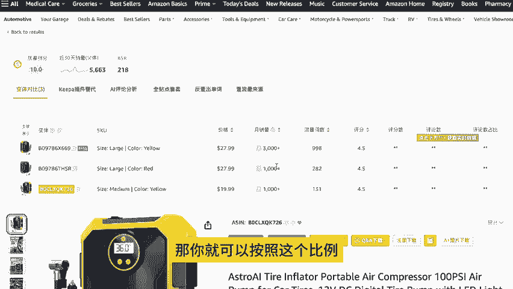

好吧，那如果你在卖一些款式的话，你也可以从从这边去判断消费者他喜欢的是什么样的款式，这是第一个。

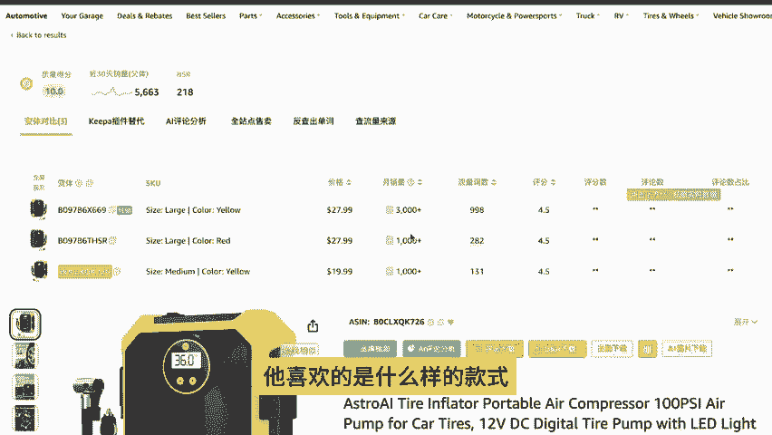

用卖家经营的变体比对去研究一下什么样的变体卖的比较好。

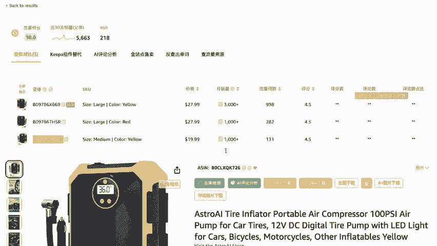

除了这个以外，我们能够看到什么颜色卖比较好以外，还有什么功用。它还有一个很重要功能。就是当我们一般在分析竞品销量的时候，我们常常看到的是它这个比如说哦在以这个这个产品为例好了。你看它月销量是4000。

那你看这我这个东西月销量4000，它是一个市场需求很高的一个产品，所以我就去卖了这个产品。

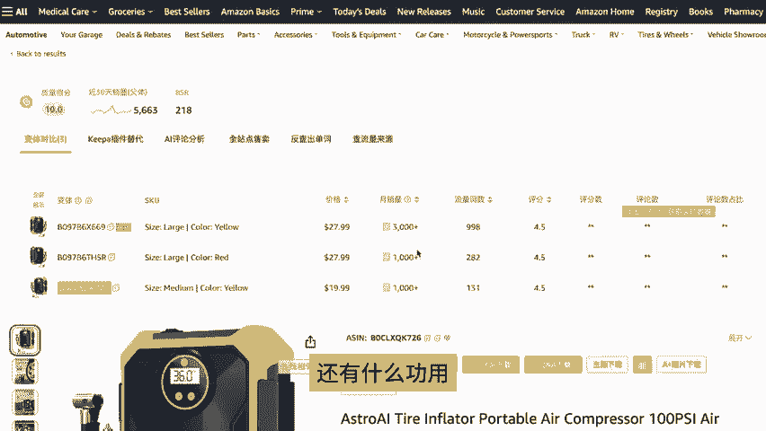

但是你殊不知你点进来之后，你。你真的去卖了这个产品，你发现你根本就卖不到4000，你可能卖了一两百。那为什么呢？是因为它这个4000，它是将它全部变体给总合起来的这个销量。

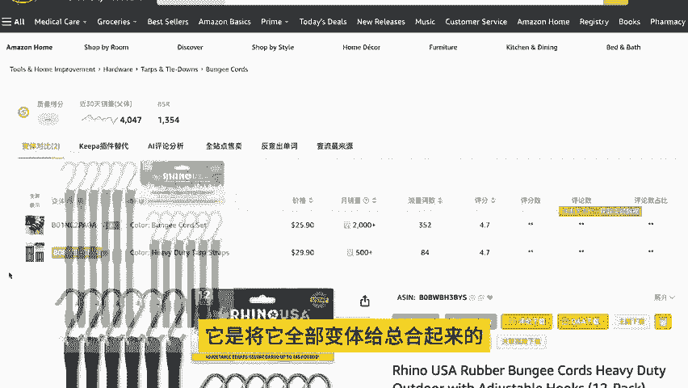

他有可能主要的卖的都是另外一款产品。那你你如果只只用传统的方式去看，你看到他卖4000，你就就很高兴就去下了4000P然后结果你根本卖不掉，因为他。主要是这个是主要这个在卖。

它只只占了大概一点点的一部分的销量而已。所以你有了这个变体比对，你就可以去。

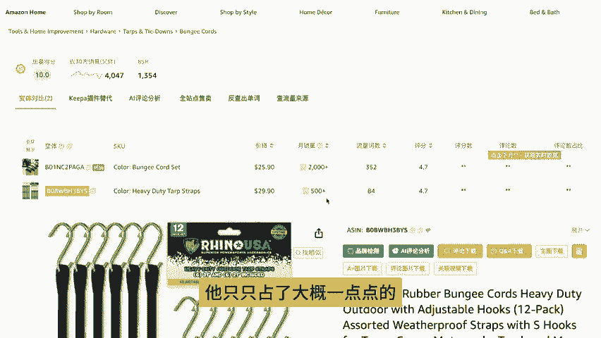

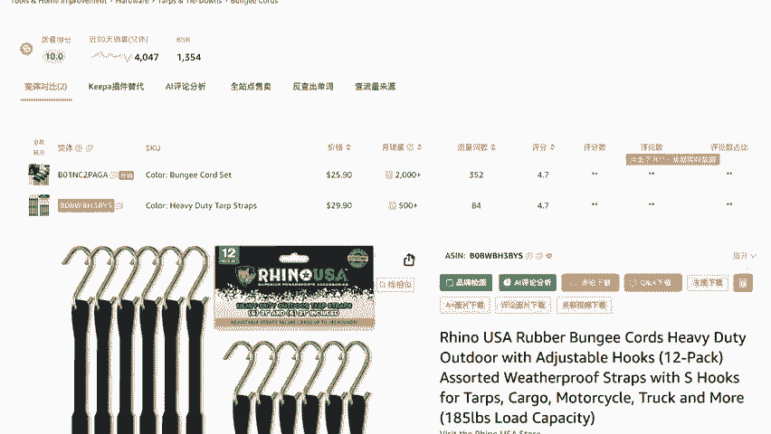

辨别出你看到的销量到底是不是这一款产品的销量。吧，所以这个很重要，这个可以帮助你不要不要被他整个这个整个变体给骗了。这个很重要。那你除了这个以外，你也可以从这个地方可以看到它的流量词数。

也就是这个产品它有多少的流量池，它。是不是靠自己获得了这些销量的，还是说其实他的流量池根本就没有。它主要都是靠另外一款产品在帮他带流量的那如果这样子，如果他这边数量流量次数很少的话，然后你去卖这产品。

你很有可能根本就没有流量进来。因为他卖他销量好，之所以好，是因为它绑在了另外一款流量高销量的产品底下，所以它有流量。那如果你你单卖的话，你搞不好死的很难看，卡越库的货在那边卡虑货在美国卖不掉吧。

所以一定要用遍体比对去核对。究竟你看到的销量好，是不是你要卖的那个款式，还有他流量次数到底多不多，还是他是靠别人帮他引流的，他自己本身没办法带流量。啊，这个非常非常重要，一定要去复合。

