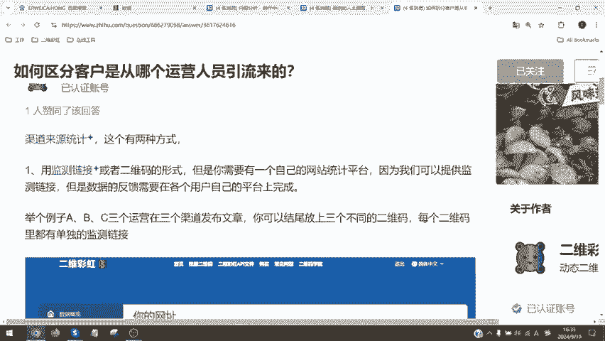
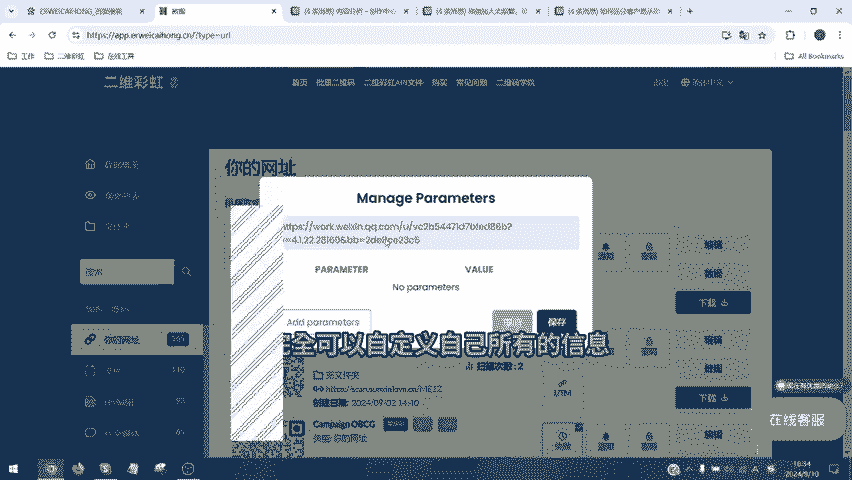
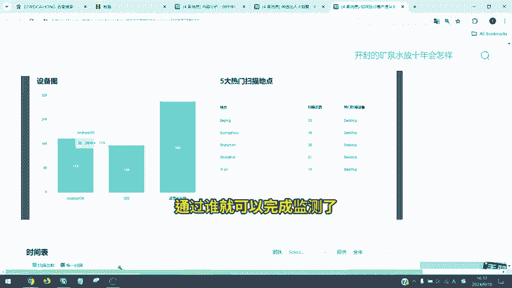

# 如何通过二维码了解客户从哪个渠道过来的？ - P1 - 二维彩虹Erweicaihong - BV1W5ycYbEfH

🎼hello大家好，又到了每日回答网友这个话题的时间。今天是有用户向我们提问，如何区分客户是从哪个运营人员引流而来的。然后他的问题是，他们公司目前在做运营，通过各种平台将用户添加到他们的微信。

但是由于运营平台较多，各个平台运营的账号也很多，不清楚添加到他们微信呢是通过哪个平台，哪个账号引流的。有没有什么好的办法来区分客户的来源是哪位运营。然后这个解决问题非常简单，只需要用到渠道来源统计。

然后就可以解决这个用户的问题，有两种方式啊。第一种是用监测链接或者二维码的形式。但是首先这里头大家需要自己有自己的网站平台。如果你只有有自己的网站平台了，可以直接通过我们提供的监测链接。

也就是在二维彩虹的后台，大家可以看到一个UTM的按钮。

🎼UTM那里在UTM里头，你完全可以自定义自己所有的信息，随便自定义你所有的信息，然后你就会出现。

🎼比如说这个人是渠道一的运营是刘亦菲，后边的渠道是百度，然后在后边你可以自定义命名上自己的数字，12345678可以代表你的渠道编号，也可以代表你的产品编号。然后当生成这个监测链接之后。

所有从这个监测链接或者监测链接跳转进来的二维码，都会在你的自己的统计后台进行显示显示。比如说数量点击频次，包括用户停留时间等等，这些都会在你自己的平台上显示，不在二维彩虹的平台显示。

但是我们可以提供给你，你可以将你所有的渠道的二维码都生成带监测链接的二自定义监测链接，这样你就知道哎渠道一渠道二都分别是谁来扫码添加的。同时如果大家说唉我没有这个网站后台说我就是一个超级小型的商家。

我们有自己的这种网站，我们有统计后台，那怎么办？我们向大家推荐第二种方法，就是将你的渠道人员分成不同的二维码，然后进行重命名，等于每个人命名一个二维码。然后你也可以看到外层用户数据。

这种第二种方法和第一种方法的区别在于什么呢？第一种方法在于你可以统计到用户跳转之后的结果。😊，🎼渠道的监测链接。但是第二种方法呢，你只能统计到有多少人扫码进来，通过什么渠道。

但是你不能知道说哎比如说张三李四都点了这个链接了，但是你不知道的是他们是不是点这个链接进来了，还是他们点了这个链接都退出去了。这就是第二种方法和第一种方法的区别。

我们看一下所有的二维后台生成的二维码都可以进行重命名重命名之后，我这是运营人员实例。然后我们可以统计到它的时间地点扫描设备IOS安卓桌面浏览器北京、广州深圳精确城市。

然后扫描总数和唯一扫描是一个人扫了一次，还是一个人扫了100次，我们可以在后台查看，同你还可以分成不同的渠道。你看后我们这就可以看成这是ktmail然后上面还有微博，还有自定义的公司的官网链接。

后边是点击你可以完全查看不同渠道的扫码用数据。通过这两种方式，大家就可以实现说我想知道哪个用户扫描哪个链接进来的，通过谁就可以完成监测。😊。

