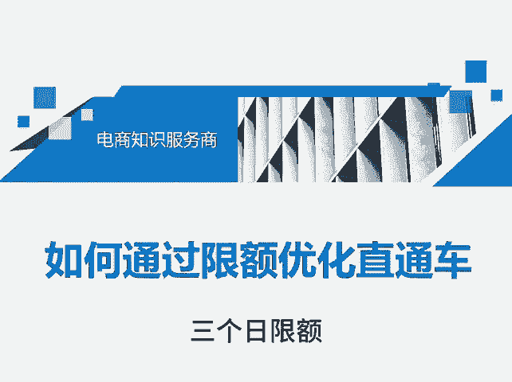
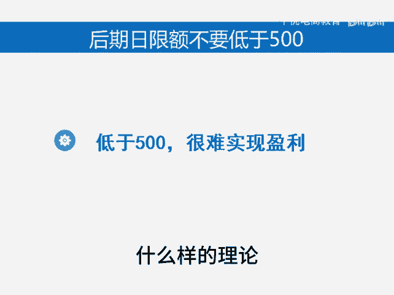
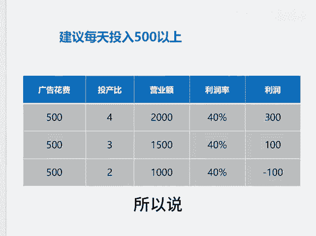

# 如何通过日限额优化直通车 - P1 - 千优电商教育 - BV1oExrewEjV

在直通车的优化里面，日限额是经常被我们忽略的一个数据。就是日限额如果你优化得当，它可以帮你盘活店铺。如果呢日限额你会控制，它可以让你实现盈利。这个视频和大家分享三个日限额优化的原则。

首先第一个日限额的调整原则是只能增长不能降低，在新品阶段，我们要做一个整体日线额的增长，日限额增长呢，那么你的销售额增长。我们知道新品阶段系统考核你什么，考核你点击率转化率，还有你的增长率以及坑产。

所以说在新品阶段，我们要做的是增长率。当我们拉升到一定程度之后呢，你要做的是日限额它可以稳定，但是不能降低。因以为你只有日限额稳定，就是你的消耗稳定，拼多多才会稳定的给你流量，这是第一个原则。

第二个原则是后期脱价的话，日线额不变。我们知道当我们拉升到一定程度之后，我们要拖价。所谓托价就是降低单笔成交花费。😊。

很多朋友没把这搞明白，它降低了日线额。那么降低日线额，你的流量就会减少流量减少，在你转化率不变的情况下，你的订单量就会减少。所以后期托价拖的只是单笔成交花费就是出价，甚至你脱价之后还要提高日线额。

这样的话呢，有助于你获得更多流量。第三个，这个很重要。就是后期日线额你不要低于每天500。如果低于500，你很难实现盈利。那这是一个什么样的理论呢？可以看这张表格，如果你每天广告花费500块。

你的投成比能够做到4的话，那么你的营业额2000块。如果你的利润40%，那么你的利润是800块，减去500块的广告花费才有300块的利润嘛。所以说如果你的投入太低，盈利就会很少或者不盈利。我是讲师大牙。

欢迎大家扫码添加我的微信。不方面扫码的朋友可以添加我的微信号，80221430。在这里给大家准备到了一套。😡。

新手运营入门的大礼包，希望能够帮助大家。