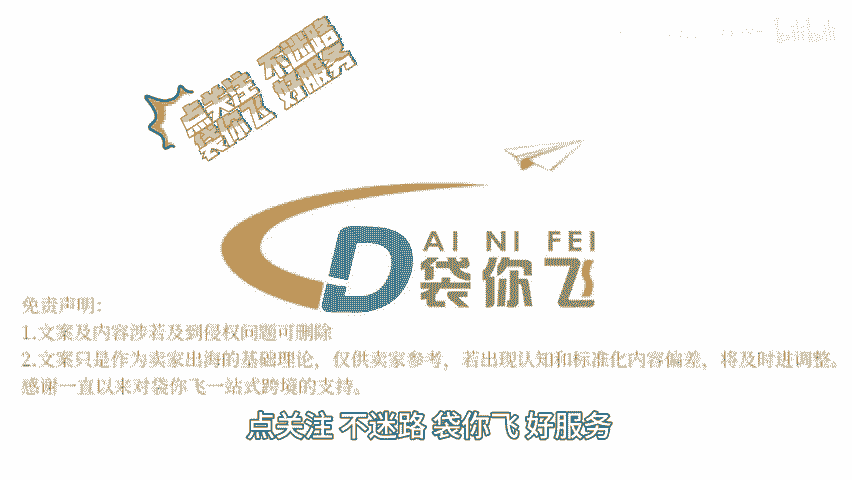

# 如何针对商品制定广告策略 - P1 - 袋你飞进亚马逊课堂 - BV1t9mGYGE9e

🎼Yeah。

🎼欢迎收看带你飞电商小课堂。今天我们来了解一下亚马逊卖家如何针对不同商品制定广告策略，卖家可以根据产品是标品还是定制类产品，选择不同的广告策略，标品可能更依赖于价格和销量。

而定制类产品则可以强调独特性和个性化服务。亚马逊提供多种广告类型，了解每种广告类型的特点和展示位置，可以帮助卖家更精准的定位广告，也可以考虑自动广告，自动广告，让亚马逊根据产品相关性、自动展示广告。

而手动广告则可以更精确，的控制关键词和商品投放，确保产品标题图片描述等都优化到位，以提高广告的转化率，通过in定位广告，可以直接在竞争对手的产品详情页展示你的产品，或者定位互补产品。

以吸引潜在客户展示型广告可以在亚马逊站内外展示，通过分析用户行为主动向潜在客户展示广告，有助于提升品牌知名度和。😊。

🎼量使用自定义商品图片来传达品牌故事，提高广告的吸引力，了解不同广告类型在亚马逊首页搜索结果页和商品详情页的展示位置，可以帮助卖家更好的规划广告投放策略，卖家还应该持续监控广告表现。

包括曝光量、点击率、转化率等关键指标，并根据数据进行优化。例如在黑屋网易这样的大型促销活动期间，增加广告预算和促销力度，以吸引更多买家，除了亚马逊站内广告，也可以考虑站外引流。

如通过社交媒体博客等渠道推广产品，合理分配广告预算，确保广告投放在关键时期，有足够的曝光，同时控制成本，点关注不迷路，带你飞好服务，点赞关注，带你了解更多跨境资讯。😊。

