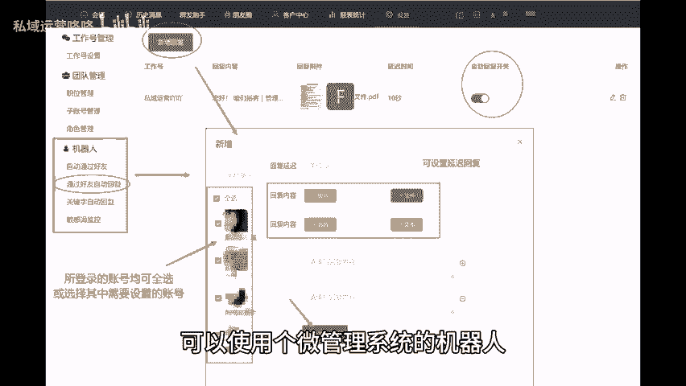

# 如何防止用户流失？三招提升用户留存率！ - P1 - 私域运营咚咚 - BV1QH4y1c71P

🎼不管是运营者还是销售客服人员，防止用户流失，都是非常重要的一环。今天就给大家分享三个小技巧，帮助大家提升用户留存率与利他思维，在给用户发布推广消息时，要突出利他性，让用户觉得有利可图。

传递给用户的信息，需要强调产品或服务对其带来的价值和好处，而不仅仅是自身的商业利益。通过了解用户的痛点和期望。我们可以定制个性化的推广内容，使用户认为与我们建立联系是有价值的。2、及时回应用户反馈。

对于用户的反馈与问题，我们要及时回复，以展现我们对用户的重视和关注，可以使用个微管理系统的机器人自动回复功能来提高回复和沟通效率，特别是对于常见问题或简单咨询，同时要确保回复内容贴合用户的问题和需求。

提供清晰详细的解答。3、深挖用户需求，为了提高用户的留存率，我们需要更深入的了解客户的需求和真正的痛点，通过定期的用户。😊。

🎼调研和反馈收集。我们可以发现用户的潜在需求和改进的空间。根据这些洞察，我们可以持续优化产品功能和体验，以及提供个性化的推荐和定制化的服务，从而增加用户的满意度和忠诚度。以上就是今天分享的内容。

希望对大家有所帮助，咱们下期再见。😊。

