# 学习小红书运营看这一篇就够了！新手0基础小红书开店全套教程，全网最牛运营思路、日常工作、及数据分析逻辑，完整的小红书运营实操教程！ - P1 - 红书运营 - BV1fy411v7AT

大家好，今天给大家分享一个，小红书零基础开店的全套一个课程内容，这个课程内容呢包括11届的内容准备，首先呢我们从开店准备开始，一直呢到我们最后的一个客服服务与售后啊，整个店铺呢他是讲解我们小红书。

零基础开店的一个整体操作啊，当我们学会这个模式以后的话，我们前期小红书开店的话，所有的基础准备就基本上全部都做完了，那么开始我们今天的第一节课啊，小红书的开店准备开店准备的话。

小红书这边开店准备其实是比较容易的，首先我们只需要注册一个小红书的一个账号，然后呢准备身份证的一个正反面照片就可以，同时呢我们这里呢需要注意一个点呢，就是我们需要拥有微信支付和支付宝支付啊。

同时这两张嗯支付方式的话需要绑定银行卡，这两个支付方式的话，第一个呢是小红书，到时候客户进行付款啊，我们进行收款的一个记录，同时绑定这些东西以后的话，小红书他店铺的话它也会有一个账号的权重。

会提升我们整个店铺的一个权重，如果说不做这几个东西的话，我们的一个系统的话，它是不完整的，也就是我们小红书的话，它是没办法正常运行的，我们收到的一个流量和数据的话，基本上都会比较小啊。

就是操作起来的话会很麻烦，最后一个呢就是说小红书的一个准备资金，保证金呢准备1000一次，因为是1000块钱的保证金，加七块多的一个手续费，他这个里面的话和其他的一些平台的话，可能会有一点区别。

其他平台的话我们只需要交保证金就可以啊，他是不需要收取手续费的，但是小红书这一块的话嗯，他和其他的话可能会商业基础比较严重一点，他的另一个保证金的话还需要收取手续费。

包括我们后续的一些那个产品卖出去以后啊，不管是我们怎么操作的，他都是要收手续费的，所以说这个的话我们大家一定要注意啊，所以说小红书的话，它的整体的一个啧，流量和大众效果的话还是不错的。

但是说嗯在资金成交这一块，包括我们这个店铺成交也好，或者说是其他的，只要是有资金流动的话，他的这个税税率吧，我们姑且这么认为吧，就是税收比例比较高啊，所以说大家一定要注意一点。

然后呢店铺的一个流动资金准备的话呃，至少要备2000块钱以上，为什么呢，因为我们前期去操作店铺的话，他这个小红书没有任何数据的话，我们是没办法起店的，就说我们店铺起来以后的，我们只交了保证金的话。

我们这个店铺也不好做，所以说这2000块钱的话，是我们的一个产品的一个活动资金，包括我们前期操作数据啊，啊怎么去操作啊，都需要用到的一个店铺的一个流动资金，因为没有这个流动资金，我们去操作整个店铺的话。

他是基本上是操作不起来啊，因为小红书跟其他的话不一样，这个呢就是我们开店所需要准备的一些数据啊，准备这几样东西以后的话，我们这个店铺开店准备就基本上已经完成，完成了，就说整个店铺我们就可以开始运行了。

后期的一些操作的话，我们再给大家讲解，其实的话小红书整体的话，开店准备的一些东西都是比较简单的，主要就是说我们手机一部啊，身份证的一个正反面照片，当然是必须要是本人的啊。

微信支付宝这个的话基本上现在基本上都有啊，但是呢他需要绑定银行卡，不要拿新注册的微信和支付宝去使用，这样的话它的一个怎么说呢，就说我们收款过多的话，会导致这种账号容易被封，知道吧。

就说到时候再去更换微信或者支付宝的话，不比较麻烦，所以说微信支付宝的话一定要使用，最少使用3年以上的，大家一定要注意了，同时要绑定银行卡，这个银行卡的话，你不绑定银行卡的话。

后续微信和支付宝的信息它是不完整的啊。

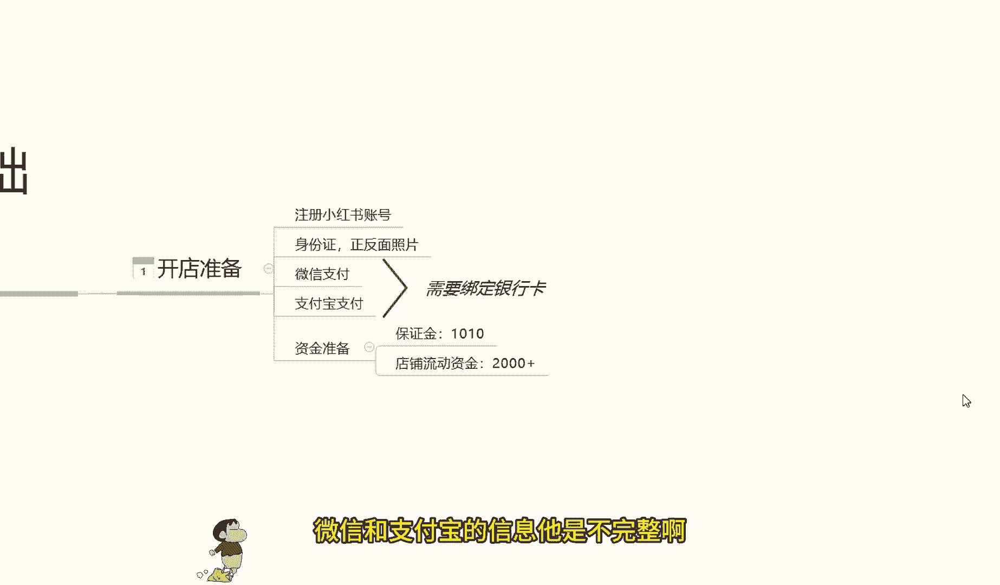

那今天的课先到这了，大家可以给个三连支持一下哦，另外给大家准备了视频资料大礼包，从零基础入门到高阶运营技巧都有包含，学完自己独立运营账号是没什么问题的，当然如果有小伙伴想要诊断优化账号。

也可以在评论区留言找我，帮你诊断店铺，给你一些实质性的建议。

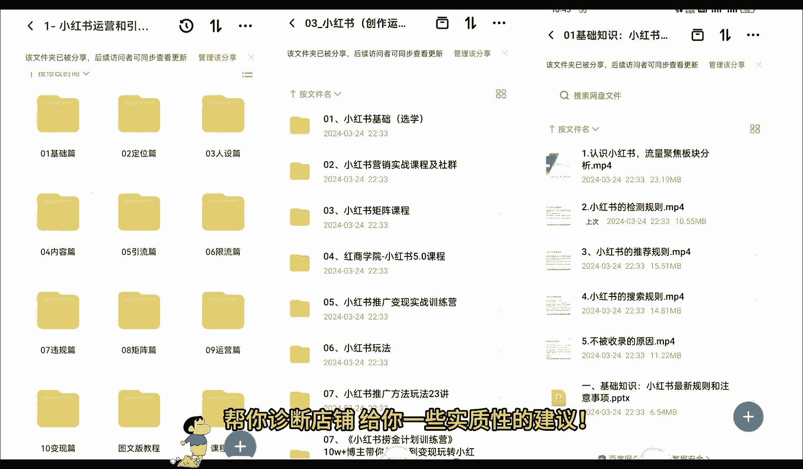

小红书零基础开店的第二课时啊，小胡说的一个店铺注册呃，废话不多说呢，直接进入我们今天的一个内容店铺注册，小红书店铺注册的话，相当于来说的话，还是有一需要我们注意的一些选项。

因为他的一些店铺注册的内容的话，它不是很好找啊，在我们戏台后台系统里面的话，它隐藏的比较深，它不像其他的呃，其他的平台直接打开就可以注册，首先呢我们店铺注册的话，就说我们的用个人的手机就可以啊。

当然你如果说有备用的多余的手机，用工作手机去操作的话也行啊，用手机下载小红书，他的一个系统就可以了，手机下载小红书系统以后的话，账号注册，首先我们手机号登录我们那个账号啊，账号登录进去以后的话。

点击我们那个他这个的话其实和微信一样，在右下角啊，点击我们的那个人物头像就可以，就可以进入到我们的个人中心，然后登录账号就行，登录账号的话呃，他这个里面的话有一个小红书，注册之前的话。

上节课内容也给大家讲过了，我们的一些开店技术的一个准备，让大家让大家是准备过小红书注册的，一个账号的，登录这个账号以后呢，在右上角啊，点击我打开，在右上角或者是左上角，他有一个三角的一个斜杠啊。

点击这三条杠以后的话，选择创作中心，点击创作中心以后呢，然后点击更多的一个服务，更多服务进去以后的话，大概在嗯第三排选择开通店铺啊，就是第三个方框，它那里面的话是分为了四五个方框。

每个方框里面的选项内容不一样啊，那个呢是设置我们的一个账户信息的，其他的不用管，直接选择我们的一个店铺开通就可以，然后点击进去以后，它会显示一个界面，界面的话它是以广告的形式推荐给我们的。

我们在里面的话，它有一个点击立即认证就可以了，点击进去就可以注册账号，其他的东西的话其实是不用看的，因为看了也没什么作用，我们对我们新手来说的话，那些东西看不看无所谓啊，点击立即认证的以后的话。

按照他的一个正常步骤走就可以了，然后提交我们之前准备提前准备好的一个材料，提交身份证的一个正反面，然后选择店铺的类型，这个里面的话注意一点啊，店铺的类型的话，它是分为三个类型的，个人店，企业店。

或者说是啊旗舰店等等，这里面的话我们正常前期操作啊，不管大家怎么样，如果说有熟悉的话，可能就不需要了解这一点了，如果说不熟悉的话啊，大家开个个人店就行了，用个人店的话，本来就是让我们上手去实验操作的。

本来做任何数据啊，我们不管是做电商也好，或者是做店下的店铺也好，我们大家都有要有一个熟悉的过程，熟悉了以后的话，我们再按照这个模式去操作就可以了，所以说大家一定就要注意了，我们前期开个个人店铺。

自己先把所有的流程熟悉以后呢，再去操作，不然的话我们所有的一个信息的话，基本上嗯就是我们前面用力过猛，你后面就会对这些东西失去兴趣，为什么，因为我们前面已经失败了，你后面再做的话。

就会对自己产生不那么信任的一种感觉，如果你做多了以后的话，你自己就放弃了，而我们在做任何东西的时候，一定要先把自己的一个基础确认好啊，我们基础确认好了以后，我们有一定的基础了再去操作。

所以说我给大家讲这些内容的话，就说我们按照步骤一步一步走，不要操之过急，前面的话我们没有必要直接就说上来一一下，投个几万是呃，上10万，哎，我非要把这个店做起来，没有必要啊，我们刚开始做店的话。

投个两三千块钱，三五千块钱，其实是花个一个多月，两个月时间把整套流程熟悉了以后的话，后面会节约我们很多时间的啊，所以说大家注意点啊，然后继续我们的一个内容，首先要登录到达我们的一个选择店铺类型啊。

选个人店铺就行了，其他的不用选了，用户能看这个课程的基本上都是新手，所以说大家了解一下就行啊，然后填写店铺的一个信息，这些信息的话后面是可以修改的，我们随便填写一下，把信息尽量填准确就行啊。

尽量的话就是在后期不要去修改，修改的话影响是有，但不是很大啊，就是说没有必要啊，一次性弄好就行了，店铺信息填写完成以后呢，我们再进入下一步啊，直接完成我们的一个认真完成，我们的一个小红书店铺。

基本上呢就已经注册成功了，他注册成功的话是三天的，有三天的一个反馈时间，但是基本上的话五到10分钟，他的反应对于其他平台来说的话会稍微慢一点，如果说我们去某多呀，或者说某宝去注册。

或者说是呃其他的这种交易平台，去网网络交易平台去做的话，可能会快一点，但是小红书这边的话，因为他的系统还不是很完善，所以说我们有很多操作的空间，但是呢它同时它的一个系统反应速度有点慢。

快的话五到10分钟慢的话可能要一天左右啊，基本上都在这个时间范围以内，他的店铺才会注册成功，注册成功，利润以后的话，我们才会去操作项目嗯，也然后呢，这节课最后一个点，就是说我们把账号注册成功以后。

在手机里面还要下载一个东西，这个东西呢叫小红书的一个客服工作台啊，客服工作台的话，他和小红书的店铺的话呃是类似的，但是他是做我们售后的，就是我们店铺里面来订单以后的话，会需要这个小红书的一个客服工作台。

他直接在小红书里面操作好，操作不了的，没办法去聊天沟通，他相当于是额外引流到了另外一个平台里面，去做了啊，所以说大家一定要把那个小红书的客服，客服工作台给下一下啊，这个呢就是这节课的一个店铺注册内容。

下节课呢给大家讲解一下，小红书整体的一个店铺类型的一个区分啊，我们前面要做的话，我们到底去做什么店，适合我们，大家好，今天给大家分享一个小红书，零基础开店第三课啊，店铺的一个类型，店铺类型。

这一节课的话是让大家充分的了解小红书，他整个系统里面，他的所有店铺类型和他的一个类型区分。

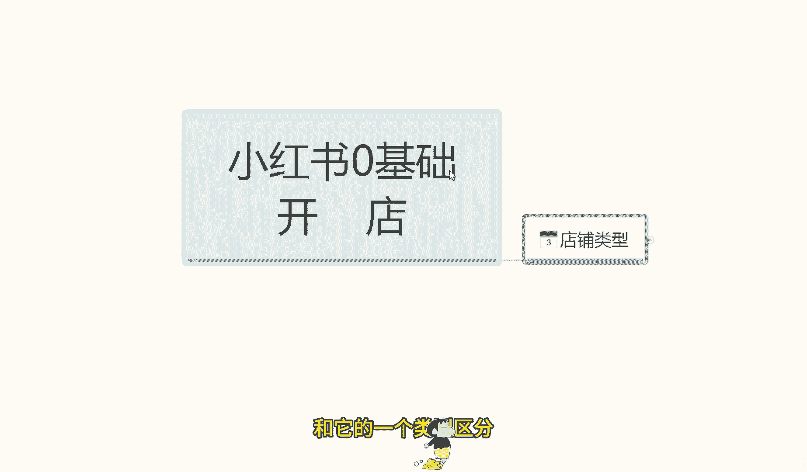

那么直接开始我们这节课的内容。

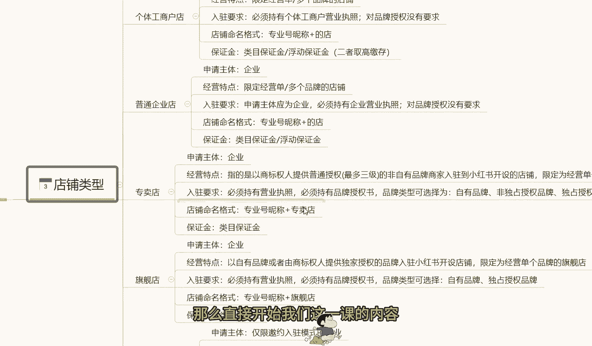

小红书的话，我们正常的一个店铺类型的话，它其实是可以分为很多种的，呃，这里面的话，我给大家把它全部都单独的列出来了，诶因为要给大家详细讲解一下，让大家了解整个小红书的一个，店铺类型的一个体系。

我们在什么阶段应该怎么去操作啊，小红书的整体个人嗯，整体的一个店铺体系的话就是第一个个体店，第二个呢是个体工商店户啊，第三个是普通的一个企业店，第四四个呢是专卖，第五个是旗舰啊。

最后的话就是说一个是卖场型旗舰店，他这个的话其实也就是品牌推销商而已啊，那首先我们来了解一下啊，个人店，什么是个人店呢，申请主体额，个人用户就是我们个人使用的，就是我们刚毕业也好，或者说是辞了工作。

自己想做点小事情，就跟我们平常在外面摆地摊一样啊，这就是属于个体店，摆地摊的话，你也要注册一个营业执照，或者说是一个小小规模的一个示范营业啊，让银行给你开通卡，然后给你开通支付权限。

这个个体店的话就类似于这种啊，基因特点的话，就是说经营限定的精英零星的小额商品啊，比方说首饰啊，服装包包包包，手机壳呀等等这些啊，多个品牌就是杂货铺，什么都可以卖，就看我们自己怎么去操作了啊。

入住要求的话，这个的话基本上是比较简单的，他没有什么特定的一个入住要求，就是我们个人一个身份证就行啊，额然后呢店铺命名的一个格式啊，专业和成泥就是然后加我们的一个店名。

就我们个体店他自己会系统给我们匹配名称的，这个的话不用管保证金的话，内部保证金和浮动保证金嗯，二者取高，这个怎么说呢，保证金这一块的话，我之前也给大家说过啊，就是说1000块钱的保证金。

这个是个人店铺的一个数据准备，如果说是超过1000块钱的话，那都是个体工商或者说是旗舰店专卖店那种，而且他的这一个整个保证金的话，他的浮动都很明显，待会的话最后一点我会给大家详细讲解一下。

他这个整个小红书的一个保证金内膜，它是怎么划分等级的，好吧，那下面呢我给大家讲一下，什么是个体工商的一个店铺，个体工商店铺的话，他和个人店铺不同呢，就是说嗯他的入驻要求可能会稍微麻烦点。

需要我们有一个营业执照啊，对品牌授权是没有需求的，只要我们自己有营业执照就可以了，其他的基本上都是一样的啊，他和个体店的话就是一个入住需求，多了一个营业执照。

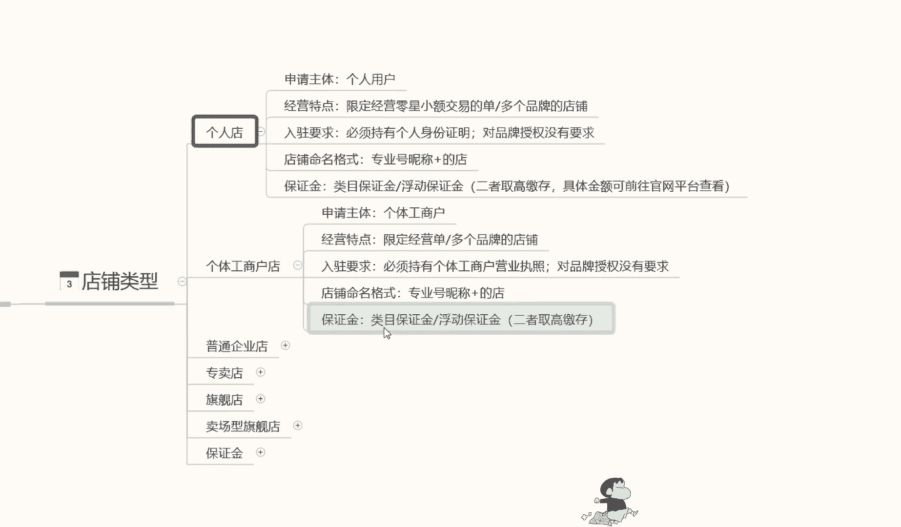

其他都没什么区别，普通企业店的话，他和和其他的话也是包括下面的一些店铺，他所有的一个区别就是在入驻要求这一块啊，入住要求这一块，他每一个店铺入驻的一个要求是不同的，就看我们自己有没有这个资质去认证了。

当然了，这个企业所有店铺的一个入驻要求，越简单的，你的权重肯定也就越低啊，越复杂的你的权重也就越高，但是我们前面嗯新人刚开始操作店铺的时候啊，没有必要弄那么高的要求，做个个人店啊。

自己测试一下有没有这个潜力，这个产品在这个小红书系统里面，好不好做就行啊，没有必要投入太多，普通企业店的话，入驻要求的话就是说啊申请主体为企业，就是我也有自己的公司，或者我也要有自己的产品。

我这个是有国家认证的啊，必须持有企业的营业执照就可以了啊。

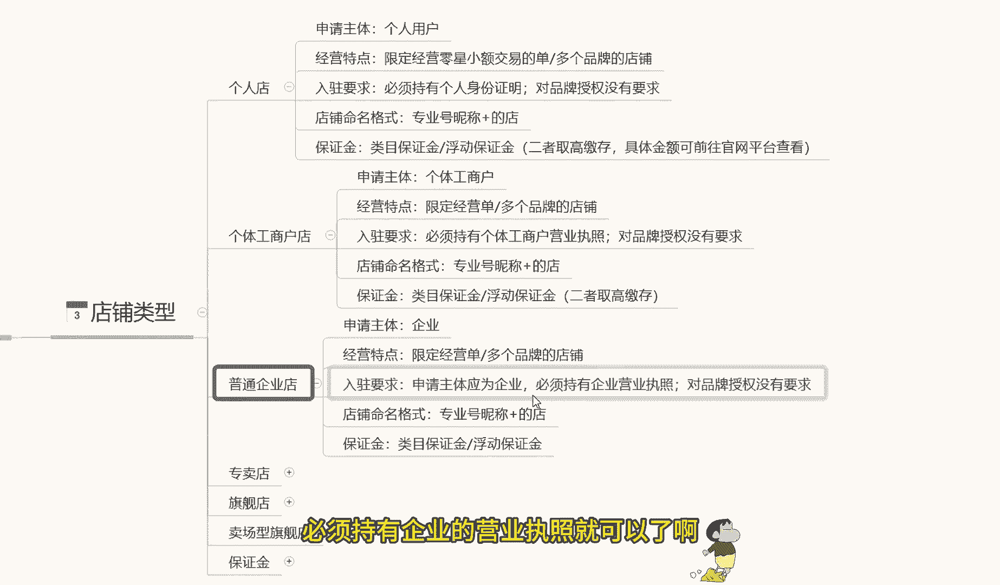

其他的话没什么需求，专卖点旗舰店。

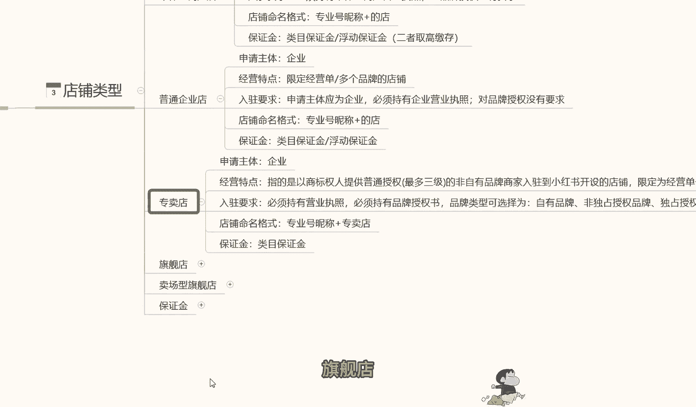

包括卖场型旗舰店啊，他只是说换了一个名称，专卖店的话入驻要求的话就是营业执照啊，品牌的一个认可自有品牌，非独立品牌啊，就是你的品牌我们自己啊，像阿迪啊那种都是国有的很知名的那种品牌。

我们自己小企业也有自己的品牌，你只要在国家上面注册认认证认可就可以，这都是属于专卖店，就是我卖我自己的产品啊，把我的资质刷上去就可以了，旗舰店的话也是一样的，他只不过是啊必须持有营业执照。

必须持有品牌授权书，我自己没有品牌，但是我有别人品牌的一个授权书就行，卖场型专卖店的话，这个具体要求回炉的话，可能根据平台的需求不同啊，他的内容也是不一样的，经营特点的话就是说零售的一个资质啊。

并且开设经营多个品牌的一个旗舰店，但是嗯基本上在小红书里面没有这种店铺啊，因为这种店铺的话，他小红书的流量和他不对标啊，因为小红书的整体流量的话，它是以女性为主的，所以说它的产品的话不对标。

很多的很多的那种大型的旗舰店的话，他不会在小红书上面去操作，所以说他会给了我们一个小卖家，很有必要的一个生存空间，就说他的竞争压力的话，没有其他其他平台那么大啊，就非常适合我们小卖家去操作一些嗯。

小型的卖卖品，这个就是说呃所有店铺类型的一个区分内容。

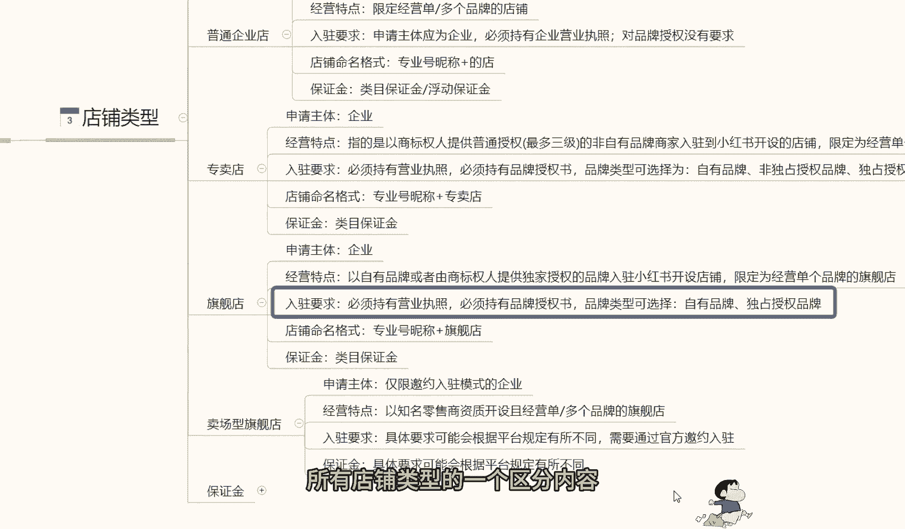

最后一个啊，就是给大家讲解一下，这些企业划分的一个保证金，因为他这个保证金的话，嗯基础保证金是1000块钱，但是基础保证金保证金之后的话，他还有额外的一个保证金，这个保证金的话。

在这里呢给大家讲解一下内部保证金，普通企业内部特殊类目和跨境内目，这里呢我给大家呃。

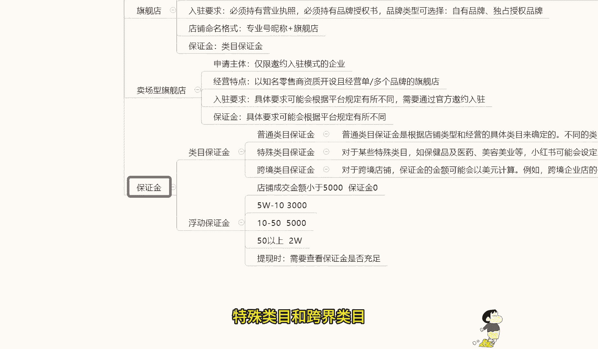

把它具体内容呢给大家打出来，大家可以看一下啊。

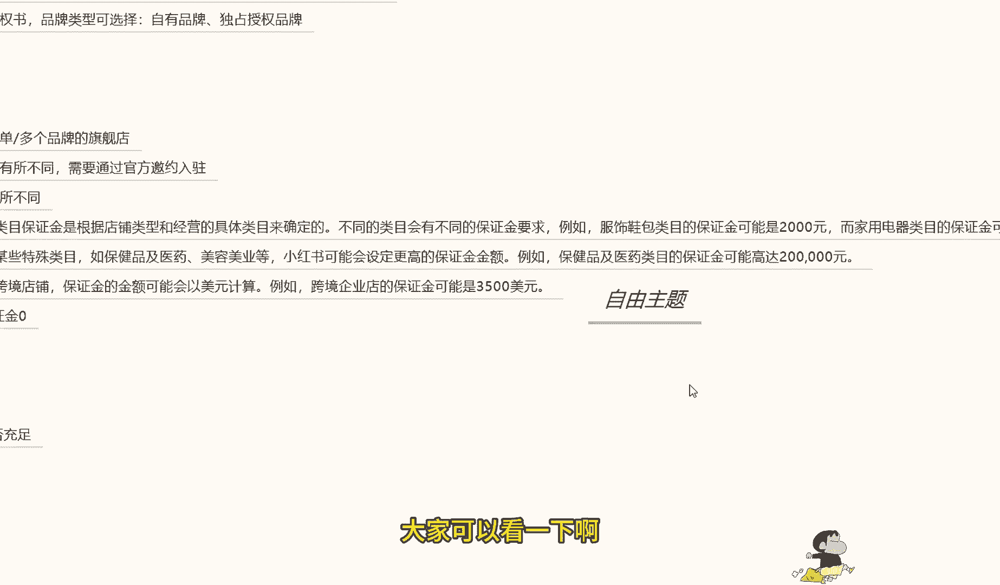

我在这里呢就不过多解释了，因为解释起来的话。

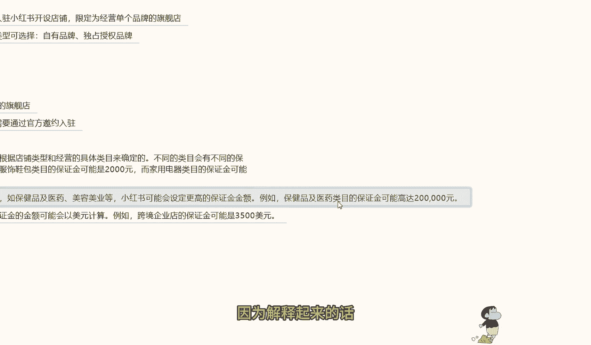

其实大家搜资料的话其实也能找到，只是说有些人的话嗯。

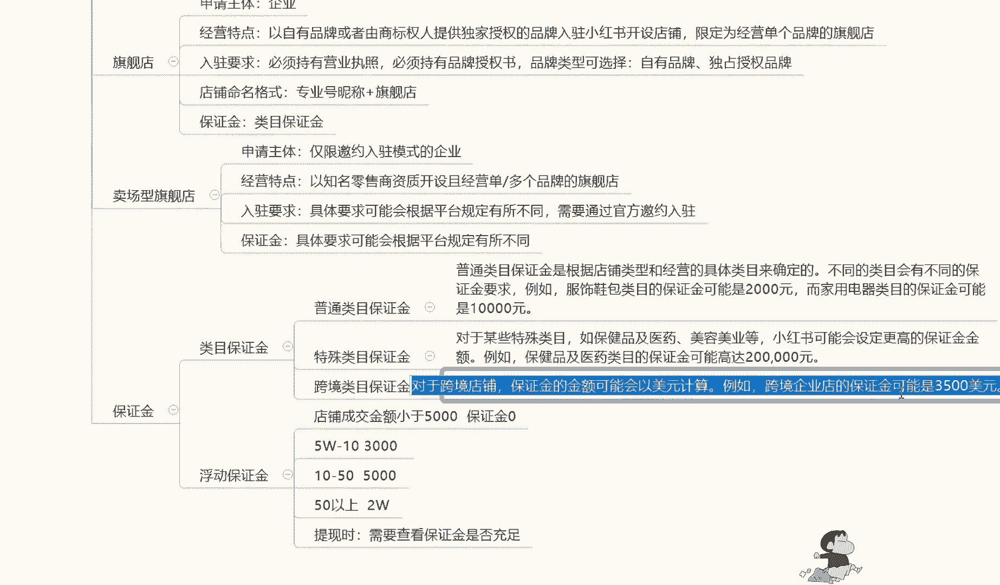

他懒得去说是吧，那我在这里呢就给大家打出来，大家看一下或者截图，对这方面感兴趣的话，可以去看一下，后面呢就是一个浮动保证金。

内幕保证金的话，他基本上都是个固定的啊，下面的就是浮动保证金，这个的话就是说所有内容的话，浮动保证金是最主要的，大家一定要了解一下什么是浮动保证金，浮动保证金的话。

它是根据我们店铺的一个成交金额来计算的啊，店铺成交金额小于5000，就是我们店铺前面如果说没有交保证金，或者是没有其他东西，成交金额在5000块钱左右的话，他的保证金是零。

但是我们起始资金保证金金是1000，不交这1000块钱的话，你这个成交金额小于5000块钱是没有用的，我们交了这1000块钱的保证金以后的话，我们在5万以内的一个店铺，就是一个月的流动资金。

在5万以内的话都是没有问题的，超过5万的话就不行，5万到10万的一个保证金的话是3000，10万到50万到50万是5000，50万以上是2万，他的这个保证金都是浮动的啊。

但是大致的一个需求的话都是在这个地方，就是我们店铺成交每个月的成交金额啊，超过5万到10万，我们需要3000块的保证金，才能把这个店铺里面的钱提出来，不然提不出来，10万到50万是5000。

50万以上是每个月是2万啊，当然了，我们做到这个时候的话，如果说每真的每个月50万以上，这样的一个成交金额的话，2万块钱的保证金也无可非厚非是吧，提现，然后呢提现的时候，他会查证我们店铺。

就是保证金账户里面的一个资金是否充足，如果说资金不充足的话，我们的资金一旦超过了5万，就是我交了1000块钱，保证金我我的资成交资金一旦超过5万，那我一毛钱都提不出来的啊，所以说大家一定要注意了。

不有时候提提现这个东西的话，一定要注意自己查看自己的保证金是否充足啊，就是说大家很多时候的话做东西就是往这些点，觉得自己的钱找不出来，小红书坑我之类的啊，其实不会，他只是说他的一个类目的一个浮动保证金。

在这个地方啊，要把这个这几个点注意好就可以了。

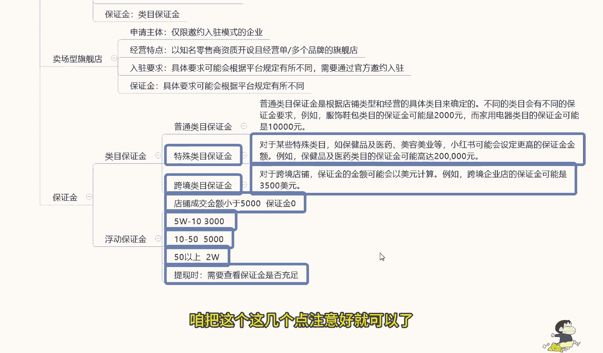

这个呢就是我们这节课的一个内容啊，给大家讲解了一下店铺的一个类型，和我们店铺类型里面对应的资金保证金，和我们的一个替换方式好吧，那么下一个节课呢给大家讲解一下选品与货源，小红书上面我们做什么样的产品。

选什么样的货源。

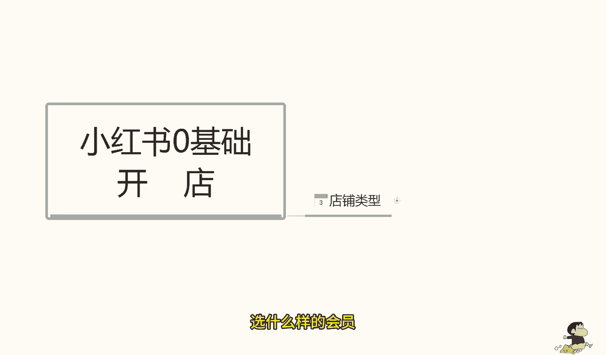

怎么去操作啊，那今天的课先到这了，大家可以给个三连支持一下哦，另外给大家准备了视频资料大礼包，从零基础入门到高阶运营技巧都有包含，学完自己独立运营账号是没什么问题的，当然如果有小伙伴想要诊断优化账号。

也可以在评论区留言找我。

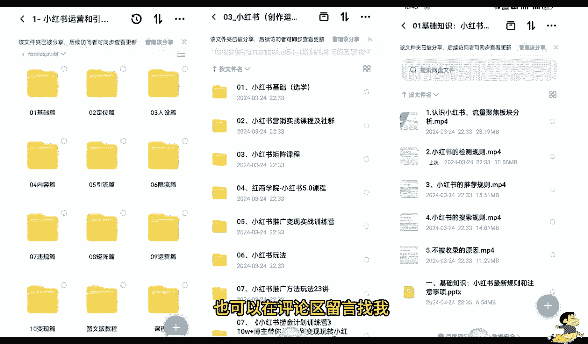

帮你诊断店铺。