# 实体结合私域，才是当下最主流的玩法 - P1 - 老胡聊私域 - BV1pNp1e2E83

🎼这人投做纯实体店啊必死无疑啊，实体结合私域，线下结合线上才是未来最好的商业模式。我举个例子啊，爆火的跳海酒馆啊，全身是北京后啊是卖野酒的二十几个客人呢加了一个微信群。

他们在2019年腊月27号呢签了第一家店啊，结果大年三十就碰上了特殊时机啊，哥几个就崩溃啊，喝了这酒一上头啊，往后海一跳就取了这个名字口罩期间呢普通酒馆不开张啊，但他们给群里的客人啊做是外卖生意啊。

不仅是外卖还常常直播和群友聊天啊，唱歌在最难的段时间啊，大家喝了他的酒啊，看见了他的品牌，自然而然的给身边的朋友们推荐就这样传播开了啊，风控期间从一个群裂变成一个4个啊，500人的群。五一解封后呢。

跳海开业了，人就啊吴泱泱的来了。这样一个从卖野酒的，摇身一变啊，成了北京西城区的头部。长乐私域的甜头后呢。😊。

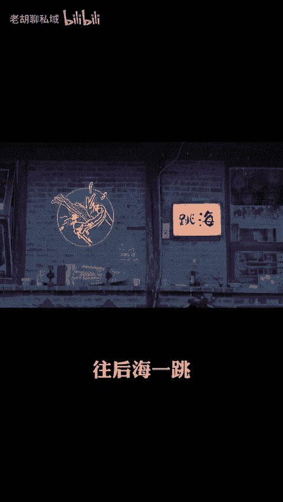

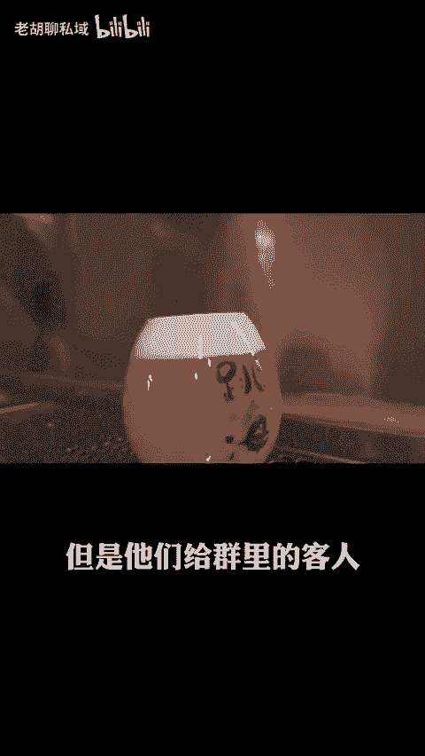

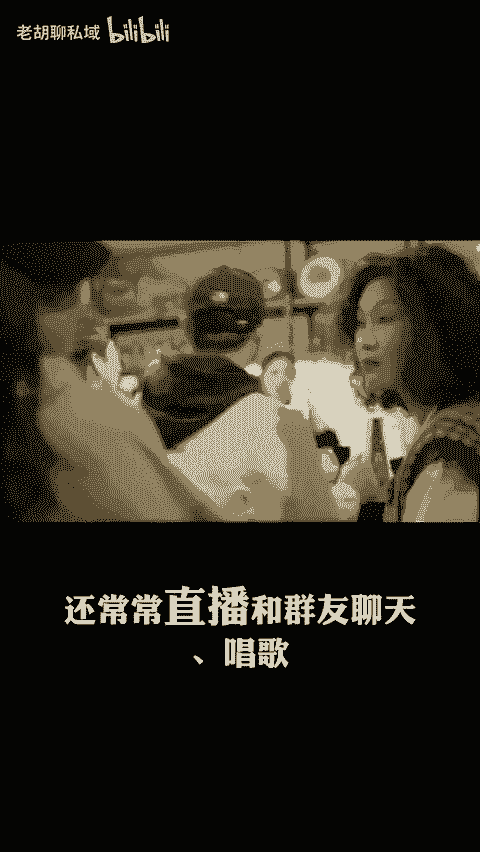

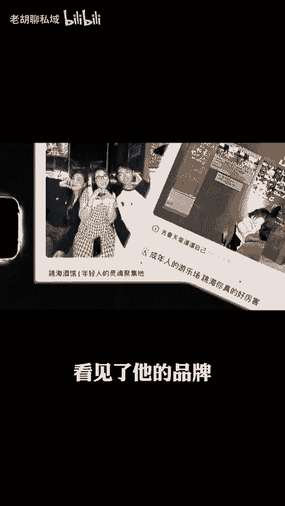

🎼验证私欲先有人再有店这个模式是可行的啊，就跳出未经去了一个新城市啊，新市场拿着这套方法论去试。一开始啊也是拉了个群，从租下门店砸枪开始，就在群里面啊分享，让大家一起参与啊提意见，投票增加信任感。

店面开张以后呢，在店里面发起活动，扩大社群，并且挖掘新内容让群里的用户呢联系更高，啊，果不其然啊，又是一家爆火的店。就这样啊5年时间在全国呢开了25家店铺，去年啊营业额已经过亿了。

这套模式啊就是典型的啊思域带动实体线上线下结合啊，适用于今天的大部分商业形态。如果你还停留在啊传统的实体店经营模式，会发现啊自己跟顾客建立长期关系上，越来越力不从心的啊，毕竟现在是信息爆炸的时代啊。

顾客的选择太多了，注意力非常分散啊，度很快。只靠实体店呢难以形成持续有效的客户眼性。想象。

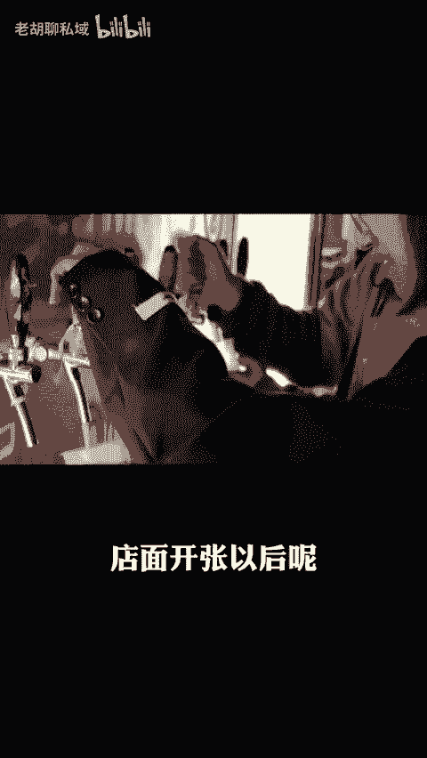

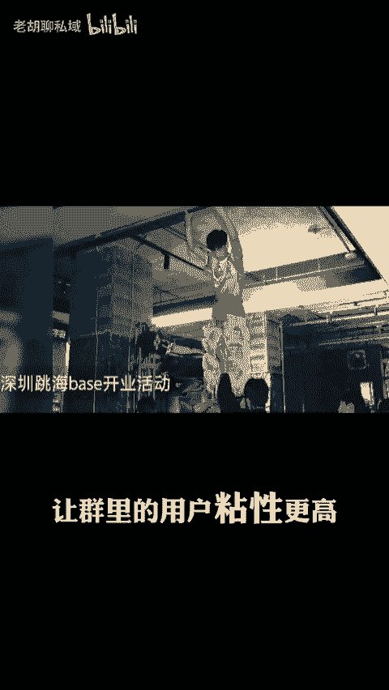

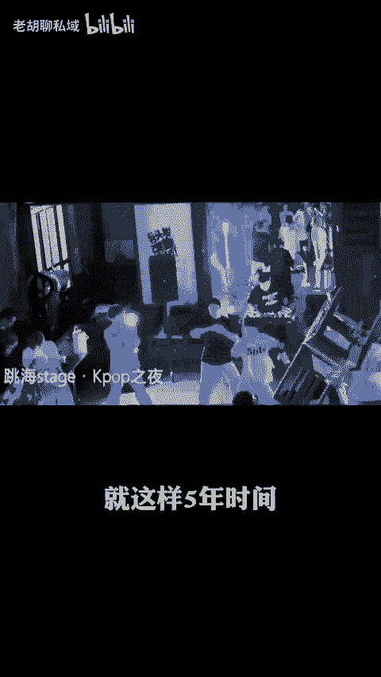

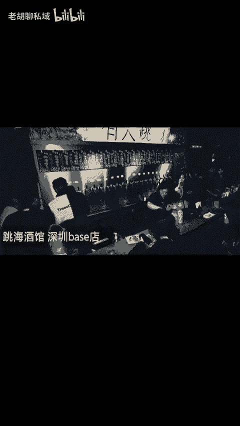

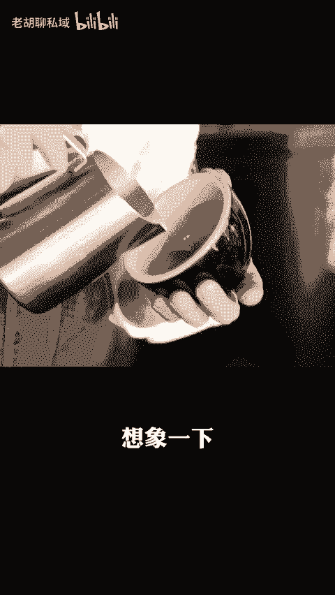

🎼啊你是一家卖咖啡店的小店老板，对吧？每天有顾客进进出出来买咖啡，但如果你没有一个有效的啊线上平台来保持和这些顾客的联系，他们很可能啊就是一次性客户啊。

不会成为你的回头客这样你就需要不断的去吸引新客客啊，付出额外的获客成本，就像一辆没有油箱盖的汽车啊。就算你加满了油，也很快会消耗光，没办法长久行驶。😊。

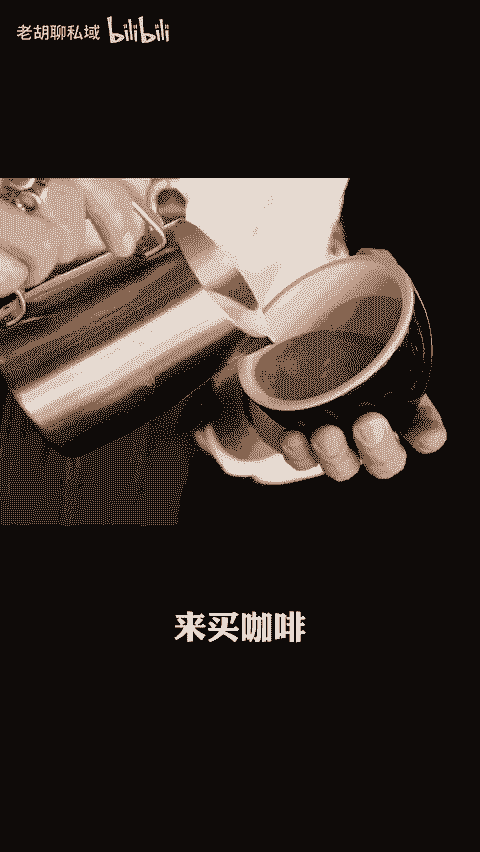

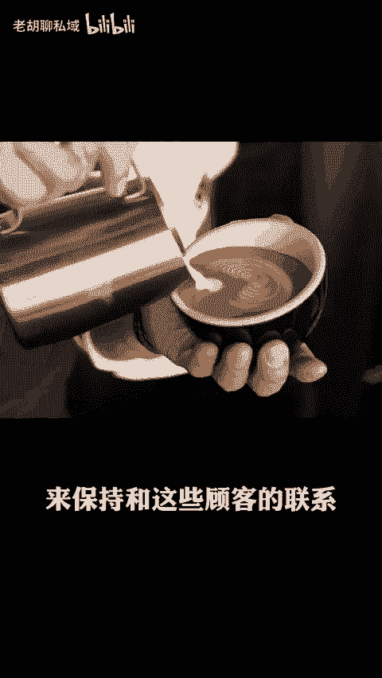

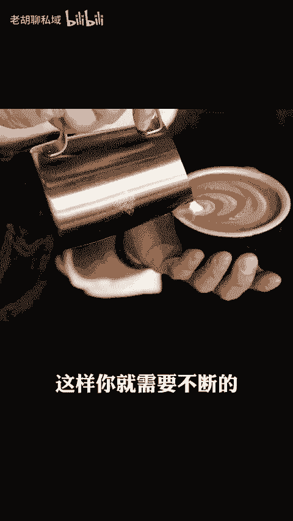

🎼另一方面呢，如果你完全依赖线上销售啊，虽然降低到运营成本，但是也缺乏整体的交付厚重感啊，以及面对面交流带来的温度和真实感。线上购物啊虽然方便，但少了实体店穿衣服啊，品尝美食的乐趣。

这就像是你在欣赏一幅画作啊，只能通过屏幕看到他的轮廓，但是没办法链接到作品背后的故事和情感。所以啊实体和私域啊已经不是二选一的选项了。现在最佳的打法就是线上私域做维护，线下实体做交付。

既保留了客户的留存，又保证了客户的体验，让为开咖啡店的老板可以通过社群朋友圈或者公众号，啊，定期向老顾客推送优惠信息，新品预告啊，同时让他们在社交媒体啊分享自己在店内的一些打卡啊，体验的照片。

甚至还可以举办一些主题型的活动啊，比如咖啡品鉴之夜啦，周末首充工作坊啊，通过社群啊再去做宣传。这样不仅可以增强顾客对品牌的忠诚度，还能记住他。🎼的社交圈啊传播带来更多的潜在客户。

再比如啊一家服装店也可以利用小程序或者微信群啊为顾客提供一对一的传达建议。在顾客生日或者节日时发送专属优惠券，既能让顾客感受到被重视和关怀，又能提高复购率啊。

毕竟现在消费者越来越注重消费体验和服务质量的，而不仅仅是关注产品本身。实体店啊单打独斗的日子已经过去了，现在就是要拥抱变化，去创新玩线上线下结合，你要是还守着传统的套路，就跟拿着诺基亚玩抖音一样。

不喝适宜的，注定被淘汰。