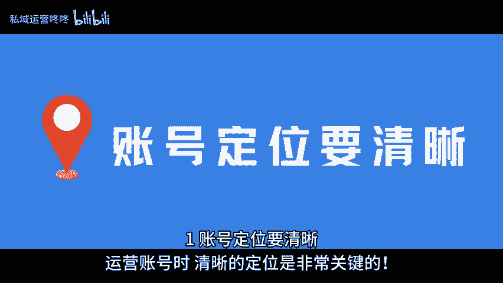
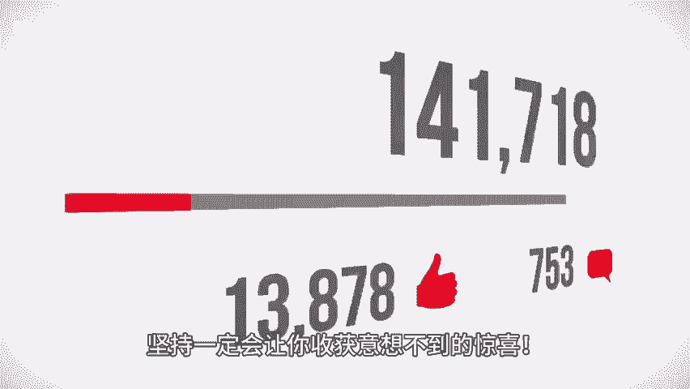

# 实测有效！对于运营新手来说有三点缺一不可！ - P1 - 私域运营咚咚 - BV13rpMetE1k

🎼如果你和我一样，也是一名刚入行不久的运营，那么今天我的分享，你一定会有所收获。下面就和我一起看看吧。一账号定位要清晰，运营账号时，清晰的定位是非常关键的。是想分享知识旅行还是其他领域的内容。

只有明确的方向。你的内容才能吸引到真正感兴趣的粉丝。2、学习同赛道的爆款内容。多研究一下同赛道的爆款内容。看看哪些帖子火了，分析他们的套路和风格，借鉴灵感，这样你也能更快找到自己的创作方向。

3、坚持更新，坚持更新是成功的核心，每周最好更新三条内容，这样不仅能积累互动，还能让你的粉丝保持关注，坚持一定会让你收获意想不到的惊喜。记住这三点，你的运营之路一定会更加顺畅。以上就是今天分享的内容。

咱们下期再见啦。😊。

