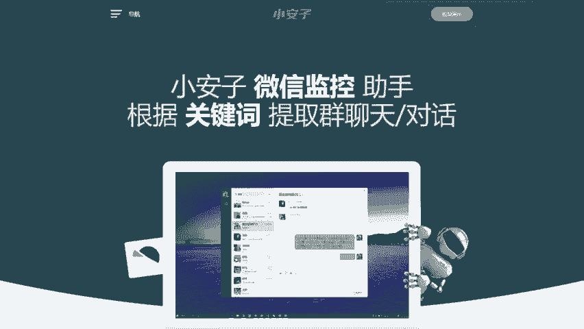
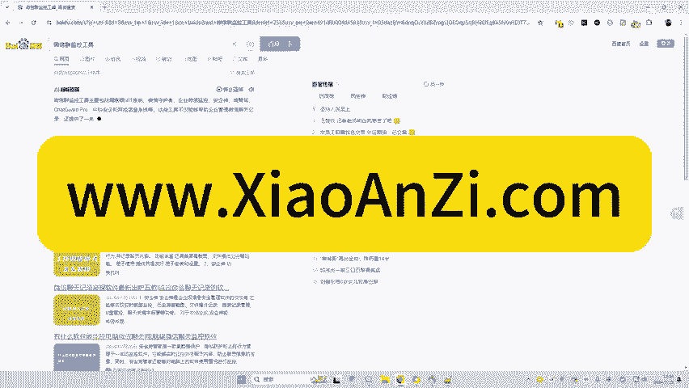
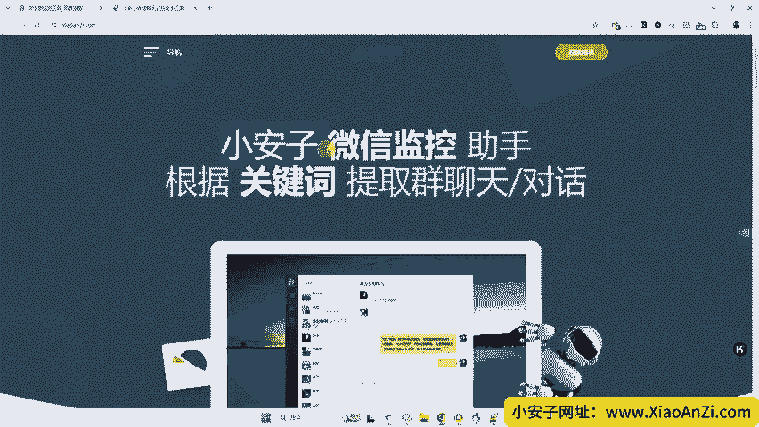
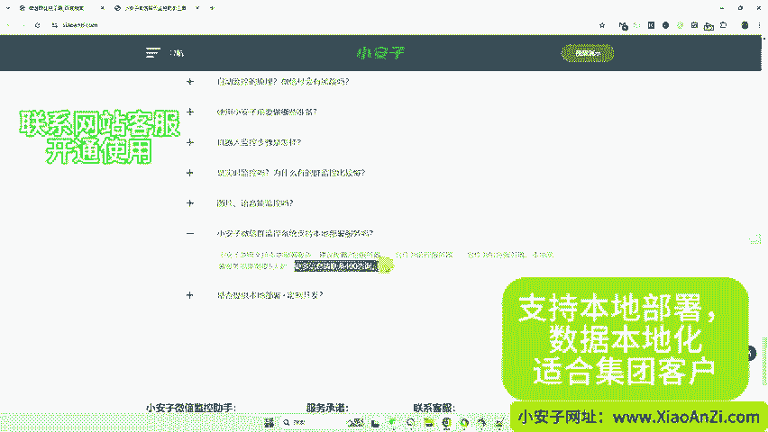
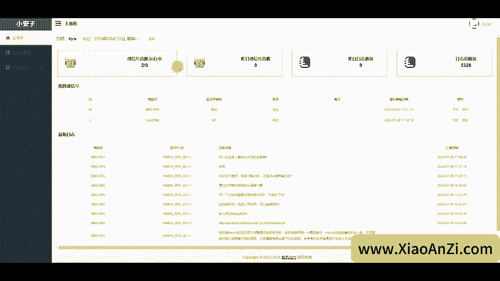
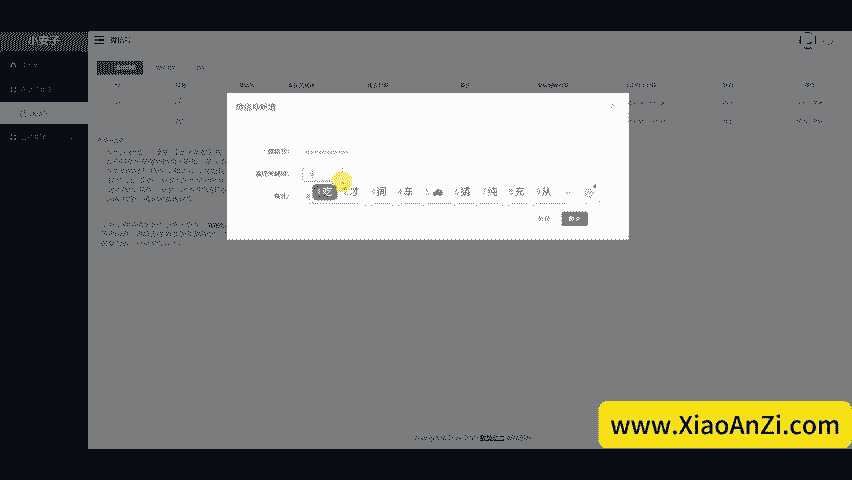
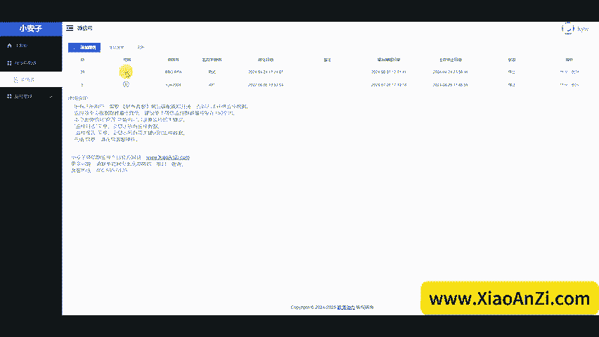
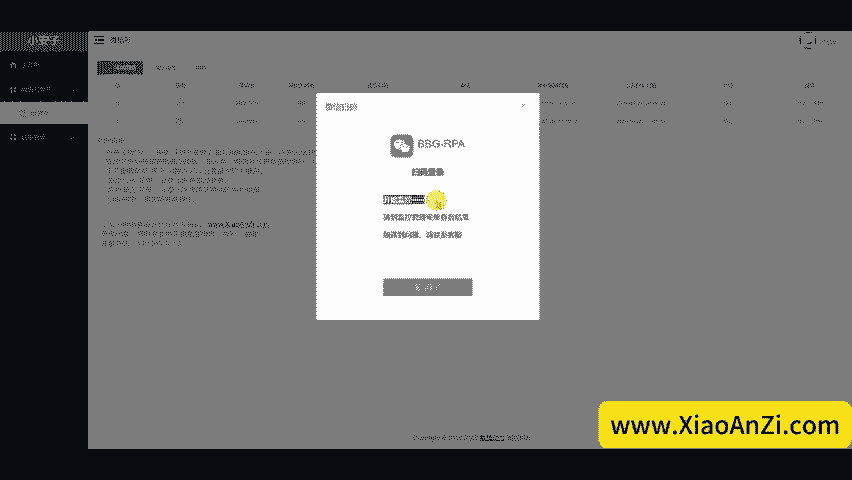

# 小安子微信群关键词监控助手工具详细解说，私域群运营必备工具，不挑微信版本 - P1 - 康康AIQBH - BV1m5ejeTEat

今天推荐一个微信群聊天监控工具，工具名称，小安子微信聊天监控助手工具，微信群监控就小安子微信监控助手云电脑拆无PA机器人完成敏感关键词的微信群和个人对话内容监控，也支持全量聊天监控记录。

大量运用于私域群管理社群管理客服群管理群限子挖掘等场景，在百度搜索微信群监控工具，找到小安子网站，或者直接输入网址小安子点com微信监控助手，根据关键词提取群的聊天记录，其实一对一的私聊对话都可以记录。

它主要优点是不封号用的是PA技术监控微信程序，支持所有微信电脑版本。7乘24小时，保持监控一刻不停。总结就是安全稳定高效。

小安子客户案例展示的三个场景。第一个是电商客户因为疫情客服人员流失，最后又小安子恢复正常。第二个是电力企业在几百个乡村用微信群做管理。村民会在群里报修，之前一直是人工定着群，人员实在不够，用上小安子后。

一个人管理上百个群。第三个案例是货代航运，行业群里有各种资源，卖运力的和买运力的又是大群。虽然群不多，但群很活跃，每天信息量太大，人工整理信息不现实，有了小安子后，群资源就100%被挖掘出来了。😊。

我们看一下常见问题，首先是对微信版本有要求吗？小安子支持微信所有版本，微信升级也不受影响。😊，因为用的是RP技术自动监控的原理，微信会有封号危险吗？在小安子后台扫描微信电脑端登录二维码。

然后小安是在云端RP运行，没有封号危险，使入小安子前要做你些准备。监控时间段的机器人需要登录PC端的。所以说微信号不只是同时登录多个PC端，所以你在电脑端登录微信监控云电脑的微信就会被迫下线，停止监控。

小安子是如何监控的。机器人会模拟人工点击未读小红点，提取最新的聊天内容，然后把群名称、发言人发言内容发送到小安子后台。你可以在小安子后台查看所有监控记录。是实时监控吗？😊，小安子因为用的RP技术。

一般情况下一秒内就会监控到信息，但遇到某些太活跃的群，可能会稍微慢一点。图片语音可以监控吗？目前，小安子只支持文本内容监控，不支持图片和语音。当然有特定需求，我们可以定制开发。最后一个问题。

是否提供本地部署。小安子提供本地部署服务，把整个平台部署在客户服务器上，实现数据本地化价格，请咨询客服。上一个视频对小安子微信群监控平台做了介绍。今天一起来看一下小安子的用户后台，这是小安子的登录界面。

用户名和密码需要联系小安子客服开通自己注册的账号无法正常使用。需要客服在系统后端开通授权。我用测试账号登录一下，登录后，我们可以看到主面板，在主面板页面可以看到账号下有几个微信号，昨天监控的微信号数量。

昨天日志数量等。😊。

我的微信号就是这个区域，展示了账号下的所有微信号，最新日志区域展示了最新的监控记录。我觉得这个监控账号有些日子没用，所以这个日期还是就是7月的，点击左侧微信号菜单，这里可以添加微信。

但需要客服开通授权才能正常使用，这里填上你需要的监控关键词，每天写一个就回车一次就可以添加多个，然后点击提交就就可以了。如果客服后端已经授权的话，可以点这里开始按钮会看到微信PC端登录的二维码。

用手机扫码，然后授权登录，然后中间会提醒你在新设备登录，然后让你等5秒，然后在手机上点必须登录就可以。

手机上授权完成后，回到小安子后台，点击我已经扫码登录成功，小安子就开始监控了。😊，可以到微信监控菜单查看监控结果，点击知道了。回到微信管理界面，原先开始这个按钮变成了暂停按钮。

就说明这个监控已经在正常运行。最后，我们的监控管理菜单监控日志是所有被监控的内容。监控报告只显示包含关键词的聊天内容，包括啊微信号、群名称发言人、发言内容、监控这个词和监控日志、建立时间，有任何问题。

欢迎访问小安子官方网站联系我们，谢谢观看。

