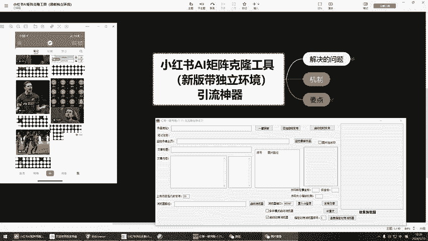
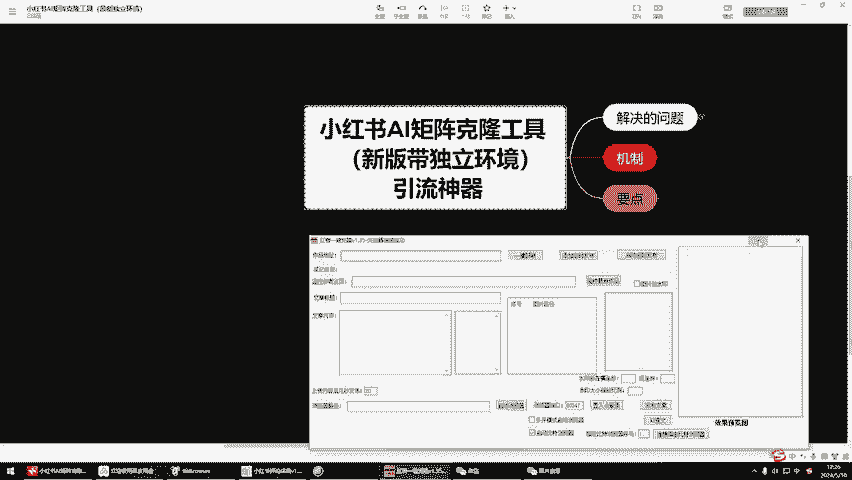
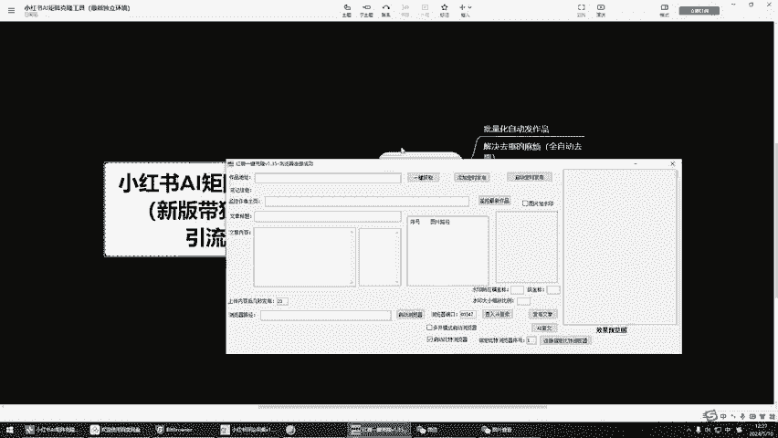
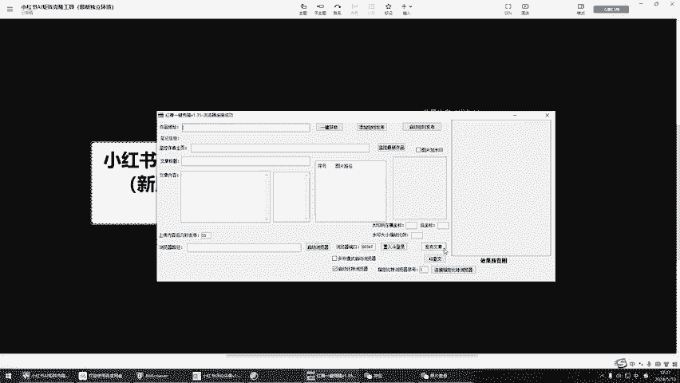
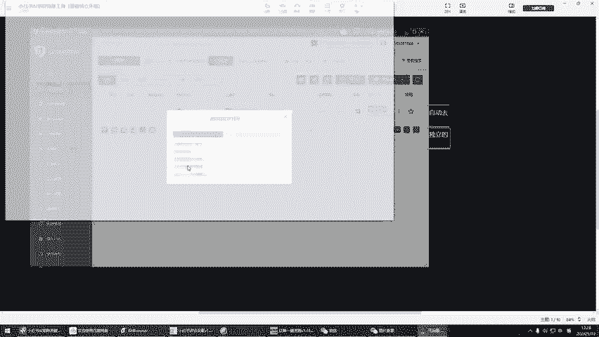
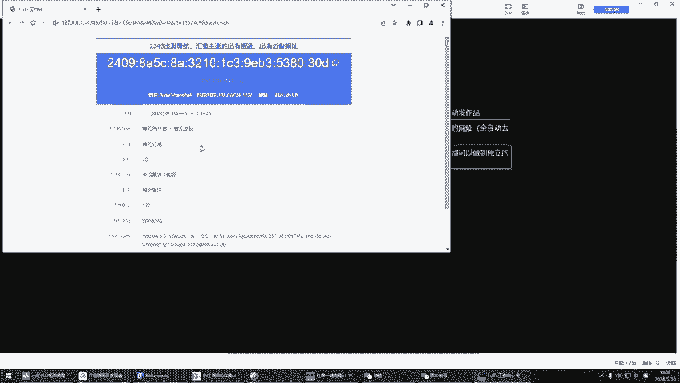
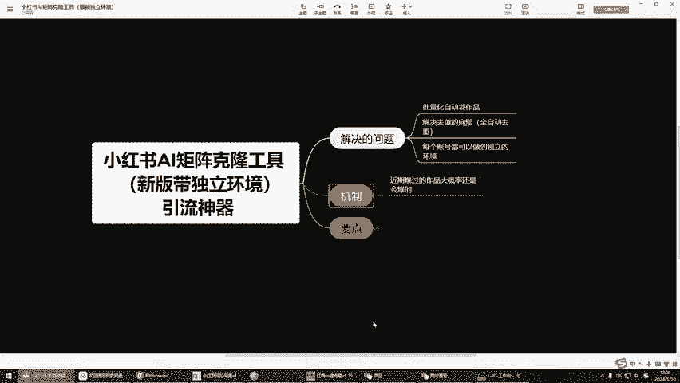

# 小红书AI自动克隆工具，复制爆款作品，全自动去重并且百分百过原创，全行业引流获客神器 - P1 - 海德那边 - BV1jugMeKEk8

啊，兄弟们好，然后这期视频的话呢，给大家更新一期这个非常牛逼的工具啊，就是小红书AI矩阵克隆工具。那么这款工具呢我们也是先植入了这个呃带有独立环境的一个功能。那并且呢可以代替你这个自热的玩法啊。

非常的牛。那么首先呢啊给大家先看一下左边摄群兄弟们反馈出来的一个效果啊，这是专门打这个题材的，第一天晚上啊当天就报了1000多的一个小眼睛。当然了，这只是其中一个案例，并不能说明什么。

那O那么咱们这边呢直接给大家去讲干货啊，那么首先呢咱们这个AI克隆工具啊，它能解决什么样的一个问题。第一个如果说我们去发布作品的话啊，那如果我们要去每一个啊手机我们都要去独立的去进行一个手动的操控。

对不对？那如果说我们用到这款工具的话，我们可以进行啊批量化的进行一个发布。比如说像我们这个工具的话，我们可以一键获取地址，对不对？获取完地址以后呢，它会自动的把标题和内容全部改写啊，把这个内容全部改写。

改写好了以后呢，然后我们直接点击发布啊。

就完事了。这个时候呢我们还省了一个什么步骤啊，我们不需要去去重了，对吧？不需要去重，全自动的它会帮你去重啊，那这样的话，报过的作品我们还可以把它抄下来，然后给它去重，然后再去发送。

那这个时候呢可以大大的提高我们的一个工作效率，对吧？OK还有就是每一个账号啊，它都可以做到一个独立的环境。可以给大家看一下，我们每打开一个浏览器。

啊，这个浏览器它都是一个独立的IP环境啊，都是一个独立的环境。那么这样去发布的话，就可以防止啊批量死耗的一个风险，对吧？O那这个是解决的一些问题。那么机制啊其实就非常简单啊，小红书呢。

大家玩过的都知道啊，近期报过的作品大概率呢，还是会爆的，对不对？那我们其实啊用这款工具，就是为了去克隆近期爆过的一些作品。那无论是什么行业都是可以去操作的，对不对？O那接下来呢就给大家讲。

咱们具体应该怎么去实操，到底应该怎么去啊使用这款工具啊，进行克隆爆款的一些做作品。那我们这边呢主打的就是用用工具来代替我们人工操作来提高我们的这个效率啊，那首先我们要用到两款工具。

第一款工具呢就是咱们这个采集工具啊，这个采集工具呢？我们在打开的时候一定要先登录一下，然后呢去采集近期报过的作品。那比如说我们是做什么行业的，比如说我们做减肥赛道的对吧？那我们就搜索关键词减肥。

或者其他的关键词。那我给大家去做演示，只搜只搜索减肥这两个关键词啊，然后点击文章采集。啊，让它自动在这边去采集这相关的文章就OK了。那这个时候呢，我们也可以在这里去设置什么呢？

比如说只采集点赞量多少的呀，对不对？只采集评论量是多少的，是不是或者说我们还可以去采集什么呢？指定的时间，比如说今天是5月10号，对不对？那么我们就可以在这里搜索啊2024年5月8号啊，05-18。

对吧？那这样的话，它只采集5月8号的一个文章，好吧，那么我们点击采集好的文章，在这里啊，我们点击全选，然后选择导出表格。这个时候呢我们把这个表格啊给它导到我们的桌面上啊，我们选择111，然后点击保存。

保存好了以后呢，就是这个工这个文件。啊，打开看一下啊，咱们这个在打开这个表格的时候啊，我们选择这个位置，再选择降序啊，选择降序。然后我们不要去选择以当前选定区域，而是选择上面的这一个，然后再去点击排序。

这样的话啊，你时间和你的标题都是一起变动的啊，然后点击排序。这样的话看一下这个是候全都变动了啊，这才是正确的啊，这才是正确的。然后我们把这个链接啊，给它ctrl C一下。

我们在这里输入作品地址cttrol V啊，然后呢点击一键获取就OK了。那这样的话呢我先给大家先看一下啊，这个作品是什么样的一个作品啊，是这个作品看到了没有啊，刚才我们采集下来的这个链接啊，是这一个作品。

然后接下来大家看一下它是怎么克隆的啊，我们直接点击一键获取。啊，他这边会直接把标题筛选下来，看到没有？直接筛选下来。然后呢，他这边会直接筛选这些图片，筛选完图片后，大家看这里啊，这里最重要的。大家好。

我已减肥50斤的倩倩，看到没有？是这个对不对？他正在改写啊，AI正在查文，请稍等片刻，稍等一下，他就会把你的文章内容全部给他改写成我们的原创。啊，是这样的一个逻辑。看到没有？大家好，我是倩倩。

成功减掉50斤体重的。我想和大家分享我的减肥经历。看到没有？他把这个东西已经给他改写了，对不对？那这个时候我们就不需要再去什么手动的去改写这些文案。这是第一个。第二个就是图片啊，大家可以看一下。

图片是一模一样的啊，图片是一模一样的，它的图片啊是什么样子的？我们的图片就是什么样子，看到没有？第三周啊给大家拉近一点啊，第三周啊减20，看到没有？都是一模一样的。那这样的作品有人就问了。

那为什么同样的作品啊，我发就发不了啊，那这个工具它就能发吗？它不会被判定这个二次搬运嘛？对不对？首先我们这个工具啊，它是可以做到啊，改这个数值，它可以改图片的数值，我们肉眼去观看的话。

它是没有任何区别的，那么内部它是检测不到的，知道吧？这就是这个工具牛逼之处啊，O那么我们还可以在这个图片上加一些什么呢？加一些我们自己的一些创意。比如说我们想在图片上加一些水印，对不对？

O那我们只需要在。这里选择啊把这个图片啊把它拖入进来，然后呢在这里选择图片加水印，把我们的这个水印坐标位置选一下。比如说十啊这个位置30，然后呢，这个位置选择缩放啊，我们输入一啊，这样子的话啊。

这个图片水印就进来了，看到没有？那么我可以再往下一点，是不是？我选择50。哎，那这样子的话，就是很O的对吧？那我这个图片是随便选的。当然大家可以根据自己的要求去选择图片好吧。

O那这个时候我们把所有的前期准备的东西都已经准备好了，我们就可以准备进行一个发布了，对不对？那前提是我们啊给大家先打把这个先关掉啊，啊后我们要这个时候呢，我们先去啊选择我们的这个指定浏览器的序号啊。

序列号的话，就是这一个，比如说我只开启了一个啊，那我就选择序列号一，如果说我这边想用序列号2，对吧？我们就重新再建一个啊，再建立一个窗口，然后呢我们选择序列号2也是可以的啊，选择2，然后呢点击链接啊。

比特浏览器。OK这个时候它已经打开了，打开好以后呢，然后这个时候啊我们要去登录一下我们的红薯啊，登录一下我们的红薯OK登录好了以后呢，我们就不用去管它了啊。这个时候我们直接在这里点击发布文章啊。

就OK了。点击发布文章，看到没有？它会自动的去上传啊，选择图片，然后把刚才那些图片全部给它上传进去。OK看到没有？它会自动的进行一个加载。OK这个时候只需要等待运行就可以了啊，它会自动的去发送。

当他把所有的话题全部添加完以后啊，需要等待20秒以后，然后他会自动的进行一个发布。啊，看到没有？这边已经发布成功了啊，然后我们点开笔记管理看一下刚才发布成功的这个作品啊。那其实像这种玩法呢。

它就相当于跟自热是一样的，能理解吗？而且你的作品啊大概率都会出现一个报道情况。那我们也可以说去多次的去发布作品。比如说我们现在已经克隆完一个了，对不对？克完一个作品以后呢。

然后我们还可以再克隆第二个作品啊，在这里边比如说我再随便采集一个啊，采集完了以后，我就要把链接再给它粘贴进来啊，粘贴进来。然后呢，我再重新。Control。V啊，然后再去一键获取。哎，这个时候呢。

我们就让他再去获取另一个链接，然后让他去查完，查完以后，然后我们再去进行一个发布啊，这都是没有任何问题的啊。因为我像我们玩克隆的话啊，基本上我们一个账号的话，我们发布几个作品都是没有问题的啊。

一天平均发3到5个作品啊，就一个账号，那我们也可以多个账号进行发布，对不对？那我比如说这里还可以添加定时发布。比如说我现在不想发布那么快啊，我想这个过半小时或者两个小时以后再去发布，可以的，没有问题。

我们只需要在这里添加定时发布就OK了啊，添加定时发布，然后把这个作品链接给导进去，那么添加任务啊，我们先选择比如说添加时间在这里去选择时间啊。

比如说10号我们这边的话是12点39分我们把这个时间调整一下啊，比如说我们去调整一下。比如是这里调整。好，50。啊，就OK了。然后添加作品任务，请输入作品链接，我们把这个链接给它输入进去啊。

这样的话就添加成功了，对不对？那如果说我想添加第二个怎么办呢？对吧？我想添加第二个，那O那我们在这里再修改一下时间啊，比如说55啊，那么想添加第二个链接，那我们在这里再复制第二个链接进去。

ctrlV添加任务，看到没有？这样的话，它就会自动的去重，然后自动的进行一个发送啊，它都会在这个账号运行就可以了。那如果说啊你要想有多个账号的话，怎么办呢？啊，多个账号的话。

那么我们可以多次打开这个工具。比如说我们在电脑上打开10个这样的工具啊，然后我们就可以开启10个账号，那么同时去进行干嘛添加定时发布，也就是说一天的话，它可以我把所有的定时发布全部设置好。

你一天你可以发布几十个作品啊，同时几十个账号进行操作，几十个作品同时发布啊，都是没有任何问题的。知道吧？O那这就是我们工具的一个强大支处啊，刚刚发布的作品看到没有？这才一两分钟啊。

10个小眼睛就已经出来了。所以说这个工具呢非常非常牛逼的啊，而且非常非常实用啊，O那这个视频呢就给大家讲到这儿，然后有什么不懂不明白的啊，可以再来问我，好吧。

