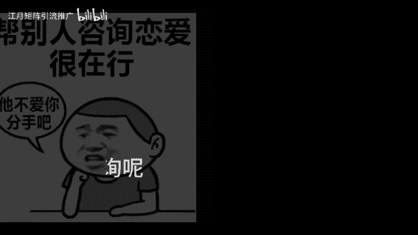
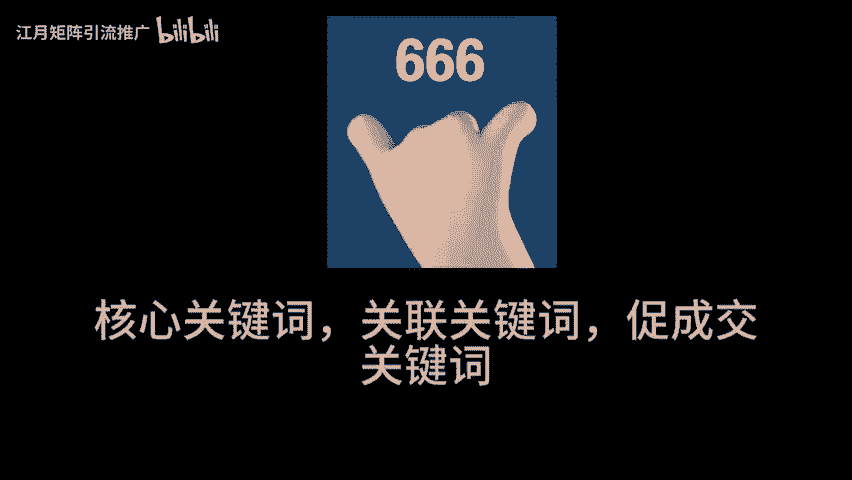
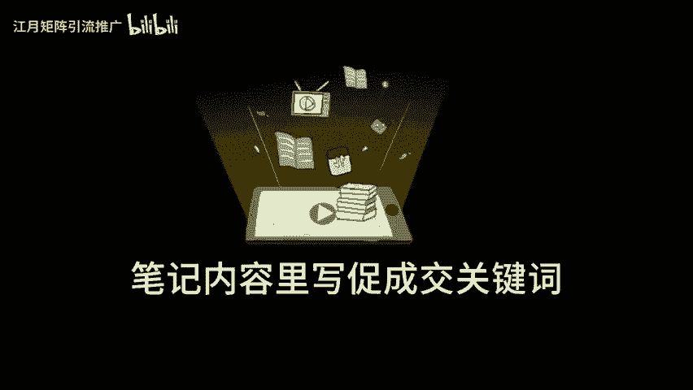
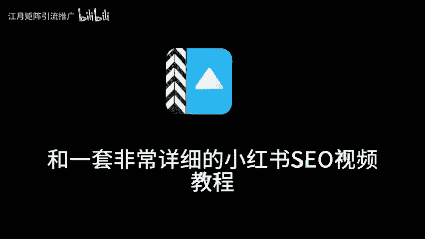

# 小红书seo优化怎么做，小红书搜索排名，小红书流量推广，小红书流量变现，小红书运营，小红书引流私域 - P1：studio_video_1725515580727.mp4 - 江月矩阵引流推广 - BV1PipueSE4E

家人们做小红书，不可再傻傻的，每天发脾记了，天天盯着那几百个小眼睛，真糟心啊。其实只要做好一个动作，就算不天天更新，也能有源源不断精准流量。这个动作就是做好ICU那啥是FO呢？举个例子哈。

你写笔记时加了很多减肥相关的内容。那用户在小红书一搜减肥就能看到你的笔记。现在小红书正从种草平台逐渐变成搜索平台，想想那些主动在小红书搜索的用户，他们啥心态，那肯定是有极大消费需求和付费意愿呀？

这批人的质量和成交率有多高，就不用我多说了吧。就像我去年9月发的笔记，现在搜小红书开店还能搜到后台也一直有咨询呢？那问题来了，到底咋做好的COO呢？核心就是布局好三类关键词，核心关键词。

关联关键词和促成交关键词，比如中小学教育赛道核心关键词是初中英语提升关。😊。

关键词呢就是从核心关键词延伸出来的，像初中英语一个月题20分的方法。初中生自理学习时间表，促成交关键词就是代表客户有消费意愿的。比如有没有快速提升孩子英语分数的方法，孩子背不会单词怎么办？

具体这三类关键词咋布局呢？啊，很有讲究。哎，笔记封面上写关联关键词标题上写核心关键词，笔记内容理解促成交关键词啊，话题标签，一般是关联关键词啊，评论区布局。好。

那促成交关键词当你把这三类用户高频搜索的关键词布局好，用户一搜就能搜到你的笔记啊，就算不发新笔记也能出现在有需求的用户面前。精准用户主动来找你啊，不会找关键词的宝子。😊。

别慌，我整理了一份常见行业的关键词表格和一套非常详细的小红书ICU视频教程评论666主页免费领取。

