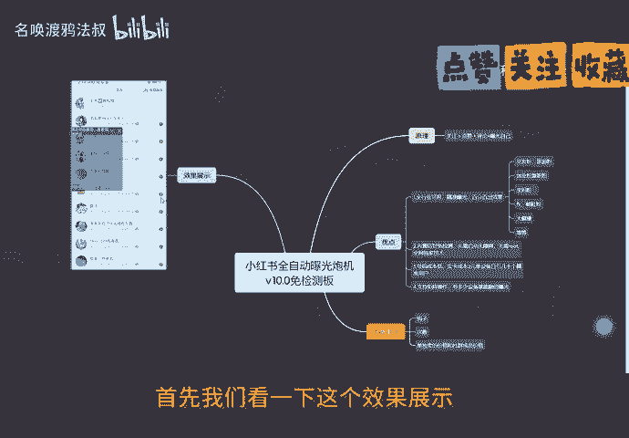
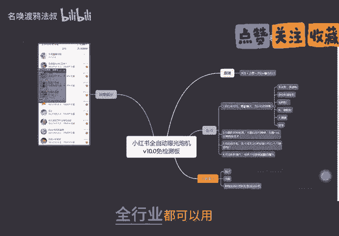
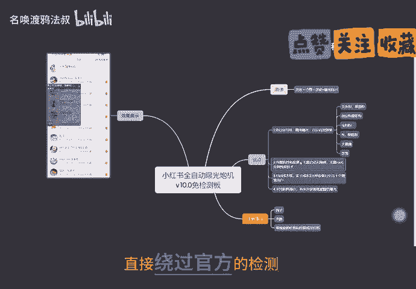
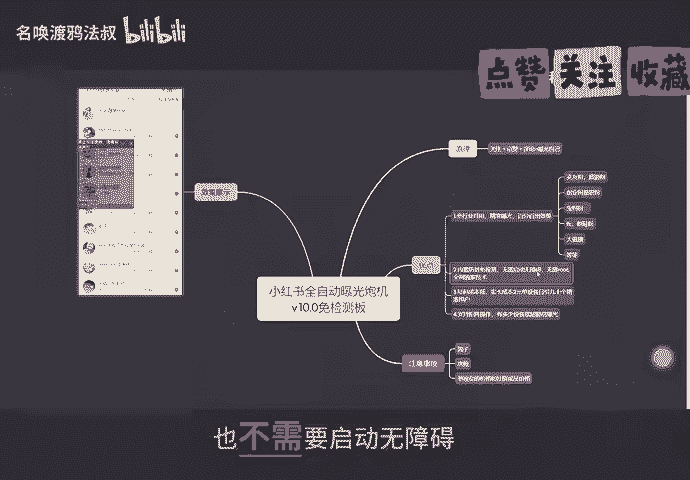
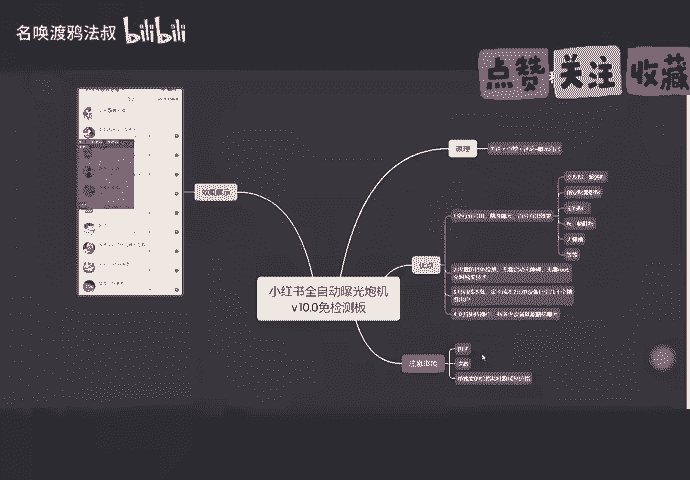
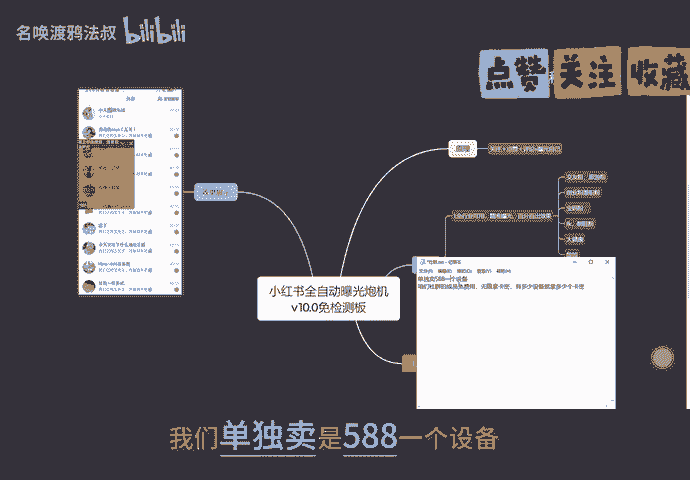
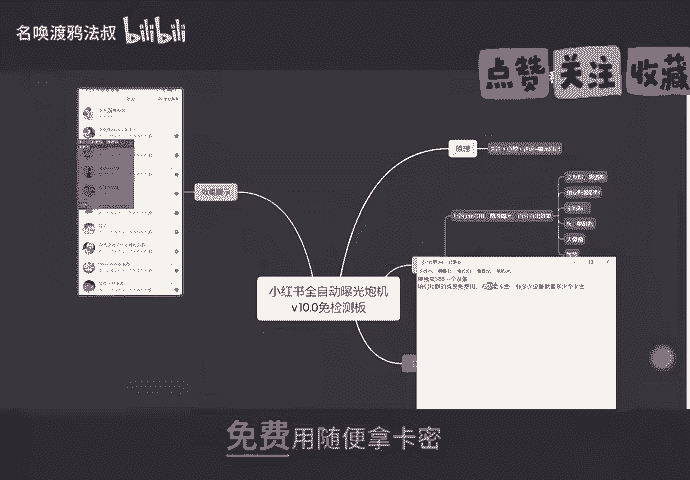
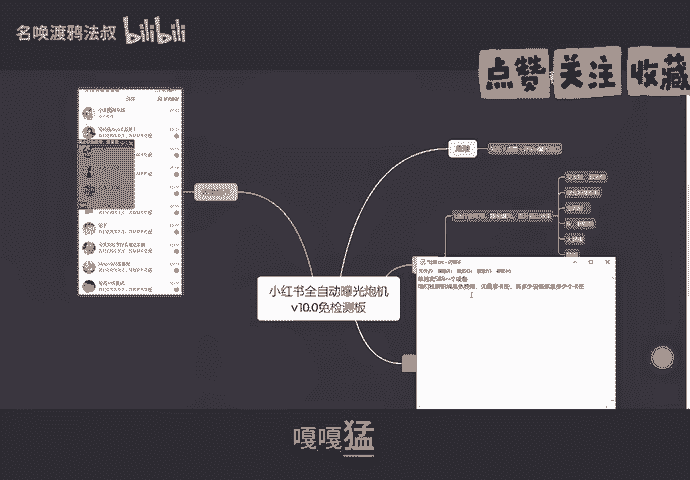
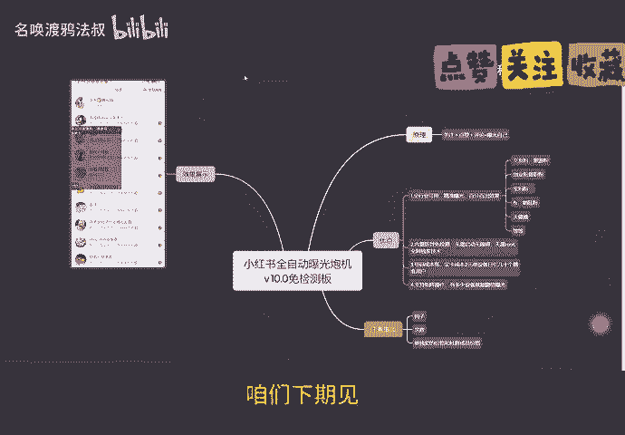

# 小红书一键全自动引流曝光炮机 精准引流获客用户，全行业通用版 - P1 - 名唤渡鸦法叔 - BV1yBHxebEeL

有好日子，我们一起过。今天给大家讲一下。我们的小红书全自动曝光炮机V10里面检测版。等下我们看一下这个效果展示。

这个是我之前打的号，可以看一下，回关率非常的高。关注了几百个，回关注有158个。再给大家讲一下我们这个炮击的原理。嗯，炮击是通过。关注点赞、评论去曝光自己。来吸引用户点进自己的主页。

再讲一下我们的这个优点。全行业都可以用，非常精准的曝光，百分百的出效果。什么焦友粉、旅游粉、创业粉、兼职粉、宝妈粉、妇科粉、大健康等等等等。只要是你的行业都可以。

第二，我们内置了防风免检测的技术，直接绕过官方的检测，这样就降低了被封号的概率，也不需要启动无障碍，不需要root全网独假的技术。第三，我们的这个号码成本很低。

斯卡卡的成本只需要2块钱就能运营几十个精准用户。

这个投产比非常的低。已被封号，假如被封号了，直接换号直接丢掉也不心疼。第四，我们这个支持矩证操作，有多少设备就能翻倍的曝光。如果你有40台设备，就翻40倍。给大家看一下我们的炮击的功能。

这里怎么搜索顺序评论，首页推荐评论。这些可以根据自己去选择自己需要的功能来进行使用。上面是评论，下面是关注点赞。这个导航。给他说一下，导航就是咱们小红书这个。这个顶部的导航。

版本号选择我们的相对的版本号。也能数量。200就是298个评论滑动9次。操作时间这可以跟我设置一样。大概10天能关注400个左右，而且不会封号。这个评论多少就是评论16条，休息368秒。

笔记收藏可以打开，也可以关闭。关注点赞也可以只关注，也可以直点赞，也可以同时关注点赞都进行。笔记类型我们选全部或者最热这两个精准用户比较多。最新不要选这个用户太少了。评论方式图表就是图片加表情。

话术就这个话就是话术自己设置的话术表就是随机的表情，智能就是这三个随机。然后保存一下，给大家运行一遍看。我们是安。推荐评论。那保存。那直接点启动，它会自动打开小红书。好，这样我们就评论成功了。

因为我是选择表情评论，它就是随机评论一个表情。这样就完成了一个评论的截流。其他这些功能呢，大家可以根据自己去使用。根据自己的需要去使用。导航评论就是。这个小红书的导航选择一个，它就跳转到这个导航。

比如选美食，它就跳转到这个美食的导航去进行截流。后面我会给大家每个功能都出一个演示。做一个教学。给再给大家说一下注意事项。首先我们要把自己的钩子给设置好。

就比如我是做社群的，教引流的，我们就可以把头像和背景图简介。这些都设置好自己的钩子。作品也也可以发一下。作品发的可以提高你回关的效率啊。就比如自己是做什么行业的，就发自己的什么笔记就可以了。

再给大家注一下这个次数。就是每天关注评论的什么次数。就是。这些。操作时间。这些。可以你们自己琢磨，要是琢磨，懒得琢磨的话，可以抄我的。再讲一下我们这个单独卖的价格和社群的价格。

我们单独卖是5881个设备。

咱们社群的话就是随便用，免费用，随便拿卡密，有多少个设备就能拿多少个卡密。

打家么。

好，今天就先。分享到这儿。咱们下期见。

