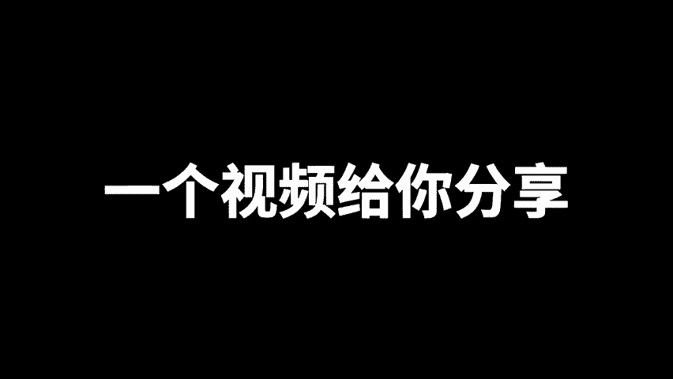
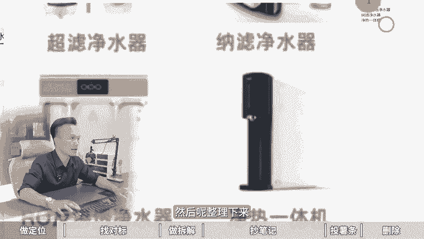

# 小红书从0-1起号过程--6步冷启动法！ 分享小红书新号如何快速起号，小红书运营技巧，小红书起号教程，小红书起号攻略，小红书冷启动sop，小红书起号逻辑！ - P1 - 黄一恒矩阵引流技术 - BV1P9s8e1E3q

🎼小红书很恶心的一个起方法，谁报就抄谁，最后自己比这一张还要爆这个方法呢略微有点丢狗，但是用起来是真的好用。最近我们在起的时候来都用的这个方法基本都报了，不能说分之百，基本上都90%。

而且最重要这个方法来，操作起来，十分简单，一个视频给你分享小红书从零到一起过程六步人起动法，落定教材有点长，记得先收藏，一起来看，我给你分享一做定位二找对标，三做拆剪，四抄笔记五头薯条六做三除。

现在看第一个一做定位。首先我们需要定人设，人设就是明确你是谁，你的IP名称是什么。比如说我的IP叫做黄一恒。第二个定方向，明确你要做什么，你的赛道是什么。比如现在我做净水器。

那我的账号就可以起名为黄一恒。

净水器为了方便用户理解，我们可以加一个词。比如说黄一恒，你要净水器啊，显得更加的专业。第三个，定目标人群明确你需要获得什么样的客户，你的人群是什么？具体可以体现为我们的需求关键词。

比如说目标人群会搜索哪些关键词，搜索这个关键人群，它刚好跟你的需求是完全贴合在一起的，具体可以分为两种词，一种词叫类目词。比如说我们做的叫做净水器啊，我们可以加上来。然后呢，净水机啊。

这是不同人搜索的习惯啊是不一样的，或者说是净化水。好，这些是我们的这个类目池。那除了类目池之外，还会有那个产品池，产品池就是细分下来会有很多啊，比如说净水器里面它会有很多的类型。我们来试索看一下。

比如说我们说个净水器。有哪些类型？好，搜索出来之后呢？这种就是产品词。那么搜索出来之后啊，这里面会有很多，比如说什么啊超滤净水器，然后呢，纳力净水器反渗透净水器进热一体机啊。

这些关键词我们都可以给它识别，然后来整理下来啊，这时我们又得到了一些产品词。我们在做的时候就可以从这些关键词入手关键词这一块呢，多多益善，越多的话，我们获取到流量自然就越多。好，这第一个我们需要做定位。

第二个咱们需要去找对标，找对标有两个。首先我们需要找这种爆款选题，选题啊高于一切，选题的潜重呢大于80%。你发布的东西有没流量就取决你发什么选题，就像你跟身边的人讲个故事一样的，讲出来很多人喜欢听。

说明这个故事啊确实比较好，讲出来之后啊，没人喜欢听，说明这个故事呢确实不行。所以咱们要学会看数据等于开店考试，随性而发某。

我像很多伙伴是把自己会的，自己想的自己有的像发朋友圈一样发到小红书上面，什么人喜欢看呢，只有你自己喜欢看，别人都不喜欢看。所以咱们在做的时候，所有的笔记都要建立在别人的数据技术指标之上。

相当于就是你的同行你的对标，他都在帮你测试，测试好之后，我们直接拿过来发，自然就会有流量。所以火锅内容呢还会在火做小红书啊一个公式，叫做70%的相似爆款，乘以足够多的城次次数，就可以把小红书做起来。

进咱们在做的时候需要去做一个选题表格。那选题表格有几种方法，首先通过搜索选题法。比如说刚才我们搜索的关键词叫做净水器，那么搜索完之后啊，这里面就会有很多很多的选题。那么有些流量比较大。

特别是有些时间隔我们比较近的，还，可以重点把它整理下来。比如说净水器八买八不买净水器比试店。好，净水器那么避垒指南，你看这些都是选题。还有这个什么除下净水器，怎么选？

我们都可以把它整理到自己选题表格里面来。第二个对标账号法。如果我们找到一个非常准确的对标账号，我们可以直接打开这个账号的主页啊，比如这个账号，我们点击然后打开账号主页。在账号主页里面。

它就会有很多人的选题，把一些数据比例拉的比较高的，拷贝出来，我们可以去拷贝模仿，特别是一些那种低粉高斩的作品可以优先考虑粉丝量比较大的那咱们基本上就可以pass掉了。第三个叫下拉选题法。

比如说当我们在搜索这个净水器的时候，你会发现它会有很多下拉尺，这些下拉尺就代表是高频需求才会出现这里面，那咱们都可以做，比如净水器怎么选净水器有哪些类型，净水器直引净水器DIY这些通通都可以整理下来。

在整理的时候呢，最好的办法是建立一个选题表格。什么是选题表格。比如说。咱们做笔记，不是看一篇做一篇，我们是建立个选题表格，从选题表格里面挑选这个收藏比评论比分享比比较高涨，优先进行操作。

因为重笔记呢更加容易获。比如说这里面有篇笔记147，相当于100个人点赞，会有147个人收藏，收藏量是大于点赞的这种笔记它就很容易什么二次货。有的伙伴不会做这个表格怎么办啊，你可以来找我。

我把这个表格打包分享给大家，我们做下来自然共享。好来看一下第三个叫做拆解。那么当我们找了很多的对标选题，做了表格，接下来我们需要去重点去猜这种叫做第粉高涨的账号，分析他中为什么能报学习他们的优点。

那种粉丝什么3万5万10万的打死也不要去模仿了，模仿的没有任何作用啊。因为这种账号呢已经做起来，它是有加成的，特别那种什么两30百个粉丝，作品有个1000个点赞，800个点赞，00个点赞要重点的去分析。

特别是这种。第三天作品，因为小红书啊它是一个喜新厌对的平台，近期内容啊更加受欢迎。像刚才我说的这个净水器说制完之后，我点筛选，我们点这个图文，然后点一周之内。好。

这时候我们点最多点赞就可以筛选出一周之内，你看4天前两天前这些都具备一个特点，叫做新鲜度啊，都是非常新鲜的，甚至有的是什么，昨天发布的几个小时前发布的还是热乎的。你拿过来拷贝流量绝对不会太差。

所以呢这种用内容啊并没有审美频道。如果你把几年前内容拷贝过来，你会发现它会审美频道和故时，这时候就不行了。接下来我们就去拆解它的一个爆款笔记，他们做的什么选题。

用的什么封面标题怎么写的内容载体是什么形式的，好吧，这些你都拷贝到你的行业上面，自然就能够报流量来自然不会太差啊，来看。第4个抄笔记。笔记啊，咱们需要进行一对一的模仿。什么叫一对一的模仿呢？

就是测试火的选题。测试火的封面，测试火的模板绝对是什么整理比较不错的。但是一比1的模仿，不是让你重做一个笔记出来，而是模仿着这个来做做出来之后呢，也是一个什么原创的啊，就比如说今年啊现在我们去做啊。

这里面它做了很多很多类型的笔记叫做四款净水器的评测。好，我们可以把这个内容做成这个模板，相当于把这两个变换一下，或者把这个我们套大个模板套这个模板啊，或者套这个模板那也是可以的。那么第二类原出的比较高。

如果你原创度太低的话，它是会提示搬运的搬运呢自然就会违规了，连这个鼠条都投不了，那什么是原创内容，没有发布过内容就是原创的，或者说是识别对比之后有超过30%不一样的，这种呢也代表原创。

第三个新疆度比较高，就是没有审美皮道。刚才讲到的啊，一定要选近期的啊，实际业。近的也好，如果那赛道比较细分，近的没有，你可以稍微啊缩严点也行。同时呢要学会对比接近气虫怎么气虫。

比如说现在我们找了一篇这个笔记，哎，咱们去进行制作，我们来复制一段上面的内容。啊，复制哪一段来，们来打开这本笔记啊，那这个笔记里面它会有很多。比如四款热门净水器评测。好，这是它的标题。

那这个标题我们也可以给它改一下。那这个怎么改的有几个方法啊。首先我们可以通过AI的方式来重写上面的一个文字啊，怎么对内容进行重写来，我们可以打开这个AI平台，在AI平台里面找到AI创作。

然后选择小红书找到小红书重写，把我们的标题把我们的文案链接进来，这个时候AI就可以改写成原创的。那这种内容并不是很多啊，比如说我们来找一些内容稍微多一点的，我们往下方滑动啊，挑一些文字型稍微多一点的。

比如这里面有一个好，我们需要对它进行重写。首先我们把这个内容给它识别出来，那识别出来之后呢，把这容给它复制一下。好，复制完之后啊，你看现在我们已经改写了4款热门净水器评测变成什么精选4款热门净水器评测。

让你不再为显购烦恼，我们把这个内容链接进来，链接进来之后啊，我们稍微给它做一下这个。😊，行好换行然后来2K以内的就是2000以内的，我们我替换一下。有可能这个K的话，它系统识别并不会特别的好。好。

我们给大家替换一下，那么替换完了之后来，接下来我们就可以点击这个立刻生成。这时候AI它就会对它进行原创，而且这个内容你一次重写都是不一样的。你重写10次，它就可以得到10个版本。比如这个内容我复制一下。

过一会我再点击重写，它又可以改写为另外的版本，这种我拿过来之后啊，都是可以进行一个套用的。你看啊，原来的这个叫做预算选择变成了什么预算参考，你学会怎么选净水器的吧，你知道如何挑选净水器的吧。

我们点这个重写，这时候AI又会对它进行重写。好，这是一个方法，另外还可以修改排版和布局，什么意思呢？比如说啊这是一个排版布局，我们可以套到这个模板里面变成聊天记录上，也可以变成这种方式的。

就是换不同的封面。我感它套还可以调整顺序。比如说啊我们在做的时候。好，咱们打开像这一个，那么它是先看利芯，然后呢再看沉水，我们可以把这个沉水给它放到上面，滤芯放到下面。这就是什么调整顺序还可以换方便。

把另外一个行业，另外一个筛的爆管方面调到这个行业里面来哎，也是可以的。好，接下来第五步，我们需要去投放这个薯条。那么薯条的话，每天发布两条笔记啊。那么第五天的时候我们就可以去观察数据了。

然后来投放鼠条进行测试。那数据这一块呢，我们需要找到。5条数据整体最好的合并一起来进行投放，投的时候直接投200。那么投诉条的意义在于什么？第一个能够强制过程加速过观察期。

能够让我们的笔记啊直接就跳到这个识别器里面来。第二个能够提高出的播放量，那么拉动我们整个的流量增长。那么在做的时候呢，一定要观察整个笔记的表现啊，比如说我们投放完之后啊，那么已经结束了。

挑选出三条笔记最好的追加在投00块钱。这时候你会发现就会有些笔记流量能够拉高到5到10万，这5到10万就能够增加我们整个账号的推流权重，能启动呢就完成了。那么此步时候啊。

就是前期呢相对来说做起来会比较艰难一点。但是一旦把这个步骤过了之后，你会发现做小了数啊，真的是非常简单。每天正常发笔记哎就可了。最后一步啊6做删除删除什么意思？

相当于我们需要删除前面10条笔记里面播放量最低的两条。流收据最高的，因为最低的它会降低我们整个账号的推流权重。后期啊按照正常节奏反复操作就可以了。那么冷启动之，后来你发笔记流量会比以前高了近2到3倍。

比如以前300的，现在你发基本上都能达到1000以上。那么学会的这个6步能启动法，如果我们想更快的去把小红书做起来，有的伙伴啊定的目标非常高，一天就想通过小红书把100个粉，那怎么办呢？

这时候咱们得学会做起战，比如说一个人做10个账号用概率来唤起成功率去降低平台的什么不确定因素，哎，这该怎么做。正面我给大家准备了这个系统的课程。咱们一个账号一天10个客户，10个账号就100个了啊。

首先给大家准备了小红书的入门引干货框架，带大家搞懂小红书的收入机制运营工具，企业号运营K外的投放，还有店铺的运营，还给大家准备了小红书的爆款学习表格。那么从表格里面挑选这个收藏比评证比分享比比较高的。

优先做更加容易报，还给大家准备了3个小时的系统引流客。那么小红书的全流程一要设计，还有导流方法，常见问题以及编辑项目通通都给大家打包好了。这里呢都可以通过主页来进行领取学习。好，各位同学。

我是黄一恒只做落地推广方法。刚才给大家分享了小红书的能启动法。如果咱们想获得更多的流量和客资，怎么办呢？我们得学会打造多流量管道。这里面我给大家准备了18个平台的流量打法，就大家如何做多流量管道。

小红书啊就是其中一个，而且这些都是我原创的，可以通。通过主页来连接进行学习。如果觉得这个视频比较不错的，请大家一键三连，感谢大家支持。咱们下个视频呢再会。😊。

