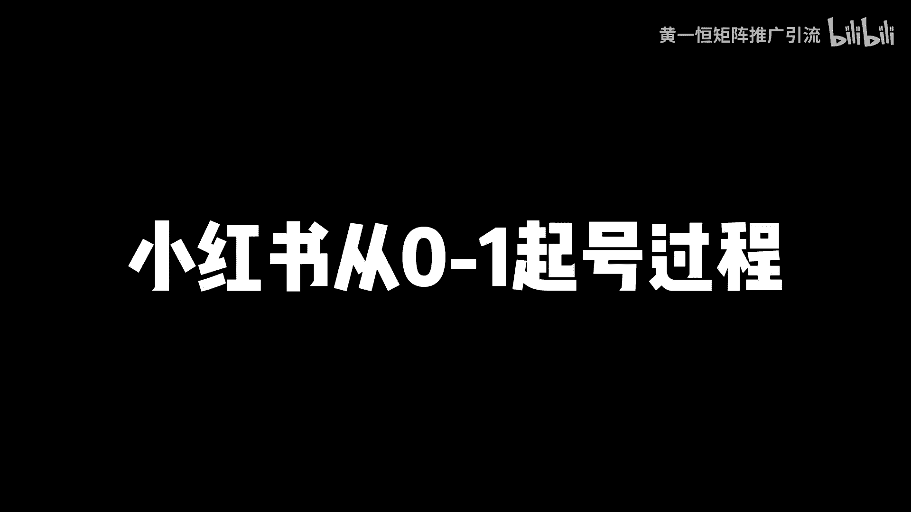
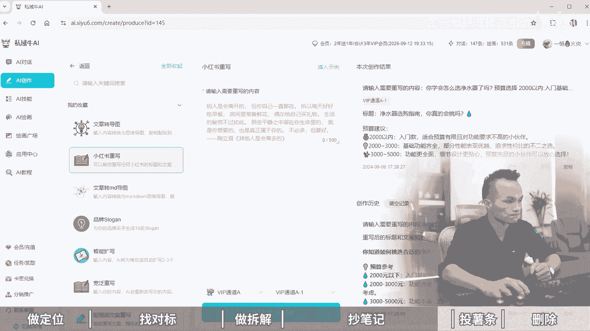

# 小红书从0-1起号过程--6步冷启动法，小红书矩阵打法！小红书起号教程，小红书起号攻略，小红书冷启动sop，小红书矩阵账号怎么做，2024版小红书运营教程，小红 - P1 - 黄一恒矩阵推广引流 - BV1F9tWeAESL

小红书很恶心的一个敲方法，谁爆就抄谁，最后自己比对方还要爆，这个方法呢略微有一丢口，但是用起来是真的好用，嘿嘿嘿嘿嘿嘿，最近我们在敲的时候来都用的这个方法，基本都爆了，不能说百分之百基本上都90%。

而且最主要这个方法来操作起来十分简单，一个视频给你分享小红书从0~1起号过程，六步冷启动法。

落地教程有点长，记得先收藏一起来看，我给你分享，一做定位，二找对标，三做拆解，四抄笔记，五头薯条，六座删除，现在看第一个，一做定位，首先我们需要定义人设，人设就是明确你是谁，你的IP名称是什么。

比如说我的IP叫做黄奕恒，第二个定方向明确你要做什么，你的赛道是什么，比如现在我做净水器，那我的账号就可以起名为黄一恒净水器，为了方便用户理解，我们可以加一个词，比如说黄一恒，你要净水器啊。

显得更加的专业，第三个定目标人群，明确你需要获得什么样的客户，你的人群是什么，具体可以体现为我们的需求关键词，比如说目标人群会搜索哪些关键词，搜索这个关键词人群，他刚好跟你的气球是完全贴合在一起的。

机体可以分为两种词，一种词叫类目词，比如说我们做的叫做净水器好，我们可以加上来，然后呢净水机好，这是不同人搜索的习惯啊，是不一样的，或者说是净化水好，这些是我们的这个类目尺，那除了类目尺之外。

还会有那个产品池，产品池就是细分下来会有很多啊，比如说净水器里面它会有很多的类型，我们来说说看一下啊，比如说我们说净水器有哪些类型好，搜索出来之后呢，这种就是产品车，那么搜索出来之后啊，这里面会有很多。

比如说什么啊，超滤净水器，然后嘞钠力净水器，反渗透净水器，净热一体机，好，这些关键词我们都可以给它识别，然后来整理下来好，这时我们又得到了一些产品词，我们在做的时候就可以从这些关键词入手。

关键词这一块来多多益善，越多的话，我们获取到流量自然就越多好，这是第一个我们需要做定位，第二个咱们需要去找对标，找对标有两个，首先我们需要找这种爆款选题，选题呀，高于一切选题的权重呢大于80%。

你发布的东西有没有流量，就取决于你发什么选题，就像你跟身边的人讲个故事一样的，讲出来，很多人喜欢听，说明这个故事啊确实比较好，讲出来之后没人喜欢听，说明这个故事呢确实不行。

所以咱们要学会看数据等于开卷考试随性而发，猛人摸象，很多伙伴是把自己会的，自己想的，自己有的像发朋友圈一样发到小红书上面，什么人喜欢看呢，只有你自己喜欢看，别人都不喜欢看，所以咱们在做的时候。

所有的笔记都要建立在别人的数据，技术指标之上，相当于就是你的同行，你的对标他都在帮你测试，测试好之后，我们直接拿过来发，自然就会有流量，所以火锅内用呢还会再火做小红书啊，一个公式叫做70%的相似爆款。

乘以足够多的尝试次数，就可以把小红书做起来，具体咱们在做的时候需要去做一个选题表格，那选题表格有几种方法，首先通过搜索选题法，比如说刚才我们搜索的关键词叫做净水器，那么搜索完之后啊。

这里面就会有很多很多的选题，那么有些流量比较大，特别是有些时间隔我们比较近的，还可以重点把它整理下来，比如说净水器八买八不买净水器，鄙视链好，净水器，那么避雷指南，你看这些都是选题。

还有这个什么除下净水器怎么选，我们都可以把它折叠到自己的选题表格里面来，第二个对标账号法，如果我们找到一个非常准确的对标账号，我们可以直接打开这个账号的主页啊，比如这一个账号我们点击，然后打开账号主页。

在账号主页里面它就会有很多人的选择，把一些数据比例拉的比较高的拷贝出来，我们可以去拷贝模仿，特别是一些那种低粉高涨的作品，可以优先考虑粉丝量比较大的，那咱们基本上就可以pass掉了，第三个叫下拉选题法。

比如说当我们在搜索这个净水器的时候，你会发现它会有很多下拉词，这些下拉尺就代表是高频需求才会出现这里面，那咱们都可以做，比如净水器怎么选，净水器有哪些类型，净水器，直饮净水器DIY。

这些通通都可以整理下来，在整理的时候呢，最好的办法是建立一个选题表格，什么是选题表格，比如说咱们做笔记不是看一篇做一篇，我们是建立一个选题表格，从选题表格里面挑选这个收藏。

比评论比分享比比较高的优先进行操作，因为重笔记呢更加容易破，比如说这里面有篇笔记147%，相当于100个人点赞，会有147个人收藏，收藏量是大于点赞的，这种笔记他就很容易什么二次火。

有的伙伴不会做这个表格怎么办好，你可以来找我，我把这个表格打包分享给大家，我们做一下来自然共享好，来看一下，第三个叫做拆解，那么当我们找了很多的对标选题，做了表格，接下来我们需要去重点去猜。

这种叫做低粉高涨的账号，分析他们为什么能报学习他们的优点，那种粉丝什么3万5万10万的，打死也不要去模仿啊，模仿的没有任何作用啊，因为这种账号呢已经做起来，他是有加成的，特别那种什么两三百个粉丝作品。

有个1000个点赞，800个点赞，500个点赞，你要重点的去分析，特别是这种最近30天的作品，因为小红书啊，它是一个喜新厌旧的平台，近期内容啊更加受欢迎，像刚才我收的这个净水器，收拾完之后，我点筛选。

我们点这个图文，然后点一周之内好，这时候我们点最多点赞就可以筛选出一周之内，你看四天前，两天前，这些都具备一个特点，叫做新鲜度，哎，都是非常新鲜的，甚至有的是什么昨天发布的，几个小时前发布的还是热乎的。

你拿过来拷贝流量绝对不会太差，所以呢这种用内容啊并没有审美疲劳，如果你把几年前的内容拷贝过来，你会发现他会审美疲劳和过失，这时候就不行了，接下来我们就去拆解它的一个爆款笔记，他们做了什么选题。

用的什么封面，标题怎么写的，内容载体是什么形式的，好把这些你都拷贝到你的行业上面，自然就能够报有用来，自然不会太差啊，来看第四个抄笔记笔记啊，咱们需要进行一对一的模仿，什么叫一对一的模仿呢。

就是测试火的选题，测试火的封面，测试火的模板绝对是什么，整体比较不错的，但是一比一的模仿不是让你重做一个笔记出来，而是模仿着这个来做，做出来之后呢也是一个什么原创的啊，就比如说吉利啊，现在我们去做好。

这里面他做了很多很多类型的笔记，叫做四款净水器的评测好，我们可以把这一个内容做成这个模板，相当于把这两个变换一下，或者把这个我们套哪个模板，套这个模板啊，或者掏这个模板，那也是可以的。

那么第二个呢研出分比较高，如果你严重度再低的话，他是会提示搬运的，搬运呢自然就会违规了，连这个薯条都投不了，那什么是原创内容，没有发布过的内容，就是原创的，或者说是识别对比之后，有超过30%不一样的。

这种人也代表原创，第三个新鲜度比较高，就是没有审美疲劳，刚才讲到的啊，一定要选近期的啊，时间越近的越好，如果你的赛道比较细分，近的没有，你可以稍微啊稍远一点也行，同时大家要学会对笔记进行去重，怎么去除。

比如说现在我们找了一篇这个笔记，哎，咱们去进行制作，我们来复制一段上面的内容，还复制哪一段呢，我们来打开这本笔记啊，那这个笔记里面他会有很多，比如四款热门净水机评测好，这是它的标题。

那这个标题我们也可以给他改一下，那这个怎么改呢，有几个方法啊，首先我们可以通过AI的方式来重写，上面的一个文字啊，怎么对内容进行重写呢，我们可以打开这个AI平台，在AI平台里面找到AI创作。

然后选择小红书，找到小红书重写，把我们的标题，把我们的文案粘贴进来，这时候AI就可以改写成原创的，那真的内容并不是很多啊，比如说我们来找一些内容稍微多一点的，我们往下方滑动啊，挑一些文字型稍微多一点的。

比如这里面有一个好，我们需要对它进行重写，首先我们把这个内容给它识别出来，那识别出来之后呢，把这种给他复制一下，好复制完之后啊，你看现在我们已经改写了四款热门净水器评测，变成什么惊险。

四款热门净水器评测，让你不再为显哥烦恼，我们把这个有链接进来，链接进来之后啊，我们稍微给他做一下这个换行，好换行，然后呢2K以内的就是2000以内的，我们我替换一下啊，有可能这个K的话。

它系统识别并不会特别的好好，我们给它替换一下，那么替换完成之后呢，接下来我们就可以点击这个立刻生成，这时候AI它就会对它进行原创，而且这个内容你一次重写都是不一样的，你重写十次它就可以得到十个版本。

比如这个内容我复制一下，过一会我再点击重写，它又可以改写为另外的版本，这种拿过来之后啊，都是可以进行一个套用的，你看啊，原来的这个叫做预算选择，变成了什么预算参考，你学会怎么选净水器了吗。

你知道如何挑选净水器的吗，我们点这个重写，这时候AI又会对它进行重写好，这是一个方法，另外还可以修改排版和布局，什么意思呢，比如说好，这是一个排版布局，我们可以套到这个模板里面，变成聊天记录的。

也可以变成这种方式的，就是换不同的封面，不同模板来套，还可以调整顺序，比如说啊我们在做的时候好。

咱们打开像这一个，那么他是先看利息，然后呢再看沉水，我们可以把这个盛水给它放到上面，逆行放到下面，这就是什么调整顺序，还可以换封面，把另外一个行业，另外一个销售的爆款方面调到这个行业里面来。

哎也是可以的，好接下来第五步，我们需要去投放这个薯条，那么薯条的话每天发布两条笔记啊，那么第五天的时候我们就可以去观察数据了，然后来投放薯条进行测试，那数据这一块我们需要找到五条数据。

整体最好的合并一起来进行投放，投的时候直接投200，那么投诉它的意义在于什么，第一个能够强制过程加速过观察期，能够让我们的笔记啊，直接就跳到这个识别器里面来，第二个能够提高初始播放量。

那么拉动我们整个的流量增长，那么在做的时候呢，一定要观察整个笔记的表现啊，比如说我们投完之后啊，那么已经结束了，挑选出三条笔记，最好的追加再投500块钱，这时候你会发现。

就会有些笔记流量能够拉高到五到10万，这五到10万就能够增加，我们整个账号的垂柳权重，冷启动呢就完成了，那么此步骤啊，就是前期呢相对来说做起来会比较艰难一点，但是一旦把这个步骤过了之后。

你会发现做小红书吧真的是非常简单，每天正常发笔记诶就可以了，最后一步啊，六做删除，删除什么意思，相当于我们需要删除前面十条笔记里面，播放量最低的两条，保留数据最高的。

因为最低的它会降低我们整个账号的推流权重，后续啊按照正常节奏反复操作就可以了，那么冷启动之后来，你发笔记流量会比以前高了近两到三倍，比如以前300了，现在你发基本上都能达到1000以上。

那么学会了这个六步冷启动法，如果我们想更快的去把小红书做起来，有的伙伴呀定投目标非常高，一天就想通过小红书打100个粉，那怎么办呢，这时候咱们得学会做几站，比如一个人做十个账号，用概率来换取成功率。

去降低平台的什么不确定因素，哎这该怎么做，这里面我给大家准备了这个系统的课程，咱们一个账号一天十个客户，十个账号就100个了啊，首先给大家准备了小红书的入门营干货框架，带大家搞懂小红书的收录机制。

运营工具，企业号运营KY的投放，还有店铺的运营，还给他准备了小红书的爆款选题表格，那么从表格里面挑选这个收藏，比凭证比分享比比较高的，优先做，更加容易爆，还给大家准备了三个小时的摄影流课。

那么小红书的前流程，以尔设计，还有导流方法，常见问题以及变现项目，通通都给大家打包好了，这里嘞都可以通过主页来进行领取学习，好，各位同学，我是黄一恒，制作落地推广方法，刚才给大家分享了小红书的冷启动法。

如果咱们想获得更多的流量，更多的课资，我们得学会打造多流量管道，这里面我给大家准备了18个平台的详细打法，教大家如何做多流量管道，其中小红书就是一个，而且这些都是我原创的，可以通过主页来领取进行学习。

如果觉得今天视频比较不错的，请大家一键三连，感谢大家支持。