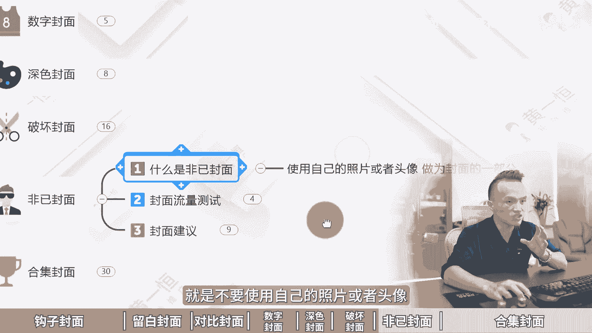

# 小红书封面怎么写吸引人，8种爆款封面模板，小红书矩阵打法！小红书封面图怎么做，小红书封面制作教程，小红书笔记封面怎么做，小红书图文封面教程，小红书运营入门到精通 - P1 - 黄一恒矩阵推广引流 - BV1HvtPeCEaq

怎样靠一张封面图去撬动10万阅读量，我看谁SK不懂去抄作业党，做小红书不用动脑，不用连充，这方面只需要操作八爆款封面模板，就能快速拉高你的流量下限，从原来的几百流量变成几万流量。

一个视频跟你分享小红书封面怎么写。

吸引人，八种爆款封面模板落地教程有点长，记得先收藏一起来看，会给你分享，钩子方面，留白方面，对比方面，数字方面，深色方面，破坏方面，飞机方面合集方面到底该如何来做，现在看第一个钩子方面。

就是在封面上下钩子，比如说我们做情绪化的钩子，通过笔记给用户带来情绪价值，在小红书上面，封面情绪化是出报文笔记的必要条件，让用户看完之后很高兴，很生气，很同情，很悲哀，这些都是什么情绪化的封面。

比如说我们在标题上面，加上一些情绪化的关键词，气死我了，就是非常生气，因为当我们看到别人很生气的时候，我们就会非常好奇到底是为什么生气，你可以看到啊，这里面就会有啊，气死我了，流量分配的乱象好了。

这里面有很多很多类似的，然后呢你也可以在里面搜，比如说我真的服了，也就是看到之后是被这东西什么折服了，然后呢无语了好你可以搜索一下，比如说我真的服了，留下这个健身房，你搜索完之后。

你看到这里面有很多很多的赛道，哎他们就在套用这个模板，给用户带来这个什么情绪价值，还有什么谁懂啊，家人们为什么会出现这种情况，那么第二种呢是恐吓式的封面，利用用户的逆反心理，看到这来反而会引起关注啊。

比如说千万不要直接发脾气，千万不要给孩子看什么，千万不要孩子吃什么啊，就是下用户，下周他发现我千万不能到底什么东西，哎，他就会产生逆反心理，反过来就去看，比如千万不要晚上啊看电影。

千万不要用这种材料装修，或者说是净水器，千万不要买这种净水器，就是恐吓这个方面好，再来看一下疑问式的方面，那么爆款方面的核心就在于什么，就是制造悬念，提出问题，引发用户的兴趣。

然后来让用户啊吸引过来进行点击啊，比如说咱们做一些疑问式的，1000块钱怎么创业，或者100块钱怎么创业，让用户觉得100块钱怎么可能辞职后，做100种工作是种什么体验，哎这些都是什么，带着问题在里面。

让用户来对这个问题产生好奇心，好这些钩子的话基底其实有很多种打法，这里面我给大家准备了八种类型的钩子，有什么好奇类，介势类，通点类，极限类，恐吓类，反差类，逆输中类，以及同理心类的这些呢。

我统统都给大家准备好了，我们来打开看一下啊，比如这里面有好奇类的，利用观众好奇，得不到没体验过的失误来激发好奇心，还有借势类的，名人自带的流量和热点扯上关系啊，就能蹭到流量，那么还有这个通点类的。

通点不解决就会难受，戳的液精准，那没有细腻，还有极限类的，将抽象的那种具体化信念强，让观众呢能够重视好，这个呢非常多，我就不详细给大家看了，大家可以找我，我把它分享给大家，咱们做一下这个自然共享。

少走弯路，好来看第二个叫做留白封面，什么是牛掰牛掰，我是这样理解的，这个牛掰啊，其实是做广告设计，里面用的非常多的一种设计方法，那么使用纯色填充，一流出大面积的什么空白区域。

我们就称之为叫做什么广告留白，那么广告留白呢，记住它的每增加一倍注目率就能提高四倍，有的伙伴说留白会不会意味着空间浪费，其实并不会啊，留白它能够提高广告的整体效果，增加视觉冲击力。

比如说我们来找一些什么叫做留白类的啊，那在前面我们输这个净水器啊，来看一下这个赛道里面哪些用的是牛掰啊，比如像这个笔记，他其实也是个牛排，只不过呢留的不是很多啊，什么叫流量很多的，像这种。

你看它它上面和下面都是做的空白的啊，好再往下面来看，我们挑一些留白，留的比较夸张一点的，就是有的笔记啊，他一个大背景拿来上面只放上几个文字，就是为了突出这几个文字的重要性，你看这个啊。

每天一个装修小知识，就是用的牛排啊，包括这个也是一样，净水器骂一个骂醒一个算一个，你看这就是前面讲的钩子方面，外加留白两种，用在一起的，那留白这一块呢，咱们在用的时候啊，它是可以进行什么。

就是说不要使用什么渐变色，也不要使用什么图案填充，尽量的使用这个什么纯色镜填充，比如纯白色哎，或者这个纯比较浅的一个，橙色或者纯黑色都可以，你看这些都是牛掰牛掰，就是让用户看起来的时候来。

直接突出我们的目标主体好，这是第二个，那么第三个叫做对比方面，对比方面啊其实是非常火爆的啊，什么是对比方面，就是强烈的前后反差对比，吸引用户的点击，将内容呢一分为二，就比如说啊装修前。

装修后让用户直接产生一个什么非常大的落差，好咱们来搜索一下装修前后的对比，那么装修前是这样的，装修后是这样的，然后呢你再往下面来看好，这是装修的一个，你看装修前好，装修后，装修前vs装修后好。

这也做对比，还有这个什么房屋改造前啊，房屋改造后这些关键词大家都可以接受啊，你的行业你可以想一下，能不能把前后给他放进来，你看一下啊，这是之前，这是后来，这是前，这是后好，这是前这是后啊，很多很多啊。

都是还有什么减肥前后，化妆前后让用户直干的直观的什么，看到这个前后的效果对比好，原来你是这样的，现在这样的就发现原来我也是个美女，差的就是什么，就是多了几斤肉，把这几斤肉减下来，我们就是美女了啊。

那么画中前后也是一样的，咱们也是大比例，只不过呢就差一个什么好的化妆技术了，你可以对比一下化妆前这的哇，化妆后这个气质立马就什么就拿捏了啊，好这是对比方面，再来看一下数字方面，那么什么是数字方面。

记住阿拉伯数字啊，它是直达大的，就我们看到一个数字之后，它只是条件反射，不需要阅读，不需要思考，而且数字来同时代表量，比如说五个方法，六款工具或者十个什么东西，它代表很多。

而且小红书本来就喜欢这种独有的东西，所以数字呢我们就可以用数字来代表，那么大号的数字啊，更加能够吸引用户的目光，比如说八部身材管理纪录片，你看把八这个数字重点加大，就是为强调包括我们前面搜索的这个啊。

比如我们来看看这个推荐笔记吧，我们把这个关键词给它取消掉啊，然后再返回来好，咱们看一下啊，这里面其实你去找他，也会有很多很多类似的这种，你看你不知道的60个爆款的钩子开头，你看这就是用的数字啊。

让用户看到数字之后就知道哇有60个啊，非常非常的多，唉这种就是什么数字的开仓啊，这里面还有很多，那比如说商号的十大行为，你看十大好，这个十字其实可以再加大一点，首串佩戴的八大禁忌，你看八字哎，就是数字。

我们可以把它用起来好，再来看一下这个深色方面，那么深色方面呢，就是为什么要使用这个深色方面，因为小红书的这个默认列表来看，它是白色的啊，如果像这种你看颜色偏深的，它就会什么更加的什么醒目一点。

能够让我们的笔记来脱颖而出，所以咱们在做封面的时候，就可以使用这种什么深色背景来做，那更加能够脱颖而出，比如说纯黑色，黄色绿色蓝色，具体我们来搜索给大家示范一下，比如说我们在小红书里面是不是买车。

搜索出来，这里看看这一个笔记，他就非常醒目，因为他是用的纯黑色啊，毕竟背景是白色，黑色的话就立马变成什么比较醒目，你再往下方滑，你可以跳一下，只要是颜色比较深的，它像这一个它也是深色颜色。

让用户看到出来更加容易被注目到买车的思路，哎不要乱来看下一个破坏方面，什么是破坏方面，我们通过破坏性的开场破坏东西，它能够吸引用户的好奇心，想点击啊，一探究竟，能够大幅度增加我们封面的一个点击率。

好具体来看一下破坏式的封面，它适合于什么赛道，比如说美妆赛道，我们可以砸化妆品，砸完之后呢，还能够再续半年，你看这些都是砸化妆品的，再比如说这个装修赛道，那么为什么没人在砸墙前告诉我，才装修完八个月。

我又把家里面给它砸掉了，好这种就是咦花了钱的，花了时间的，为什么给他砸掉，是你看原来互联网上面有很多什么砸汽车的，砸洗衣机的，砸家电的也是获得了很多流量，但这个有个缺点啊，缺点就是比较费钱啊。

毕竟你砸东西的时候，你得真真正正的去买东西过来砸，或者买点样品过来砸，那么操作方法比较简单，就是我们啊把这个物品给他破坏掉，把这个过程照片给他拍下来，最方便哎就可以了，好接下来看一下这个飞机方面。

那什么叫非己方面，就是不要使用自己的照片或者头像。

来作为封面的一部分啊，最开始呢其实我也犯了这个错误，我们来看一下封面流量测试，最开始的封面我也是使用这个本人在各大平台，我发布作品的时候都是用本人的照片啊，什么十大朋友圈发布技巧怎么怎么样啊。

把自己照片放上来，但是我自己呢本身他又不是特别有名啊，就是说很多人看到他也不认识，你，长得又不好看，也没什么特色，那怎么办，所以咱们在做的时候不要使用本人的流量，后面我就换了啊，你可以看一下。

我就直接用主题来突出，用深色背景啊，如果放人物的话，人物也是作为一个次要的元素，并不会作为主要元素来进行突出，所以咱们在做封面时候有个建议啊，不要自恋，不要使用自己的照片来作为封面图。

那么照片呢和选题没有关系啊，它会导致你的选题分辨率，大幅度的什么切近拉低，并且我们又不是知名人物，很少有人认识你，你放进去之后呢啊，不能够给你带来好处啊，反而会什么降低了点击率，所以封面图的选择啊。

尽量的选择跟我们主题比较相关的，比如生活感比较强的，分享感比较强的啊，就是越真实的封面越好，反而你用什么软件精修细修，做出来之后来反而效果不好，为什么，因为小红书它是一个分享平台，所有的手写的。

看来随拍的比较杂乱的，很真实的，灯光比较暗的，甚至有噪点的，反而流量比较大，反而你做的很专业的嘞，像广告图一样，像那种什么开电商那种方便图，流量呢就会大幅度下降，好来看最后一个叫合集方面。

那什么是合集方面，合集方面就是一个系列的内容啊，内容太多了，根本看不完，看完了怎么办，先收藏以后再慢慢的去看它，就类似一个歌单，好，比如说现在给你啊推荐100首开高速的歌单哇，听着这个歌呀。

你根本就不会犯困，好，你看这么多歌，那怎么办，我先收藏起来呗，等我开高速的时候我再听，再比如书单，人生必看的十本书，迷茫的时候一定要看这十本书或者影单，人生必看的十部电影啊，或者说是灾难片，十部合集。

好这种什么都是一个合集，所以咱们在做合集的时候啊，每个行业都可以用起来，什么小物品合集，知识分享合集，帽子合集，口红合集，各个合集都可以，就是把内容放在一起，你不用去找了，你直接看这个合集什么就够了。

所以你在说合集看啊，什么小红书封面，何洁，还有什么美食合集，然后嘞抗衰老产品合集，你看各种各样的合集，反正重点就是一个内容太多太多，你看这个一个小五只的裤子合集，一看哇，一看这么多，那这么多怎么办啊。

就说明别人花了很多时间整理了怎么办，只能够先收藏，所以打开笔记就会发现，很多笔记的收藏率都是比较偏高的，甚至有些合集的它会出现一个情况，出现什么情况呢，就是你去看这个笔记啊，他的这个笔记的这个合集。

他的收藏会大于这个点赞，你看这一个3700个点赞，有3900多个人收藏好了，各位同学，所以封面呢是我们小红书非常重要的一个点，它能够直接拉高我们整个账号流量下限，发布完之后是500流量还是5000流量。

还是5万流量就完全起结，你用什么方便，除了封面之外，如果咱们想玩好小红书，每天搞个100个200个顾客，那该怎么做，其实呢更加适合做小红书的集成打法，一个账号一天搞十个顾客并不难。

十个账号呢加起来每天就100个顾客了，这里面我给大家准备了小红书的入门运营，干货框架，教大家了解小红书的内容，收录机制，运营工具，企业号投放以及KY的投放，包括店铺管理。

还有给大家准备了小红书的爆款选题表格，让我们在做笔记的时候啊，都是开卷考试，用好工具，而不是随性而发，盲人摸象，咱们可以挑选一些收藏比比较高的笔记，就代表什么内容非常实用，内容比较多。

你做出来的数据绝对不会太差，也可以挑选评论比比较高的，就是互动的人比较多，分享比比较高的是传播的人会比较多，但有的伙伴不会做这个表格，没关系，我把我的表格共享给大家，还有我们小红书的系统引流课。

教大家怎么做这个矩阵，比如说前流程钩子怎么设计，引流方法以及常见问题，还有便捷项目通通都给大家分享，这些呢我都打包好了，大家直接找我，我们给大家做一下这个资源共享好了，各位同学，我是黄一涵。

只做落地推广方法，刚才给大家分享了小红书的封面，如果咱们想在互联网里面搞到更多流量，更多的顾客，我们得学会打造多流量管道，那么这里面我给大家准备了，18个品类的详细打法，小红书呢就是我们其中一个。

而且这些都是我原创的，可以通过我的主页来灵体进行学习，如果觉得这个视频比较不错的，请大家务必一键三连，感谢大家支持。

