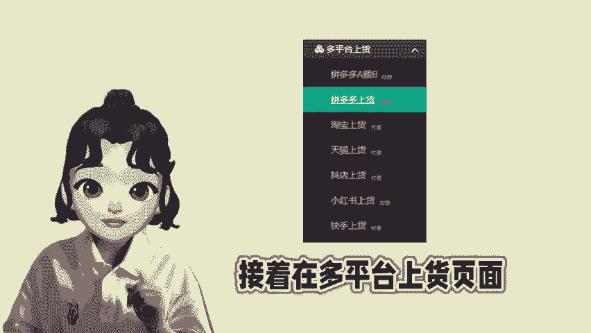
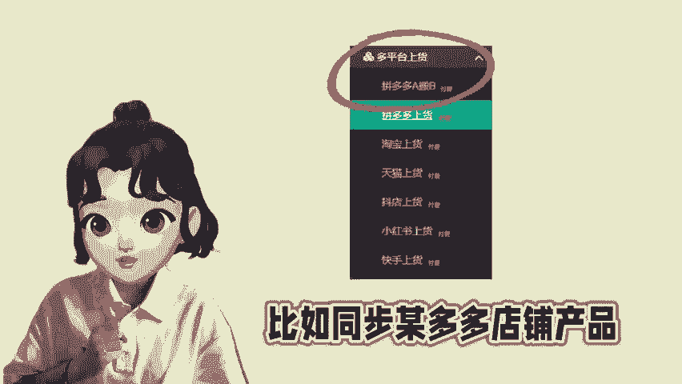
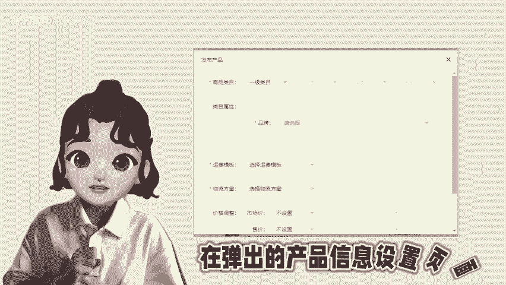
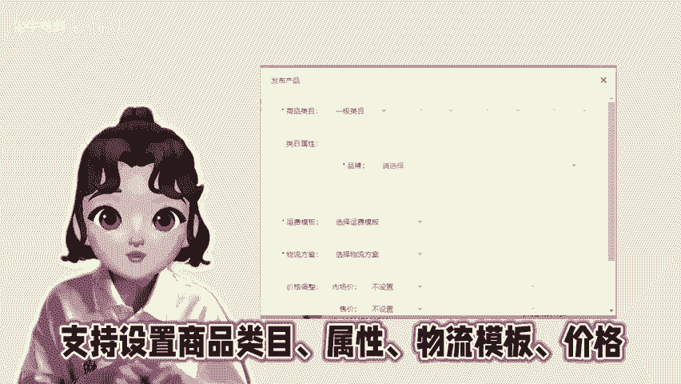

# 小红书店铺运营之如何批量上架商品？ - P1 - 尘牛电商 - BV1g7xxemEUB

🎼其他店铺的产品批量上传到新开的小红薯店铺，也就是多平台的产品再搬到小红薯店铺怎么操作？有多店铺上货需求的商家记得看过来，在陈牛这里有个小红书上货，先登录小红薯店铺。

接着在多平台上货页面同步其他平台的产品。比如我这里同步某多多店铺的产品同步完成之后，在小红薯上货页面，筛选一下拼多多这个平台，然后批量选择已经同步到产品列表的商品，点击发布产品。

在弹出的产品信息设置页面，支持设置商品类目属性物流模板以及价格等操作，最后将产品上传到小红薯的店铺后台，商家可以在后台检查已经上传的商品，根据店铺运营需求，再进行批量上架。如需同步其他平台的产品。

根据以上的操作流程就可以批量上货了。😊。

