# 小红书引流到私域技巧，私域老手实战经验分享导流技巧，如何在小红书导流，小红书安全导流， - P1 - 课雨蓝海 - BV1iDxNeeErV

那小红书如何不花一分钱安全导流怎么发都不封号。那么这期视频呢就给大家详细的讲一下。其实在小红书获客过程当中，最悲哀的并不是你没有流量，而是你的流量来了，我的号没了，那怎么才能做到我来了流量。

再保证我大号不被封的情况下安全的让这些客户进到我的词语当中。OK那接下来给大家先看一下，你是不是在用这些方式进行导流。那么首先大家常见的就是打卡，看到没有？哎，这就是打卡的一个导流方式。

那我们可以直接在这个圆圈里边写上我们的自己的个人信息。那么只要有人打开我的主页看到这个信息，哎，就可以加到我，对吧？这是一种方式，那么接下来三连啊，那在小红书上呢，一般情况下是二连比较多啊。

二连或者是四连。那什么叫二连和四连呢？我拿这个给大家举例，我们这个作品发完了以后封面，我们可以把我们的这个联系方式分成几段啊来做成一个封面。比如说我们的是一2，然后三。

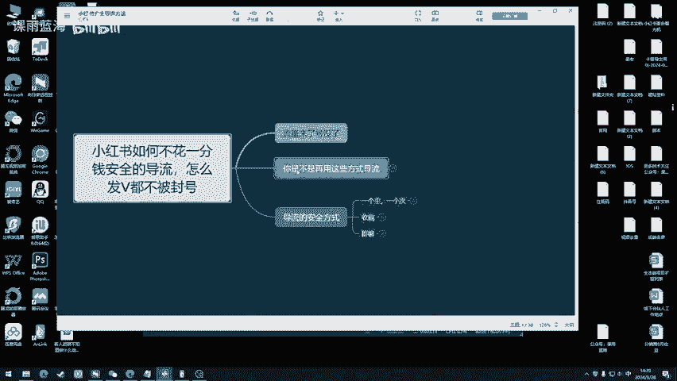

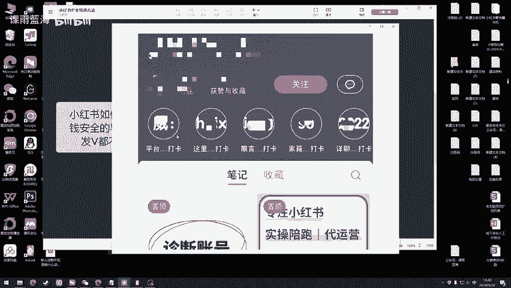

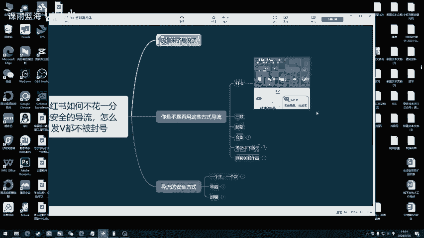

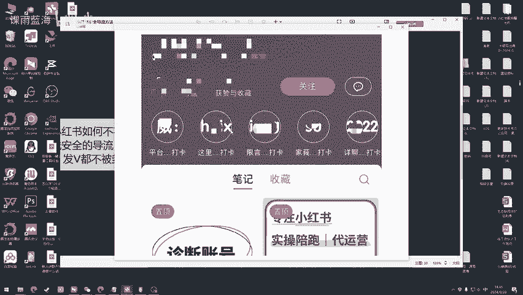

4哎这样的一种方式进行一个展现啊，这就是二连屏好者三连屏的一个方式。那么还有放邮箱的。那么邮箱是放在哪里呢？他们邮箱很多都是放在个人简介当中啊，放在这个个人简介当中，放在这里啊，放在这个位置。

但是邮箱呢现在用的人是非常非常少的啊，所以说呢这个只是一种方式。那么还有合集，那合集的话给大家看一下，这里就是合集，看到了吧？哎，这里就是合集。他在这里边就是创建了一个合集。

然后这边留下了自己的联系方式。OK还有就是笔记中下钩子。那么笔记中下钩子的话，那么置顶作品然后呢他在这里边写上了他这是一个引导啊，它这个钩子是一个引导，引导你去群里边啊去找他，或者是在头像或者是简介啊。

去找他，这个是作品的一个钩子O那还有第二种啊，笔记钩子，还有像这种。

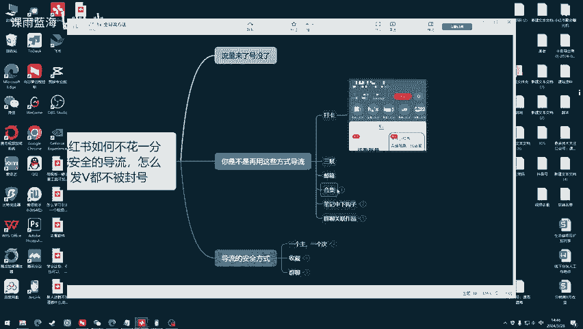

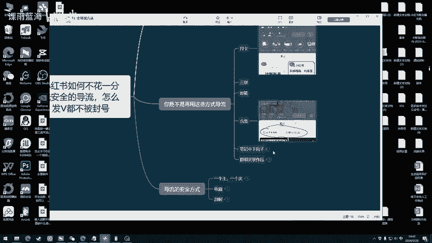

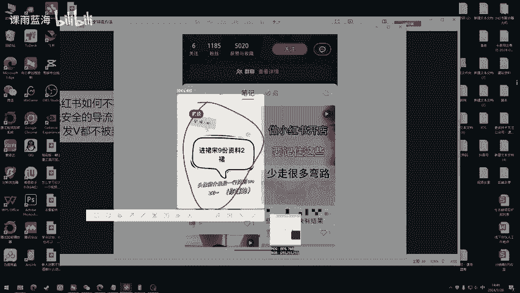

给大家放大看一下啊，看一下他这个作品啊，他在下边打上了自己的联系方式。O那接下来还有一个群聊关联作品。那么群聊关联作品的话，那就是在我们的整个作品之下啊，放上我们的这个群聊啊。

这个我们可以在群里边自己去这个设置的啊，那么以上这几种方式不知道大家有没有发现一个问题，他们是通过主号进行获取流量，然后用主号进行引导，那么引导的这个过程就有被封号的一个风险。

那我们玩流量首先要保证的是我获取流量的这个账号不要被封掉。如果我这个获取流量的账号被封掉的话，那我还谈什么导流，对不对？那这个时候我们就要想明白一个关系，就是主次关系。那么主次指的是什么呢？

主就是大号次就是小号，那我们要保障我们的这个大号，它一直可以获取流量，并且不被封掉。那我就不能用这个大号进行一个导流。那我想导流的话，我就可以用小号说白了可以做一个ts柜。所有有。

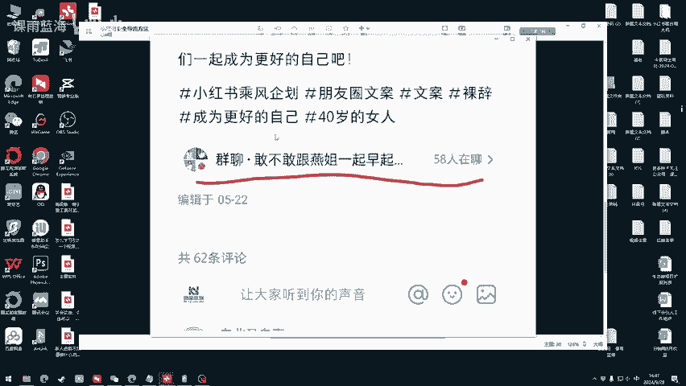

风险的事儿全部都让这些小号来干啊，就是承担被封的风险的啊，让小号来承担被封的风险的。那么导流的方式有几种。第一种收藏，我们可以用大号去收藏小号的钩子作品。比如说像这个啊。

我们用大号去收藏了一下这个小号的作品。OK然后给大家看一下啊，这个是我们这己一个账号。那我们这里个收藏，这就是我们收藏的一个钩子，给大家点开看一下啊。

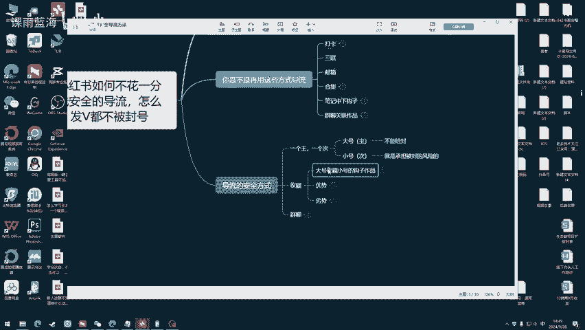

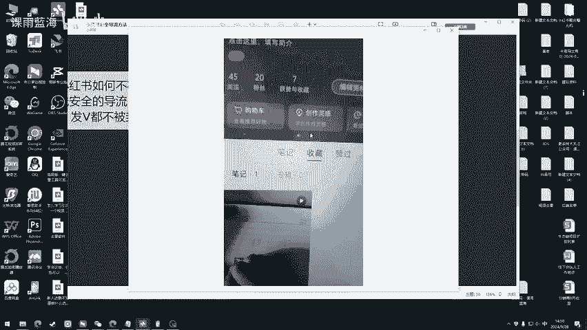

哎，看到了吗？这就是一个钩子。那么这个钩子我们用大号给它收藏，收藏完以后呢，公开我们的收藏。那我们也可以通过用小号去给大号的作品去评论，然后引导他们来看我们的这个收藏的钩子。那比如说我评论的话术。

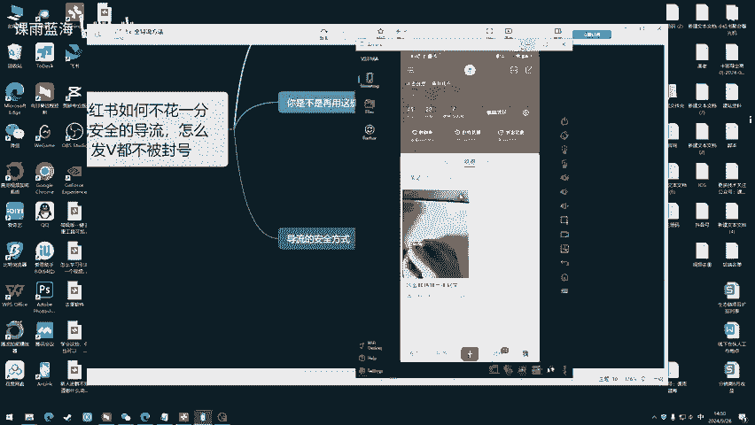

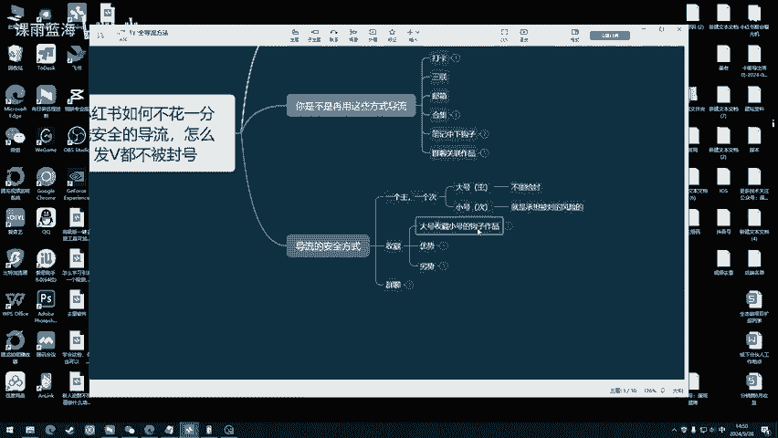

作者收藏的作品好性感啊。哎，或者等等等等一系列的评论词。当你评论好这个词以后，发送出去，让你的大号。把你小号的这条评论给他置顶。😡，这样的话，只要点开你这个作品，看到评论的人都会看到你小号的这条评论。

那么他们就会去看你的收藏。

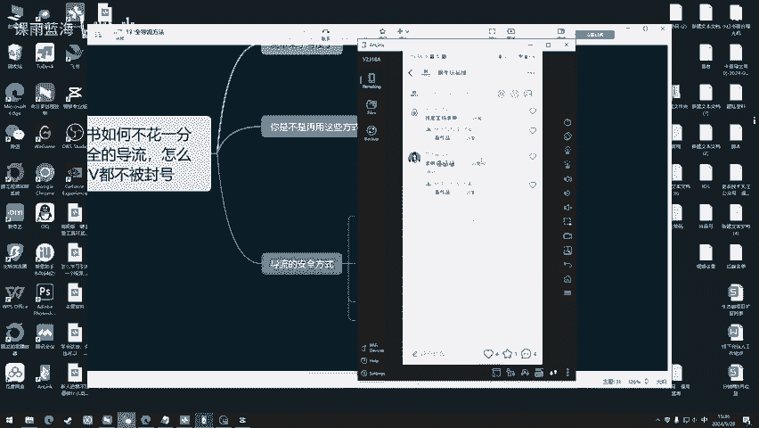

哎，这样的话人是不是就可以看到我们的这个钩子了？哎，就是这么一个逻辑。那么群聊就是我们用小号在群里边发我们自己作品的一个钩子。那我给大家演示一下。那这个呢我用小号在这个群里边发我自己的钩子。

我们可以直接点击笔记分享。

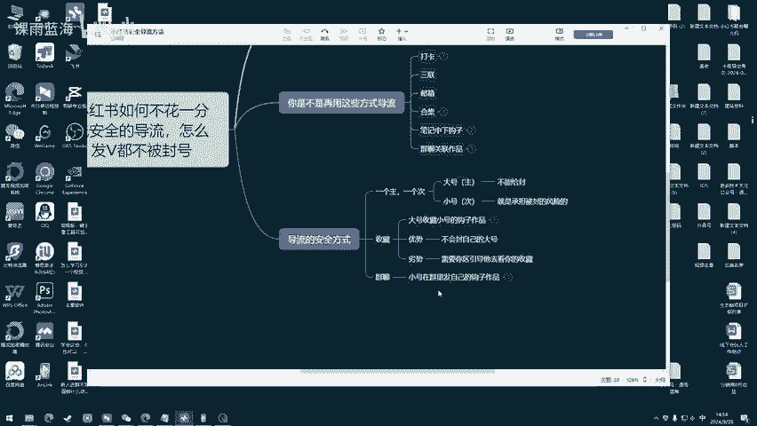

然后点击收藏okK直接发送。这样的话，即便有同行在群里边，他也没办法举报你。那这个就是在群聊里边啊去发自己作品钩子一种导流安全方式。那么这种方式呢也可以给它理解为什么呢？

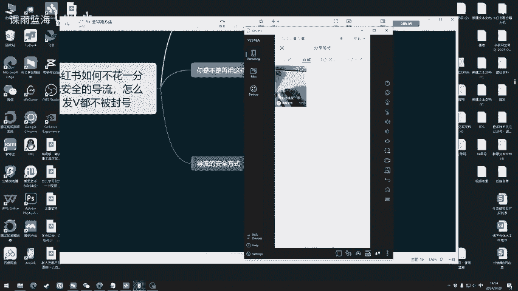

A中。A中B收。啊，A呢就是我们大号，B呢就是这个T4柜。好了吧，OK那这期视频呢就给大家讲到这儿。那么如果说你想学习更多的获客方法，可以加入到社群，可以更加系统性的学习获客。OK那这期视频讲到这里。

有什么不懂的不明白的可以再来问我。

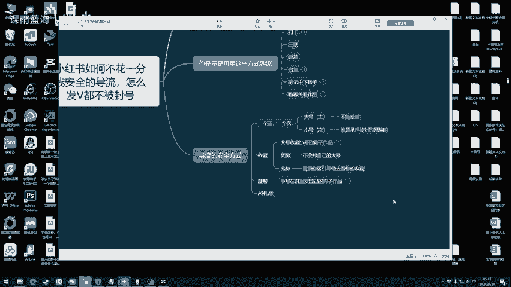