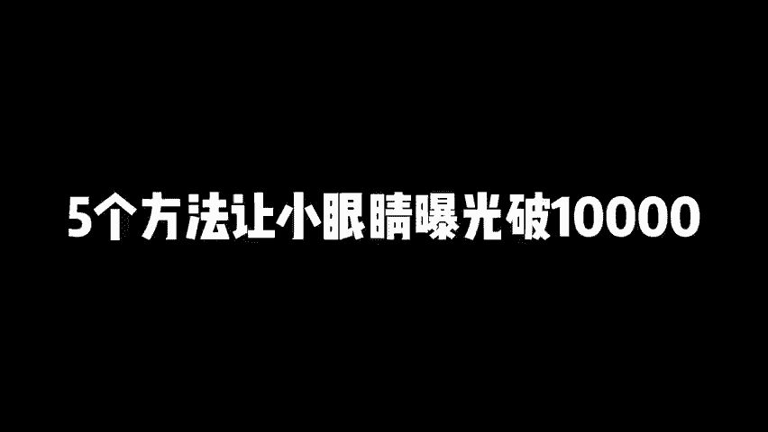

# 小红书怎么发才有流量，亲测有效，5个方法让小眼睛曝光破10000 小红书新号怎么上热门，小红书新号如何快速起号，小红书流量上不去怎么办，小红书新号运营，小红书流 - P1 - 黄一恒矩阵引流技术 - BV1c9pseWEn2

🎼小红书这样发笔记账号又爆了，我们公司刚来学习生，我叫他去发小红书笔记，他发了一周，账号又99家了。牛逼，我们一起来看看他怎么发的用的这5个流量密码，真是个人才。

nice这个方法不错，新账号也能99加一个视频给你分享小红书怎么发才有流量，新测有效。5个方法让小眼睛曝光破1万。详细教材有点长，记得先收藏。一起来看，我会给你分享怎么获取流量奖励，拿到平台的流量补贴。

怎么优化关键词排名做搜索流量，怎么做本地的周边流量，怎么撬动流量词拿到10到100倍的流量，以及怎么自己导入流量，做一下能启动。首先来看第一个获取流量奖励，这个呢其实就是平台的流量扶持。他有一些入口。

只不过很多伙伴呀不知道就导致呢没有拿到这个流量补贴，特别是新账号。因为大部分同学他们在做小红书的时候啊，发布笔记，都是直接点击中间的加号，或者通过网页般发布，这里面发布来，他是没有流量补贴的。

那怎样做才可以获得流量补贴呢？我们需要通过创作中心笔记灵感里面，针对新账号就可以拿到大量的流量补贴。

特别是新账号，你只要进到这个笔记灵感里面，点击订阅立马就可以获得一张200的流量券，流量券呢，下一个笔记直接就可以进行使用。那么进入灵感中心之后啊，这个流量券呢是很多的。像咱们自己在发的时候。

有的时候啊领到了1000的流量券。有的时候领到了500个流量券，反正加在一起的话，已经有几千个流量，这几千个流量来整体还是比较不错的啊。然后我们在成长助推里面就可以把它助推到其他的这个笔记上面。

这体我来给大家演示一下，咱们打开这个投屏手机，点击我然后呢找到右上角的这个是左上角的三条杠，在这里面我们进入到这个创作中心。这里面呢我们需要找到下方有一个叫做找灵感，然后往下方滑动。

这里面就会有一个叫做什么更多的发布热点。这时候我们就进入到了这个创作灵感里面。因为我这个账号呀就领取过了，已经没有前面领取入口，正常进来之外，就会有一个按钮，你点击一下这个按钮就可以拿到200的流量券。

那么在这里面。那我们可以根据自己的赛道这一笔记去找到一些比较相关的行业，然后来进行发布啊。如果实在找不到，你也可以在推荐里面，它是有一些通用的模板啊。比如说像这个什么记录吧。

现在啊那么这就是一个比较好的，另外再往下方划动，像我们发的比较多的是一个有问必答啊，只不过这个模板有的账号里面他是在非常下方，你找到之后点击发布啊，通过这里面发呢，就可以获得流量补贴，这个主要是新账号。

老账号的话，你去发基本上就比较少了。另外就是我们发布完笔记之后啊，可以定期的把每篇笔记就拿过去做一下申诉啊，申诉是什么意思呢？就是当你的笔记如果流量不好，或者你觉得说有什么问题。

你可以去申诉一下申诉完之后，他就会给你一个叫做笔记审核流量补偿件，相当于他觉得说哎我误判导致你的流量损失，所以我就给你1000个流量补贴好，这个呢也是比较多的啊，那么这个在什么地方操作的给大家演示一下。

我们返回来之后。还是一样，点击左上角的三条杠，点击这个帮助与客服，在帮助与客服里面找到这个叫做笔记申诉。然后呢，在这里面我们需要去找到自己的一个笔记。然后呢，我们点击这个问题反馈。

在问题反馈里面就可以去提交反馈的，也可以获得相应的流量补贴，这个呢并不是百分百的一定的概念啊，那么第二个呢就是我们要学会去优化关键这个产品，这一个呀也非常的重要啊，很多伙伴发笔记啊。

那么都是随便去取这个标题的。啊咱们在发笔记的时候呢，一定要学会布局好这个什么小红书的这个IO下拉尺。因为现在很多的用户，他们在使用平台的时候，除了去刷推荐之外，更多的他会直接在右上角的搜索框里面搜索。

比如说我在这里面我搜索这个净水器。那么如果我们的标题里面卡了净水器就能搜索到。比如说我们在搜索一下净水器怎么选啊，或者净水器的这个安装应头。这些我们都可以把关键词一埋到里面。这样的话我们。

又能够多获取到一些搜索人员。你看这些之所以有排名，就是因为他们什么疫买的关键词好，这第二个非常重要，要学会卡这个关键词。那么第三个呢就是做同城的周边流量啊，很多伙伴呀都把这个点给它忽略掉了。

其实在我们的平台上面你可以看到我们返回来，你会发现啊，在平台里面，那么左边是关注中间是发现右侧就是同城，比如说现在我打开同城，我刷到的一些附近的这个人，我刷新一下，你会发现啊。

这里面推荐出来的钱都是我周边的这个人，那我们在发布笔记的时候，你选这的位置，那肯定不要乱选啊，有的伙伴可能随便选。那咱们在选的时候呢，一定要切换着多个地点来选，这个什么意思？

选择一些相对来说流量比较大的地点。就比如说我在发的时候，我是怎么做的啊，我会在手机上面去下载一个软件啊，这个软件呢叫做什么叫做百度地图，大家应该多做少少啊，都用过这么一个软件啊。

那么这个软件有什么好处来？我们来看一下，咱们打开。这个地图软件，比如说百度地图它有个图层，在图层里面就可以选择这个叫做热力图。打开热力图之后啊，我们就可以看到每个地区的一个流量颜色越深的地方。

人流量越大。那如果我们选择一些人流量比较大的地点来进行发布，自然就可以获得更多的什么本地的周边流量啊，这是第二个方法。第三个方法就是要学会去撬动流量词，任何平台都是有规则的啊，如果你不会玩规则。

你发的笔记完全就是什么，靠硬气啊，谈话一线，你可能能够上热门，没有谈话一线，你的笔记啊就不闻不热的，那怎么办？那么小红书的流量密码，第一个就是选题，选题高于一切，选题的权重大于80%。

大部分人发笔记都是像发朋友圈一样，会什么发什么，想到什么发什么，有什么发什么，结果发不这流量非常差啊，正确的做法是什么？用户需要什么，我们就发什么，用户想看什么，我们就发什么用户喜欢什么，我们就发什么。

说简单点，我现在做东西都是。结合你的兴趣爱好来做的，我是为你而做的，不是为我自己而做的啊。所以咱们会看数据，就等于开展考试，随性而发呀给盲人摸象。所以咱们在做的时候。

所有发布的笔记都需要建立在别人的数据技术指标之上。因为小红书它火过的笔记呢还会在乎。因为小红书里面它有个公式啊，叫做什么叫做70%的相似爆款，乘以足够多的层次次数，就可以把小红书做起来。

所以咱们在做的时候需要去搞一个选题表格，在选题表格里面来，我们第一天先花时间做上什么100个选题，从100个选题里面挑选这种收藏比评论比分享比例比较高的，并且尽量优先选择这种什么低粉高涨的账号。

更加容易什么把这个账号来给它做起来。好，有的选题之后，接下来小红书的第二个流量密码就做封面封面这东西啊没有经验的，千万不要这种封面。我认识几个小伙伴啊，他们自己做封面，就是用PS啊。

花了5个小时设计设计出来之后，花里胡哨的啊，结果发动机之后流量都会破100。你直接找近期对标账号再用的封面绝对是比较火的。所以就看你抄谁了啊，怎么抄哎，这个就讲究了，这是进流量次。

那一旦你选题找对了封面找对了，相当于你就什么得到的密码，自然就能够获得什么。到100倍流量，原来你发布1000个流量，现在你发布完之后啊，起步就是一万流量，甚至10万流量都可以做到。

好来看第五个自己导入流量。这个方法呢，我们也称之为叫做能启动流量。什么意思？刚开始我们做账号呀，如果你前面的都做的流量还是不高，那怎么办？我们还可以用第五个方法。

那么用自己的私意容量导入到笔记里面什么意思？比如说啊你自己有很多的粉丝群，有多的铁粉，也可以让铁粉去搜索某个词，刚好能收到的笔记，搜索完这个一键三连把你的书记笔例拉高一点啊这是一个方法。另外一个方法呢。

就是我们也可以这个方法呢不是很道德啊，可能会有点啊缺的。所以咱们在做的时候呢，可以用熟人啊，比如搞几个小号啊，悄悄的加到这个精品的粉丝群里面啊，因为很多人玩粉丝群。

他们都没有禁止别人去分享笔记的那么咱们就可以把自己的笔记分享到别人的粉丝群里面啊，特别是从晚上的时候分享。比如说晚上10点钟啊，这个你的同行就下班了，你就十0点半你就去发咔咔咔的怼一个一大堆在里面。

那自然就能够给你带来流量，而且粉丝群我们可以加很多啊，那也可以做。下这个人气统这些玩法来啊都是可以灵活变通的。好了，魏同学，那么学会了这个怎么发育流量，想玩好小红书啊，这其实只是一个开始。

小红书来见大家，如果一个人做，最好是做10个小红书的集成账号。毕竟啊目前这个平台它就是一个赛马机制啊，那么。咱们在做的时候呢，就是一个优胜劣汰的一个玩法。所以在做的时候，你总能够跑出一些好的账号。

就是因为玩了几针，特别是一些热门赛道，做10个几帧账号，基本都能做到一天100个顾客啊，那怎么玩好。这里面我给大家准备了小红书的入门运营干货框架啊，有这个内容收录机制，运营工具。

还有这个企业号的管理投放啊，店铺运营都有，还有这个小红书的爆款选题表格，就前面给大家演示的，做一个表格出来，这种表格里面去选，而不是看到什么，就随意的拿过来去做啊，那么这个呢影响其实是什么是非常大的啊。

另外我还给大家准备了小红书的系统引流客，时间有2到3个小时。因为咱们这些视频没办法做太长，做太长，你也没天心看完，所以如果你想认真的学，你可以来学这个系统课，有这个钱流程要设计导流方法，常见问题。

变现项目，这些通通都给大家分享。这些呢可以通过主页来找我进行一个领取。好给同学，我是黄一涵只做落地推广方法。刚才给大家分享了小红书笔记。我发财流量，这只是我们玩好小红书的其中一个板块。

如果想系统化的去学习小红书，这里面我给大家准备了18个平台的详细打法，教大家如何布局多流量管道。小红书就只是其中一个，这些呢都是我原创的，可以通过主页来领取进行学习。如果觉得今天视频比要不错的。

请大家一定要一键三连，感谢大家支持。咱们下个视频呢再会。