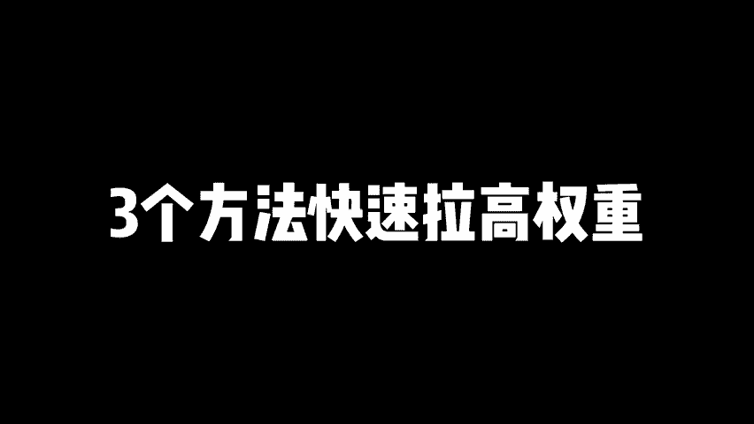

# 小红书怎么增加账号权重，3个方法快速拉高权重！ 分享小红书起号攻略，小红书新手起号，小红书如何提高账号权重，小红书权重提升，小红书运营技巧！小红书权重低！ - P1 - 黄一恒矩阵引流技术 - BV1mFsDeGEpF

🎼你的笔记违规，账号限流甚至方禁，流量只有几百上千，怎么都起不来。我的账号被禁言30天后，流量严重下滑，一个字惨两个字好惨三个字惨惨惨，但我用了这三个方法，让我的一条笔记流量直接拖百万。

一个视频给你分享小红书怎么增加账号权重，三个方法快速拉高账号权重，落地教程有点长，记得先收藏，一起来看，我给你分享做小红书遇到低权中账号会出现什么问题。如何去拉高我们账号的权重，如果获得更大的推流权重。

现在看第一个低钱中账号所出现的问题，最直接的体现，就是我们发笔记流量基本上不会卖。比如说现在你做哪篇笔记发布完之后，间隔了3天，整理流量就那么几十个，而且呢特别容易违规。有时候啊经常出现说这个内容违规。

你的同行呢又可以用，或者说是改个资料有违规，甚至有的时候啊账号直接违规，禁言30天，严重者直接放进，有的伙伴呢去发评论。

不管发什么评论，甚至有的时候发一个表情都被吞掉，发私信来，对方也收不到，也被吞掉。而你的同行每天都在搞，因发现同行的没有问题，而自己发团子内容就会被打压。这个到底什么原因，就是我们的账号权重太低了。

那怎么去拉高我们账的权重，这里面给大家分享几个方法。第一个方法就是我们的账号在获取在注册的时候，就得是那种高权众社交号，如果你是机器号，比如说有的伙伴用这个虚拟号注册，1716的号码进行注册。

手机配置的又非常低，而且还用了什么多开软件，手机还有封号记录或者IP被关联了，没有通讯录也没有回度。这种账号拿去发，肯定是低钱重的。而什么账号流量比较大的。有的伙伴把自己的小红书账号拿过来。

随便发一个生活点滴，随便发一个水友牌，发现流量哎都非常不错，甚至破千，到底什么原因来看一下社交号，就是我们的账号在注册的时候，用的是13151819号单注册的。而且手机的配置非常。

比如的伙伴还用的是几千块的手机，重点是我们在使用小红书的时候，还点击了引起访问通讯录，更像是一个真实的账号IP下面呢也没有过多记录，也没有出现什么方号记录之类的。好，这时候如果你满足的这个条件。

你的账号就不会太差。同时呢我们自己的小红书账号，每天还保持的活跃度，做一个正常社交号，比如说每天浏览30分钟，点赞收藏一些作品，评论一下，关注一些博主啊，更像是一个真实的用户好。

这些如果你都做好了流量还不是很高，那教大家一个小红书上面很狗的玩法啊，这个很少人知道啊，但是呢在小红书里面一直存在叫做摸摸帖来提高账号的权重。那什么是摸摸帖来，这些的伙伴可能完全不知道。

刚开始我也不清楚啊。后面我去搜索一下才知道也来摸摸是这个意思。好，咱们可以搜索一下摸摸。搜索完之后你会发现这些摸摸啊，他们基本上都是呃数据反馈来整体什么哎都是比较不错的。你看到。

那么为啥小红书中国厉还都叫么么然后呢啊请问小红书到底有多少个么摸，第一次做摸摸需要注意什么？啊，已婚，但是过得不快乐啊，辣闷两天了啊，终于知道摸摸是怎么回事了。所以大家可以搜索一下。

就知道到底什么是么么的发摸摸贴一个好处啊，涨粉，你会发现原来这么的简单，账号呢迅速的会提高这个活跃度，因为有大量的人关注你，重点是什么？你会发现莫名其妙的你就能够吸引到大量活跃账号，他们来关注你。

说摸摸帖有什么特点。你摸摸的人群啊，他是那种吸引讨厌被关注的数控网友。比如现在我是个摸摸人群。你千万不要关注我，关注我太难受了，我就喜欢在互联网里面当一个小透明，就是我存在。但是呢我是透明的。

这时候就会产生反向心理，一夜不让我关注，我一夜要给你关注。哎，让你不受恐。哎，就这个意思，这就是摸摸帖。说大家如果账号权重比较低，可以发这个摸摸帖来拉高你的这个账号权重。出了账号权重。

我们还是要拉高推流权重，你发布完笔记之后，流量是100500258000就完全取决于我们的推流权重。那么推流权重型号高，首先得给我观察期。那什么是观察期，对于一个新注册的账号。

系统不确定这个用户的质量怎么样，它会给你限制流量。本来你发布完之后可能是2000流量，限制完之后呢，只有200个流量，常见的现象就是新账号发布内容时，流量很低，甚至根本就没有流量。因为系统它会监测。

它会识别风险，避免违规内容。敏感行业如果你发布的违规内容就会导致账号违规被限制，严重的。直接账号就放进了。那操作建议是初期发布内容需要脱敏，避免因为敏感内容导致违规。

在操作的时候尽量发布一些利他性的干货内容帮助账号快速的度过观察期。有的一个星期，有的两个星期慢点的一个月也能度过咱们的观察期，接下来看一下账号的基础推流，机础推流它是有最近30天的互动数据决定的。

比如说什么点赞评论啊，收藏转发关注之类的。如果你最近的互动数据非常好，推流数据非常高，你发布完之后，你发布的笔记流量可能就是两三千。如果你整体的数据都非常差。比如说伙伴整体数据啊就只有两三百。

你发布的笔记怎么可能达到两三千呢？所以咱们在做的时候，账号的权重，它会直接决定我们的初始流量。这也是为什么有的账号流量只有50个，有的账号100个，有的账号300个，有的账号呢能够达到1000的流量。

那如何拉高我们账号的基础权重，让我们获得一发布笔记就是1002000甚至30。小眼睛，这里面呢有一个方法叫做先犯后垂外潜内伸什么意思？好，先来看一下先犯外潜。就是前期咱们发布笔记的时候，不要太垂直。

尽量的可以发一些泛垂直的内容，受众范围非常重要，受众越广，流量自量就越大，能够吸引更多的什么潜在用户。那么后垂和内生呢是转换目标客户。因为如果你全部发这个呃泛垂直的流量数量非常大。

但是吸引过来的人呢很难成交，很难转换，很难卖货，所以咱们还是要发布一些相对来说垂直和比较深的内容，吸引目标客户能够获得更多的什么精准流量。即体咱们在落地的时候啊，可以配合一个策略，这个策略叫做久浅一深。

潜的话是为了触达我们的潜在用户。比如说啊我们现在做旅游行业的，做旅游赛道的，触达详细的顾客，我们就可以发一些关于西藏的西藏美食攻略，西藏拍照技巧，西藏有哪些地方好。反正就发各种各样西藏理由的。

那么这种就属于什么流量好的宽口内容，发完之后的流量基本上啊做个几万没什么问题。但是呢这些流量它转换率比较低。所以咱们在发的时候发9个浅的内容，9个流量好的宽口内容，我们要发一个深的用来转换目标客户。

比如说我们可以发一个国庆定制胡杨林小报团高升纯玩绝美。好，这一个呢就是来转换目标客户的，它只能够转换，已经决定详细的客户无法出到那些详细的因详细的他对这个内容呢根本不感兴趣。这种就是转好的窄口内容。

两种内容可以配合在一起就可以做到久浅一深啊，先放后垂外浅内深，这个打法呢还是比较不错的。好了，各同学提高了账号钱中啊，如果想快速的把小红做起来。其实还有一个好的办法，就是做小红书几证。

用概率来唤起成功率，通过几证来对抗平台。不确定因素。比如说一个人搞10个账号，多多少少肯定有个三五个账号能做起来。如果你一个账号一天加个10个20个人，那么合计在一起，一天就能够搞到100多个顾客。

那具体怎么做几站，这里面我给大家准备的详细的资料。比如说我们小红书的入门运营干货框架，里面有小红书的内容收录机制，运营工具，企业号的运营Q大投放，还有这个店铺的运营。

最重要的是还给大家准备了小红书的爆款选题表格，让大家在做笔记的时候啊，都学会开建考试，都学会观察数据，都学会让你的每条笔记都建立在别人的数据基础指标之上。

这里面呢挑选一些收藏比评论比分享比比较高的笔记优先来进操作。哎，比如说这一个笔记，他的这个收藏比达到147%100个人点赞，会有147个人收场。这种笔记呢很容易二次货。那怎么做这个选题表格很往常不会。

那我给你准备好了。还有我们三个小时的小红。系统引流客里面讲到小红书的全流程医药设计导流方法，还有常见问题以及编缘项目，这些呢通通都给大家打包好了。可以来找我，我把它分享给大家。好，各位同学。

我是黄一涵只做落地推广方法。刚才给大家分享的怎么提高账号权重，获得更大的推牛。如果咱们想获得更多的流量和订单，得学会打造多流量管道。这里面我给大家准备了18个平台的详细打法，教大家如何布局多流量管道。

小红书就是其中一个，而且这些呢都是我原创的，可以通过主页来连体进行学习。如果觉得今天视频比较不错的，请大家一键三连，感谢大家支持。那么下个视频呢再会。

