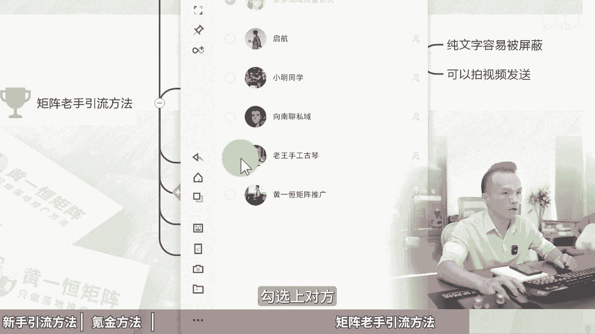

# 小红书怎么引流到微信不违规，一天加300粉不封号，小红书矩阵打法！小红书矩阵账号怎么做，2024版小红书运营教程，小红书怎么引流还不违规，小红书引流加微技巧，小 - P1 - 黄一恒矩阵推广引流 - BV1iGHZeiEbA

一共30部手机全部封号了，我们公司刚来随声，我叫他在小红书上面引留到失意，他把这账号全部搞封了。😡，🎼我们一起来看看他怎么引流的给我直接私聊发的微信啊。现在小红书引流到失亿非常严格。

一个不注意账号就封了。一个视频给你分享小红书怎么引流到微信不违规，一天加300不封号，详细教材有点长，记得先收藏，一起来看我给你分享新手小白用的引流方法，哪些比较容易违规，氪金玩家用的引流方法。

以及做几只老手玩几十个账号，他们在用什么引流方法。现在看第一个新手小白用的导流失意方法。很多伙伴胆子比较大，刚开始玩小红书也不了解规则，结果直接给那些联系你发私信的人直接在里面回复微信。这种呢。

如果你发的比较少，会导致你账号限流发的比较多呢？你的账号直接就方禁的，会显示你的账号存在什么违规行为，破坏网络安全，侵犯评价的什么权益，已经把你的账号采取什么方进处理。那么嗨多伙伴呀选择了去。

给里面留邮箱，那邮箱其实呢他是不会违规的，但是啊发邮件的人非常少，每天加的人呢基本上是妻指可数，少的可怜。那怎么办？还有很多伙伴研究的这个瞬间引导，那瞬间引导你会发现，对于这种新账号来说。

根本就设置不上，而且呢还频繁的出现违规，导致我们账号在发的时候，也受到了影响。那些同学啊又研究了新的方法，比如说艾特小号，A中B收在千位里面引导到另外一个账号，这种方式呢其实是不会违规的。

但是他的流量会有损耗。比如说可能10个人看到之后，他去联系的人可能非常少，就那么几个，那到底我们该怎么去导流失意来来看一下氪金玩家在用的导流失意的方法。首先我们给平台交保护费。

相当于我们需要去开通这个栏位啊进行这个激光投流，每个月呢只要消耗超过1000块钱，我们就可以获得这个私信服务组件。那么他的要求是什么？每周啊考核账号近30天。激光镜价总消耗大于1000块钱。

那么满足即自动开通前限，不满足呢就会关闭这个组件权限。只要你开通这个组件，你就可以获得实信版名单，可以大摇大摆的直接在私信里面发你的手机号发你的微信号都不会出现这个违规。那么如果你还消费比较高。

达到3000块钱以上还可以获得私信通的升级版，这个升级版它是可以做自动回复的啊，那么可以获得更高的前线，哎，这就是科技玩家，但科技玩家只是个单个账号，你说得大号来玩。如果有的伙伴说老师我搞10个账号。

不可能10个账号都是栏位吧，也没有那么多营业执照，从时10个账号，一个账号一个以消费1000，一个月得投1万块钱，那这笔开支的也不大，而且有的行业投激光确实效果不太好。

这1000块钱有可能很多都是打水漂，那怎么办？我们来看一下啊，几只老手玩10个号，20个号的人，他们在怎么导流，而且是不违规的。先先第一步，他需要创建这个粉丝群。那么这个具器怎么操作啊？

咱们的粉丝群呢一定要带一点这个钩子效果，能够增加吸引力，能够让更多人来加我们的粉丝群，给大家演示一下。我们打开投屏手机，找到下方的消息。在消息里面，我们点击右上角的这个叫做发现请聊，选择创建请聊。

在这里面呢我们的群名称啊就可以设置的有这个心理点了。比如说。啊，一横原或者说是原创。课程和资料大全啊，这个名字本身就是具本细腻的。好，分享自己。自己收集的。工具和资料啊，写个简介。

然后在下方我们选择上这个类型类型。比如说我们选这个兴息职业和互联网，大家往下方滑动。第一点的话，我们可以勾选一下，可以获取到一些同城周边流量啊，这些都可以自己来选选择完之后，我们点击一个创建。

这时候它会提示我们是否生成笔记。我们点不了谢谢。好，接下来我们就创建的这个粉丝群，粉丝群名称啊，它是需要审核的，审核的时间大概在10分钟左右啊，有时候快有时候慢啊，这个先不用管。你隔一段时间来看。

自然就审核通过了。接下来呢我们需要点击右上角的三个选择点，在这里面找到下方的一个叫做群管理，在群管理里面把这个进群方式来开启为任何人都允许啊，选择保存。这样的话加粉定会比较高。毕竟及时反馈。

并且在下方欢迎给它设置一下，设置为这个什么看置点消息。好，然后点击保存。好，接下来这里面我们就设置完成了。如果还需要做设置。比如说这个群常员的消息权限啊，大家可以在这里面对它进行设置。

禁止你的同行跑过来推广他的笔记啊，可以给他关闭掉。好了，这些都弄完之后，接下来我们需要进入第二步置顶引流信息，并且这个引流信息，一定要用小号来发送，用大号发的话，很容易违规。

小号发来就是避免与主号产生关联，这个小号说简单点，就是一个背锅下。相当于咱们发笔记这个号呀，做一个不连锅，不管怎么样跟我没关系，你不能怪我嘛。哎，所以呢这是别人发的，大概就这个意思啊。

那么接下来怎么操作呢？我们首先啊需要用一个小号加到里面，我们点这个群二维码，就点这一个啊，给他加进来。这里面呢，因为二维码我们不能做到视频里面会违规啊，所以我就准备一台手机啊，好。

这是我们用这台手机去扫这个码。然后呢我们就。好，进到这个群里面来。好，这里面我尽量给大家全程演示啊，不漏过任何一个细节。好，现在我们已经进到群里面，在群里面呢，我们就能够看到一个消息，叫做看这等消息。

你看我们的新人艾特已经生效了。那么接下来我们就要用这个号去发送我们的引流信息。这个引流信息呢一定不要发文字了。文字啊，比如说你的纯数字纯字母发出去之后啊，百分之百都是被吞的啊，现在已经不行了，要发视频。

那怎么发？具里我来给大家示范一下。首先我们需要用这台手机先发一段内容啊，比如说好原创课程和资料啊原创课程和资料大全好，我们给它发出来，发下这，你看啊现在都是什么正常的进行显示的好。

接下来呢我们再给他用这个你看为什么我给要准备一个本子和一个纸啊，你可以在上面把自己的账号给它画到上面去啊，那这里面呢作为演我就画画了可能视频会违规，我就简单写几个数字。比如说12345好，打几个星号啊。

打几个星号好，假设这是我们的账号啊，你可以在上面给它写上，写上之后打开手机在手机上面呢，首先我们要打开手机的相机啊，用相机呢去点击录像啊，然后把这个给它录下来，录的话，我们录个一23好，就录完了。

录完之后之下我们打开这个呃账号里面，然后点加号，点击相册啊，这里我就不投屏的，给大家示范一下，然后点击这个发送好把这个视频给他什么给它发。到这个群里面来，目前视频的话，平台是不做检测的啊。

用这种方式发来还需要稍微等待的话。那么发完之后啊，在群里面你就能够看到这个视频。你看啊，现在原创课程和资料啊，下面是我们的一个账号啊，这样是不是又实现了一个安全导流啊。那现在我们选中这个资料。

它是没有置顶的。没关系，我们返回来之后啊，然来刷新一下，再进入到我们的群里面，然后再按住这个资料，哎，这时候有个置顶，点击一下，然后选择下方的这个叫做确认置顶好，这时候在最上方就有置顶消息。

当新用户进来之后，他是能看到历史消息的，点一下这个置顶，并且我们艾特了他，他自然会看好，这时候我们就实现了一个安全导流。接下来我们需要点击这个第三步啊，我们选择群招募，在群招募里面点击关联历史笔记啊。

在这里面勾选上咱们的笔记，在笔记下方就会自动匹配我们的一个粉丝群，就可以达到这个什么引流效果了。那如果用户发私信怎么办？发私信也是一样的啊。比如说假设假设现在我用这个账号。啊。

给咱们的这个号发上一个表情，发上一个私信啊。那么发私信呢，首先我们需要给对方来一个回关啊，我们返回来之后。好，打开这个消息啊，你可以点击上铺的一个回关。这里我已经回关过了啊。

然后呢我们给对方发上一个这个表情，发完表情之后啊，你打开你的群。那么在群里面之后啊，你点这个群招募，在群招募这里面就会有一个邀请互关的人进到群里面勾选上对方那对方就可以直接进到群里面了那么这种人少人多的时候。

他只需要对方点了个同意的这种方式导流啊，目前就是我们在用的，而且相对来说是比较保守，比较安全效果呢还非常不错。那学会了导流不违规。我们想玩好小红书还得学做几证，因为小红书它有个赛马机制。

我们做10个账号自然就能够跑出一些做的比较好的账号。有的账号一个月顶得上别的账号做半年，那咱们去跑来，这里面有一个优胜劣汰的机制啊，所以咱们玩10个小红书账号，很多行业都能做到每天互个100家。

这里面我给大家准备了小红书的入门运营干货框架。有这个收入机制，运营工具，企业号的运营KY来投放店铺运营，还有小红书的这个爆款选。

很多伙伴呀是把小红书当成发朋友圈一样，自己会点，自己想着自己有的去发美流量。我们要做一个选题库，把这种收藏比、评论比分享比，并且是那种什么低粉高斩高收场作品优先发布，这种的数据指标才会比较好。

所以做小红书啊绝对不是靠谈话一线啊，而是真的是靠开卷考试，靠我们去什么看这个数据的啊。那盲人摸象呢就等于什么。我们自己去研究了，而且小红书呢我还给大家准备了系统的课程。因为这节视频咱没办法做太长，太长。

大家也没耐心看完啊，所以我给大家准备了2到3个小时的系统引流课。这里面有包含了小红书引流的全流程一耳钩子导流方法，常见问题和变缘项目。你看这个课件就知道比这个肯定是多了10倍以上啊。

那么这些呢大家都可以通过主页找我，我把这个资料的话，分享给大家，咱们做一个什么资研共享好给同学，我是黄一涵只做落地推广方法。刚才分享的小红书怎么导流微信不违规，这只是我们小红书的其中一个板块。

如果想玩好小红书，我们得系统化的学习，用系统打法以及操作。这里面我给大家准备了18个平台的详细打法，教大家如何布局多流量管道，小红书啊，只是其中一个，这些呢都是我原创的，可以通过主页来领取进行学习。

如果觉得今天视频比较不错的。请大家一键三连，感谢大家支持。咱们下个视频来再会。