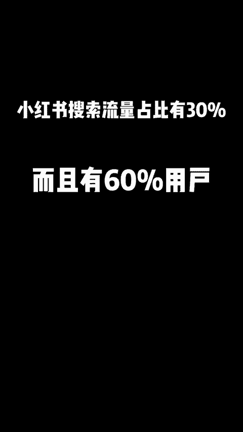
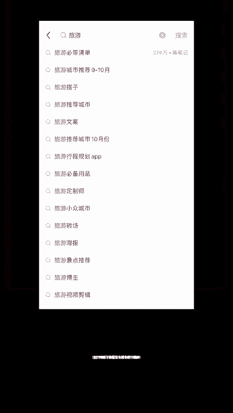
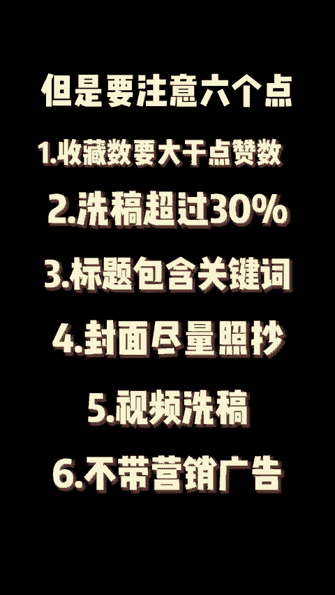
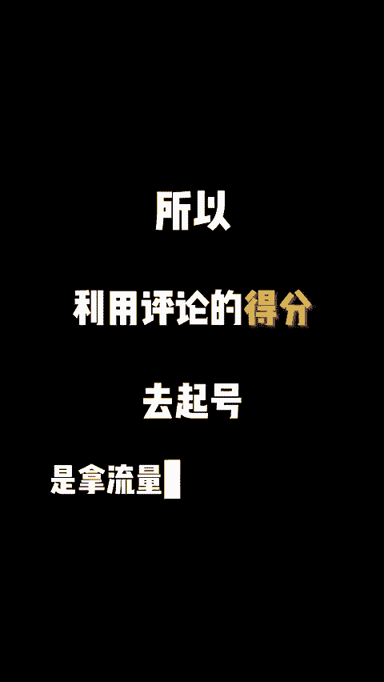
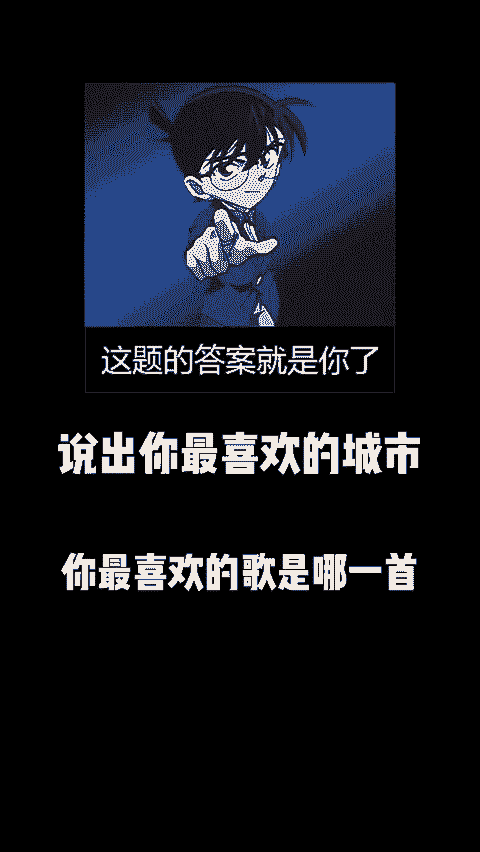
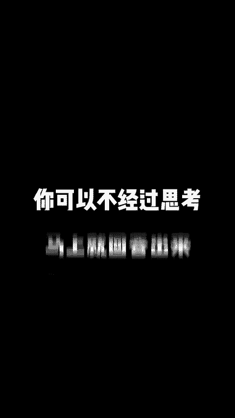

# 小红书怎么快速起号，小红书起号方法二选一 - P1 - 黄一恒矩阵引流技术 - BV1NkxCesE8T

🎼新手刚开始做小红书，千万不要不上来就发优质笔记，不然你会发现辛辛苦苦发了几十篇，播放量还是只有两三百。我有个账号，喜好一周做了7万的播放量。今天呢就来给大家分享一下我是怎么做到的，一定要看完。

🎼越往后越重要，喜好的方法有两种。🎼一种叫做搜索起号法，一种叫做片频起号法。前面的视频我讲过小红书起号的核心在于如何让系统识别到你是做什么的？我该把你推送给什么样人群，这里面就需要一个东西。

🎼反馈标签。🎼那如何让系统快速识别到你呢？🎼利用小红书的搜索流量。🎼小红书搜索流量占比非常高，有30%以上，而且有60%用户打开小红书，第一时间不是去刷推荐，而是去进行搜索。

🎼那具体怎么做呢？🎼我们来举个例子，比如你是做旅游的，那么你在小红书的搜索框上输入旅游，这个时候下拉框就有很多的下拉词，而这些词就是用户的高频搜索问题。

🎼我们只需要点开它找到收藏高的那种喜稿就好了，但是要注意6个点。🎼收藏数要大一点赞数，这样的内容才是荣易卡搜索排名的好内容。🎼2洗稿的内容替换要超过30%，不然容易被判定为搬运。

🎼3、标题要把关键词包含进去，因为小红书的标题权重是大于内容权重的。🎼4、封面尽量照抄，因为别人的封面点击率已经是被验证过了，抄就好了。5、如果洗稿的是视频笔记，要把视频内容复制一遍，放在描述里。

方便系统去识别。写好内容不要带任何的营销广告，不然你的薯条是不过审的。第二个方法，片频起号法。

🎼为什么要骗评论？因为评论在CES分里面得分是私分，所以利用评论的得分去起号是拿流量最快速的方法。

🎼那问题的核心是怎么让客户给你评论呢？

🎼这里面有两个最常用方法，一个叫做极限二选一。🎼一个叫做简答题，选还是B这个就是极限二选一。🎼简答题是什么意思呢？

🎼说出你最喜欢的城市，你最喜欢的歌是哪一首？

🎼你的战裙。🎼这一些都是简答题。🎼为什么二选一和简答题是最容易偏评论的？🎼核心是在于降低了用户的行动成本。🎼比如说我问你，你说一下周杰伦的优点，爱你可能会很。🎼你需要去思考。

但是我问你最喜欢周杰伦的歌是哪一首，你可以不经过思考，马上就回答出来。

