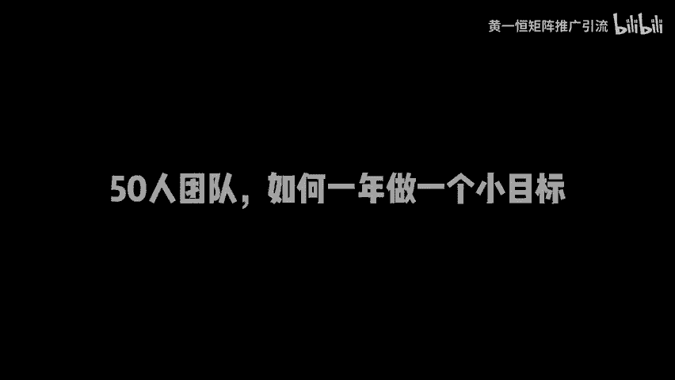
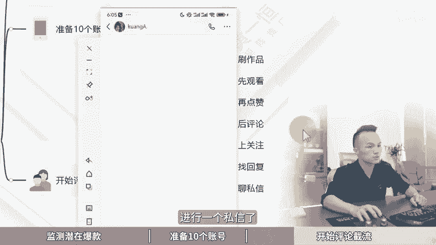

# 小红书截流方法和技巧 50人的团队，一年做了一个小目标！小红书矩阵账号怎么做，小红书截流软件分享，小小红书运营教程，小红书截流玩法，小红书截流工具，小红书截流脚 - P1 - 黄一恒矩阵推广引流 - BV1yU411U77c

🎼50个的团队竟然看小红书截流，一年做了一个小目标我的一个客户，他是做大健康的，他们的引流方式简单粗暴，颠覆了我对流量的认知。爆截流并不是一个非常新奇的引流方式。那为什么他颠覆了我对流量的认知呢？

为什么呢？之前我觉得评论期截流是一种上不了台名的手段，普通的截流方式很容易引起博主的反感，被挤爆的概率也非常高。但这种截流方式可以说非常的高明，完美的解决了这两个问题。季节废话。

一个视频给你分享小红书截流方法和技巧。50人团队如何一年做一个小目标，视频有点长，记得先收藏，一起来看我给你分享如何监测潜在爆款，准备10个账号开始评论截流。现在看如何监测潜在爆款。

这里面咱们的目标账号。因为主要是做大健康类型的目标账号呢可以关注一些皮肤问。

题或者祛痘方案的一些笔记。那怎么监测最简单的方法就是去关注50到100个目前在更新作品的对标账号。那如何操作给大家示范一下。比如说现在我们想找一些皮肤的，我们直接打开小红书。

在右上角的搜索框里面搜入关键词，搜索皮肤，搜索完成之后，那这里面就会有很多很多的一些笔记，我们需要找到近期有更新的，我们打开之后啊，比如这个账号，我们点开看一下，如果确认这个账号是我们的对标，哎。

这里它只发了一个作品，咱们可以啊换一个，比如说挑这一个点开看一下啊，团子小姐，这个账号呢，它目前发了很多的笔记啊，大部分都是跟皮肤相关的那我们可以点一个关注，那这样搜索起来，相对来说会比较慢一些。

那我们也可以直接在笔记下方，它会关联上一些话题，我们在话题这里面可以直接进行一个进入，比如说点击这个修复啊，这里面就有很多。很多的账号，这些账号呢我们都可以去找一下，看是否跟我们的对标匹配。

如果匹配的话，有这一个账号点进来之后我们打开。看一下发现是匹配的。接下来咱们点击个关注。好，这是种方法。另外还有一种方法，我们可以直接去搜索这个账号。比如说咱们搜索账号来搜皮肤。

这时候可以关注到一些行业里面的专业账号，特别是一些环为账号。比如说一些一眼官方的账号，那正常就不是数人号了啊，我们可以点击关注那这里关注比较费时间，你需要花上个半天一天时间，关注个50到100个。

接下来你怎么做呢？每天你只需要打开这个关注，在关注列表里面就能够看到近期发布的一些作品，也就是你关注的这堆标账号，从这里面找到作品，然后啊比如说这里面我们找到一个关于皮肤的。

接下来我们就可以通过这个作品开始进行截流。特别要关注到这种短期数据上传比较快的。比如说刚发布作品3个小时就获得100个200个点赞收藏，你可以开始进行操作。因为这种作品呢。基本上在接下来的2到5天里面。

数据啊能够翻10倍以上。好，这是第一步。第二步，我们需要准备10个账号，一个账号呢很容易被屏蔽啊，那怎么办？咱们在操作的时候需要遵循一个注意事项，EG耗机网络不多开，防止设备关联，也不去连wifi。

防止IP关联。因为小红书这个平台它跟其他平台不一样。小红书啊它是会放设备的，如果你放设备了，你上面着所有张号全部都会方禁。第二个我们需要准备10个手机卡，手机卡小红书的要求会比较低点。

可以直接购买这个灵业注册卡就可以了。价格一般是3到10块钱一张，一个人可以实名20到30张都没问题。还需要准备10台手机，那手机这一块呢。

目前我们用的比较多的是这个红米 note9或者pro价格在400到500之间，6加64G配置以上可以到闲宜也可以到其他平台进行购买。然后呢还需要配上10张流量卡。毕竟我们需要做到一G耗网络。

这里面我们单独配的是物联网卡，如果你有那种听卡自带流量，那直接使用就可以了。如果没有的话，你单独配上流量卡，流量卡的特点就在比较便宜啊。比如说像我们操作的69块钱24个，每个月有4G流量。

基本上能够满足咱们的需求，所以价格呢比较便宜啊，大家可以多我找一下。实在找不到这几张卡的也可以来找我，我把我的渠道分享给你，帮你节省一点时间。那当我们有了这些之后，接下来我们就要开始提什么注册账号。

那账号注册完之后啊，我们需要把这个资料选象卡里面的信息呢，能完善的都给它完善一下。目的就是为了正常活跃账号，而不是你这个江字号注册完之后就放在这地方，看起来呢资料有没有完善，这种是不行的啊。

每天需要保持一点基本的活跃度，这个呢是最基本的。也就是你在找对标的时候，只用这台手机就可以了。接下来我们就可以开始进行评论解流。那怎样操作来看一下操作流程。首先我们正确的流程是先刷作品。

然后呢我们需要观看一下，然后来点赞后评论上关注找回复了私信，是一个这样的流程。比如说举个例子啊，像这一个我们打开之后，确实是需要华泽看一下的。有滑点键就去评论这是不行的，很容易被删除。

一定要模拟正常用户操作。好。接下来我们刷作品再观看。然后呢我们进行一个点赞，点赞完成之后啊，我们再打开评论啊，这时候我们就可以开始进行评论了。评论完成之后，我们就可以开在这里面找一些精准的人群。

然后来点击之后就可以开始给大家来一个关注，关注完之后就可以开始什么进行一个私信的，这是正确的流程。另外我们在评论的时候啊，有几个技巧需要注意啊。比如说。

你家发评论，你可以这样表达我好了啊，比如举个例子，我按照博士说的做了已经好了。但是呢还有点红肿，这种红肿怎么处理。好，为什么要这样做，咱们后面来看啊。好，这是第一个。第二个呢，我们需要用小号来进行互动。

小号立马提问你是怎么好的。比如说我的不敏感呢，只讲真的太痛苦了。那么大红点都拉低我的颜值，下面立马就有人怎么弄的。好，立马回复对话框讲的，这个什么意思？那肯定就是发私信的。好。

这时候来就是解决方案呢比较复杂，没办法在评论区告诉你只能够单独找我喽。好，所以这里面有一个非常巧妙的点，就是我们需要注意啊。我的问题解决了，这叫表达信息。接下来呢我能够帮你解决问题，叫提供帮助。

相当于我把问题解决了，解决完之后呢，你可以来找我，我能够给你解决问题。所以这就是它的巧妙以及什么高明之处。那整体的策略。第一个先给正面反馈，正面反馈什么意思？我们再反回到前面来看啊，正面反馈呢。

刚才我们讲到了，我是按照博士说的做的已经好了，这叫正面反馈，你不给正面反馈，很多博主一看到你立马就给你删除掉了。好，这是第一个大家一定要注意。第二个呢要委婉的告诉你啊委婉，不要讲的太直接，什么叫委婉。

就是说啊我的不敏感了，之前太空苦了，大红脸垃低我的颜值啊，这时候别人说怎么弄的，这种就非常委婉，没有直接上来说，我怎么怎么弄，你要怎么怎么样。另外呢这种方法才是跨行业使用。

所以大家不管是搞什么呃这种什么医疗类的呀，装修啊或者每页支付费的其实都可以这样玩好给同学我是黄一涵只做落地推广方法，刚才咱们学习了小红书的节流打法。小红书目前发笔记流量，整个也是比较不错。

咱们可以搞举证，一个人玩1个号，每天发布10到2层笔记也可以加到很多的精准客户。那这个。具体该如何操作呢？我给大家准备了18个平台的详细打法。小红书就是其中一个教大家如何做多流量管道。

这些呢都是我原创的，可以通过主页来连接进行学习。如果觉得今天视频比较不错的，请大家一键三连，感谢大家支持，咱们下个视频呢再会。

