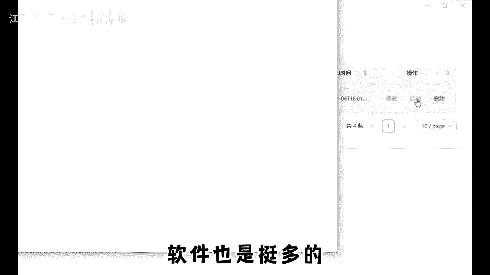
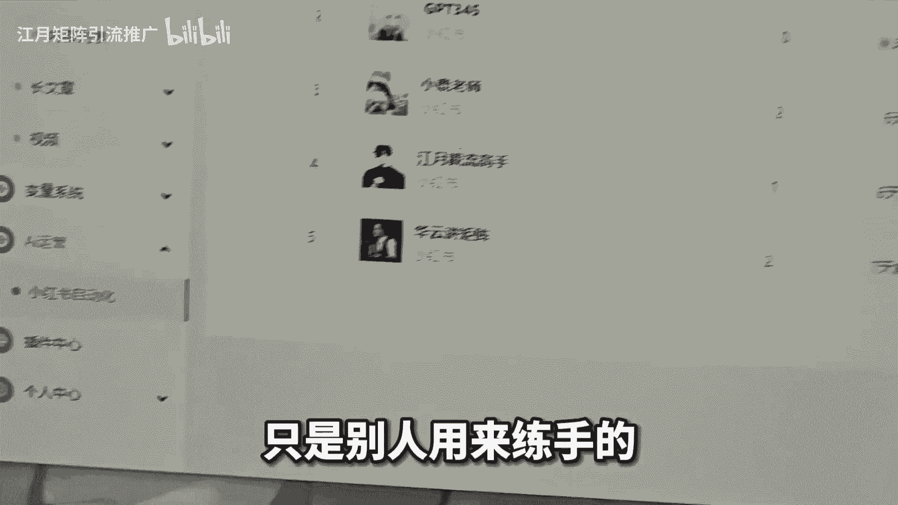
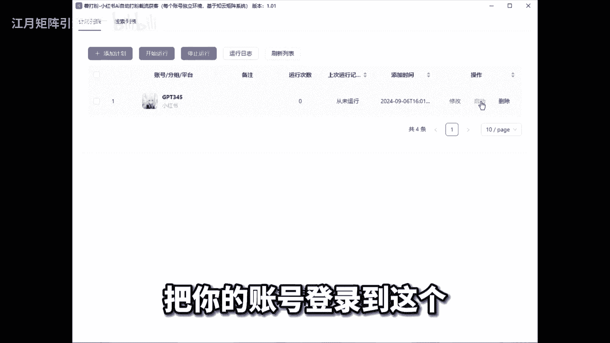

# 小红书批量注册账号，小红书批量发布笔记软件，小红书批量养号软件，小红书批量起号，小红书批量管理软件，小红书批量生成图片工具，小红书批量下载 - P1：studio_video_1727949886049.mp4 - 江月矩阵引流推广 - BV15zxQebEKu

学会一个方法注册全平台账号不是问题，同时再搭配上批量局限管理账号的软件，等于无敌，最重要还是免费的，大家好，今天给大家分享一下，我们是如何同时注册和管理2000个账号的，这期视频干货拉满，建议收藏。

大家现在可以想象一下，比如你现在做100个账号，你会怎么做，你的具体流程是什么，好停止奖项，进入今天的正题，我们是如何同时注册和管理2000个账号的，我们先说一下青铜玩法，做几个账号就买几个手机。

如果要做100个账号，那是不是就要买100个手机，比如一个手机300，这里我们说的是二手手机呀，买100个手机就是3万，而且一天光是找账号就要花费大量的时间，手忙脚乱的效率也提不上去，很浪费自己的时间。

黄金玩法就是，在网上随便找一个小红书管理软件，当然网上的这软件也是挺多的，但是好不好用就不知道了。

其实你不知道这个软件只是别人用来练手的。

不仅操作繁琐，功能不全，而且还有一堆漏洞，售后也没有，三天两头封一个号，万一有一天坐着跑路了，那你的公司也就跟着倒闭了，王者玩法，利用小红书矩阵工具来管理，不管你是做小红书还是其他的一些自媒体平台。

可以直接把账号交给员工智能来管理家养号。

我们自己的时间摁可以花在找内容吗，找选题上，那这个我们就可以借助一些，已经接入人工智能的机器人流程自动化工具了，比如说像这个智云助手啊，首先呢把你的账号登录到这个工具。

内置的指纹浏览器上面，添加账号的时候呢，选择小红书，当然这里也可以选择一些其他的自媒体平台，然后如果你的账号超过十个以上。

务必要配置一下独立IP，这工具啊。

它是可以实现每个账号独立FC和设备的，正是因为这款软件提升了我们做小红书的效率，要知道做小红书的效率第一，这也是我们之所以能做2000个账号的原因，而且这款软件还有专业的售后，也完全是免费的。

你如果想知道具体怎么样去做好，小红书这个平台，以及如何通过这套软件去把你的效率提升十倍，100倍的，在评论区扣666。

