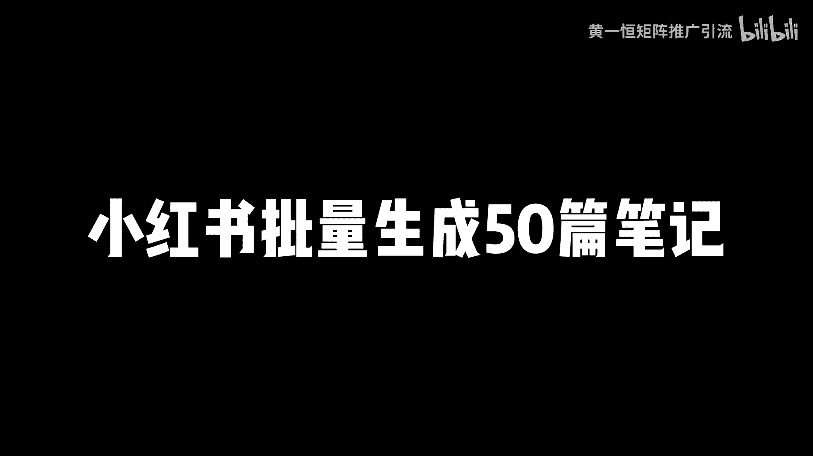
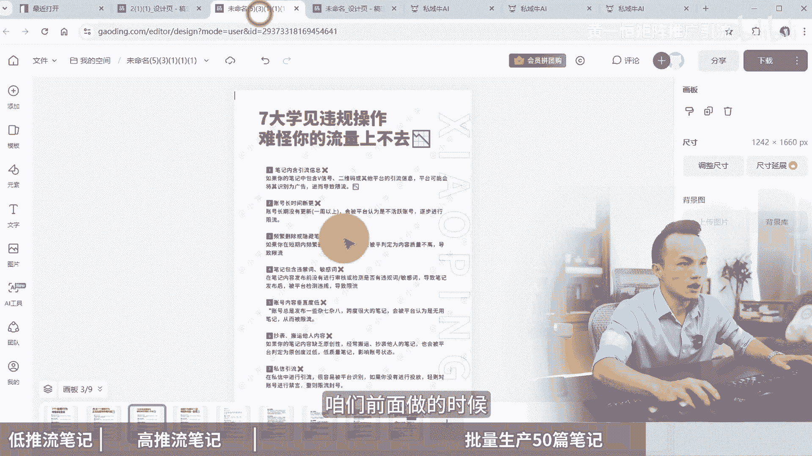

# 小红书批量生成50篇笔记，小红书图文制作教程！小红书图文笔记怎么做，小红书批量生成图片工具免费，小红书笔记制作教程，小红书笔记图片怎么制作，小红书矩阵搭建，小红 - P1 - 黄一恒矩阵推广引流 - BV11RpMemEcx

那天做了50篇小红书笔记，我们公司刚来实习生，我叫他去做小红书推广，他做了一周，每天能做50篇小红书笔记，我们一起来看看他怎么做的啊，做模板批量气重发的呀，Nice，真是个人才，这个方法不错。

可以批量做小红书笔记，几分钟一篇很容易爆，一个视频给你分享，小红书批量生成50篇笔记。

小红书图文制作方法，详细教程有点长，记得先收藏一起来看，我会给你分享什么样的笔记是第一推流笔记，咱们打死也不去生产什么样的笔记呢，是高推流笔记，发布完之后能够获得四位数五位数的流量。

咱们只读这种学完之后怎样批量生产，一天做50篇这种高推流的笔记，先来看第一个环节，不生产低推流笔记，很多伙伴可能去刷视频或者看介绍，看到一些功绩啊，宣传说输入关键词，输入行业，输入赛道。

就能够一键生成几百上千篇笔记，这种工具啊，纯粹的可以说是忽悠小白，很多刚开始入门的伙伴觉得说哎，搞个工具都不用自己做了，点个按钮就完事了，然后发上去之后就守株待兔，每天客户就加过来。

最后发现被人割了韭菜，因为这种工具啊，首先他浪费金钱买工具，软件的钱，有的好几百，甚至有的软件一套就大几千，真的不便宜，而且呢非常浪费时间，你搞出来之后啊，比如说你搞了500篇笔记。

你把这500篇笔记需要花大量时间去发布，有的伙伴是早上啊，发到晚上手发麻了，甩几下继续发，重点是发布完之后呢还没有流量，刚开始的账号权重比较高，可能浏览量还有个两百三百五百，住了半个月之后。

浏览量变成100，住了一个月之后，浏览量直接变成了零，没有浏览量了，几十篇笔记，还不如我们正常发一篇能够获得几千个流量，账号来变成了消耗品，它非常的消耗账号，账号变成了死号，属于废号流打法。

什么叫废耗流打法，我们这批账号挣完之后，赶紧去换另1P过来，如果你搞不到账号的渠道，就等于什么，你的账号就没办法再往下玩了，彻底的什么跟这个平台拜拜了，那到底什么样的笔记能够获得高推流。

咱们去做这一种来看一下，它有三个点啊，第一个点呢就是我们之所以能够上热门，能够获得几百个点赞，包括你打开手印机刷这些笔记，数据反馈比较好的，记住绝对是什么，因为它有爆款的框架，什么意思。

也就是你做一个内容，这个内容是别人测试过火的选题，什么叫火灾险，你说简单一点啊，就像我们跟一群人聊天一样的，你聊什么的话题，大家喜欢听，比如现在你跟你的对象啊聊天，结果你聊一个话题，他根本就不想听。

为什么他不感兴趣，所以咱们在做选题的时候，千万不要把自己会的，自己想的，自己有的搞给用户看，而是要找到用户的需求，找到用户痛点，他们喜欢什么，我们就做什么给他看，就现在你喜欢看这个视频。

所以我做了这个视频给你看，不是说我会这个视频，我把这个视频录给你看，是这个道理啊，接下来就是车子和的封面，封面呀非常重要，小红书的封面直接决定流量下限，为什么有的人做小红书发布完之后。

流量是5000打底的，而你发布都是500打底，相差十倍，就是因为封面没玩好，那封面怎么玩呢，你要去找目前当下哪个封面点击率比较高，我们就用哪个封面点击率差，打死也不用测试火的模板，什么是测试火的模板。

就是我们有了一个内容之后，这个内容怎么把它呈现出来，用什么样的方式用户比较喜欢啊，比如说我们在这里面搜索关键词净水器，那么输出完之后啊，这里面有很多很多选题啊，比如这一个啊，最近书记反馈比较好。

那如果我把这个模板拿过来，换成另外一个内容，那反馈也会比较不错，因为用户呢他是比较认可的好，这第一个爆款框架，所以咱们在做的时候啊，一定要建立在这个基础之上，第二呢就是严重度比较高，很多伙伴说。

那我能不能把别人测试我的选题方面，模板直接套过来，发到我的账号里面，你发一个两个没问题，发多了之后你账号违规严重者，账号直接就挂掉了，所以咱们在做的时候，第一个不搬运，搬运的话绝对会违规。

那什么样的素材到底是原创的嘞，我们是这样定义的，没有被人发布过的，就是原创，或者说是这个内容，我们拿过来之后改了30%，改了50%不一样的，那就是原创，所以第二个得原创，第三个呢它有新鲜度。

有的同伴说老师我找了一个非常火的选题，非常火的模板，非常火的封面，我去发，结果发布这流量就200，什么原因，一看这个啊是去年两年前，3年前的，肯定不行，你要知道小红书它是一个喜新厌旧的平台。

一个东西出来之后啊，它的迭代特别快，很快用户就已经麻木了，他就不感兴趣了，就审美疲劳了，所以咱们在做的时候，一定要找这种近期受欢迎的内容，没有出现审美疲劳，没有过时，只要你服了这三个点去发布流量。

打底也是两千五千的，不可能说啊，出现什么两三百的情况，当我们有了爆款框架，高原创度，高新鲜度，怎样去批量生产50篇笔记，让我们发版中能够获得四位数的推流，这里面我给大家整理了一个详细的流程。

第一步我们需要找近期的这个什么爆款选题，爆款选题呢，大家需要去做个选题库，咱们做小红书啊，前期得花个一天两天时间，做个100个200个选题库，然后从选题库里面优先挑选这种收藏，比评论比分享比比较高的。

特别是那种低分高收藏高展的作品，要重点的去看一下，然后来再从这里面十个里面挑两个，三个来做绝对数据呀会比较好，有伙伴说这个选题表格我不会做怎么办，好不会做可以来找我，我把这个选题表格分享给大家。

接下来第二个我们需要去制作好的，这个什么模板框架，模板框架什么意思，也就是从我们的爆款选题库里面，挑选一个笔记出来，比如这一个哎是我们的爆款选题，我们拿过来之后呢，先把这个模板给它做出来。

模板比如说布局颜色排版给它做出来，这个第一套做确实比较费时间，有的时候啊得花半个小时，一个小时甚至复杂的，我们得花两个小时，因为有的笔记内容太多了，光分支就有超过上百个，那么做好这个模板之后。

我们是配合上一些第三方工具，比如说什么搞定设计啊，创可贴防原相机都可以，那这里面呢我用的是这个叫做搞定设计啊，咱们打开之后，你看我用的也是免费版啊，不用花钱也可以用，我们点击这个创建设计。

然后找到小红书的配图，选择这个尺寸来制作就可以了，那这里面呢我已经做了很多了，咱们点击这个最近打开，这里面就有N多我制作的一些模板和框架啊，那这些模板框架我就可以把一个套成两个，五个十个笔记出来。

发布到我的几成账号里面啊，那么这一个模板做起来着实是比较费时间，特别是有些思维导图啊，里面的分支太多了啊，真的得花一两个小时来做，那接下来我来挑我近期做的一个啊，比如说近期这一个我做的。

那么叫做那么七个违规行为，难怪你流量低，那么这个笔记啊，我已经花了一个小时把它做出来，做出来之后，接下来我们就用这个笔记来通过填充框架内容，比如说改标题，改笔记内容，改图片，素材变成新的笔记。

这也是我们要学习的一个，如何对笔记来进行一个器重，那七种方法其实有很多种玩法，第一个是重写文字，我们使用AI来进行改写，比如这里面我们会用到一个叫做私牛AI，因为它有一个非常棒的功能。

在AI创作里面找到这个小红书，点击小红书重写啊，比如说举例啊，接下来我们想做的时候嘞，我们做好之后，我们怎么做，第二个第三个笔记出来，我们点击这个三个选项点，先点击创建副本啊。

比如说我们创建两个副本出来啊，那么我们这一个就不改了，我们在这两个上面来改啊，标题我们可以改，我们复制一下，然后呢打开工具之后，我们在这里面对它进行一个粘贴，点击立刻生成为了提高效益啊。

我们可以把这个窗口给他复制多个出来，这样操作起来会更快一些，包括有的伙伴可能想一次性做三个也是一样的，咱们创建副本出来好，创建错了，我们得创建这一个的啊，创建这个的副本出来好，创建出来之后。

现在我们就得到了很多的一个什么好副本出来，接下来我们把这一个再复制一个窗口出来，前面给大家演示啊，咱们不漏掉啊，也不简介了，给大家看一下完整的做是怎么做的好，我们输入进来之后，点击这个生成好。

这时候他已经帮助我们生成出来了，第一个版本，我们点击复制一下好，复制完之后找到第一个复制的给它粘贴进来，今天进来之后呢，你看啊，重新发现的流量瓶颈好，那么这个我们给它删除掉啊。

这七个常见违规行为正在悄悄拉低你的曝光量，好，这里面我给他换个行，换行之后啊，我们把文字调整一下啊，这七个违规行为我们把它改一下，那么正在拉低你的啊曝光量，我们看看盐的内容是什么，是难怪流量低。

你看它也是不一样的啊，然后接下来我们把这个文字给他稍微设小一点，设个120吧啊是个120，100万还是太大了，我们再调小一些，然后把这个行间距给他设一下，设个1。2倍左右啊。

好这时候我们就得到了一个新的版本啊，因为这一块我们做的时间比较多，所以咱们打了个水印在上面啊，好这个水印我们不要的话，那么也可以给它删除掉啊，这样看起来就会啊清晰直观一些了啊，好给他挪过来啊。

那么接下来我们得到第一个版本，第二个版本也是一样，我们找到AIAI里面已经重写了，好我们复制一下啊，这是重写的内容，我们打开这里面，然后来给他替换一下七个违规操作，难怪流量这么低，好这个好像没重启好啊。

没重启好，我们可以重新啊，点击这个重写，重新重写一下啊，他会进改给我们看啊，七个违规行为，难怪流量上不去，我们换一下啊，说简单点，他其实就是换了一种什么表达方式啊，就是原来你的内容。

现在呢我们换了一种新的表达方式，七大违规操作，难怪你的流量上不去啊，这边有多余的符号，我们是需要给它进行一个删除的啊，比如这里面有几个星号，它是加粗的符号，我们给它调整为一行，显示给它调整小一点。

好来七大违规操作，难怪你的流量上不去，七大我这里我这点少给他改一下啊，七大常见的违规操作，好这个我们也把他的行间距设一下，这个设个1。2倍好，第三个版本也是一样，我们来复制一下七大违规操作。

难怪流量上不去啊，好那么违规行为踩坑了，难怪你流量一直很低，好找到第三个，我们也给它进行了替换啊，好听2年之后来这些操作都是一样的，就是照葫芦画瓢了，大家只要学会这个方法。

这些呢其实是什么都是非常灵活的，那现在我们标题改好了，接下来内容怎么改啊，内容也是一样，我们复制一个段落啊，原来复制完之后，我们直接链接到一啊2号窗口里面，然后呢3号窗口里面进行一个改写，等待一会。

那么AI就可以对这个内容什么进行一个改写，那我们就得到三个版本啊，对它进行替换啊，为了方便替换，我们把这个窗口稍微调大一点啊，这样操作起来会更加容易一些，咱们复制一下啊，或者直接这样复制啊。

直接这样复制就不用去删除多余的符号了啊，好咱们把这一个给它呃，替换一下啊，好这第一个第二篇笔记也是一样，我们打开第二个窗口啊，把这一段又给他复制一下啊，这个细节我就不去对比了，大家可以去看啊。

这个文字绝对就是原创的啊，这种如果都看翻译哈，这个一般很很少了，好接下来我们来看第二个方法啊，这个后面我就不改了，因为这个改比较费时间啊，大家可以自己熟悉一下，第二种呢是修改排版和布局，这个啥意思啊。

比如说举个例子啊，那现在我做的这个排版是当下比较热门的，那在我的账号里面其实还有很多排版，比如说这一个排版我能不能换成这个，也是可以的，相当于就是我把这里面的内容套成这个模板啊。

那么又可以得到一个新的笔记，好这是第二个方法，第三个方法就是调整顺序啊，这个更简单了啊，什么意思，比如说好，咱们前面做的时候啊。

我们这一个我们稍微给他还调大一点，好调大一点，比如说我们把这个第二个内容给它，替换到这个第七个或者第六个内容里面，然后把第六个内容给它换到第二个内容里面来，那么系统在截取识别的时候，他就会发现啊。

这个段落根本就不一样，而且还改写过，那这个原创度是不是就更高了，好这个大家可以灵活一点，包括后面的这些页码也是一样，都可以做一下这个调整的，那么第四个呢叫做更换封面啊，比如说我们在做的时候。

我们去搜索一些当下的一些热门爆款，那这是一个模板，这是一个模板，这是一个模板，这是个模板，我们可以把内容把封面换成另外一个，当下火的封面，流量也是比较不错的，好了。

这就气成气虫这一块呢大家可以灵活一点啊，那么玩好这个气虫，你就可以快速的获得更多的笔记，我们花一个小时，那么做一个模板出来，这个模板可以变成十篇笔记，如果你做两个模板，三个模板就可以变成20篇，30篇。

40篇，50篇甚至更多的笔记都是可以的，那如果我们想去做好小红书啊，光会做笔记还不行，因为做小红书里面一定要学会打几针，几针的好处就是可以让我们去获得更大的流量，而且来对抗平台的一个风险。

毕竟小红书啊有的时候账号是很容易阵亡的，所以咱们在做的时候，小红书的赛马机制，他就能够跑出一些比较优质的账号，如果你只有一个账号，你跑不出来，你有十个账号，自然有些就能做起来，有些做不起来。

那么像很多行业和赛道都能做到，一天搞100个客户啊，为了帮助大家系统化的学习，这里面呢，我给大家准备了一个小红书的入门运营干货，框架，里面有小红书的内容收录机制，运营工具，企业号的运营，包括KY的投放。

店铺管理都有，还给大家准备了小红书的爆款选题表格，就前面给大家看了这个表格模板拿过去之后，把里面容删除掉，填上自己的就可以了，做出来之后呢，就优先选择这种收藏，比评论比分享比比较高的来重点做就可以了。

另外因为咱们这个视频流量做太长，太长的话，大家也没有耐心看完，所以呢我们还单独做了小红书的系统课，有两到三个小时，那么有教大家小红书的全流程，以要设计保留方法，常见问题，以及小红书配套的一些边缘项目。

这些都是帮助大家去玩好小红书啊，那么这些资料怎么去领取，可以通过主页来找我，我把这些资料来统统分享给大家，做一下这个资源共享，毕竟这也是互联网的一个优势了，好各位同学，我是黄叶恒，只做落地推广方法。

刚才给大家分享了，如何快速的去制作小红书的50篇笔记，如果想玩好小红书，光会做笔记还远不够，因为小红书是一个系统的平台，咱们需要通过系统的方法来进行操作，这里面呢，我给大家准备了18个平台的详细打法。

教大家如何布局多流量管道，小红书就是其中一个，而且这些都是我原创的，可以通过主页来领取进行学习，如果觉得今天视频比较不错的，请大家一定一键三连，感谢大家支持。

