# 小红书新人自动养号 ｜ 小飞薯RPA多账号演示 - P1 - 及辞要学习 - BV1yqh6eZE1w

🎼멈춘 시 계속 잠든널 찾아가 아무리 막 아도 결국 너 겨친 걸큐고엔 여행 아 걸렸 네젠 돌아가 너 라는 집 으로 지금 다시 왜백 홈。😊。

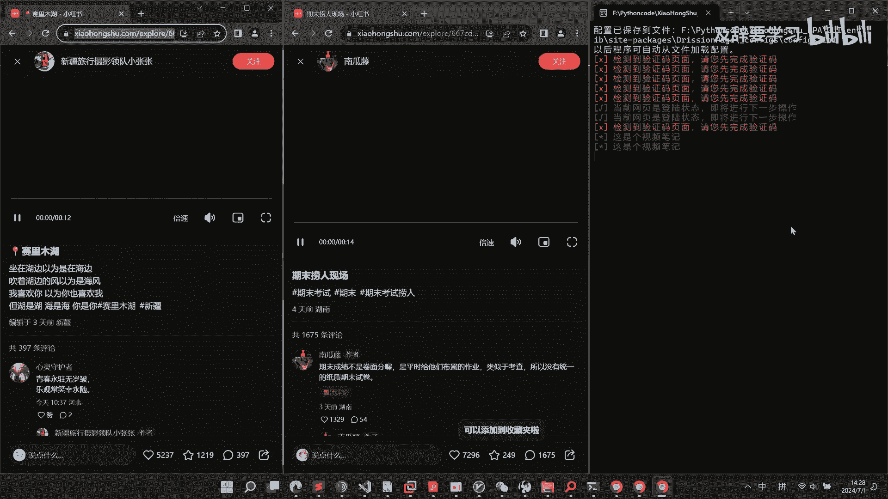

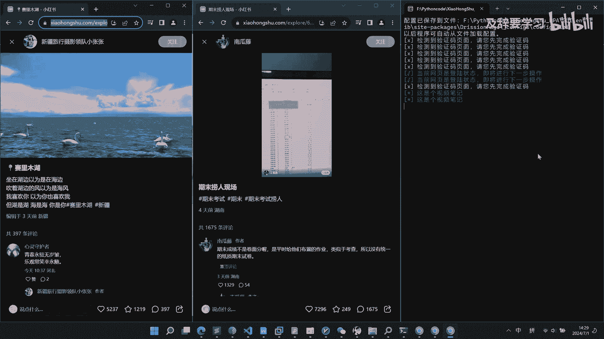

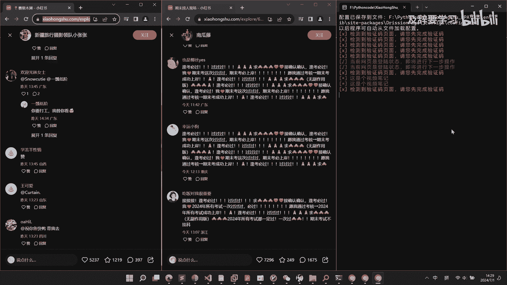

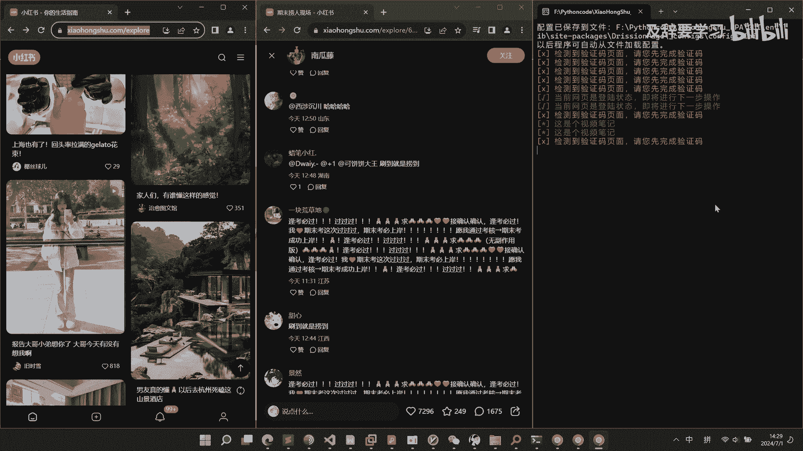

🎼TheYeah。🎼The。🎼あ무り行こただと。

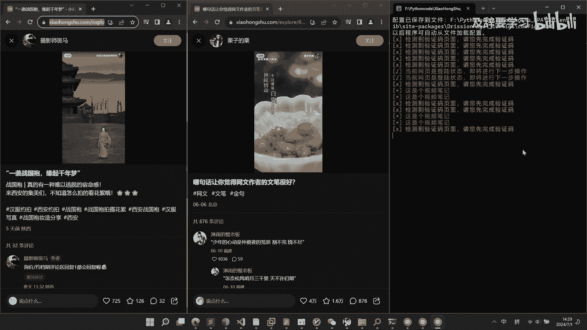

🎼다시 열린 서랍 같 아 하늘 로 높이 날린 날 자꾼 내게 되 돌아와 힘들 게 삼킨 이 별도， 다 그대로 인 걸 얼헐。😊。

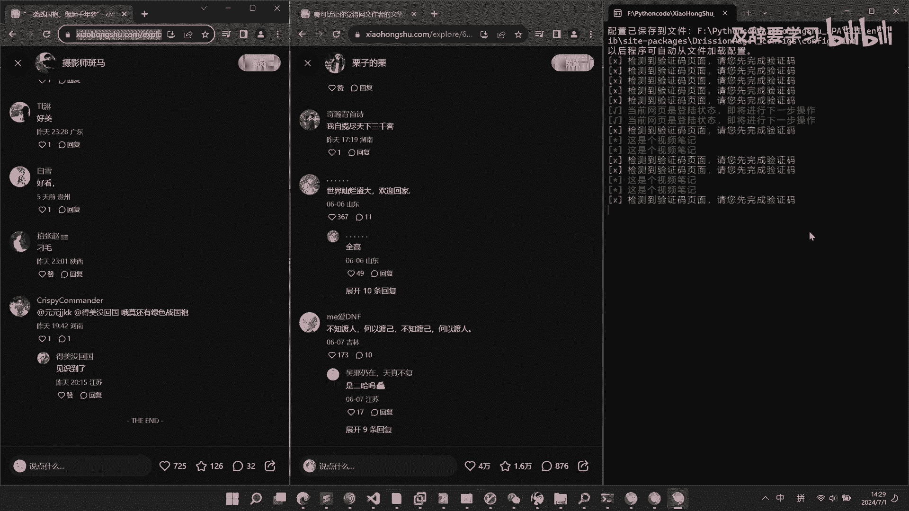

🎼수 없이 떠는 길 위해서 난 너 를 발견 하고 비려 했 던 맘 은 또 이렇게 너 어 자울라。😊。

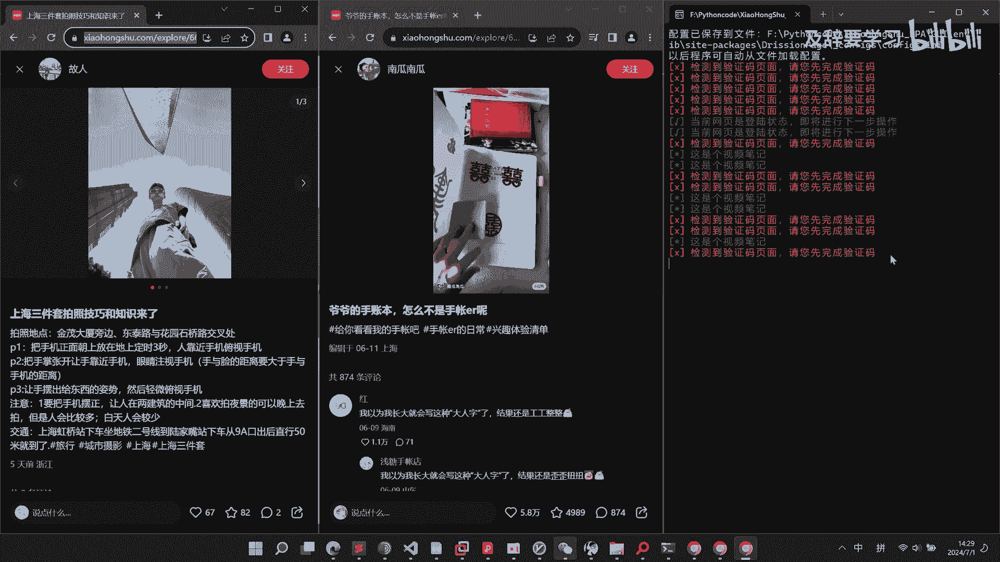

🎼벌걸ル 깨끗 끝 에。🎼而你何不必说可吗？😊。

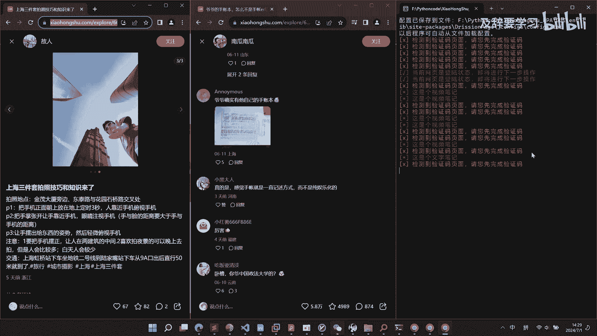

🎼你可了。

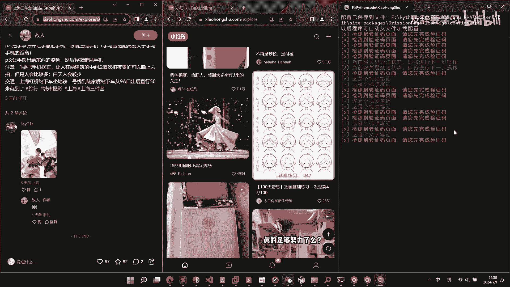

🎼멈춰지 가서 잠깐 너 를 찾아가 아무리 막 아도 결국 너 의겨친 걸 유 해요。😊，🎼那个人。🎼디젠 돌아가 너단 집 으로 지금 다시 왜 백홈。😊。

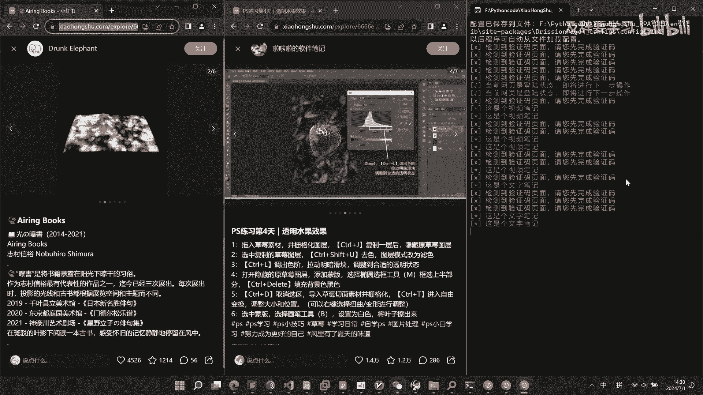

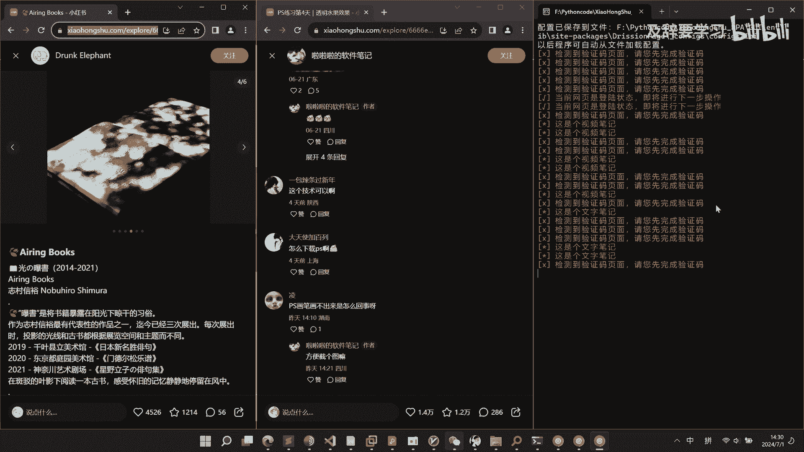

🎼，🎼一场盾牌没有到。🎼기억 을 끌어 들어 부서 은 시간 이어서， 선 명이 놓 는 더。😊，🎼길잃는 마음속 에。

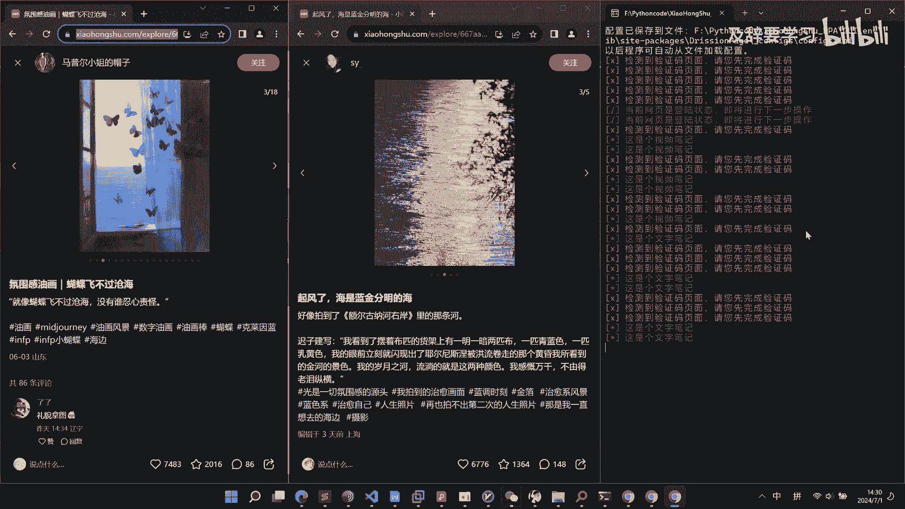

🎼널 가둔쇼 살 아 그만。🎼可能？🎼梦初细看颂 창的 너를特잖。😊。

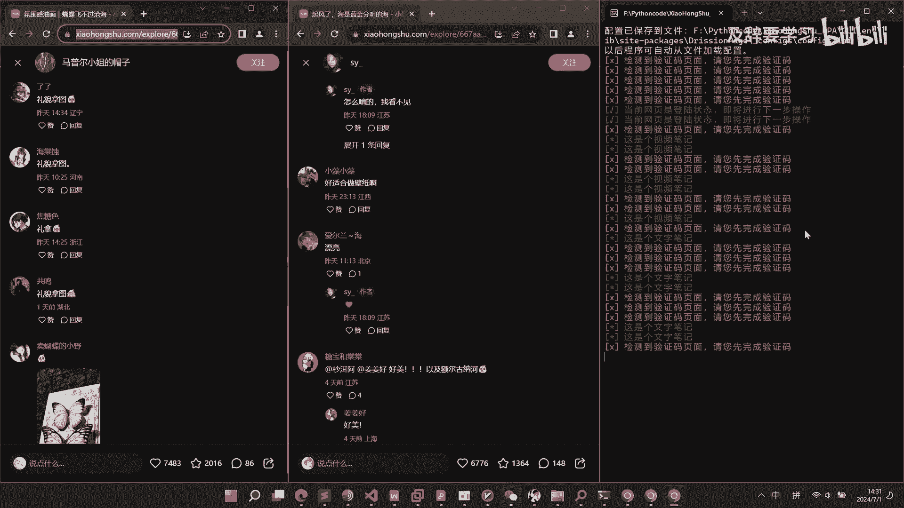

🎼아무리 막 아도 결국 너 가 걸 유복 해요。😊，🎼以前走了吧。🎼다 는 집 으로 지금 다시를 입 백 고 세상 을 뒤 집어 찾 으려 해。

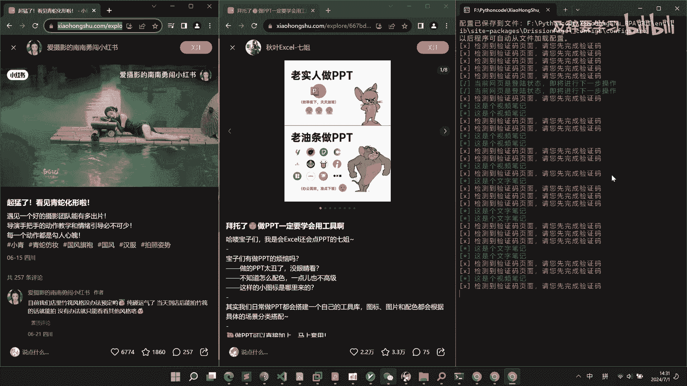

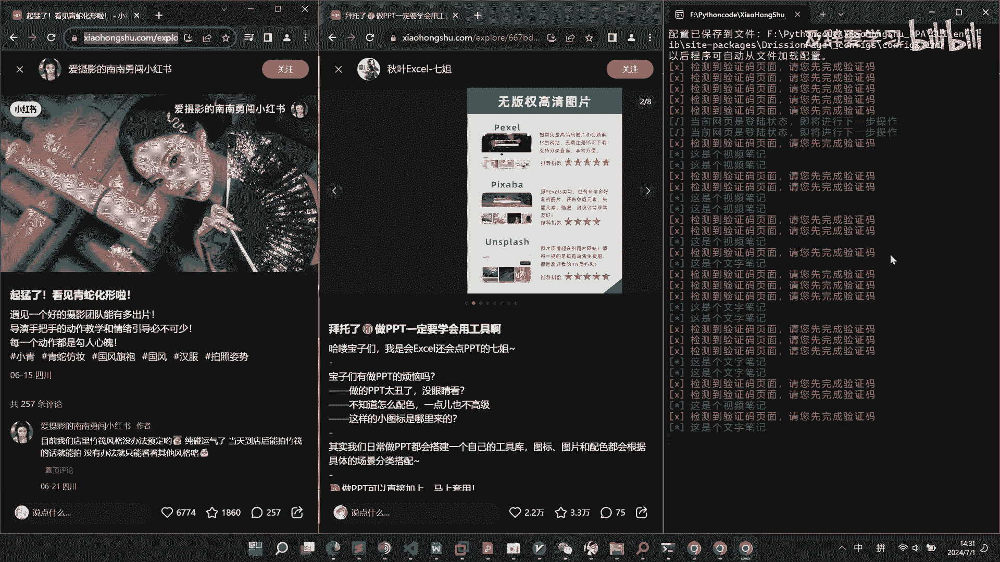

🎼무신 어로 연결 된 이야 기를。

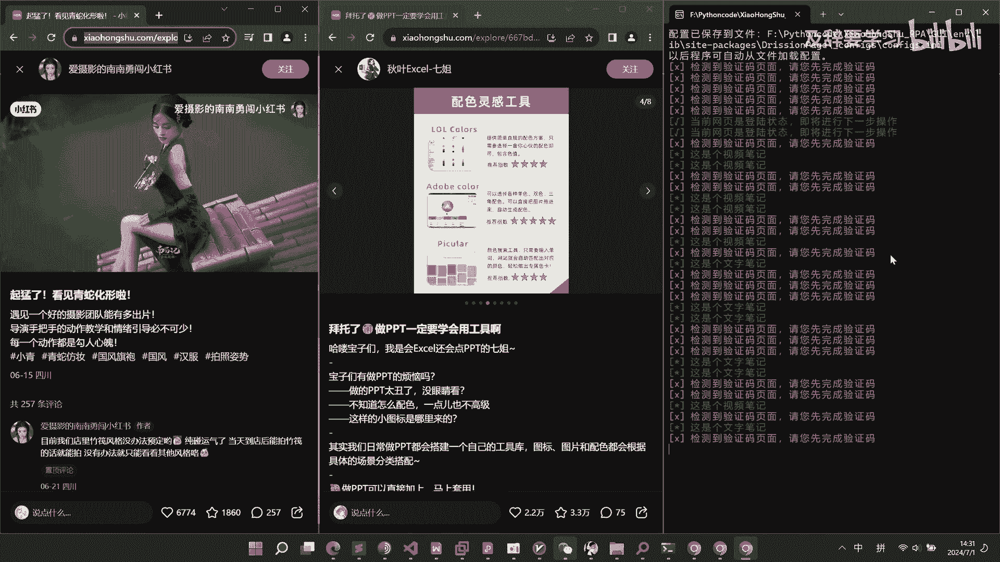

🎼摩的。

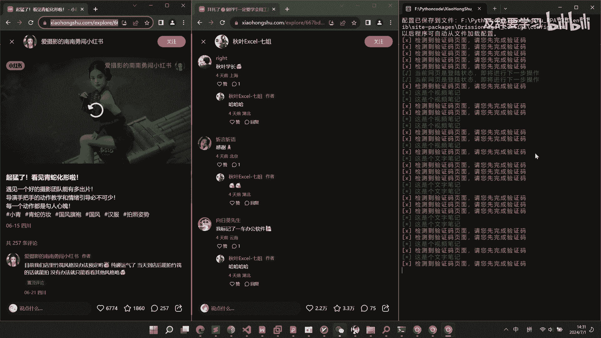

🎼你到的。🎼难道我。🎼。