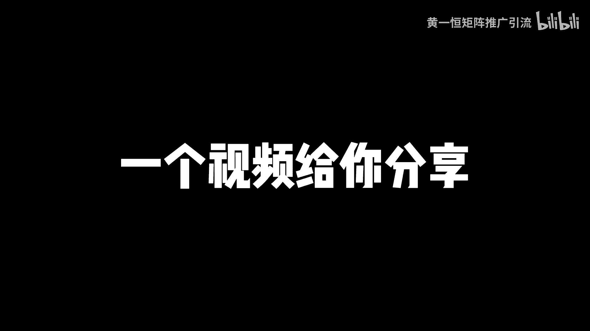

# 小红书新手入门攻略，黄金赛道3天涨1000粉，小红书怎么发才有流量！2024版小红书运营教程，小红书起号教程，小红书新手起号，小红书新手教程，新手做小红书账号， - P1 - 黄一恒矩阵推广引流 - BV1foHrehEdP

2024下半年，新手做小红书，先别发笔记，先别做直播，先别找对标账号，为什么呢，因为你做了也可能是白做，我是一名从事4年小红书的操盘手，我用这个方法测试三天涨了1000个粉丝，今天就把方法分享给大家啊。

嗯虽然毁三观，但是真的有效，尤其是最后一步一定要看完一个视频给你分享。

小红书新手入门攻略，黄金赛道三天涨1000粉，详细教程有点长，记得先收藏一起来看，会跟你分享小红书有哪些黄金赛道，怎样在这些赛道里面做爆款笔记，如何做好账号包装，能够让我们的账号三天涨1000个粉丝。

先来看第一个做黄金赛道，到底哪些赛道比较容易涨粉，有句话叫选择不对，努力白费能涨多少粉丝，完全取决于咱们做什么行业，选择什么选题，做什么赛道，有的选题我们能做到5万10万粉丝。

有的行业呢最多也就能做到几千或者1万粉丝，已经是头部账号了，所以大家如果只是单纯的为了，增加我们账号的粉丝，能够获得更多的流量去接广告，这时候建议大家选择一些大锤类的行业，什么叫大锤类。

也就是受众比较广，人群比较泛，需求比较大，这种行业来他的涨粉非常快，你发布笔记之后能够获得几千上万的点赞，而有的赛道你去看一下，近期最高点赞量也就两百三百，你要涨几千上万的粉丝肯定很困难。

而且他的上限非常高，在这个赛道里面能做5万粉丝，能做10万粉丝，而且呢，我们主要是靠接广告或者带货来进行变现，那么接广告的话，目前后台有这个蒲公英平台啊，也可以带货，带货的话就是我们做一个买手号挂车。

然后来带货赚取佣金，对于细分行业来说啊，咱们在做的时候，其实涨粉是比较慢的啊，特别是大家做了一些比较细分的垂直，跟自己产品相关的做行业，你可能做了三个月，半年才涨了5000个粉丝，整体来是比较慢的。

但是流量特别特别的精准，哪一个呀都是准客户，主要是靠什么导流到私域来进行一个卖货，那到底有哪些是大锤类的行业，是黄金赛道来，其实他有48个大锤类的行业赛道，我们可以根据自己的兴趣爱好来选择，有兴趣的话。

做的时候更加有深度，这个什么意思，就比如说如果我比较喜欢露营，我做一个露营账号，那流量肯定会非常大，因为本身我就喜欢，我能够判断这个行业哪些内容是好的，哪些内容是差的，比如说我喜欢汽车。

那如果我做一个汽车类的账号，那么这时候才能够把这个账号做得更好，但是如果我对宠物不感兴趣，我硬是去找一个宠物，那做起来效果肯定会差一些，那具体这个赛道其实非常简单，我们打开这个投屏啊。

找到自己的小红书账号，然后来往下方滑动，在发现界面，这里面有个小三角，我们点开这个小三角，这里面就有什么，就有40多个大的内幕啊，比如说有这个搞笑音乐穿搭，家装舞蹈夹击职业，然后嘞再往下方滑动。

还有这个比如说婚礼机车露营护肤运动，那么萌宠等等，这些其实都是可以选择的啊，能够出现在这些推荐频道里面的，记住都是属于什么大热门的黄金赛道啊，这些赛道可以结合兴趣爱好来选这种赛道，你要涨几万个粉丝啊。

相对来说是比较容易的，只要你持续更新，把作品做好就可以了，这是第一个啊，那么第二个呢，就是咱们得学会去做这个爆款笔记啊，那么能够涨多少粉丝，赛道是一方面，另外就是内容，有的伙伴发版内容之后啊。

能够获得几千上万个点赞，有的伙伴发版之后呢，是有几个点赞，到底差别在什么地方，其实最主要就是选题选题啊，你可以理解为就是我们聊什么话题，比如说我们在一起聊天聊什么话题，你感兴趣聊什么话题呢。

你不感兴趣这几个简单的例子，比如说你跟你的爱人或者老婆聊天，如果你聊他感兴趣的，他自然就喜欢听，如果你聊你感兴趣的人，他就不喜欢听，所以常用做笔记的时候就得做那些用户喜欢的，而不是你喜欢的。

所以选题高于一切选题的权重啊，可以说是大于80%，所以我们在做的时候呢，一定要学会去看数据，看数据等于什么，开卷考试随性而发呀，可以说是盲人摸象，也就是你做的所有的笔记。

都是建立在别人的笔记的数据基础之上的，说简单点就是我做这个笔记，我不是瞎做的，不是想什么做什么，会什么做什么，有什么做什么，而是我去找一个对标账号，他发布了50篇笔记，有两篇笔记，五篇笔记书籍特别好。

我把这五篇笔记的选题拿过来，我也进行自助啊，说简单点就是他们聊什么，大家感兴趣，我也聊什么，哎，大概就这个意思，因为火锅内容呢他还会还会什么还会再火，那么在小红书里面有一个公式叫做什么。

70%的相似爆款乘以足够多的尝试次数，所以做小红书的时候啊，一定要学会去做一个什么，做一个这个爆款选题表格，这个选题表格呀可以说是非常的重要啊，也就是刚开始做小红书，第一天你啥也不用干。

你就花一天时间去整个100个200个选题，整100个200个选题，你自然就知道你的行业里面，哪些选题收藏率比较高，哪些选题评论比比较高，哪些选题分享比比较高，挑选一些数据指标比较好的。

并且是选择那种什么低分高涨的作品，拿过来之后呢，更加容易什么报，那么这个选题表格，大家如果不知道怎么去做这种数据比例的啊，那么我会把这个分享给大家，可以来找我啊，咱们做一下这个资源共享。

另外一个呢就是咱们的一个更新频率啊，有的伙伴说老师我到底该更新几篇笔记啊，更新频率它其实也会有影响的，如果你时间比较多，能够制作高质量的笔记啊，记住一定要保证质量啊，如果你随便去搞些内容。

发蜡发多了跟发少了没什么区别，每天能够三更，比如上午一根，下午一根，晚上一根，因为爆款它是有概率的，并不是你发每一篇都能报，一般我们正常测试下来，20篇左右笔记能够接近报一篇啊，所以呢咱们在做的时候。

如果你一周能够发布20篇左右的笔记，能报1~3篇，基本上你涨1000个粉丝，这件事情呢就稳了，这件事情呢就什么拿捏了啊，那么第三个就是要学会做这个账号包装，那什么叫账号包装，账号包装里面。

它其实涉及到一个非常关键的叫做转粉力啊，这个转粉的，有的伙伴可能没有去计较这个东西啊，但是他的影响却非常大啊，具体我们来看一个赛道给大家演示一下，比如说现在我对露营感兴趣，我们来看一下啊。

在露营赛道里面，这里面会有很多的笔记啊，如果是一个做的比较好的笔记，他的账号是怎么样的，我们来点开几个笔记啊，给大家看一下啊，那比如说我们打开这一个好，我们找一些偏，比如这一个叫机车阿浪。

我们点开这个账号可以看到啊，那么这个账号呢他是有5。8万的赞，已收藏粉丝的话是6000多好，这个已经满足我们的指标啊，做到了这个呃我们讲到的一个十比一，也就是说1000个粉丝。

你大概得有什么得有1万个这个展成啊，第一关，那么这一个是做到了的，那么像有的账号，他的这个账号定位没有做的太好啊，比如说你自己的账号，包括还有你的一些对标的账号都没做的太好，那没做的太好了。

就会出现这种情况啊，比如说我们挑一些这种看名称根本不知道干嘛，比如这个叫萌萌哒，你可以看一下啊，那这个萌萌哒，140个展长三个粉丝正常也得有十几个吧，不过这个数据太少了，咱们没有必要去进行参考。

好我们还是找一些，比如这一个啊，那么泡泡今天去哪了去哪了，你可以看一下9000多的展场粉丝很多啊，你这种就代表是转粉率比较高的啊，所以转粉率高就是账号包装的比较好，也就是说更多的人他喜欢你这个账号。

会关注你，成为你的铁粉，能够增加你的这个账号的技术推流，那怎么说，先头像头像这一块呢，我们可以用这个真人出镜的啊，那么尽量的增加这个辨识度，增加这个信任度啊，这些头像来都是我觉得是比较不错的。

确能达到这个效果，那么专业号或者企业号可以用企业的logo啊，都是可以的，重点就是要什么，要真实好看，拉近用户，以你的距离，也不要用那种职业照，职业照的话在小红书上面不是很受欢迎，那么第三个是昵称。

昵称最好的办法就是让别人知道你是谁，所有的账号呀，其实我们看李医生，是根本不知道他到底是干嘛的啊，比如说你可以看一下里面的一些昵称，咱们来看一下，比如这个露营啊，那么这个账号我们是知道他是搞露营的啊。

如果我们对录音感兴趣，那么这个账号我们可以直接关注，你看这是一个新号啊，他的转粉率还是非常高的啊，做到了接近什么那么30%左右啊，整体还是比较不错的，而有的账号呢咱们在看的时候，比如像这种账号啊。

他只有个昵称，或者有的伙伴他写了个英文，你看这个什么JOE你到底知道他干嘛的，根本就不知道啊，所以昵称啊在起名的时候，大部分人都是随手起名，名字呢可能是乱码，可能是一些不认识的生词。

你看像这个真的非常深，或者是搞那种英文啊，显得非常的高大上，那么爆款昵称啊，它是一个公式的，就是昵称加所在的细分领域，那么这样的话第一个当用户在搜领域的时候，比如说像前面我们看的账号里面。

他加了这个录音两个字啊，那如果我们在搜索框里面直接搜录音，就可以搜索到这个账号，所以呢更加容易让用户怎么搜索到立啊，这个点的话是很重要的啊，特别是一些同城类的账号，可以方便我们做这个搜索引擎的优化。

这是非常关键的一个点，好这昵称昵称做好之后呢，接下来我们就需要去优化咱们的主页，主页的话它是我们天然的一个广告位啊，可以在后面设置一个咱们的背景墙，背景墙这里呢需要注意啊，图片比例呢是五比四的。

避免重要细节呢被截取卡掉之后啊，就展示不出来，这个点大家也需要注意一下啊，那么第五个是简介，简介其实就是一句话说明你是干什么的，你可以提供什么样的价值，用户有什么关注，你给大家分享一个模板。

模板就是背书加共情加优势，这个非常简单，背书的话就是我们的一些特点，比如说你曾经的一些贡献，或者达到一些别人达不到的这个成就，那么可以数字化的呈现，比如说三天怎么怎么样，30天怎么怎么样。

比如说像我自己做，我就会直接写一个啊，那么10年网络营销经验，我做了10年，我搞了推广，然后后来我有什么，我有比如说啊50万的这个什么啊，4亿的一个流量，并且我更新了超过1000套的一个课程啊。

这些都是什么数字化的基金呈现，那么第二是共情，共情的话就是跟这个用户产生共鸣，比如说啊读书博主涉猎啊，让我们一起来共同进步吧，啊就是我们一起来，而不是我一个人来那减肥的，比如说让我们在100天之内啊。

共同的努力，第三个是优势，优势说简单点就是你真的比别人厉害，为什么，比如说我的优势就是什么，大家为什么要看我的视频，就是我只做落地的这个什么啊，推广方法不落地的，我不做啊。

所以你看我的每个视频都能够去落地啊，去操作，就是这个原因好了，这个模板大家可以套一下啊，注意事项，就是有的伙伴可能会习惯的，去在我们的这个简介里面，比如说咱们要学会套用这个什么EMOJ。

那么套用与毛解之后来，那么它就可以更加的清晰化，能够分清这个城市这个点需要注意，另外我们签名里面前期新账号呀，不要做任何的这个什么呃，引流方式很容易导致你的账号进行一个违规。

这个点呢咱们在做的时候需要进行注意啊，那么小红书咱们在做的时候，如果你把这些账号包装，把赛道选择好，把这个选题库做好之后啊，像玩好小红书的最好的办法是搞几战，那么赛马机制啊，那么强者生存，弱者淘汰。

通过优胜劣汰把账号筛选出来，这样的话很多赛道做几证都能做到，一天100多个顾客啊，那么想玩好嘞，这里面我给大家准备了小红书的入门干货框架，教你怎么去收入，运营工具有哪些，企业号怎么运营，KI了。

怎么投放，还有店铺的管理啊，以及前面我给大家展示的这个小红书的爆款，选题表格模板啊，自己做呢，有的伙伴可能不知道套什么公式啊，那这里面我们都套好了，拿过去之后把里面内容换成自己的哎就可以了。

另外因为咱们这个视频不能做太长，做太长，大家也没耐心看完，所以我还单独的做了一个小红书的系统课啊，加起来时间大概有两到三个小时，有这个全流程仪表设计，导流方法，常见问题以及变现的项目这些来。

那么都可以通过主页来领取进行一个学习，好各位同学，我是黄一恒，只做落地推广方法，刚才咱们学习了新账号，怎么快速的去涨1000个粉丝，如果咱们想玩好小红书啊，光学习这几个知识点是远远不够的，这里面呢。

我给大家准备了18个平台的详细打法，小红书就是其中一个，这些呢都是我原创的，可以通过主页来领取进行学习，如果觉得今天视频比较不错的，请大家一键三连，感谢大家支持。

