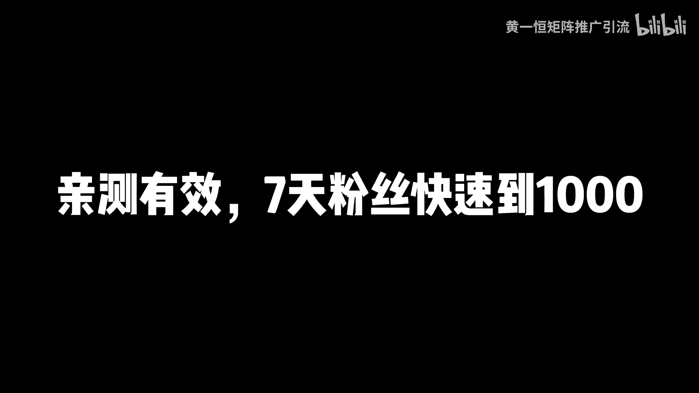
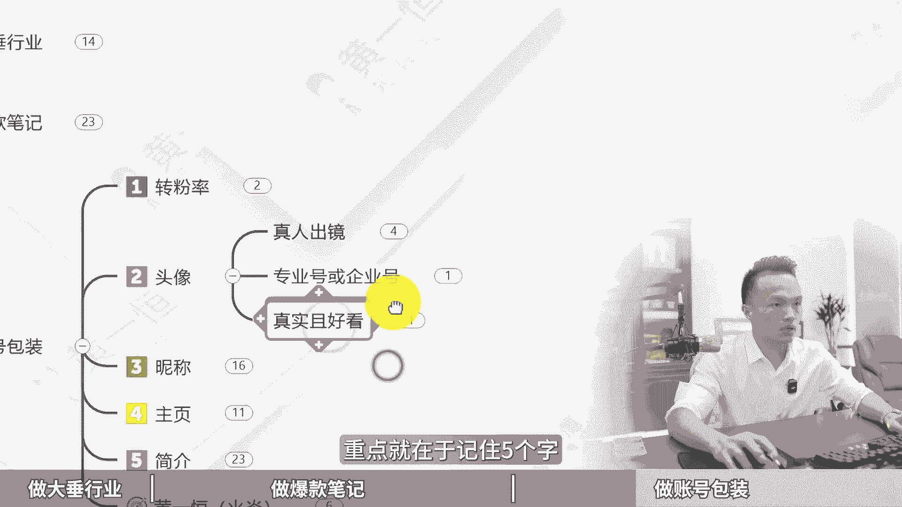

# 小红书新手如何涨1000粉，亲测有效，7天粉丝快速到1000！小红书运营教程，小红书起号教程，小红书新手教程，小红书涨粉秘诀，小红书涨粉技巧！小红书涨粉训练营 - P1 - 黄一恒矩阵推广引流 - BV1Hi421U7nC

小红书又涨1000多粉丝啊呜呜，我是如何做到的，一个视频教会你小红书新手如何涨1000粉，亲测有效，七天粉丝快速到1000。

详细教程在这里，记得先收藏一起来看，会告诉你如何做大锤行业涨粉，怎样做爆款笔记快速吸粉，以及如何做账号包装来提高转粉率，首先来看做大锤行业能涨多少粉丝，完全取决于我们做什么行业。

如果你想快速的涨到1000个粉丝，并且在七天之内就要做到，建议大家做大锤类行业，因为他的涨粉比较快，能够在短时间之内涨到很多的粉丝，毕竟需求比较大，而且上限比较高，比较容易做到几万粉丝。

甚至有的头部账号能做到一二十万粉丝，那怎么变现呢，我们靠接广告或者带货进行变现，接广告我们可以去开通蒲公英平台，就可以接到很多官方派发的广告，如果想带货，咱们可以升级为买手号，就能够挂车带货。

然后来赚取相应的佣金，有的伙伴做的是细分类行业，要涨到1000个粉丝，还得花很长的时间，因为他的涨粉会比较慢，毕竟需求比较小，特别是一些冷门的垂直细分板块，但是这种流量来特别精准，怎么变现。

我们靠导流到10亿卖货来进行变现，大家如果想快速的涨粉，大锤类行业到底有哪些，这里面给大家准备了18个大锤类行业，我们可以根据自己的兴趣爱好来进行选择，有兴趣能够做得更加有深度。

毕竟我们做这件事情是能够感受到快乐的，咱们打开投屏手机，在小红书发现页最上方，我们点击这个小三角，这里面就会有小红书的热门的大锤类行业，可以根据自己的爱好来进行选择，比如说摄影美食穿搭旅行夹击露营汽车。

这些都是受众非常广，而且流量比较大的板块，从这里面大家可以来选择，毕竟48个大板块，总有一个我们比较感兴趣的，第二个，我们如果想快速涨粉，到以前还得学会做爆款笔记，那怎样做爆款笔记呢，记住做小红书。

选题高于一切，之所以你发布这个内容没有人看，没什么推流，没有破1000的浏览量，最主要的原因就是选题的问题，所以选题的权重呢可以说是大于80%，那选题这一块我们要学会会看数据等于什么，开卷考试随性而发。

等于盲人摸象，所以咱们制作发布的笔记，都需要建立在别人的数据基础指标之上，最好的办法就是我们学会去做一个选题表格，在选题表格里面可以整理所有的数据，我们优先挑选一些收藏比，评论比数据指标标好的。

优先拿过来进行操作，特别是时间比较接近的这种笔记来，很容易二次火，比如说这里面有一篇笔记，它的收藏比达到148%，相当于100个人点赞，会有148个人进行收藏，这种笔记呢就很容易二次爆。

咱们就可以什么重点进行操作，这就是我们讲的学会看数据，那怎么去做这个选题表格模板，大家可以来找我，我把我的选题表格模板分享给你，你把里面的数据替换一下，唉就可以了。

所以做小红书你会发现火锅内容呢还会再火，因为小红书的公式一定要记下来，70%的相似爆款乘以足够多的尝试次数，就是小红书的人量密码，这些我们通过拨款选题表格就能够解决问题。

那怎么去建立这个小红书的爆款选题表格呢，这里面给大家分享三种方法，第一种方法叫做搜索选题法，比如几滴，假如现在我是做这个净水器的，我只要在右上角的搜索框，在这里面输入关键词净水器，然后我们点击搜索。

搜索完成之后，这里面就会有很多的爆款选题，比如这里面有个昨天发布的，就获得了200多个赞，这个代表已经上了小热门，我研究了三天三夜净水器好，这时候我们就可以把这个选题给他镇定下来。

放到我们的选题表格里面，然后再往下方滑动，这里面有一个选题，家用净水器哪款好好，这又是一个爆款选题，再往下看好，这里面还有净水器有必要吗，然后除下净水器选购指南，你看这些都是数据指标比较好。

咱们先整理一个选题表格，在表格里面建议大家先整理至少30~50篇，然后再进行操作，因为在整理的时候，你就会有很强的网感，你就知道哪些内容能够火，哪些内容呢不能够火，这第一个方法，第二个方法是对标账号法。

什么意思，就比如说当我们找到一个人是专门做净水器的，我们就可以打开他的账号，把他账号里面跟净水器相关的全部拷贝过来，比如说这里面有一个叫做我们打开他的账号，打开他账号之后。

可以看一下他账号里面有哪些跟净水器相关的，如果有的话，我们就把这个账号里面，只要是数据指标大于三位数的，都给他拷贝过来，因为他发布的笔记很多，你看到这些都只有三个十个，然后呢这里面有300多个代表。

这一个确实是比较受欢迎，再往下方滑动，你看他的数据指标都是两位数，一位数的比较多，三位数的比较少，三位数的，这就是什么流量密码好，第三个方法，下拉选举法，我们可以直接在下拉框里面输入关键词。

它会推荐很多高频词，这些词能够出现在这里，就代表是高频需求，搜索量非常大，比如说怎么选，然后呢，净水器推荐，家用净水器评测，净水器标买吗，净水器选购攻略，净水器，那么，管线机推荐套餐。

这些咱们都可以把它整理下来，放到这表格里面，那有了选题表格，接下来我们就可以从选题表格里面整理，那些数据指标比较好的，优先进行操作，这种笔记来很容易爆，只要我们报了一到两篇笔记，你就能够涨1000个粉。

就比较容易了，其次咱们的更新频率，想在七天之内涨到1000个粉丝，最好是能够做到三更，比如说上午下午晚上各发一篇笔记，因为爆款它是有概率的，对于我们这种普通账号，草根账号来说，我们发布的频率高一点。

更加容易爆，一周我们发21篇笔记，21篇笔记里面能够报1~3篇，基本上你涨1000个粉丝，这件事情呢就比较稳了，那除了做个爆款笔记，能够涨到1000粉之外，我们还有一个方法，也就是做这个账号的包装。

账号包装它能够直接提高我们的转粉率，什么叫转粉率，小红书的转粉率，正常的账号能做到十比一，也就是十个战场至少要有一个关注，那么1000个粉丝，我们只需要做1万个展场就可以了，那怎么做呢。

比如说我们看一下刚才这些账号，这些账号他们的这个展场到底怎么样，我们可以滑下来给大家看一下，比如这里面有个程程妈妈育儿分享，可以看到他的一个粉丝量8。3万，斩仓的话是156万。

那这个账号的他的转粉率就不是很高，正常这个账号应该得有15万粉丝左右，好你再往下方滑动，可以去看一下其他的账号，比如说咱们在下方找一个，相对来说比较垂直一些的，因为账号垂直定位比较好。

他的涨粉呢就会相对来说会比较快一些，比如这里面有个做评测的，我们打开看一下这个账号58。3万，然后呢只有3。1万粉丝，他的一个转粉率也稍微低点，正常这个账号应该能做到5。8万粉。

或者6万粉丝左右才是比较正常的，好这些呢大家需要优化一下，那怎么优化好的账号，用户看到之后，第一个头像能够加分，头像的话尽量的真人出镜，能够增加辨识度，能够增加信任度，尽量用智能的。

千万不要用一些无法代表你的头像，其次如果是企业号或者专业号，可以选择用抽象的logo或者品牌logo都可以的，重点就在于记住五个字。

真实且好看，这样的话可以拉近用户的距离，用户自然会关注你，第二个呢就是昵称，昵称的话最重要的就是让别人知道你是谁，你是干什么的，你能够提供什么价值，说好的昵称用户看一眼他就知道这是我需要的，直接关注你。

有的昵称，你看它的名称根本就不知道他到底是干嘛的，比如说像这里面有的昵称，我们可以挑，像这个做装修的，我们可以看到他是搞装修的啊，像这个第四节气，你知道干嘛的，根本就不知道，我列乌龙不加冰，你也不知道。

像这种用户来，他的关注率就比较低，所以咱们起昵称的时候，大部分人都是随手起名，名字呢可能有乱码，也可能有一些不认识的，那么生存根本就普通用户啊，到底他不知道你的医生到底是什么样的啊，一个名字。

然后呢还有个伙伴加个英文，英文的话虽然逼格很强，但是呢用户也是不方便记忆的，咱们这里面有一个昵称的爆款公式，就是昵称加所在的细分领域，第一个让别人能够啊搜索到你，同时呢又能够获取到这个搜索流量。

也就是当我们在搜索关键词的时候，用户能够搜索到你，比如说我搜这个重庆摄影，这里面就能够看到很多的账号，这种账号呢它自然就能够增加一定的这个曝光，第四个主页，这里是一个天然的广告位，很多伙伴都容易忽略。

咱们也可以把这个背景墙给它设置一下，比如说这里搞了个箭头，引导用户来进行关注，也能够提高转粉率，另外咱们在设置主页背景墙的时候，需要注意它的图片比例是五比四，避免重要细节被卡掉或者被截取掉。

导致展示不完全，第五个简介，那我们在操作的时候，简介最简单的就是一句话，告诉用户你是干什么的，你能够提供什么样的价值，他自然就会关注你，这里面给大家准备了一个模板，叫做背书加共情加优色，比如说倍数。

我们可以围绕自己的一些奉献，包括达到的一些领域的成就，还可以数字化的给他展示，比如说啊三个月啊，涨粉20万或者30天瘦身10kg，这些都可以，第二个共情，跟读者有共鸣的话，比如说读书博主。

咱们可以这样写，让我们一起来共同进步，减肥博主我们可以写，让我们在100天之内共同努力，也就告诉这件事情是我们一起来完成的，让用户呢也有参与感，第三个是优势，也就是你真的比别人厉害，有哪些厉害的点。

也可以把它放到我们的简介里面来，看一下注意事项，当我们在撰写简介的时候，尽量的配合上emoji表情，这样的话可以让我们的整个简介，更加能够分清层次，看起来来更加省力，当我们能够把这四个点做好头像。

昵称主页简介就能够做到一个比较高的软粉利，当你在操作的时候，更加容易做到1000个粉丝好了，各位伙伴，我是黄叶涵，只做落地推广方法，关于互联网推广，我还给大家整理了18个平台的详细打法。

教大家如何布集多管道流量，让你的每个管道都能够加到大量的客户，这些呢都是我原创的，具体也可以通过主页来领取进行学习，如果觉得这个视频比较不错的，请大家一键三连，感谢大家支持。

