# 小红书无货源电商实战全流程演示，必爆选品指南，多平台选爆款 - P12：11. 小红书如何选品之抖音选品 - 秋枫不入睡 - BV17BsBeZEXK

大家好，我叫阿强，接下来我们来学习我们小红书选品，我们上一节课跟大家讲了，小红书如何去额选品的一个底层逻辑，选品的一个基本的逻辑，今天我们就具体来从抖音方面来跟大家讲一讲，小红书我们如何选品的。

好吧呃我们先来了解一下小红书他的啊，从小红书里面选品如何从抖音选品，它的一个核心，我们核心就是选爆品嘛，选择与自己类目啊人群匹配的爆品，我们的方法从方法两个方法，第一个利用抖音橱窗来选片。

利用抖音橱窗来签名，第二个利用抖音搜索，找到近期爆款的视频再造产品，我们抖音选品的橱窗选品来给大家演示一下，目前可以零元开通橱窗，大家呃，抖音橱窗可以零元开通橱窗，我具体会演示一下方法，好吧呃。

这边有一个电商带货，打开抖音开通橱窗呃，开通橱窗这边有个电商电商带货，点击电商带货之后，我们会有一个百度打开我们抖音主页，打开抖音主页最下面有个我点击我的页面。

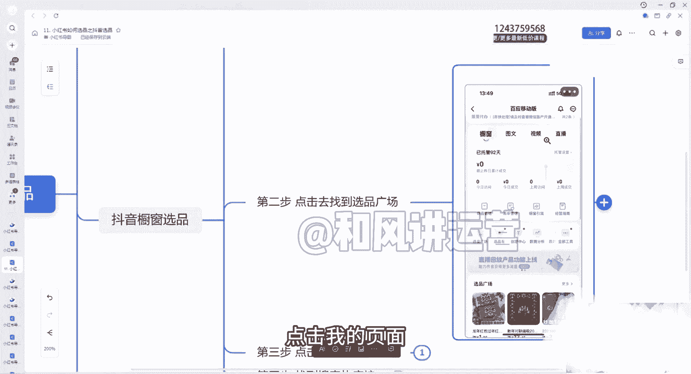

这边有一个电商带货，点击电商带货之后，我们这边可以找到我们的橱窗，看到了吗，这边橱窗这边有个选品广场，看到了吗，选品广场我们点击这个选品广场。

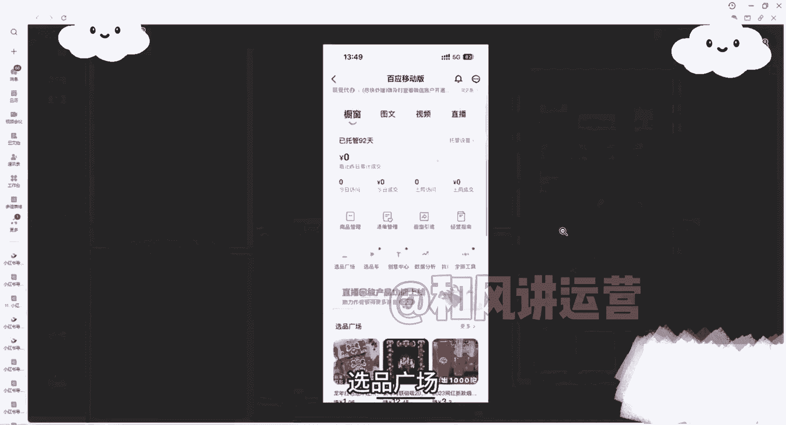

给大家再放大一点，看一下选品广场，我们第三步。

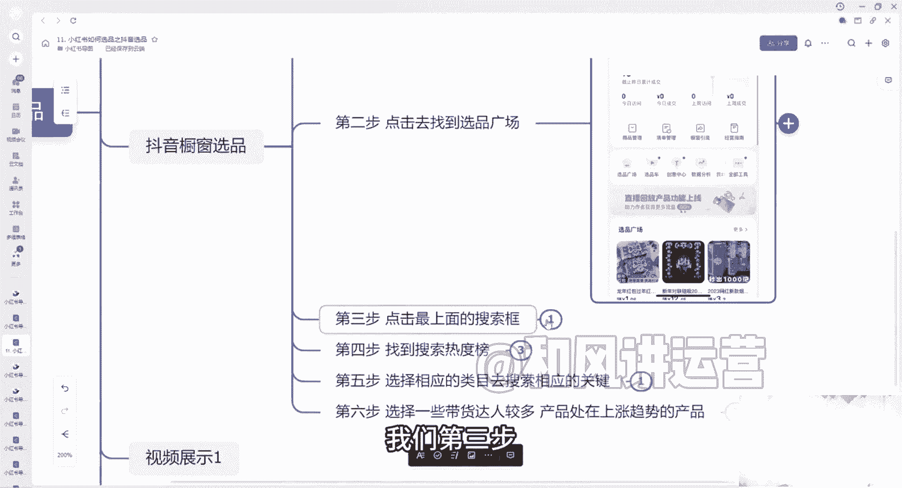

我们点击最上面的点击选品广场之后，点击最上面的搜索栏，这边有个搜索栏，看到了吗，我们在里面可以搜索我们相应的类目啊，相信我们相应内幕相应的产品都可以，以及这边我们点击搜索栏之后，这边有一个爆款热度榜。

看到了吗，爆款热卖榜。

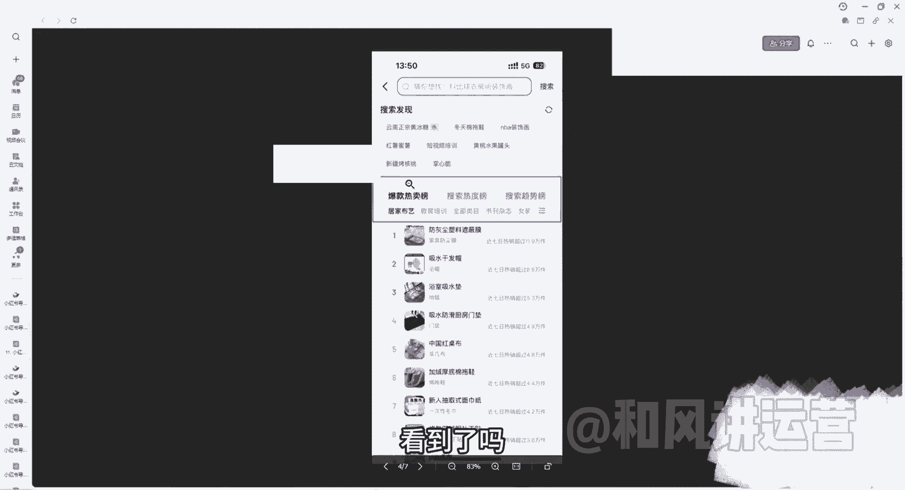

报搜索热度榜，搜索趋势榜，你要知道啊，近期在抖音上面说搜索的产品，搜索最多的一些产品关键词都在这里面，在抖音上搜索多的，基本上这个爆款在全网他搜索最多，那在小红书里面也不会太少的好吧。

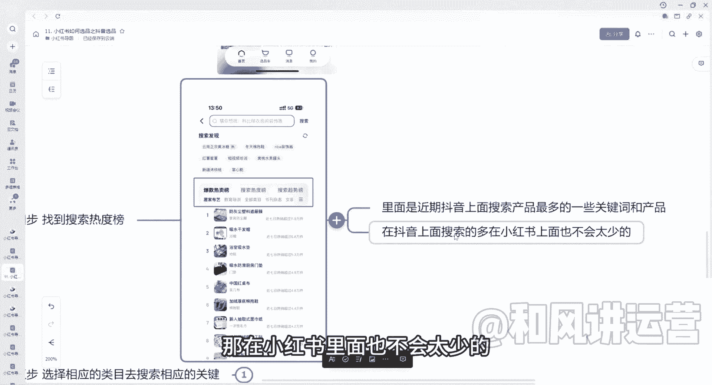

你看可以看一下防尘的，吸水的，感冒呃，浴室的吸水电等等，这些都有点击，这里面会有很多类目，还有很多类目你可以选择自己的内幕，我们选择相相应的类目进行搜索，比如说你是卖什么产品的，卖女装的，卖什么百货的。

学习用品的，美容护肤的，女鞋的是茶叶啦。

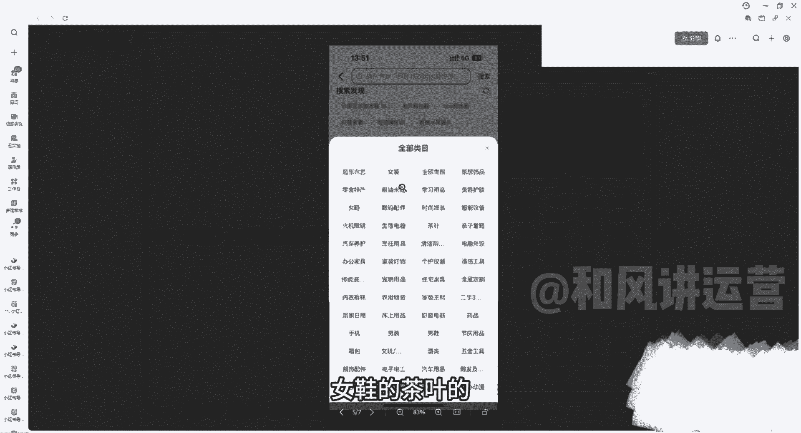

清子你可以选择里面有很多很多，我们选择自己的类目就可以了，第六步，我们选择一些带货达人多的产品，叫趋趋势的。

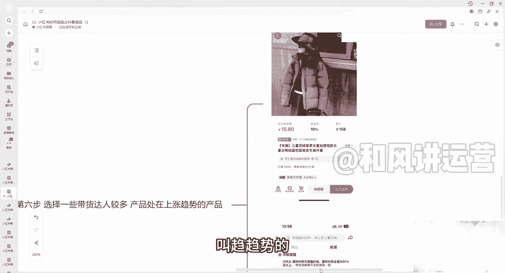

我们点击这刚刚那个这个产品外套对吧，每单可以赚15块钱，这个是他销售比较多，2000多份了，用销售两居多份啊，这里面可以看一下他近期的近30天吧，一直处在上涨的阶段，而且没怎么下架，看见了吗。

这个是近期的近30天的。

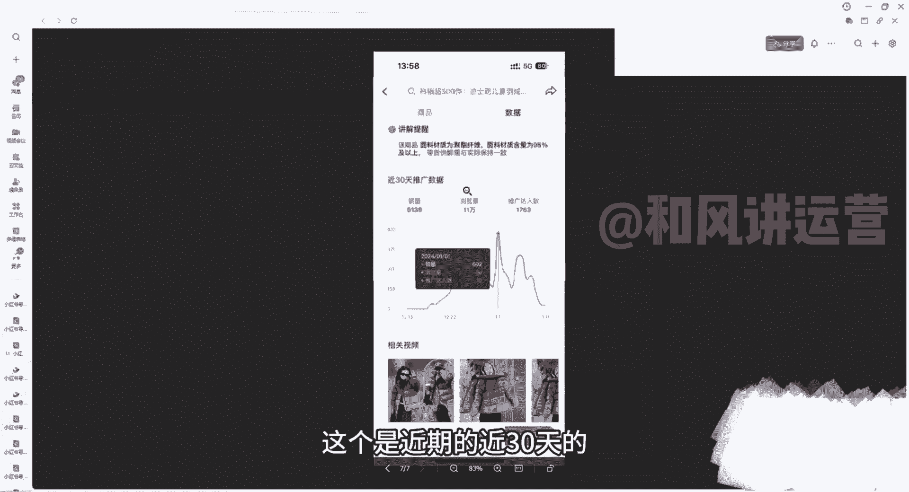

这个我们就可以去使用它，当当一个爆款选品好吧。

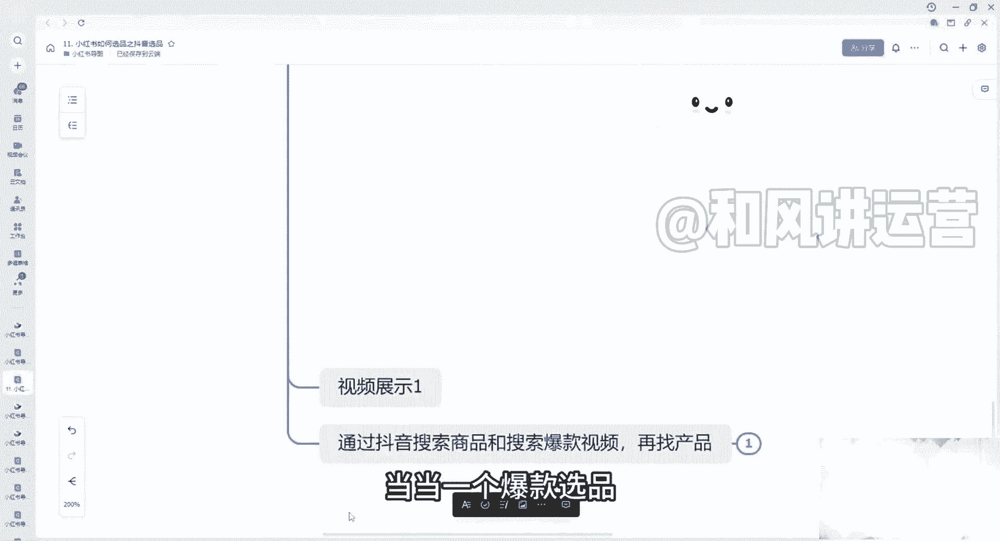

然后这边在第二种，我们会以一个视频的形式展示给大家，面料也很舒服。

谢谢好的，我们来看一下这个视频，我们打开我们的橱窗，然后选品广场，这里面有很多很多，我们可以搜索搜索我们的类目对吧。

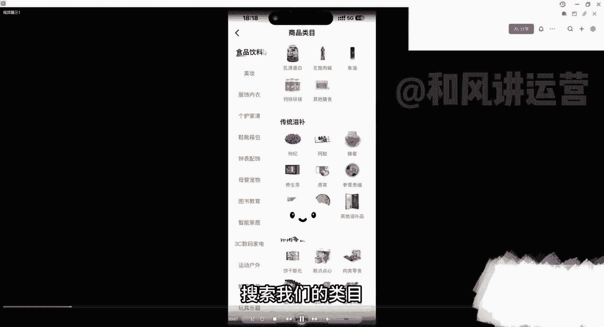

这边有很多很多类目可以自己去选择对吧，选择你的类目而到里面去挑选产品对吧。

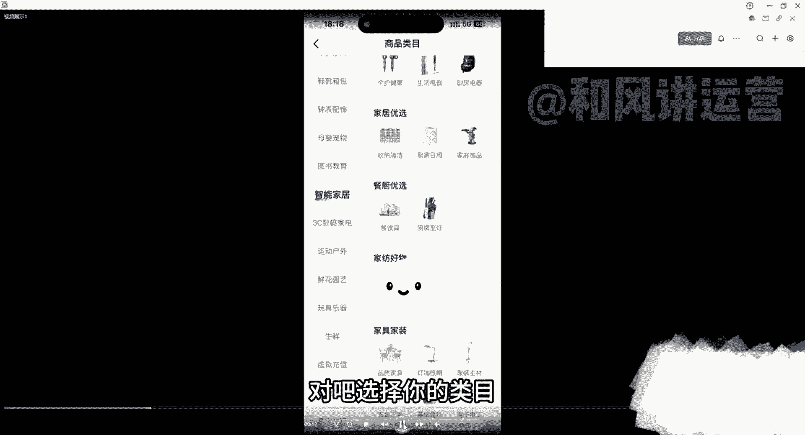

人家卖的好的，我们也可以作为爆款去卖很多很多，就比如说搜马燕群，有很多正在人家带的带货对吧，这些都是可以的对吧，人家销量也是都是很高的对吧，1万加几万加的对吧，就比如说这个产品对吧，它的销量2。7万。

商家体验分还是92的对吧，以及它的整体的好评率对吧，都是可以看到的，它整体的属于处在一个上升的趋势，这里面都是可以很明显的看到，大家按照这个步骤一步步去操作就可以了好吧，我们找到这个产品。

你看它的整体的浏览量16万，整体的好评率都在里面，能很详细的展现出来对吧，价格我们把他的图片保存下来。

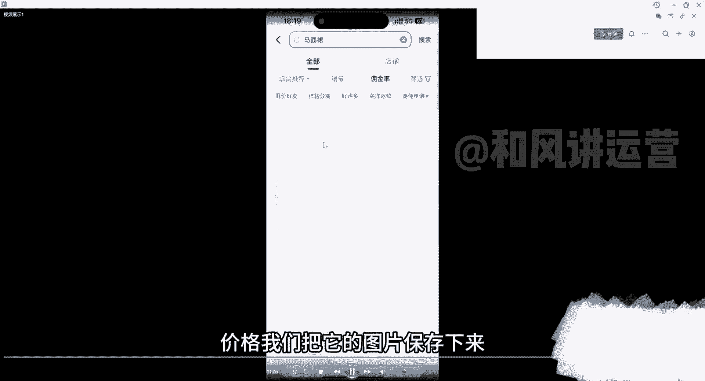

然后到1688里面去搜索就可以了好吧，很多东西我们都可以搜索到的。

通过抖音搜索商品，我们再找产品对吧，来再展示一下。

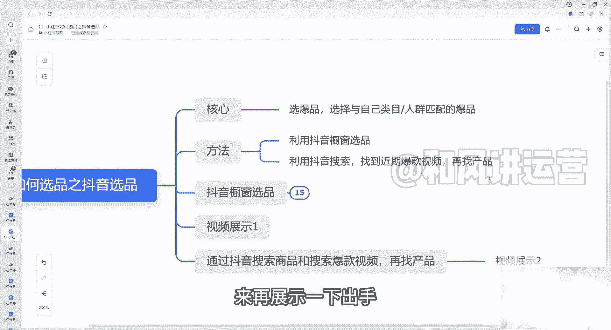

入手面料也很舒服，一起我们可以找到这些产品，找到这些产品，比如说是卖马面裙的，这些人家正在直播的，卖的好的，几万件的对吧，我们可以把它图保存下来对吧，保存下来，然后1688里面去搜一下这个产品。

是否有很多上面都是品牌的对吧，我们这里有视频，有视频展示的，上哪家求求把东方美可以做混剪视频这种对吧，也可以把它产品拿出来。

我们自己去卖好吧，这个就要跟大家讲点，今天具体来讲一讲抖音如何去选品呢，通过两种形式，第一个通过橱窗里面去选品，第二个通过抖音搜索对吧，找到近期的爆款视频。

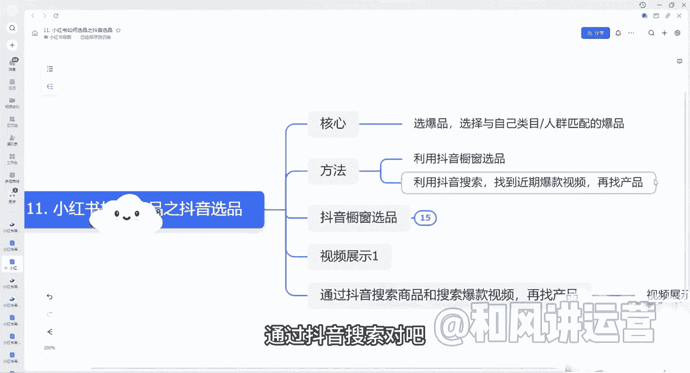

再找到这个产品去搜索就可以了好吧。