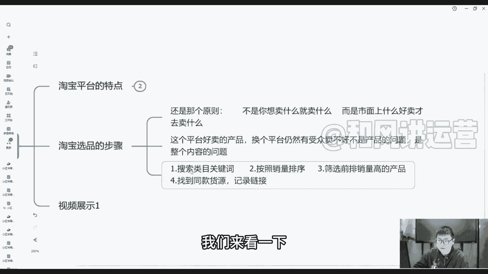
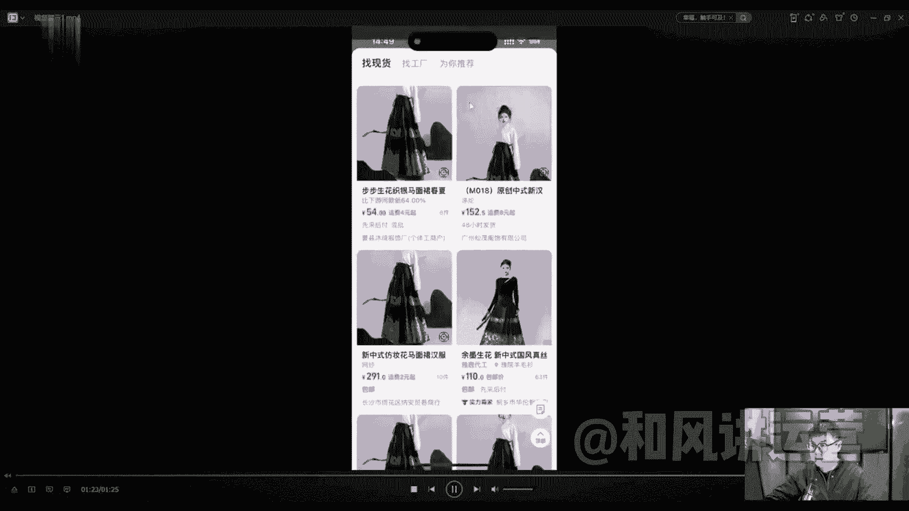
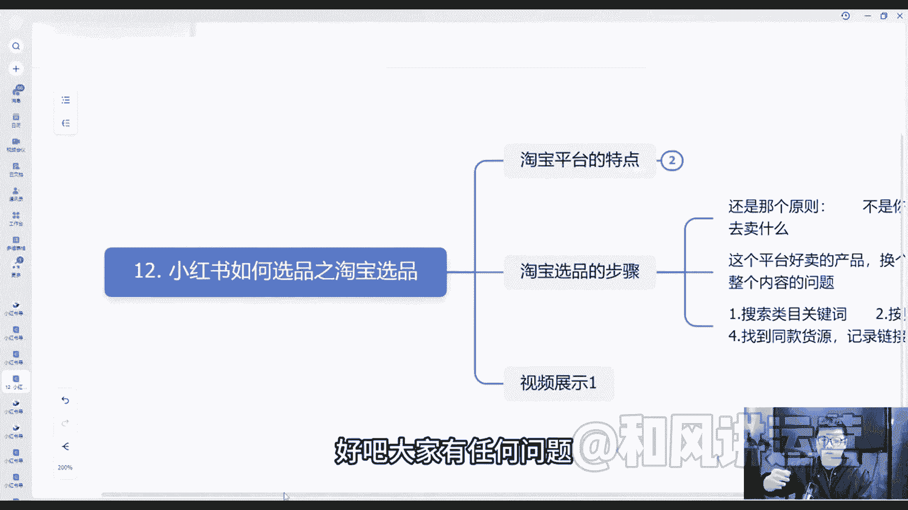

# 小红书无货源电商实战全流程演示，必爆选品指南，多平台选爆款 - P13：12.小红书如何选品之淘宝选品 - 秋枫不入睡 - BV17BsBeZEXK

大家好，上一节课我们讲到了，如何在抖音里面选品的步骤，这节课我们具体来讲一讲如何在淘宝里面选品，淘宝里面也是有很多爆款的品，等着我们去寻找的对吧，淘宝其实也是比较早期的这种电商平台，里面有很多销量。

其实好的品其实是值得我们去挑选的好吧，那我们具体来通过了解淘宝的平台特点，以及通过选品的步骤来给大家演示一下，首先你得了解淘宝平台的特点，淘宝平台我跟大家讲了，就像就像是步行街一样对吧。

价格稍微比较便宜，但是好东西还是有的，五淘宝的特点就是用户主动去搜索关键词，基金购买很多都是我想买什么，我打开打开淘宝去搜索的，我想买衣服啦，想买T恤，我就到淘宝里面去搜索这个女装T恤是吧。

就购买它整体搜索的结果啊，首页推荐都是千人千面的，你1000个人看到这个搜搜索页面都是1000种，不同样的，因为他会根据你的标签而推不同的懂我意思吧，他也是会根据像我们小红书抖音一样。

他也是会根据你的喜好，你人群打的标签来推更多的对吧，你搜索的越多，他后面推的也更多好吧，这是淘宝平台的一个特点，大家可以简单了解一下，那淘宝选品的步骤呢主要有三个步骤，也是比较简单一点的。

来带大家看一下，首先第一个步骤还是那个原则，不是你想卖什么你就卖什么，而是市面上好什么东西好卖，我们才去卖什么，就像淘宝一样的搜索一个淘宝里面搜一个产品，这个产品卖了100万。

那说明这个产品卖了100万件，说明这个产品本身它就是一个爆款，肯定不火，不可能这个产品太差的太差，你就你你就想一下再差，他会有那么多人给他刷到100万吗，他有那么多钱给他这个产品刷到100万嘛。

可能性不大的，然后这个平台好卖的产品，换个平台他依然有受众卖，不是不是产品的问题，而是整体内容的问题啊，所以说我们一定要知道产品一定是别人买的好，我们也能买得好好吧，呃第一个哦他的一个步骤。

第一个步骤是搜索类目的关键词对吧，搜索这个类目的关键词，比如说马面群，我就搜索呃，中式呃，汉汉服或者中式的一些古装，古装风的一些裙子啊，按照销量来排序的，基本上都是按照销量排序的。

以及筛选前排销量高的产品，我们找到同款的货源链接，记录链接，我们然后把它保存下来，再去到1688里面去再再搜索就可以了好吧，然后我们来看一下我们的视频，具体来了解一下吧，好吧行，我们来看一下。

首先我们打开自己的淘宝页面，你看到千人千面，每个人他的页面不一样的好吧，我们可以去搜索一下，搜索一下，比如说我们搜索马面群对吧，就我一一直提的搜索马面群，那我们就搜索马面群，搜索马面群之后。

你看打开很多页面都是销量比较高的，4万4万多的呃，8000多的，2000多的，基本上不会太低的，除非那个人打那个直通车打的太过分了对吧，他会把你这个推推到最最前端对吧，有很多，你看这些top3呐。

它啊还有像这种内衬的，那我问一下大家，你说这种这种内衬的长裙，这种穿马面裙，内衬长裙能不能用，能不能放在我们的爆品里面去，我建议大家啊适当的可以放在里面，因为那然后人家买了我们马院群。

肯定想买我们这个内衬的，我们不能把它作为主推款，但是可以作为一个辅助款来做好吧，像这些你可以作为一个辅助款来做这销量高的，200多块钱，销量几千几万的等等等等，都有很多很多啊，但是类型都差不多。

你发现了吗，其实都差不多，但是这些就是爆款，因为很多人都喜欢这个嘛，买的人越越多嘛，我们怎么去做，我们把他的图片给他保存下来，我们先给他收藏，喜欢的都给它收藏，爆款的都给收藏，8万多的。

我们都给他收藏下来，像这种对吧，我们适当的也是可以运用的，放在自己，但是我们不能把它作为一个主推款啊，这种这种也是可以放在我们的橱窗里面，别人看到了也会买的好吧，那我们不能作为主推款。

这个我再强调一遍好吧，我们把这图片保存下来，图片保存下来之后，我们打开1688，阿里巴巴的1688，我们到里面去把这个图片给他搜索一下，我们搜索一下，你看有很多看下价格几十块钱的。

100多块钱的很多很多，他卖多少钱，他卖200多的是吧，同样同样款式，连图片都是一样的，看见了吗，图片都是一样的，我们就可以作为我们的产品，它利润就是翻倍翻倍再翻倍的好吧，很多很多这里面都可以看到。

好吧，这个就是我们今天讲的小红书，如何在淘宝里面选品，如何去放在1688里面的好吧。

