# 小红书无货源电商实战全流程演示，必爆选品指南，多平台选爆款 - P14：13.小红书如何选品之拼多多选品 - 秋枫不入睡 - BV17BsBeZEXK

大家好，我叫阿强，今天由我来跟大家一起来继续学习，我们小红书的课程，我们是上一节课讲到了，如何用小红书在淘宝里面选品，在抖音里面选品，这节课我也会跟大家具体来讲一讲，如何我们小红书在拼多多里面选品。

其实我前几节课也跟大家讲了，选品的一些底层逻辑，选品，拼多多其实就跟如果说我们按照市场来说的话，他就跟那种路边摊差不多，它里面是有好有坏的，而且整体来说价格是比较便宜的，好吧，我们从几个点来了解。

首先第一个就是拼多多，他们目前平台的特点，拼多多选品的一个方法好吧，我们来具体来看一下，首先拼多多它有什么特点，首先第一个它肯定是价格低的，他整个在整个全网的这种，在整个全网的这种电商平台来说。

它属于价格属于非常非常低的，整体的质量呀，也属于稍微稍微偏差一点的吧，这是他第一个特点，第二个特点，它整体的销量是容易作假的，你可以看到你刷进去打开拼多多，看到很多销量可能大概在几千几万的那些。

那些不一定不一定收，真的都是可以通过一些后台啊，都是通过刷单呀等等可以做操作的好吧，这个就是目前拼多多，所以说我们在拼多多选品的一定要睁大眼睛，一定要看清楚，到底到底这个品到底能不能适合我们用，好吧。

我接下来会具体的跟大家讲一讲，我们拼多多肯定是作为最后的平台来选的对吧，我们现在抖音在淘宝天猫对吧，以及在我们小红书站内选品，选完之后，我们再到拼多多里面去选品，那那我们来看一下拼多多选品的方法。

拼多多选品方法我们正常有两个方法对吧，我们的正常选拼多多，重点看细分内幕的销量排行榜对吧，看一下排行榜排行榜，虽然说它的销量容易作假，但是你要记住啊，再作假，它的大销量是无法作假的对吧。

它大销量最起码它说明这个产品不会说太差的，它肯定是比一些根本卖不出去，那些品要销量要效果好的，这是第一个排第二个，我们看排行榜，筛选出受众匹配的产品是吧，那我们具体来看一下我们的方法。

第一个方法第一步我们也是很简单，先打开我们的拼多多app，我们手机里面下载一个拼多多app，下载完之后，我们打开它的拼多多秘密，这个app其实也是一样，千人千面的对吧，我们每个人看到这个页面不一样。

打开这个APP呃，这里面有个九块九特卖，有没有看到，那具体来跟大家展示一下。

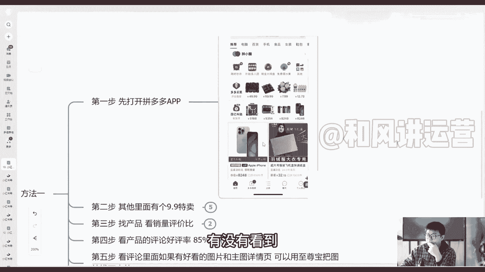

我们打开我们这边这边有一个这第一页，第一页这边有个其他看见了吗，给大家再放大一点，看一下，这边有个其他。

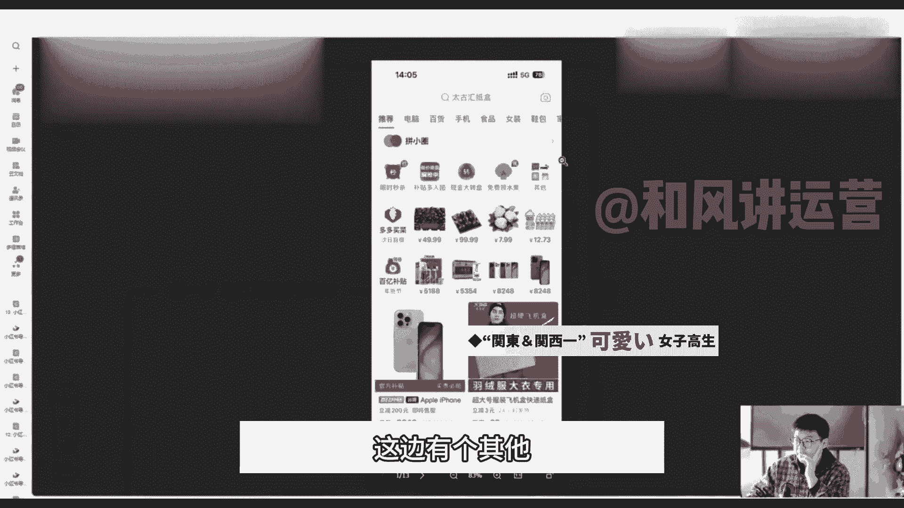

这边有个其他我们对吧，点击其他这边有个九块九特卖，大家有没有有没有看得清楚啊。

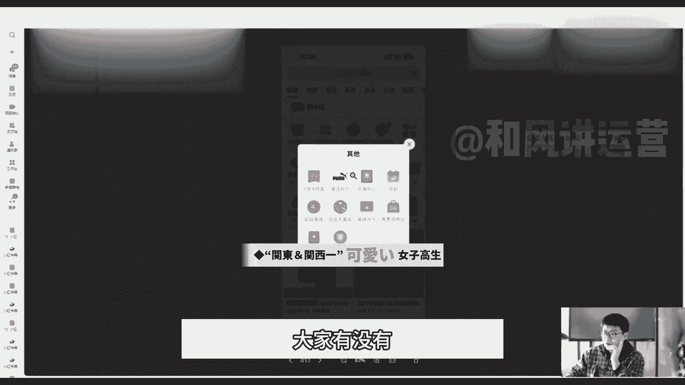

九块九特卖我们点击进去，点击进去，这里面基本上都是九块九的，都是价格比较合适的，你看一块多的，六块多的等等等等，这些价格都是很划算的，以及年货节三元三件这些官方补贴的对吧，能进入九块九特卖的。

都是厂家为了销量而亏钱的，大家一定要明白这个点，基本上这些都是亏钱的，要不然他不可能说呃。

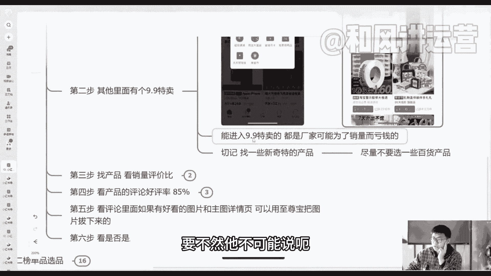

放在九块九特卖这里面的好吧，然后看它的销量，几万件的很多很多。

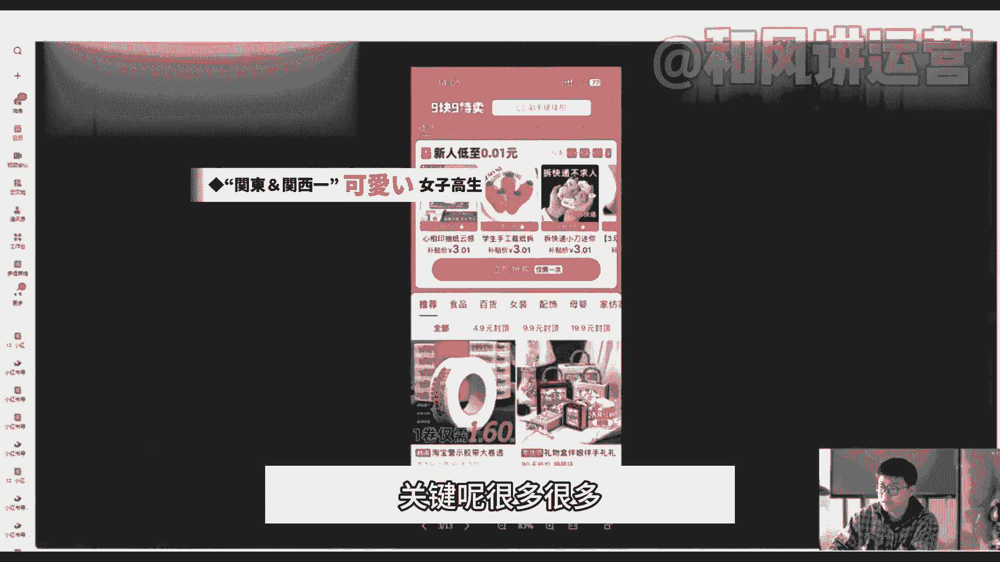

切记在这个九块九，特别是在拼多多里面找低价的产品，以及找低价产品，一定要找一些新奇特的产品对吧，不要说像普通一点的产品，你都能拿出来卖，那你在拼多多，因为本身效果就不一定有人家的其他平台，效果好。

一定要找一些新奇特的产品，尽量不要去选一些百货的，你像这个胶带就不能选，像这种伴娘伴手礼这种礼盒包装的，这种好看的礼盒包装，我们就是可以作为一个预选的对吧，这是第一个，第二步，第三步，找产品。

看它的销量评价，销量的评价比，这个其实是我们看一下它的整体的评价比，你看它的整体的销量在在这边是2。7万件，已拼了2。7万件对吧，你看他的整体的评论评论在3000多一比十对吧，超过一比十了。

那说明这个就是我们可以选的好吧，然后我们看第四步，看它的整体的好评率，能达到85%的对吧，你一定要记住啊，在其他平台我们能达到90%，在拼多多里能达到85%，90%已经算很好的了好吧，我们看85%的。

然后最新的评论，最新评论我们打开可以看他最新的评论，不是有最新的吗，最新的评论，那评论最新的基本上都是真实的评论，因为他们作假，你说这种这么多销量，他不可能每天都作假吗，基本上都是最新的评论。

然后看一下他们的销量，把他们的一些组图啊，一些图片啊，如果好的拍的好的是吧，或者说呃好的一些图片，我们可以后期跟大家讲，会用至尊宝把他图片给他扒下来好吧，然后第六步我们看是否是厂家，点击商品的主页。

看一下它同类型的产品，看货源多不多，比如说他这个是卖杯子的，我们下面这边有个主页，其他店铺看一下他是不是基本上都是卖杯子的，那如果说基本上都是卖这种杯子呀，百货的这种，那他基本上都是源头厂家。

不是厂家的东西，卖的多，卖的杂那种，不一定是厂家，而且像那种销量比较高的，基本上都是属于厂家的，好吧，这个是第一步，我们来第一个方法，我们来看一下我们第二个方法，通过榜单品榜单来选品的，也是第一步呃。

确定自己的选择类目，你是卖什么类目的，你只卖女装的，你是卖男装的，你是你是卖食品的，都可以对吧。

我们到这里面去选，这最上面这边有很多类目，看到了吗，电脑百货，手机食品，女装鞋包等等等等，我们去选择，假如说你是卖食品的，那么就选择食品，你是卖什么类目的，你就选择上面的什么类目，先选择一个大类目啊。

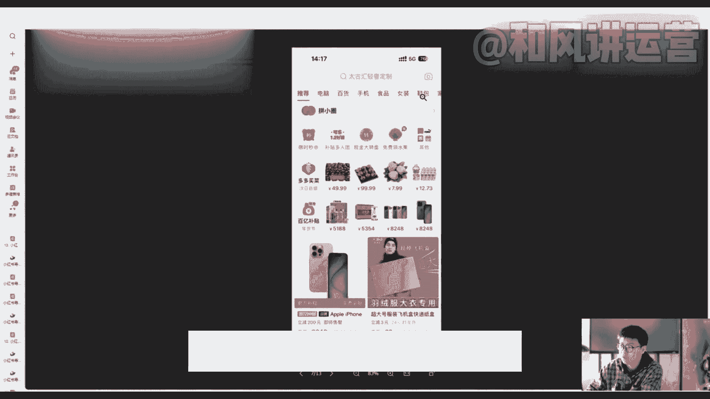

先找到这个大类目的排行榜啊，我点击这个类目了，你看点击这个类目这边是不是就有个排行榜啊，我们点击相应的排行榜对吧。

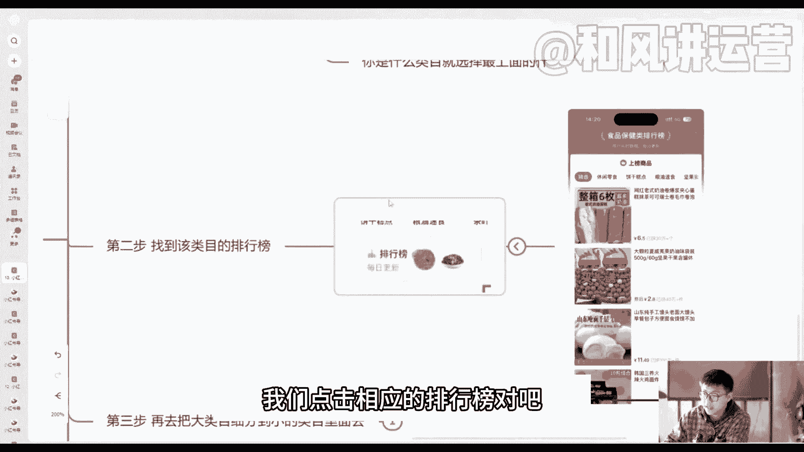

点击排行榜里面就有很多啊，这个类目的食食品保健类目的，目前比较火的一些对吧，拼了30多万件这种老式的奶油卷对吧，像这种夏威夷果啊，馒头等等等等，这些都是拼多多里面的一些排行榜比较高的。

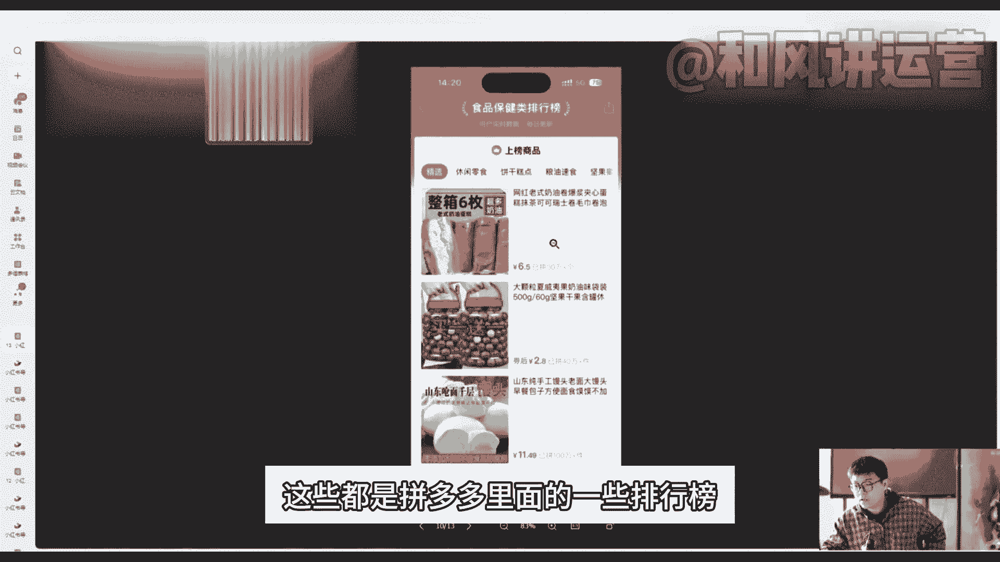

第三步再去把大类目细分到小类目里面去。

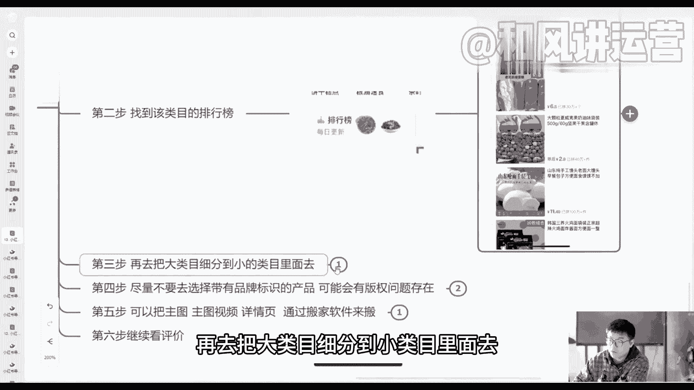

我们这边也是可以细分小类目的，零休闲零食的饼干。

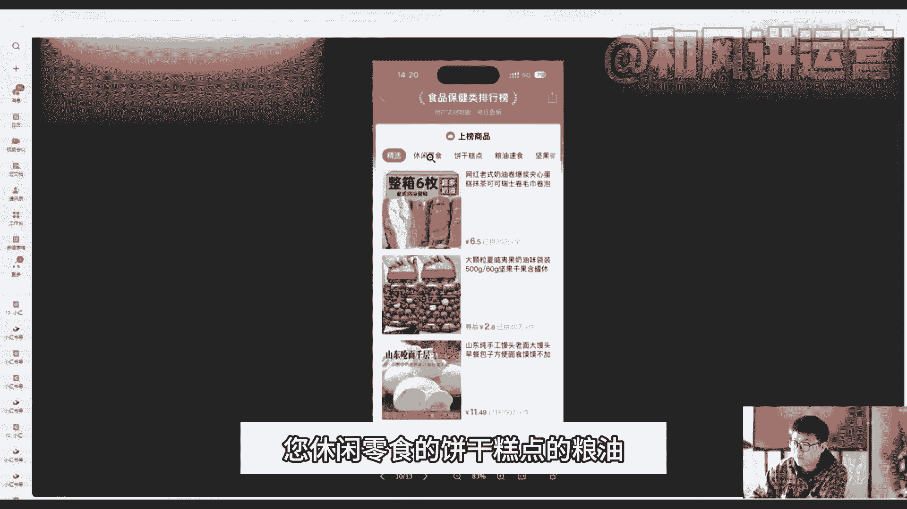

糕点的粮油，素食的，坚果，蜜饯的啊等等等等，这些大家都是可以去选的，第四步尽量不要去选择带有品牌标识的，那什么叫品牌标识的呢。

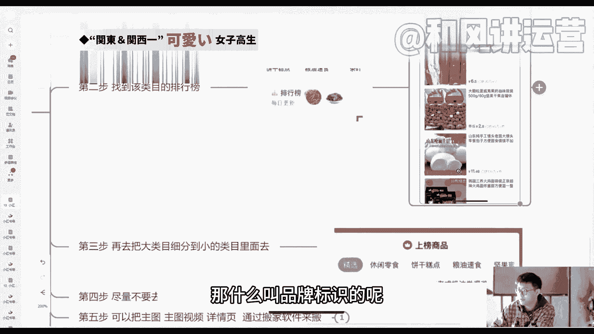

来给大家也展示一下，你像这个像这个它就不是有品牌标识的，而这个看到了吗，品牌官方授权百分之百正品，像这种你就不要选，因为你要如果选的话，你没有跟人家提前沟通好的话。

这个也也是有可能会影响到一个版权的问题的，好吧，选这种没有版权的，我们就可以去带好吧。

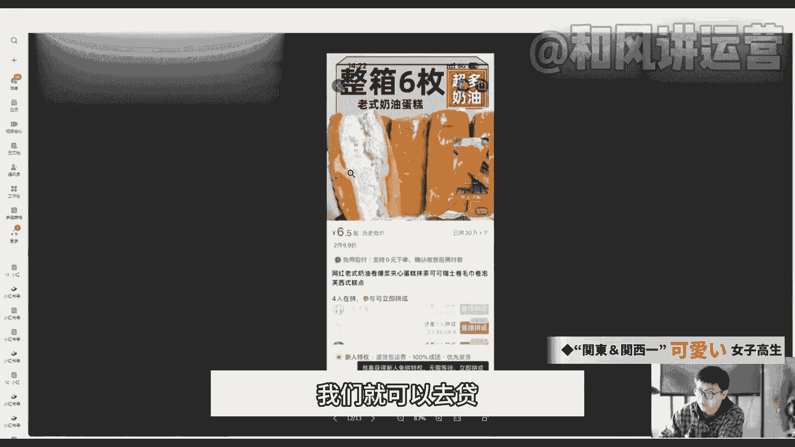

就是这个问题，第五步，我们可以把主图详情页这些他们的一些视频啊，这些组图啊，我们可以保存下来，通过搬家软件保存下来，然后看一下是否有一些拼多多，或者某厂家直销等等的字样，那我们这些图片可以保存下来。

但是他有可能图片里面会有一些，关于拼多多的一些字样，我们这些字样是不要让它出现的好吧，这些就图片不用不要再去使用它，第六步继续看评，评价里面它的一个销量跟评价比，评价的一个差评比。

可以把好的评论作为图片作为笔记，我上面也讲过了，我们这种方法，拼多多这种选平法好吧，这是我讲的两种方法呃，两个注意事项，首先第一个就是销量跟评价比要达到十比一，就是你卖十件产品最起码要有一个评论。

卖100件产品要有100呃，要有十件品，十十十条评论，差不多，这个评论比的话是属于比较正常的，好评率的话最好能达到90%以上的评，正常情况下是没有什么太大问题的，好吧，就这两个注意事项好吧。

这个就是我们今天跟大家来学习的，我们小红书如何在拼多多选品的好吧。

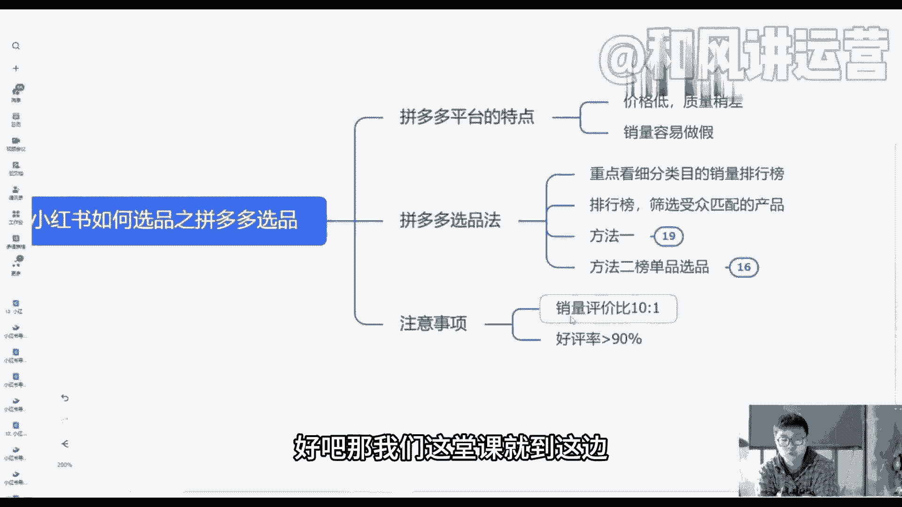