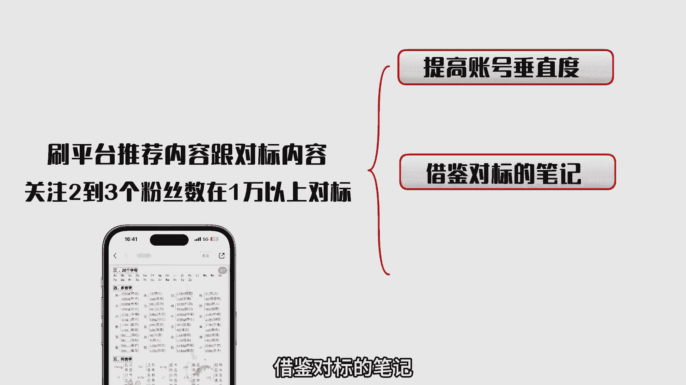
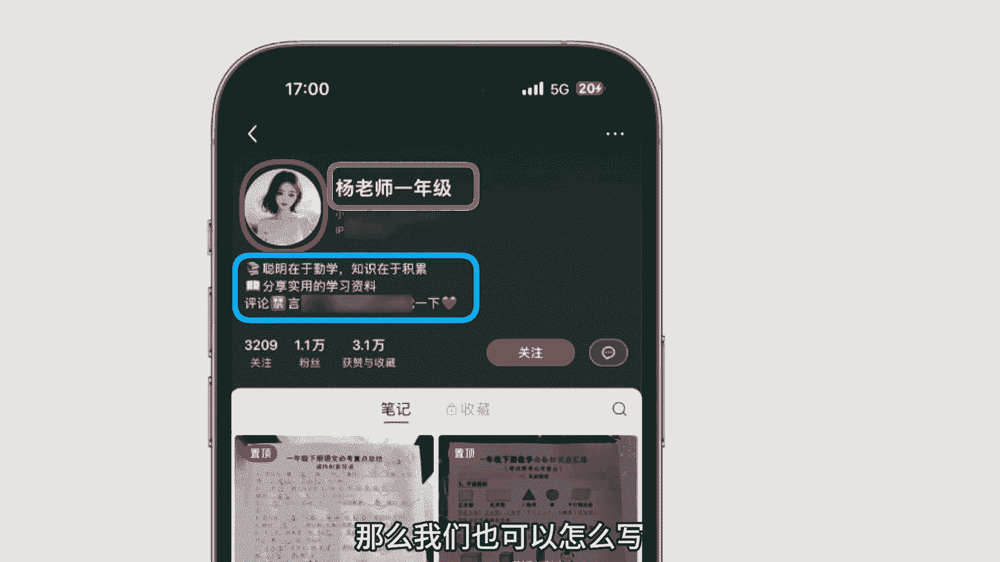
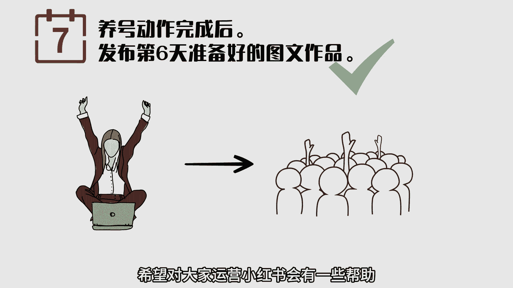

# 小红书暴利起号流程，7天螺旋起号法详细操作步骤来了。 - P1 - 可行思维 - BV1h6421f7c2

做小红书如何快速起号，快速获取精准流量，给大家分享，我在小红书平台做虚拟资料的起号方法，我管这个方法叫做七天螺旋起号法，可以看看我的小红书账号后台每天都是九九加，不只是虚拟项目啊。

其他的行业同样适用于这套方法，来起号直接上干货，所谓的七天螺旋起号法，就是在七天时间完成账号的注册，养号到账号的搭建，再配合爆款模板把笔记打爆，怎么做呢，第一天先注册账号。

注册账号的时候尽量选择一机一卡一号，这个是基本操作，资料什么的都不要改动，然后再利用碎片化的时间去刷平台的推荐内容，碰到自己同领域的作品，可以适当的点点赞评论一下，每天关注两到三个。

粉丝数在1万以上的同领域的对标账号，如果你刷不出对标，可以先用关键词去搜一下同领域的内容，刷对标账号的目的有三个，提高账号的垂直度，借鉴对标的笔记。

思考优质账号的运营技巧，第二天完善个人信息，每个行业不一样，我以小学虚拟资料举例，头像设置成知性的女性，昵称呢就选择某某资料或者某某老师，某某书屋简介处，同样是怎么写的，那么我们也可以这么写。

然后呢继续去刷对标账号以及平台的推荐内容，按照五比一的比例来刷，每天刷笔记的时间要大于30分钟，第三天和前两天有一些区别了，第三天开始啊，我们只刷同领域的内容，依旧每天去刷30分钟。

挑选两到三个同领域粉丝量在1万以上的账号，关注互动，浏览笔记的时候，速度不要太快，建议把笔记的图片内容都看完，做一下，停留第四天继续做第三天的摇号动作，另外在第四天我们要去关注官方运营的账号。

向我服管家小红书生产笔记创作者小助手等等，并且适当的去跟官方的笔记互动一下，同时准备好第五天，咱们账号需要发布的笔记内容，至于怎么去制作笔记啊，每个行业都不一样嘛，想学虚拟资料的笔记。

可以去看一下我上期的视频，第五天同样持续第四天的摇号动作，然后发布第四天准备好的小红书笔记，但是不要做任何的引流动作，重分享止养号来提高账号权重，发布笔记后，不要频繁去看小眼睛有多少。

也不用过度的去解读数据，同时制作好第六天需要发布的笔记内容，OK到了第六天了，重复第五天的氧化动作，发布，第五天准备好的图文笔记，同时制作好第七天需要发布的作品，最后到了第七天，养号动作完成之后。

发布第六天准备好的图文作品，那么整个账号的权重基本上就上来了，接下来就可以开始造势引流精准客户了，以上呢就是我们常用的小红书七天螺旋起号法，包括我们做虚拟资料跟小红书电商，都是用的这个小方法。

希望对大家运营小红书会有一些帮助。

老规矩，我也给大伙整理了一份，七天螺旋起号法的文字版教程，你可以在我的可行思维回复小红书来学习，那今天的分享就结束了。

