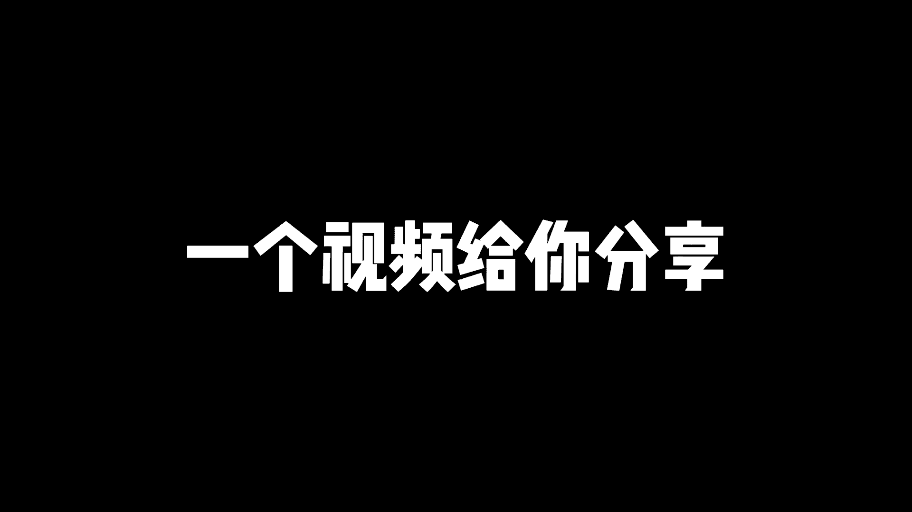
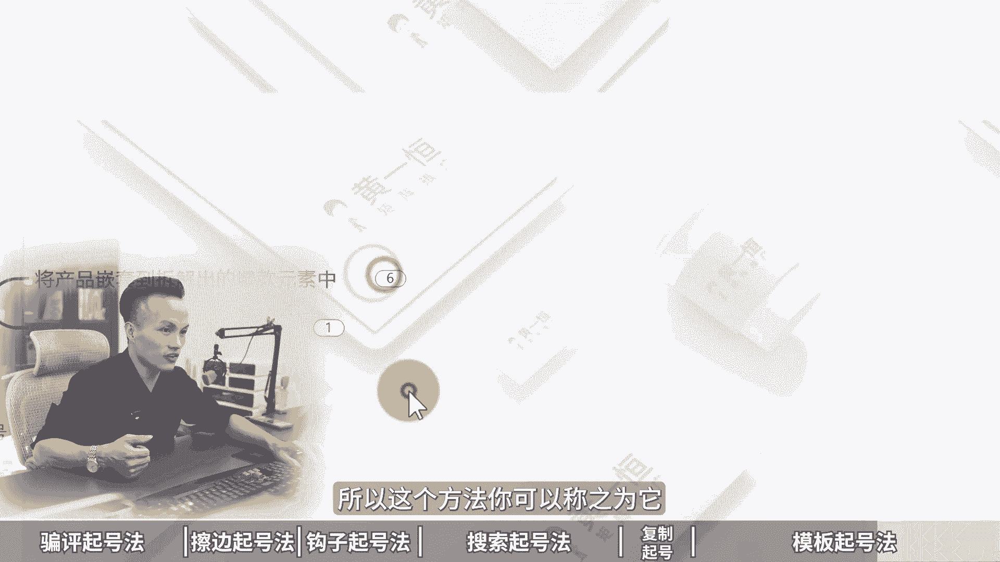

# 小红书最不要脸的6个起号方法，小红书起号运营思路！ 分享小红书运营技巧，小红书起号教程，小红书起号攻略，小红书起号运营教程，小红书起号逻辑！小红书起号攻略 - P1 - 黄一恒矩阵引流技术 - BV1kmtWeKE6H

最不要脸的小红书敲号方法，24小时就能敲号成功，甚至更加的狂暴，我说一下，但绝对不给力，第一个骗瓶取号法，在笔记上面下手指，让用户咔咔咔的评论，通过评论来拉高账号推流，第二个擦边起跑法。

只要你在你的笔记前面加上擦边标题，你会发现你的流量比之前高了10~20倍，关键是无论哪个行业都有模板，可以直接套用nice啊，24小时起哄还嫌不够快，还有钩子起号法，搜索起号法，复制起号法。

模板起号法通通给你分享一个视频，给你分享小红书最不要脸的六个起号方法。

小红书起号运营思路落地教程有点长，记得先收藏，一起来看，我给你分享片频，起号法，擦边桥法，钩直桥法，还有收缩桥法，复制桥法以及模板桥法，现在看第一个片平巧法，因为小红书70%的用户啊都是理性理性。

有什么特点，他呢比较八卦，所以在身边你可以看一下很多的这些女同事，他们非常关注什么明星的八卦事件，在村里面一些女性长辈组在一起，就成了咱们村的情报局，探讨来非常激烈，伟人呢也比较热情。

非常喜欢什么互帮互助，同时呢评论得分，他又说我们整个账号里面得分比较高的，因为在小红书的CES评分里面，评论达到了四分，点赞一分，收藏两分，评论四分，转发四分，关注八分，相当于一个人评论顶得上什么。

四个人进行点赞，两个人进行收藏，所以通过拉高评论得分，是获取流量非常快速的一个方法，那怎么办，接下来我们来看一下引导用户进行评论，这里面有个非常简单的方法叫极限二选一，就是用户看到之后啊，他不需要思考。

里面选择你和我里面进行选择，具体大家如果不太理解，我们来说说看一下，咱们打开这个投屏软件，点击右上角输入框，在这里面输入关键词极限二选一，好输入之后你可以看一下，这里面就非常多了啊。

这是听说感情越好的两个人口味道夜相近，极限二选一，是选这个关东煮还是选钵钵鸡好，再往下方看洗衣机极限二选一，然后嘞苏泊尔的奶茶极限二选一好，再往下面看，这里面很多很多啊，不管哪个赛道都可以玩。

比如这里面有一个做家装赛道的极限二选一，厕所地板砖选哪一个嘞，点进来啊，上面一个还是下面一个好，这时候你可以看一下啊，基本上下方就有很多的评论，而且这篇笔记的书记比例啊。

他的评论量都达到了什么1700多，这1700多相当于顶得上多少，顶得上接近7000多个人进行点赞的，各位同学好，再往下我来看看，这里面有个啊，非常非常还有做首饰的姐妹们手镯二选一。

然后呢这里面还有这个啊，这个咖啡二选一，然后呢护肤品的一些二选一，薯条二选一，好体育用品二选一这个模板记住啊，适合于所有赛道哎，都可以直接套，你看7200选一，四选这个腾是Z9还是选帕拉梅拉好。

这个模板呢非常容易，另外还有个玩法叫做简答题，什么叫简答题啊，就是让用户回答问题，说出你最喜欢的城市，说出你最喜欢周杰伦的哪一首歌，比如说说出你最喜欢哪一辆车，比如现在我们做一个汽车的账号。

我们就可以打上，说出你最喜欢的车，你看啊，那么这时候就会有很多人进行一个互动，你看一下，大胆说出你最喜欢的车，原来1~20岁最喜欢的车，你看这种就套模板了，然后说出你最喜欢的，你看这边就非常非常多。

什么明星呀，什么运动员呀，还有什么星座之类的，核心点就在于什么呢，就在于降低用户的行动成本，不需要用户思考，用户只需要回答你的问题，而且回答的答案你都给他准备好了，选择就行了。

好来看第二个更加的猛叫做擦边巧号法啊，那么擦边巧号法就是在标题上面，来加上擦边词汇，引导用户产生无限的遐想，你看到之后哎呀这个不点击也难受啊，流量就能够提高10~20倍。

那么增加用户的一个点击账号的流量，提升CES评分呢也拉高了，也能够吸引精准的人群，因为我们是在标题上面加擦边词，不是纯擦边啊，这个点需要注意，无论哪个行业都有模板呢，可以直接套用啊，比如说什么擦边词呢。

我们来看一下啊，像什么出轨，想看翻车，无意间看到量了，这些词都是什么，都是能够让人产生无限遐想的，你可以直接套用啊，比如说我们来看几个行业，女装行业，那么发女装的穿搭图啊，没什么流量，那怎么办。

我们可以这样发，那么想看能把男朋友迷音的吊带，你看到啊，那这里面把男朋友迷晕的吊带，就说明非常的性感好，这篇笔记呢大家看一下数据啊，非常高，达到了2万点赞，1。2万的收藏，4000多个人展开评论。

而且他的封面有个特点，就是直接用手写的，让用户看起来非常非常的真实，所以大家可以用什么备忘录啊，也可以用什么纸张手写都是可以的，好，再来看一下法律行业，那法律咨询，这里面写了一个法官认可的出轨证据好。

这里面你看这个是法官认可的，立马发上来之后数据也比较不错吧，也获得了几百条数据反馈，好，再来看一下这个民宿行业普通人怎么发嘞，普通人这样发啊，什么民宿推荐，直接就像打广告一样的用户非常反感，那怎么发嘞。

我们加入擦边词和男朋友怎么怎么样啊，长沙制片舒服死了，你可以看到啊，那么这就是在做什么，在做民宿的，只不过来换了种方式，所以流量立马就提高了几十倍，好接下来看一下第三个方法，叫做钩子桥法。

钩子起号法就是说在我们的笔记里面留下钩子，比如说挑战型钩子啊，珠宝行业怎么玩，我们可以这样做，挑战一周手势不重样，那么挑战500块钱理由，挑战100块钱理由挑战100块钱玩遍北京。

挑战200块钱玩三天啊，用户就会觉得啊200块钱我有啊，能玩三天，那我想试一下好，这种就是什么激起了用户的一个什么点击页好，再比如说素材型钩子啊，那么基于人性急功近利的特点，他就非常想快速拿到结果啊。

描述到位，新用户来去看完笔记啊，就比如说3分钟搞定约会妆容，十秒钟教会你学各种各国语言，然后嘞三天时间选搞定什么加装的一些效果，反正你就可以加上时间，把这个时间正常可能要十天，你变成一天，正常要一年。

你变成一个月啊，这种就是什么啊，比如说啊挑战一一个小时赚一桶金，这个就会让人觉得不可思议好，接下来再看一下反差型的钩子，那么反常规反认知的内容引发用户的思考，促使用户后悔没有早点知道。

要是我早点知道就好了，比如咱们来看一下实例，买得起200万的房子，千买不起万的包，还就会让用户觉得这个人这么有钱，200万都花了1万钱，花不起，不想接触人类的工作，就是不想跟人打交道，不懂就问。

想想都可怕，好你看一下，这些都是带反差型的好，还可以组合打法，我们上面多种方式组合在一起，比如说挑战带爷爷一个月学会阴影好，你看一下，这就非常奇怪了啊，挑战要来一个月时间，而且是爷爷，就算牛哇。

爷爷年纪这么大，还能够一个月学会英语，挑战100块钱搞定一周穿搭不重样好，这就是让用户觉得，100块钱相当于一周穿搭不重样，你要买什么，要买七套衣服，而且是一周就会让用户觉得怎么可能做得到啊。

他就想来看一下，来看第四个搜索巧法，小红书搜索流量占比65%以上，有80%的人第一时间打开小红书，都会通过右上角的搜索框来搜索答案，那如果我们想获得这个搜索流量，就需要做搜索排名。

那影响搜索排名的因素有哪些呢，咱们来看一下，首先就是内容标签的一个相关度，用户搜索完之后，他会把相关性更强的数据反馈，比较好的来排到前面，这里面有一个发布笔记到曝光流程，给大家梳理一下。

首先我们发布成功笔记系统来进行审核，看看有没敏感词，接下来社区啊就对它进行收录，收录完之后呢，它会根据你的内容来打标签，比如说根据你的封面标题，话题画面和声音来打标签，打完之后。

这时候系统开始进行推流测试，如果打的标签比较精准，那么我们的流量就会进入到下一个层级，如果打的标签不精准，数据反馈很差，流量呢也就什么终止了，所以咱们在做的时候，都需要在这些地方里面卡上我们的关键词。

其中啊有的伙伴说，为什么我打开索框，搜索完关键词之后，我看到一些笔记排在前面，他并没有在这几个里面都放上关键词，为什么也会有排名，是因为他们主要在标题里面放上了之后呢，也会的排名。

因为标题它是影响排名非常重要的一个因素，在我们发布笔记的时候，系统也会提示填写标题能够获得更多点赞，为什么填写完标题之后，用户能搜索到你，系统能够识别到你推荐给记更精准的人群，毕竟一个东西好与不好。

它是企业推给谁看，那么其他的还有些因素啊，像比如说这个什么账号的权重啊，发布时间多多少少也会有点影响好，接下来咱们来看一下到底该如何操作呢，在落地的时候，我们需要去布局这个搜索关键词，首先把那种竞争小。

流量大，更精准的关键词，来布局到我们的这个笔记里面来，所以这可以选择一些更加具体的什么，综合关键词，就比如说我们做这个连衣裙的，连衣裙非常竞争大，那怎么办，我们可以做微胖连衣裙竞争变小。

或者说高个子连衣裙，就像净水器也是一样，净水器这个词啊竞争非常激烈，那怎么办，我们可以选择一些稍微细分一点的，比如说净水器指引好，直饮净水机，那这一个关键词竞争就变小，想排在前面更加容易好，第二个。

那么反馈目标用户可能会搜索的关键词，什么意思，我们可以站在用户的角度去思考，预测用户搜到什么关键词，有的关键词系统给我们推荐了，但是呢还有很多关键词是系统没有推荐的，比如说净水器，我想出去玩的时候。

我想带一个户外的净水器，而且是那种比较便携的，你看啊这个词搜索出来之后，你会发现他的笔记啊，其实数量是什么，整体是非常小的，咱们刚才搜这个户外净水器便携的时候，它提示只有505篇笔记，那你要排在前面。

这不等于什么特别简单啦，特别容易吗，你只有500多个竞争对手，各位同学好，接下来看一下增加笔记里面的关键词密度，那咱们在操作的时候呢，可以在封面标题，正文话题评论区里面都可以出现我们做的词。

比如说我们做的词叫做户外净水器，便携好，把这个词给它预埋到里面，更加能够获得这个牌面，另外一个伙伴在操作的时候会堆叠关键词，结果放一大堆关键词，就是避免不相关的关键堆叠，被系统判定为垃圾广告。

那么避免这个流量跑偏，防止被降权，这个点来我们在操作的时候是需要注意的好，接下来看一下第五个叫做复制巧法，什么叫复制巧法，记住爆款笔记啊，它都是有时效性的，只发布一次，可能会导致同人抄写。

比如你发布了一篇笔记爆了，结果第二天第三天有五六个同行都在草里，他那避免为同行做嫁衣，那么同行发布之后，有可能比我们自己研，作者还能够得到更大的流量，怎么办，我们可以把这个爆款与其等着别人抄。

不如我们自己抄，自己把这个笔记稍微简单修改一下，多发几遍去吸收这个流量，多发几件可以获得更大的推流，把流量全部都给他薅过来，而且爆款笔记呢有个特性啊，记住爆款都是重复的。

已经爆过的笔记呢仍有可能会再次爆，所以这也是为什么你打开一些对标账号，它里面有几篇笔记重复的，而且数据反馈都非常不错，就是因为他用了这个复制条法，自己报了一篇，与其别人复制，不如自己复制自己的。

所以重复利用爆款素材，那么播过的素材可以再拍一次，分发到多个账号，然后来重复发布几十遍，甚至上百遍都能够带流量，我原来看到一个账号，他专门发这个明星的热点，发这个谢霆锋和张柏芝的一个账号里面。

发了几百个，全部都这一个热点，条条爆款，真的太厉害了，好来看最后一个叫做模板起号法，什么叫做模板起号法，那么当我们去搜索行业的关键词，搜索完成之后，在主页你会发现它会有很多的。

比如说我们搜索这个叫做家装行业，那么家装行业呢它是可以分为这个家装，装修和软装，比如说咱们来搜索一下，那么搜索完之后啊，这里面它会有很多很多的一些笔记内容，那么这些笔记中呢，我们接下来需要对他笔记。

找到这种最近一个月甚至15天里面比较爆的，比如这一个发半周或者四个五，5555个点赞好，这个内容呢确实比较不错啊，再往下面来看，还有很多很多这个赛道里面比较热门的笔记。

然后接下来我们需要去拆解这里面的爆款笔记，那么找到爆款笔记进行拆解，拆解的越详细越好，记住爆款和爆款之间呢它都是有相似的点，比如说有相似的封面，相似的排版，相似的标题，相似的计算，相似的什么内容结构。

哎，就比如说咱们来这里面看看，能不能快速的找到一些还比较相似的，这种爆款好，咱们可以来划一下好，这里面你会发现啊，有很多就是直接展示自己家里面装修效果啊，这种就是最简单的一个模板。

那么其他的还有一些就是啊，比如说我们往下面来看，你看入住一年啊，这种也是直接拍家里面的一个装修效果图，那么还有人家是直接拍这种啊，前后对比类的啊，这些其实综合下来都是比较不错的啊。

那么还有这种你看他是做了拆分的啊，做了细节的，那么前面我们刷到了一个，它是有一个什么有一个这种流程图的啊，就比如装修的时候啊，那么前流程好，这种你去看有很多这种前流程都是比较火的，还有这种排版类的。

就是一大堆跟你叠加在一起，一次性就能够看到什么十几种方格好，这些都是爆款好，接下来呢我们来看一下产品全套爆款元素，什么意思，我们可以将产品全套到这个爆款元素里面来啊，就比如说我们找到了一个爆款。

那么这个爆款叫做毛坯房装修的全流程，那我们如果做净水器的，我能不能把它换成净水器安装的全流程，然后呢，这里面他做了一个叫做，那么12大热门装修风格，那我换到我的净水器赛道里面。

我就给大家分享12种不同类型的净水器啊，比如说什么直饮净水机，然后呢还有这个什么过滤净水机，户外净水器等等，给他租过来也是可以的，所以爆款方面是客厅的，我们可以换成卧室，我们来看一下啊。

比如说这一个为什么不高级啊，廉价感现代简约方避坑六要素好，那么这个呢他是讲的是客厅的，接下来换到什么，换到这个卧室里面，想提高级感，千万不能碰的东西，你看啊，这个是讲高级感，这个呢也是讲高级感。

也是前后对比，改造前改造后的好，再来看一下爆款式软装，我们给它换成这个木地板，比如说这是从来没有这么直观地感受，软装的重要性好我们换过来之后，那么这么直观的感受到木地板，反正每一个都可以感受。

比如我们投到净水机里面，从来没有这么直观的感受到，直饮净水机的这个什么重要性，是不是可以直接套过两位同学，所以这个方法你可以称之为它其实就是什么。

通过排列组合替换主体，然后嘞换一个赛道，换一个小行业，换一个细分生成大量的爆款相册笔记，接下来看第四部发布优化，咱们需要制作的笔记啊，需要保持每天一到两篇的更新，十天之后呢，我们需要分析一下数据。

找到这种高点击的，高互动的以及评论量比较大的笔记，进行第二轮的什么优化，裂变，什么意思，相当于我们把这个笔记再套一个模板，然后嘞给它放到里面去，相当于就是选题是爆款，形式是爆款，文案也是爆款。

那么数量和质量呢整体都有了保证，那么通过这种方式啊，认真执行一到两轮大概率来都可以成功好了，各位看，这就是多种起号方法，除了通过起号来快速拉高我们账号流量，其实还有一个比较暴力的打法，就是做几针。

一个人玩十个小红书账号，每天或黑100家，一个账号，每天十个顾客，十个账号加在一起就100个顾客，那这种到底该怎么去玩嘞，这里面我给大家准备了几份资料，首先第一份呀是小红书的一个入门影干货框架。

让大家能够快速的上手，了解小红书的平台收录机制，运营工具有哪些，企业号的运营以及投放，包括店铺管理，还有这个小红书的爆款选题表格，咱们在做笔记的时候啊，千万不要盲人摸象，一定要学会什么开卷考试。

学会看数据，挑选一些收藏比，评分比，分享比比较高的优先来进行操作，更加容易爆，那这个表格呢大家可以找我，我把它分享给大家，还有我们小红书的系统引流课，有接近三个小时，系统的给大家拆解小红书的前流程。

钩子怎么设计，怎么导流，还有常见问题以及小红书的边缘项目，这些统统都打包好了，大家找我，我把它分享给大家好，各位同学，我是黄一恒，只做落地推广方法，刚才给大家分享了小红书的起号方法。

如果我们想更快的搞到流量，获取到顾客，我们得学会打造多流量管道，这里面我给大家准备了18个平台的详细打法，教大家如何布局多流量管道，小红书嘞就是其中一个，这些都是我原创的，可以通过主页来领取进行学习。

如果觉得今天视频有效不错的，请大家一键三连，感谢大家支持。