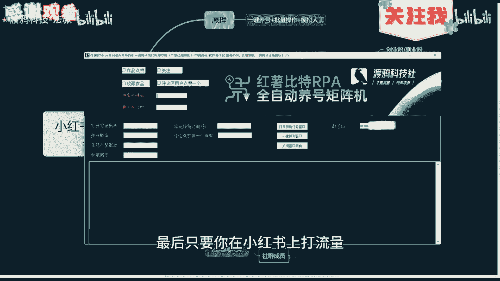
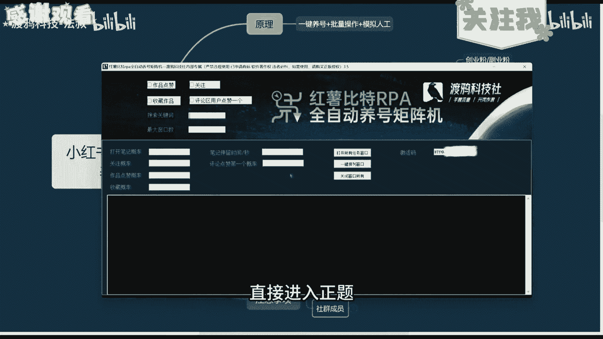
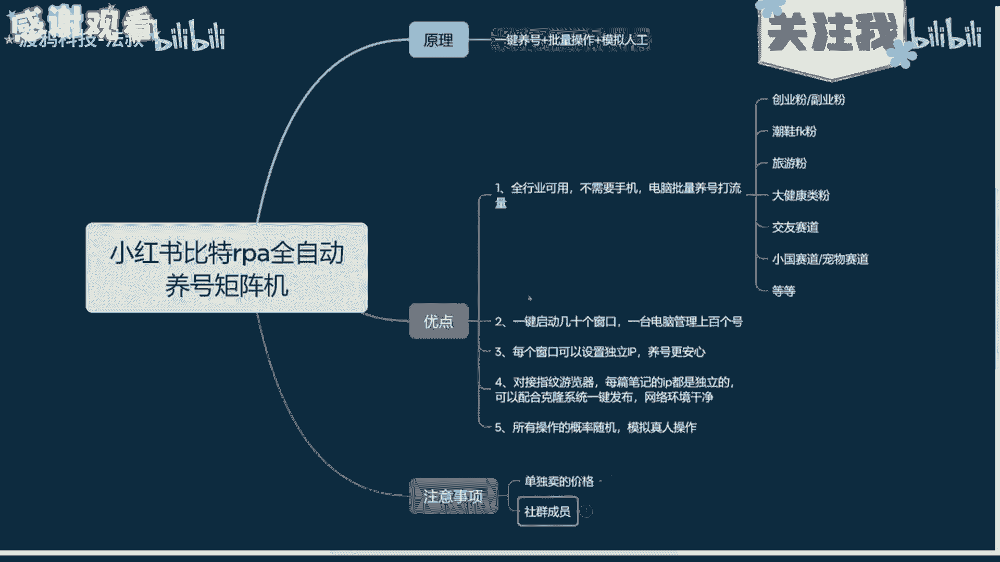
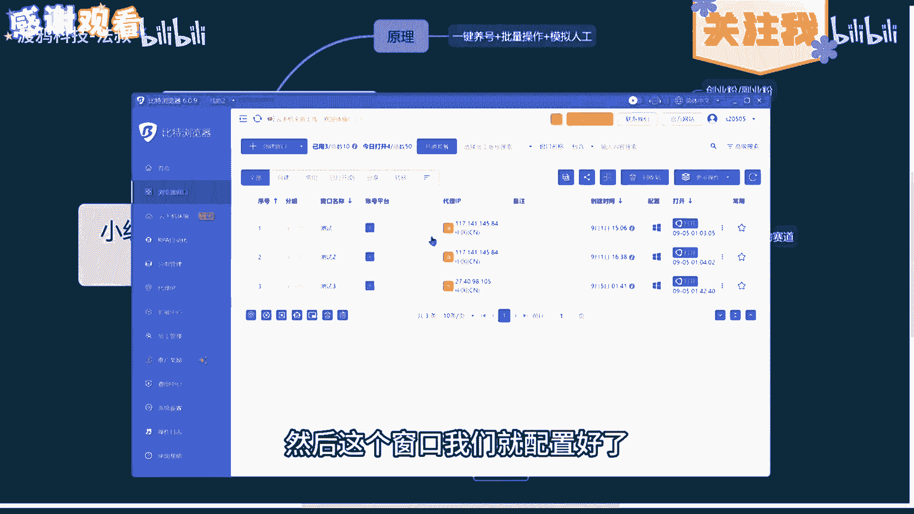
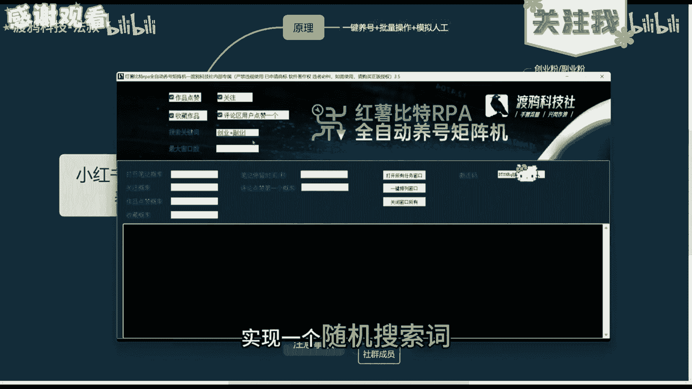
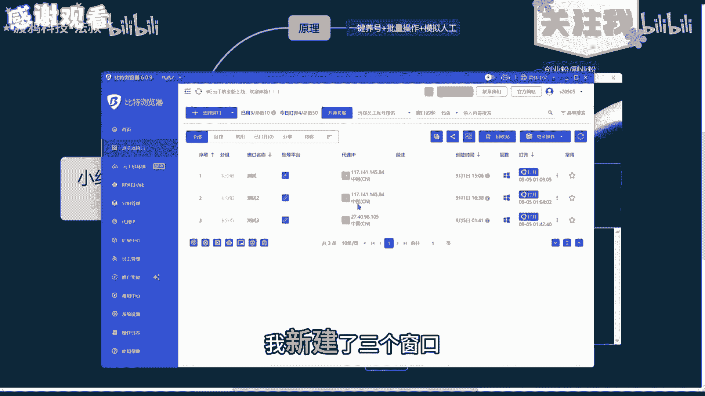
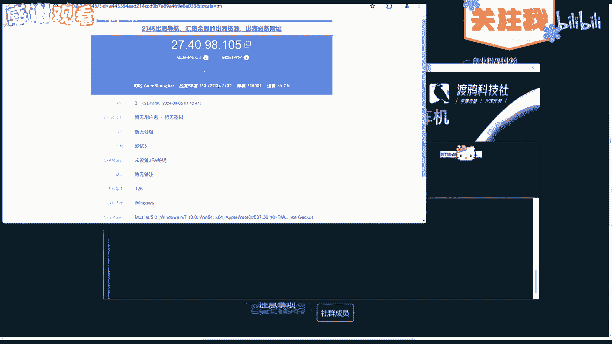
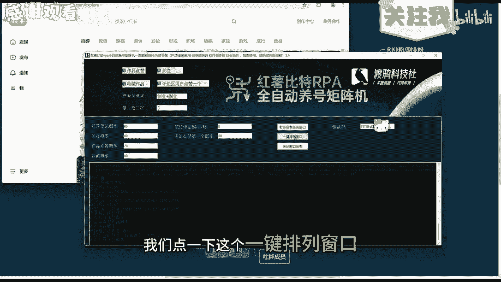
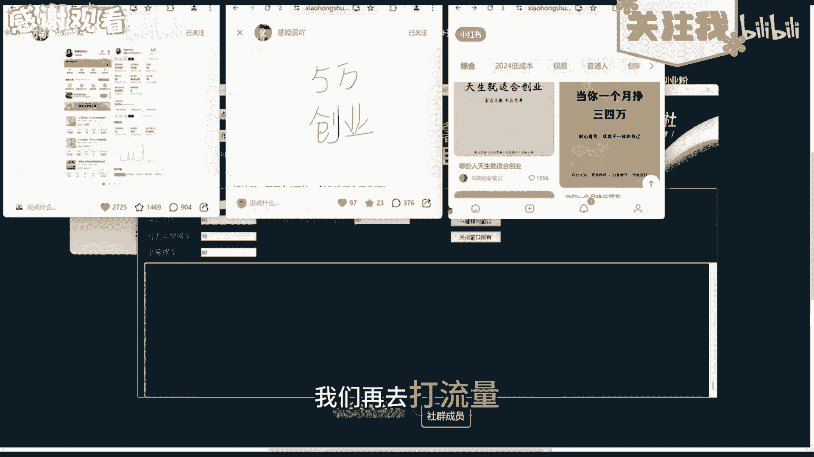
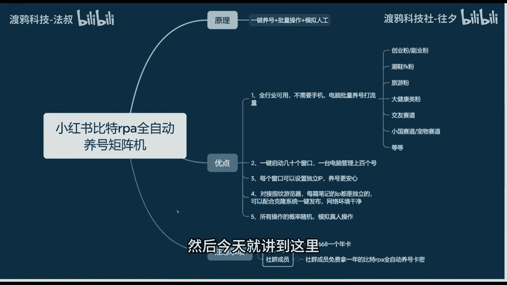

# 小红书最新比特养号系统，矩阵必备一台电脑操作一百个账号，高效引流！ - P1 - 渡鸦科技-法叔 - BV1ho4nezER8

牛逼牛逼，今天给大家分享一款小红书，比特RPA全自动养号矩阵，它可以一个电脑控制几十个这个窗口，去批量的养这红书账号，我们都知道，想打小，让每个窗口的IP都是独立的，然后这个模拟人工的操作随机的去养号。

那么接下来我会详去怎么配置比特，所有细节都会教到，感兴趣的一定要看到，最后，只要你在小红书上打流量。

这个养号就是必不可少的，我们废话不多说，直接进入正题。

在开始之前先给大家讲一下这个原理和优点，原理就是我们一键的养号，然后配合比特的指纹浏览器，实现每个窗口独立的配置，什么意思呢，就是说如果你去用普通的百度或者谷歌浏览，他的指纹也全是一样的。

但是我们用到的比特指纹浏览器，它的每个窗口特征都是不一样的，这样就可以避免平台的检测，让你的号养出更高的权重，然后所有的窗口搜索词全部随机，这样他每个号的标签都不一样，完全模拟人工操作。

然后简单介绍一下它的优点，就是全行业可用，不需要手机电脑批量养号打流量，比如创业粉，副业粉，旅游粉，大健康粉等等，只要你在小红书上打流量，这个工具都是必不可少的，第二一键启动几十个窗口。

一台电脑管理上百个账号都是没问题的，然后每个窗口设置独立IP，一台电脑每个窗口的IP都是独立的，Ip，都是不同地区，直接规避所有检测，养号更安心，然后对接指纹浏览器，可以配合克隆系统一键发布。

网络环境干净，我们所有的概率都是随机模拟真人操作，那么原理和优点讲完了，下面我们直接上实操。

首先打开我们的比特浏览器，然后点击创建窗口，这里我们可以输入窗口名称，然后我们往下滑，配置我们的IP代理，这里选择这个，然后输入我们的IP纯净节点，我们直接把它复制过来，直接粘贴到这里来。

它就会自动识别，我们可以检测一下它是正常的，那么这个IP纯净节点怎么获取呢，你们有需要的可以直接找我拿，然后我们可以点一下这个一键，随机生成指纹配置，这样每一次这些指纹配置，设备信息都是不一样的。

然后我们点击确定，可以看到这个窗口已经新建好了，然后我们点击打开一下，可以看到这个IP，然后我们看一下这边的IP，上面这两个我是没有配置的，它IP是一样的，这个就是我们刚才配置的。

它的IP和上面两个是不一样的，然后窗口创建好之后，我们点击打开，然后我们把小红书的首页链接复制一下，回到刚才打开的窗口，把它粘贴进来，然后我们登录一下，登录好之后就可以直接删掉了。

然后这个窗口我们就配置好了。

然后打开我们这个RPA全自动养号矩阵机，这些都是养号的一个动作，比如说作品点赞，关注收藏作品评论区用户点赞一个，作为一个演示，我全部选上吧，然后这个搜索关键词，比如说创业加厚叶。

这个账号就是作为一个随机分割符，比如我开了多个窗口，它就会有些窗口是搜索创业，有些窗口是搜索副业，实现一个随机搜索值。

然后这个最大窗口数，比如我这边有三个号，我新建了三个窗口。

然后我这里就输入三，然后这些就是操作的一个概率，打开笔记概率，关注的概率，作品点赞的概率，还有收藏的概率，一般5~15就好了，因为我们长时间以后你调太高也不好，还有这个笔记停留时间设置个十几秒。

20秒都可以，我这边做个演示，方便你们查看就调高一点，然后我们设置好之后，直接点击打开所有用户窗口。

我们点一下这个一键排列窗口。

它就会对这个窗口进行一个排列，我把窗口拉大一点，给你们看一下，一会我给你们做一个演示，我设置的概率比较高，基本都点赞收藏了，你们正常设置5~15就可以了，不用太高，比如说如果你想去跑一个曝光。

你就把关注概率调高一点就可以了，可以看到非常的猛，我们正常的去打流量，挂个两到三天，我们账号全中，我们再去打流量。

这个效率是非常猛的，然后最后说一下这个注意事项，我们单独卖的话是6681个年卡，然后社群成员免费使用一年，你们有需要的或者想了解社群的，可以一键三连支持一下，然后主页地球链接我找我领取。

然后今天就讲到这里。

