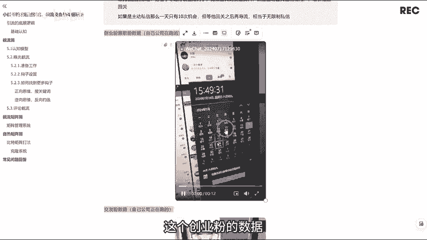
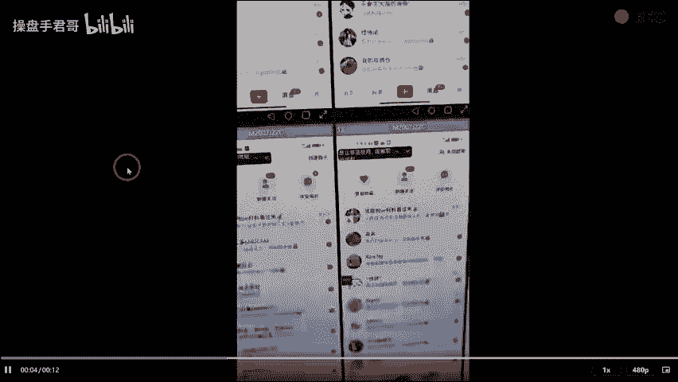
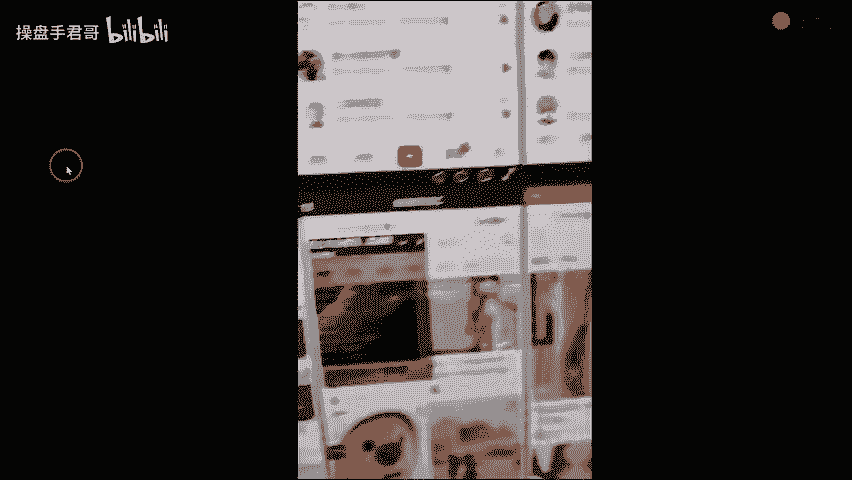
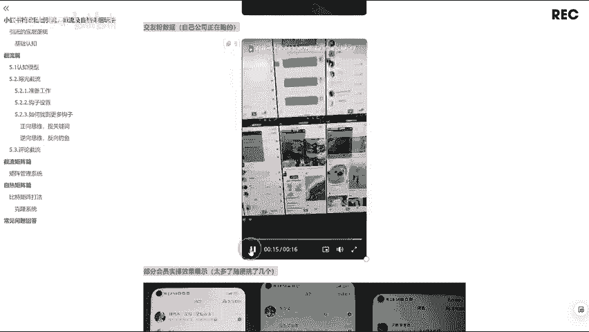
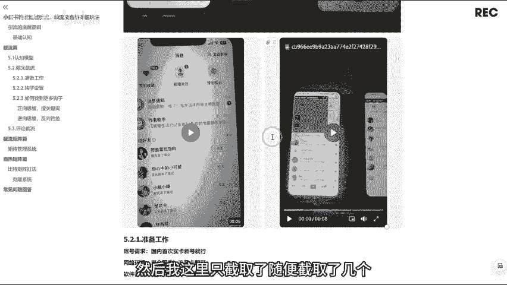
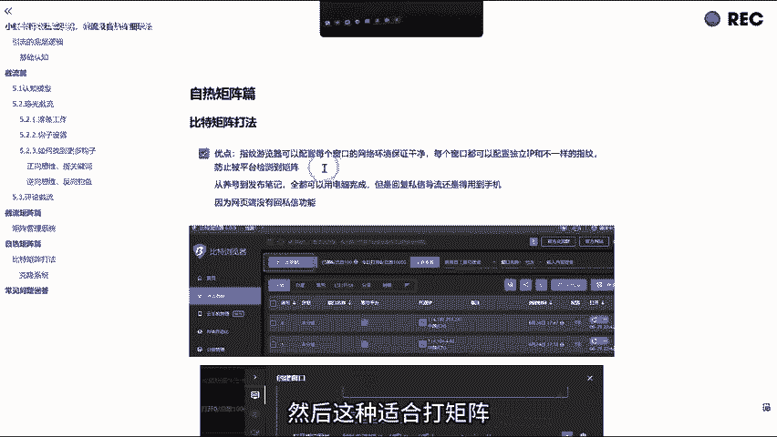

# 小红书最新矩阵自热与截流玩法，小红书运营引流必备 - P1 - 操盘手君哥 - BV1UqxCeoEs5

大家好，我是操板手军哥。6年的私域矩阵引流经验。那我们团队呢已经带了非常多的兄弟去跑通自己前端的打粉SOP和流量闭环。那各行业引流案例呢，大家可以去看一下军哥的朋友圈，了解一下公众号下子君笔记。

那今天啊给大家准备了一份军哥整理的价值上千的小红薯精准私域引流打粉手册，那里面全部都是实战的案例，那思域引流打粉呢，他其实适用于大部分赛道啊，你像我们平时接触最多的这个创业啊，兼职FK2师对吧？

考研考工，还有社群里面很多兄弟是做这个国学的法律旅游都可以的。还有一些兄弟是做实体的，比如说卖家具啊，卖那个数码产品啊，还有卖手表呢，其实都可以的。都适用于这套玩法。

那这是我们团队啊自己打出来的一些数据，几十台手机啊，用我们团队自己开发的这个呃工具啊去打这个关注曝光，让他自己跑。然后这个效果啊还是非常炸裂的。啊，我先给大家说一下这个引流的底层逻辑啊。

因为还有很多小伙伴他不知道这个引流的底层逻辑到底是什么。那首先呢既然是引流，对吧？我们就要把我们的目标客户从公寓引流到你的私域，那这个是需要什么呢？那这个一定是需要一个把客户引过来的这个内容。

也就是说你要给别人一个加你微信的理由。那下面我分别说一下，我们打粉的话，主要是这两种玩法，一种是节流，一种是自热，那节流呢就是我们需要去设置一个钩子，然后这个钩子啊是把别人吸引过来的一个非常重要的东西。

也就是说你能给别人提供价值，能在别人到你私域后啊，你提供好处。那这个好处啊就是这个钩子，这个钩子是非常重要的。你比如说你是卖考研资料的对吧？那你把用户吸引到你的私域。那这个钩子啊就是。

你送这个虚拟的考研资料。所以说你做什么行业啊，你都要把自己这个行业的钩子给整理好。还有这个自热。呃，你像自热的话，其实很多小伙伴一听这个自热都有点不明白，其实它这个就是字面的意思啊，就是自己去发布作品。

靠作品的热度去引流。那这个自热啊，你要能展现内容的输出价值。它最关键呢就是这个素材和模板。你通过这个输出的价值啊，去把你这个行业相应的人群去吸引过来。那总的来说呢，就是什么鱼塘钓什么鱼。

什么样的内容啊去吸引什么样的人群，你把这句话理解透了，那你的段位啊就能上一个台阶。好，那接下来我给大家详细说一下这个节流和自热到底是什么样的玩法。那节流呢它顾名思义啊。

就是从别人作品下面截取的流量就叫做节流，那它的优点呢就是它比自热更简单，而且是确定性更强，目标更强，往往跑通一个点啊，你直接复制这个点去打矩阵就可以了。比如说你先拿一个手机对吧？拿一个手机去打关注曝光。

你把所有的流程啊全部跑通了，跑出来一点效果了，你就可以拿十部手机，20部手机去复制这一个手机的玩法就打就行了。而且你不用担心这个爆流问题，你不用考虑这个作品热不热，因为你不管什么行业。

你一定会有很多同行的曝款笔记，我们直接去截流就可以了。那缺点呢就是节流来的人啊，他这个信任度会低一点，比你自热来的人啊会低一点。而且部分需要信任度的这个赛道啊，它也是打不了节流的啊。那这个曝光简。流啊。

这个是我比较推荐新手去玩的打法之一。因为你不用去考虑什么权重问题啊，这个账号它这个账号成本是非常低的，一个号几块钱，你上号了，直接怼就行。然后他适应的行业也很多，你比如说兼职交友创业啊。

这个FK男科啊等等。他适用的行业是非常多的。那曝光截流的原理啊，他就是把你的用户名，比如说你的小红书的名字啊，还有一些简介啊，把这些地方设置成勾子。你比如说把你的名字改成回关，免费送资料。

然后去打关注曝光去关注这些精准用户去吸引他们回关。现在小红书的话，大家都知道你主动私信的话是一天只能私信失条的给陌生人。那等他回关之后再导流啊，就相当于无限制私信，因为你打关注的话，你单号的话。

一天打两三00个关注是没问题的。你只要把这个名字钩子设置好，他只要一回关，你就可以去把它。去拉到群里聊，去引到你的微信。这个是我们自己团队啊在跑的这个创业粉的数据。

今天。十7。你打牌。直到这个群家导流已9。

好，这个是我们团队啊在打的这个椒油粉数据，也给大家看一下。

那么7月7号啊。是。可以讲话。他们都是。

全部就。

啊，这是我们社群的一些兄弟啊去打的数据，当这个数据比较多啊，然后我这里只截取了，随便截取了几个。

啊，那这种玩法到底是怎么玩呢？首先就是这个准备工作啊，就是账号的话，我们只要是国内的这种施卡信号就可以了。然后网络环境，你网络环境的话呃，这种最好是不要连自己的wifi啊，你你连wifi的话，你号多了。

你这个号可能会批量死，然后我们用这个全国电流量卡就可以，或者是你如果有自己就是营业厅办的卡，然后用自己营业厅办的卡也可以啊。那软件的话就用我们自己开发的这个IRP全自动软件，然后交给他。

让它自己去跑就可以了。还有非常重要的一个点，就是这个钩子设置，那你曝光截流的效果好不好，其实很大程度上和这个钩子有关系，那钩子呢它是有四部分组成名字头像简介和作品啊，我们去看一下。

这是我给大家截取的几个呃比较优质的这个呃钩子啊，你看这个账号是怎么设置的。比如说你的名称，对吧？回关带你日入3张。

回关领资料小号回关，我教你回复修复感情啊，这些名字啊，你去关注别人，对吧？别人一看你这个名字就知道你是做什么的。那他感兴趣的话，他一定会点进来你的主页去看你的这个简介或者是作品。

那我们啊只需要在这个笔记里面去铺几个你这个行业的相关作品，他只要感兴趣的，他直接就会回关你，你像这个打了1。7万关注，然后粉丝2000多，这个就是回关的回关过来的粉丝，这个是打了1。2万的关注。

然后粉丝是回关了8000多，啊，这个效果是非常炸裂的，这只是几个勾子的代表。那如何能够找到更多的勾子呢，对吧？他每个行业的钩子肯定是不一样的那我这里给大家两个方法，首先就是以创业粉举例，就是正向思维。

搜关键词，怎么搜呢？我们直接到小红书里面去搜回关带或者是回关这种。谐音字就回关，你可以多试几个字啊，因为它不止有这个回关，还有一些别的回啊，你可以多试几个这个回关，然后去把你的同行把这些同行全部找出来。

然后看一下他们是怎么设置勾子的，他们的用户名，他们的作品是怎么设置的。啊，这个是我们团队这个软件的一个界面，你只要选择这个功能，它可以，它就会自己去打这个关注，自己去关注。然后你不用这个人工干预啊。

你只要把这个时间设置好，操作时间，尽量的把这个操作时间设置长一点。你这样打出来的关注就更安全。啊，还有一种评论截流啊，那评论截流的话，我是不建议新手去玩的。因为现在小红书的话。

它对这个评论管控的是非常严的。特别是你一些信号啊千万不要去打呃，吞屏其实还是小事，不但容易吞屏。其实吞屏还是小事。那很可能啊会直接把你的号给尬掉，就直接封掉。但如果你是呃那种比较老的号，权重比较高的号。

你可以适当的去打这个评论，这个效果也是非常好的。然后这里我也给大家去收集了一些这个节流评论截流的这个话术参考，大家可以去参考一下。啊，那节流玩法，我们就说到这里，还有这个自热矩阵。

那自热呢我们是用这个比特浏览器去打，也叫指纹浏览器，那它可以配置每个窗口的这个网络环境啊，那每个窗口都可以配置独立的这个IP它防止被平台检测到矩阵。那这个玩法其实更简单，我们只需要利用一个工具啊。

就可以去自动去重这些作品，就是我们直接去找同行。爆管作品，然后把他的作品直接扒下来，然后图片去重文案去重，然后发布到我们自己的账号上面。这样基本上2分钟你就可以去制作一篇呃原创的这个笔记。

然后这种适合打矩阵啊，具体的玩法的话，因为时间也一样，我这里就不给大家演示了。

