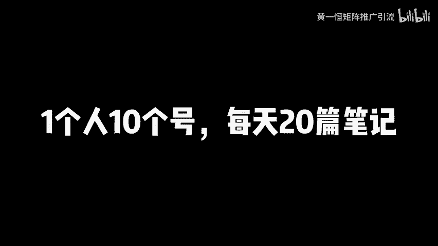
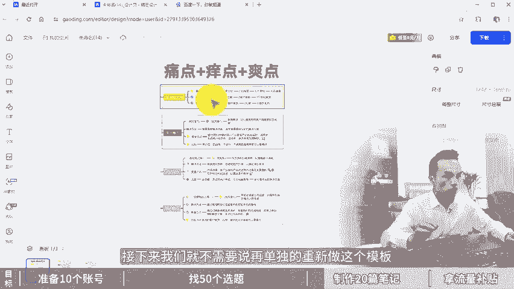

# 小红书矩阵号操作技术，1个人玩10个号，每天发20篇笔记！小红书矩阵工具，小红书矩阵账号怎么做，小红书运营教程，小红书运营推广，小红书推广引流，小红书引流技巧！ - P1 - 黄一恒矩阵推广引流 - BV1H1421q78d

小红书举证又报了几个账号，我们公司刚来实习生，我叫他去做小红书举证推广，他做了一周，总于报了几个账号，我们一起来看一下他怎么做的。找爆款模板批量器从发的呀。😡，🎼nice真是个人才，这个方法确实不错。

可以批量产笔记几分钟一篇还容易爆。一个视频教会你小红书几账号操作技术，一个人玩10个号，每天发20篇笔记，详细教程在这里记得先收藏，一起来看，我会告诉你如何准备10个账号，找50个选题。

每天制作发布20篇笔记，批量拿平台流量补贴。首先来看操作目标，咱们需要准备10个小红书账号，每个号每天发布两篇笔记，用概率来唤取成功率。因为做小红书加粉都是靠一些上热门的笔记，每天发布20篇笔记。

一个月就能发600篇笔记。这些笔记里面大概能有一二十篇上热门，给我们带来几百上千个客户。那如何去准备10个账号来。咱们在准备账号的时候，一定要注意一个点，这是我们需要遵循的前提。一机一号一网络。

我们不使用任何的多开，包括系统自带的，防止设备关联。小红书这个平台比较特殊，它会方设备，一旦放设备，不管你是。

如果多开还是通过千万登录，上面的账号全部都会挂掉。其实我们不连wifi，防止IP关联。有的伙伴会在一个wifi下面搞很多个账号，导致很多账号都被限流，严重者直接关联房号。那如何去获得10个账号。

我们需要有10个手机卡，这一块我们是这样操作的会找10个亲朋好友用他们的实卡来进行注册。什么是时卡，也就是151318开头的号段。这种号段注册出来的账号质量比较高推流的也比较多，一个月之后。

我们再给他换绑上零业租注册卡。中注册卡，它是虚拟号段，一般都是17或者16开头的号段，用该方法来就可以实现无限产账号，那怎么去获得这个林业租注册卡，我们可以通过平台上面去搜索林业租空格注册。

一般5到10块钱就可以买到一张价格来啊都是比较便宜的这种注册卡，他只能够收发短信，不能打电话也不能上网。其次我们还需要准备10台手机，手机这一块。很多型号都可以。目前我们在用什么型号来？有两个比较多的。

首先是红米note8或者pro价格在350到400之间。红米note9或者pro价格在450到500之间配置，我们都是选择6加64G配置或者这个以上太低配置的。当我们在上面登录的更多的软件就会比较卡顿。

手机这一块，其他型号也是可以的。像我们推荐这个型号给大家，我们自己使用的最主要的特点就是啊性价比比较高，价格来实在是非常便宜。哪里去购买呢，我们可以通过啊闲鱼上面啊就可以直接去搜索购买。

没有经验的也可以通过其他平台找一些职业卖家进购买也是可以的。我们每台手机还需要配流量卡。所以这里面我们还是要准备10张流量卡。流量卡这一块呢，像我们单独是配的物联网卡。这种物联网卡，它只能够上网。

不能够打电话，也不能够收到短信。但是价格呢非常便宜。69块钱就能够使用24个月，每个月有。接近40G的流量。对于我们做小红书来说，这个流量是完全足够使用的。大家如果实在找不到这种啊比较便宜的流量卡。

你也可以来找我。我把我的渠道来分享给大家。那当我们有了10张手机卡，10台手机和10张流量卡。接下来我们就可以开始去注册账号。那账号注册完之后，我们一定要先完善一下资料。

把资料选项卡里面的信息能填写的都给他填写一下。前期咱们的型号签名，包括昵称，任何地方都不要留广告，一留广告就容易导致你的账号被重置，严重者来直接就疯掉了。其实我们的账号还是要有点活跃度。如果没有活跃度。

有的伙伴发布完笔记搁了3到5天，浏览量都没有超过100。这种就是典型的账号活跃度太低了，被系统判定为机器号，那怎么操作，我们可以每天比如说浏览30分钟，点赞收藏20个作品。

评论5到10条或者关注5到10个博主都是可以的。就跟我们正常玩小红书是一样的。模拟正常操作就可以了。当我们有了10个账号，接下来我们就要开始去建立选题库找选题。那选题是什么呢？

也就是你要发什么内容能够带流量，什么内容能够上热门。做小红书选题高于一切，选题的权重啊大于80%。很多伙伴发布完笔记说，我的笔记发布完一周，流量只有300至有500。甚至连1000都没有破。

这个什么原因？80%都是选题出现的问题。所以有没有流量，就看我们会不会找一些爆款选题。选题这一块呢，我们要学会看数据，因为会看数据就等于什么开奖考试，随性要发就等于什么盲人摸象。

所以咱们在发布的所有的笔记都是建立在你的同行，你的竞品，它的一个数据基础指标之上，这个啥意思？相当于你的同行它发布的200篇笔记，这200篇笔记里面有20篇数据指标比较好。

我们直接做这20个选题就可以了，不需要自己去测试，因为测试的成本实在是太高了。其实你还得知道在小红书上面火过的内容，火锅的选题呢，它还会在火。因为做小红书有个公式叫70%的相似爆款乘以足够多的层次次数。

这也是为什么我们需要搞几针，因为你搞几针一个选题你可以发多个账号，在多个账号里面肯定有些就能够报，那么给我们带来很多的流量，那经理怎么去找选题，这里给大家分享。三个方法。那么第一个方法呢叫做搜索选题法。

也就是我们可以直接搜索关键词，找近期的一个爆款。我们打开投屏手机给大家示范一下。我们点击右上角的搜索框，在这里面进行一个搜索啊。比如说如果我是做这个净水器的，我在这里面输入关键词净水器。

那么搜索完成之后，这里面就会有很多的笔记。这些笔记呢我们就可以把它整理下来。比如这里面有一个进期发布的啊，这是暂助的广告，咱们要把它过滤掉啊，再往下方滑动笔记这一块，咱们尽可能找一些发布时间。

离当下比较近的一些它老的笔记，比如说好几年前的我们就不用参考了。这里面有一个啊100多的数据，而了三天三页净水器总算搞明白了。好，这个选题不错，我们可以把它整理到选题表格里面。好，再往下方滑动。好。

这里面有个107的三天三页好，这两个选题其实非常相似。可以说就是从一个模板上面。然后裂变出来了。好，再往下方滑动，咱们尽可能去调选一些数据指标比较好啊，这里面还有1个100多啊。

300多这个点赞书据有的伙伴说，哎，这种阴阳板的也要做吗？这看行业，有的行业。发布的笔记基本上都是几千上万的站，你可以找指标多一些。有的行业呢比较细分，比较冷门一点。一两百个站已经代表流量是比较不错的。

我们也可以整理。好，这第一个方法。那么第二个方法呢，我们称之为叫做对标账号法什么意思。比如说当我们搜索到了一个账号。那么这个账号它是做净水器的。这时候我们可以打开它的这个账号主页。

在账号主页里面我们可以判断一下它是做什么类目的哎，发现这个家伙呢，它基本上是啊家电这一块都做。如果我们是做家电的，就可以从这里面挑选一些啊数据指标比较好。比如你会发现刚才我们看的净水器啊，这理篇笔记好。

这里还有一个净水器的，我们也可以把它整理下来。好，再往下方滑动，挑选一下，看看这个账号里面有哪些净水器，并且是数据指标比较好的。那如果这个账号它的定位，你觉得开放也没关系。

我们可以继续往下方啊来进行挑选，尽可能的去挑选一些。那么定位跟我们比较相。是。发布都是净水器，这种账号里面的对标呢更加具有参考力义。比如这里面有个叫做小木净水。好，我们打家看一下。

这应该是专门做净水器的。可以看到他发布的笔记啊大部分都是个位数或者说是10多个展的，也只有这一篇。那么有300多个展，代表这一个就是报关选题，然后再往下方滑动，把他账号里面啊，这里面还有1个100多的。

咱们也给它整理下来。好，再往下方滑动，继续寻找这个来比较费时间。我们在找的时候，大概需要花个好几个小时才可以整理50个选题。那么第三个叫做下拉选题法，这个下拉就是我们搜索关键词的时候。

会出现一些高频需球，这些高频需求，也就是用户的关注度比较大的。当我们在搜索框里面搜索净水器，这里面就会有净水器推荐家用净水器怎么选净水器排名前十大品牌，净水器有必要吗？

你看这些关键词全部都可以把它整理下来。每一个下拉词都代表是一个高频气球。这种高频需球，它是很容易爆的。那当我们通过三个方法获取到了选题过之后，一定要建立一个选题表格。选题表格。

也就是让我们的所有做的笔记。都有机可依，都是建立在数据基础指标之上。这也就是我们前面讲的开奖考试，而不是说盲人摸象。比如像我们在操作的时候，就会先建立一个这样的选题库。在选题库里面。

我们还会通过一组数据。比如说收藏比收藏比的话就是我们的收藏啊除以点赞。还有这个评论比，包括分享比。那么通过这几个数据，我们就可以挑选一些数据指标比较好的。比如这里面有一个148%。

也就意味着100个人点赞会有148个人收藏。这种笔记呢，它就很容易啊报很容易带来流量。另外评论比比较高的，比如这里面有一个10%的评论比，也就是10个人点赞会有一个人评论，这种评论比比较高的人。

也很容易带来流量。好，这些方式大家都可以借鉴。那么这个选题表格，大家如果不知道怎么建立的，那么也可以找我，我把我的选题库模板分享给你，你就可以节省时间了。当我们有了选题之后，至少要找50个。

因为我们发的笔记不是每一天都发，我们是从50个里面挑选一些数据指标比较好的优先进行发布，那怎么去制作呢？而且一天要搞20篇笔记。首先我们需要找近期的爆款选题，我们从选题库里面直接挑选就可以了。

找这种收藏比，评论比分享比整体数据来比较高的。第二个制作好模板框架。什么叫模板框架？我们在做小红书的时候，会配合上这个搞定设计平台。在搞定设计平台里面，像我们做的模板可以说是各种各样的模板都有。

一旦我们找到一个模板之后，就比如说哎这是我们做的一个模板。那么这个模板做好之后呢，接下来我们就不需要说在单独的重新做这个模板。我们只需要在模板里面通过气重的方式。

就可以快速的把一篇笔记裂变成10篇20篇，所以一天搞20篇，它是有方法的。接下来我们就填充这个框架内容就可以了啊，把这个标题把这个笔记内容，把图片素材替换一下。

就可以变成什么新的笔记就可以通过这种方式来进行器重。笔记这一块呢，咱们每一次你发布到一个新的账号里面都需要单独的对它进行器重。那做的平台，大家可以通过搞定设计或者创客贴黄游相机这些都可以。

像目前刚才我给大家演示到的，就是这个搞定设计，也是我们啊可以说做的时候用的非常多的。基本上。

那小红书上面只要是通过制作类的笔记，这个平台90%以上都可以做出来。那如何对比机器虫把一篇笔记历变成20篇呢？非常简单。第一个方法，我们可以通过重写文字的逻辑来进行操作。什么叫重写文字？

这里面咱们需要配合上1个AI平台，给大家演示一下。比如说我们打开这个AI平台，在AI平台里面，我们找到自己的一个模板。那么找到模板之后呢，在模板里面都会有这个文字，这些文字我们是可以对它进行修改的。

比如这里面有我们做好的一个模板。这个模板如果我想快速的把它裂变最简单的方法，就是我们把这里面的一些文字给它替换一下啊，比如说13种爆款钩置开头。好，这个我们可以给它修改一下。

我们打开AI平台找到AI创作。在这里面来，我们选择上。那么智能重写在智能重写里面，我们找到这个宽放重写，也可以选择小红书，在小红书里面也会有一个小红书的重写功能，把内容粘贴进来，然后来点击那个生成。

这个时候它就会帮助我们把这段文字进行一个修改。修改完之后，你可以比如说。我们原来的标题叫13个爆款钩子开头，13个爱不释手的爆款超级爆款钩子。好，我们可以给它修改一下。这里面的标题有点长，13个啊。

超级爆款钩子，我们把这一个给它连接进来。连接进来之后呢进行一个替换啊，把文字适当的啊调小一点。好，我们再调小一些。好，调小之后，现在我们这个笔记啊，再把下面这些内容进行替换。

这样的话我们就得到了一个全新的笔记。这篇笔记已经做了系重，其实我们还可以修改排版和布局，也可以调整顺序，或者套一个封面就可以变成一个新的笔记。从目前我们做笔记的逻辑就是什么？先做模板模板还比较费时间。

有的模板可能要花半个小时一个小时甚至2个小时做出来之后，然后填充内容，通过系重的方式，把一个笔记列变成三份5份10份。这样的话我们做起来账号输入比较快。那如何去做好小红书。

怎样才能够一天搞到100多个精准的客户呢，这里面我还给大家准备了一些扩展资料。因为我们这个视频啊做太长，大家也不喜欢看，所以还有一个小红书的入门框架。这里面会教大家一些小红书的收入机制。

运营工具以及企业号的运营，包括平台的作用啊，都在里面。还有我们小红书刚才演示到这个报款选题表格以及小红书引流的这个系统课啊，那么会从第一章节到第二章节，差不多两三个小。系统的带大家来完成这个小的书。

这些资料大家可以通过主页啊来找我。我把这些资料来分享给大家。好，接下来咱们来看一下，当我们有了20篇笔记，我们怎么去发布，怎么去拿平台流量补贴。首先在发布笔记的时候，一定需要注意。我们如果是新号。

我们一定要针对这个创作中心的笔记灵感，这里面发布对新号来说，只要你点个订阅立马就可以获得200的这个啊流量券，这流量券呢，它是新账号，任何账号都可以获取到它。在什么地方给大家简单示范一下。好。

我们返回到。小红书的账号点击右下角的我在这里面找到我们左上角的三条杠，然后点击这个创作中心。在创作中心里面，我们点击这个叫做。下方的这个创作灵感。然后点击更多热点灵感。好，如果是新账号打开。

这里面就会有个按钮，点击一下就可以获得200流量券。这200流量券后期我们在发布笔记的时候，也需要从这个入口发，从这个入口发，你就可以领到大量的流量券。这些流量券像我们在操作的时候。

基本上都能领到啊三五天。也就是大家在发的时候，从这里面挑选一些跟你行业相关的，然后点击这个发布啊再去发布，而不是通过主页直接发。通过主页直接发的话，它是没有这个流量补贴。这个点呢，大家一定需要主页。

其实我们在操作的时候，还是要在标题里面卡上一个关键词。卡关键词的主要目的就是为了获取到这个搜索流量，让用户在搜索这个关键词的时候，也能够那么找到我们的笔记，让我们的笔记来多获取到一个什么流量渠道。

也就是比如说我们在这里面啊搜索净水器，或者搜索净水器怎么选啊，会显示咱们的笔记出来，就是因为我们布局的关键词，所以标题里面一定要卡一个关键词。这样的话可以获取到搜索流量，让用户。搜索也能够找到你。

第三个我们需要开启这个同城位置，而且添加一些当地流量比较大的这种位置。因为在小红书的逻辑里面，除了推荐，除了搜索，还会有这个同城发现，同城发现呢也是能够带流量的，虽然不是很多，但是也多了一个流量渠道。

关于小红书这一块，大家如果想系统的学习的，我们也更新了一个小红书的打卡训练营。那么教大家怎么去进行一个完成作业就能够把小红书做起来，前程实战演示，每天的打卡视频，包括打卡任务，还有技术老师指导。

以及我们使用到的所有的配套工具啊，都会分享给大家。大家如果感兴趣啊，可以通过咱们的主页来进行一个啊学习。好了，各伙伴，我是黄一涵是做落地推广方法。关于互联网推广，我还整理了18个平台的详细打法。

教大家如何去搞流量。这些呢都是我原创的，具体可以通过主页来获取进行学习。好了，各位同学，如果觉得今天视频比较不错的，请大家一键三连，感谢大家支持。咱们下个视频来再会。

