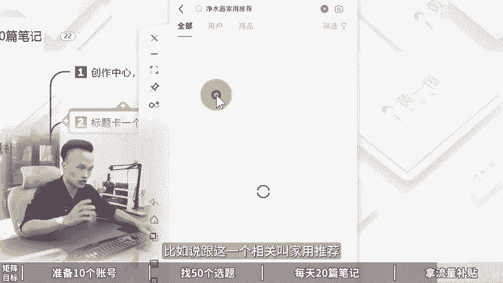

# 小红书矩阵引流怎么做，1个人做10个号！ 分享小红书矩阵账号怎么做，小红书矩阵运营，小红书矩阵账号是如何搭建运营的小红书矩阵搭建，小红书矩阵号！ - P1 - 黄一恒矩阵引流技术 - BV19otKeKEPn

🎼小红书最暴力的一种打法，新手小白也可以复制操作。我花了30天发笔记测试，已经爆了这个账号。这个方法就是小红书暴力一阵打法先准备10个账号，快速找50个选题，每天批量做20篇笔记。

多个账号分发拿平台流量补贴。具得该如何落地操作一个视频给你分享小红书几帧引流怎么做，一个人做10个号落地教程有点长，记得先收藏，一起来看，我会给你分享如何准备10个小红书账号，每天找50个选题。

快速制作20篇笔记，批量发布拉平台流量补贴。现来看几帧目标，为什么做小红书一上来就要搞几帧，就是为了更快的把小红书账号做起来，或者大量的流量和顾客，所以我们在操作的时候需要准备10个小红书账号。

每个号每天发布两篇笔记，上午一篇下午一篇，目的就是为了用概率来唤取成功率。因为咱们做了10个号。每个号呢每天发布两篇笔记，一天就能发接近20篇笔记，一个月。

大概有接近600篇笔记，这些笔记里面有的流量大，有的呢流量小，还有一些能够上小热门。比如说能够带来10万加的流量。这种笔记啊，一篇笔记就可以给我们加粉上百人，客户呢自然也就不缺了。

那到底我们该如何去操作。首先我们需要准备10个小红书账号，在做多账号的时候一定要遵循一个前提，就是咱们的注意事项，一机一号一网络。有的伙伴呀一上来之后，为了节省成本。

一个手机它搞了很多个账号也连接一个wifi，导致后期出现，比如说账号关联，甚至最坏的打算，就是全部账号都被限流或者都违规了。所以咱们在操作的时候呢，一定要遵循这个点不多开，防止设备关联。什么叫设备关联。

小红书是互联网整个平台里面最严格的一个。因为它是唯一一个会封禁设备的平台。比如说像我们的账号就出现了这个情况，方号通知亲爱的小红书经证实您的账号所归属的设备下多个账号。存在严重违规行为，不符合设及规范。

平台将对您的账号采取封禁处理，且该设备下面所有账号都会被限制登录。注意看啊，所有账号，所以说伙伴登录了三个5个账号，一个账号出现问题，设备被封置后，另外几个账号全部也挂了。

而且这些账号有的可能是你做了几个月的，全部都挂了，我们是不是又得重新开始。很多伙伴呢喜欢连wifi，比如说5个10个账号连家里面或者连公司的wifiwifi他也会导致关联流量全部都非养差。

所以咱们在做的时候不连接wifi防止IP关联。那么这理在落地的时候，我们需要准备10个手机卡，那么手机卡这一块呢，为了获得更高的账号质量，获得更高的钱重，或者前期大的推牛。

咱们在做的时候最好是能够找10个亲榜好友。因为在我们身边很多长辈他们基本上都不上小红书，他们的手机号呢，我们直接填过来获几个验证码就可以去注册这个小红书账号，这账号称之为叫做1卡注册的账。

也就是13151819号站的质量会比较高。一个月以后，现在我们注册完之后拿来进行使用发布笔记一个月之后，流量上来了，我们再给他换绑上营业出租的卡，用该方法就可以实现上么无线产账号。

而且产率的账号质量都是特别特别高的。不过呢中间我们是需要配合上营业中注册卡的，这个灵业租租的卡，大家可以在各大平台去搜索。那么5块钱就可以买到一张50块钱可以买到10张一个人的话可以实名几十张卡。

中卡呢，就是它只能够收发短信是不能够上网，也不能够打电话的。然后我们还需要准备10台手机手机这一块，大家家里面如果有多的手机可以直接使用。没有的话，像我们自己用的这么多手机都是哪些型号呢？

其中就是红米这个9或者pro价格呢非常便宜，350到400块钱就可以购买到。这个不是全心的，是二手的一个价格。所以咱们在做的时候啊都用的是这个型号。在购买配置的时候，尽量的选择这个6加64G的配置以上。

配置太低，用一段时间之后来非常卡顿，咱们搞起来的时候啊，做一部卡一步肯定也没有什么心情，做下去了，还可以购买这个红米note10或者pro价格稍微贵50块钱。配置呢也是最低买这个以及这个以上的购买起到。

大家如果有经验的，那么可以到这个某一上面购买，价格呢会非常便宜啊，也就是到这海鲜市场，如果没有经验，担心翻车的，可以到这个某东的拍拍或者某宝上面找卖家来进购买，那么会有售入保障一台的话贵30到50。

当有了手机之后还需要准备流量卡。如果你自己有手机卡，手机自带流量，这一个操作的，就可以省略掉了。如果你前面用的是营业租租的卡，这个卡它是没有上网功能的。我们就需要单独给他配上一个独立网络。

那么流量卡这一块呢，也就是大家俗称的这个物联网卡，为什么用它来第一个，因为它价格特别的便宜啊。你看我们用的69块钱，24个月，这个69不是每个月是总共两年只需要69块钱。每个月有接近40G的一个流量。

而且呢一个人可以实名很多张卡，跟我们那些手机卡它是不冲突的。说大家可以去找一下这种物联网卡纯流量，用这种卡放在你的手机里面进上网就可以了。如果你实在找不到这种套餐，你也可以来找我。

我把我这个渠道分享给大家，做一个资源共享，帮助大家来鉴省时间。接下来我们就可以开始去注册账号了。那么账号在注册的时候啊，我们一定要把资料给它完善一下。有的伙伴资料都不修改，直接去发布。

不像一个真实的账号，那怎么办？我们打开图屏手机，然后来点击右侧的这个我在这里面我们找到这个叫做编辑资料，在编辑资料里面把这里面的信息能填写的，尽量都给他什么填写一下，这样的话更像是一个真实的账号。

其实呢有的伙伴呀一上来就希望在什么签名背景墙里面做个小广告。我告诉你。这种方法完全不可气，因为这信号非常敏感，还没有过这个脱敏期，你稍微加一点小广告，就有可能导致你资料被重置严重者账号违规直接就完蛋了。

好，接下来我们还需要正常活跃下账号。账号做册完之呢，千万不要只分在这个办公桌上面从来都不动啊，一定要每天保持一点活跃度，更像是一个真实的账号。这点你可以参考一下。比如说每天浏览30分钟。

点赞收藏20个作品，评论5到10条，关注5到10个博主，哎，都是可以的，目的就是为了保持活跃度，而是变成一个什么正常的高社交的活跃号。接下来我们需要去找选题。选题啊，咱们每天都需要去找50个选题。

那50个选题伙伴说哇，这也太难了吧，该怎么找，这里面给大家分享一下方法，记住选题来高于一切，选题的钱重啊大于80%。你发布完这个笔记之后，能获得100流量，1000流量，1万流量，10万流量。

完全就取决于选题。那选题呢我们不能说自己有什么做什么，会什么做什么，想到什么做什么。这种就像发朋友圈一样，发出去之后根本没人看，咱们要学会看数据，看数据等于什么？开间考试，随性而发，等于盲人摸象。

所以你发的所有的笔记，所有选题都要建立在别人的数据基础指标之上。这句话怎么理解？比如说你找个对标，这个对标一共发布了1百篇笔记，100篇笔记里面有十几篇流量是比较大的。你就把这十几个选题拉过来，抄过来。

直接照着发布就可以了。因为做小红书，你要知道火过的内容它还会再火的。爆款都是相似的。所以做小红书有个公式叫做70%的相似爆款乘以什么足够多的尝试次数就可以帮助我们把小红书做起来。

那具体怎么去做这个选题呢。这里面给大家分享几个方法。首先我们可以通过搜索选题法，搜索关键词找到近级的爆款，来快速的找到选题，来给大家投屏演示一下啊。咱们打开投屏手机，然后呢在上方的这个搜索框里面。

我们输入自己筛到的关键词。比如说我们搜索这个净水器。搜索完成之后啊，这里面就会有很多人的选题，咱们在挑选题的时候，尽量的挑一些时间标进的，这种它老的呢已经过期了啊，已经过时了。

比如这里面有个那么300多点赞的，整理下来叫做不懂就位净水器到底该怎么选好，再往下滑好，昨天发布的好，这种笔例看，虽然它只有几十个赞，但是你隔个3天5天去看它的流量就拉高到了几百个赞。

30秒教你选对净水器干货满满不甩坑啊，你再往下滑，这里面还有很多好，像这个5天前的啊，这个视频笔记咱们就不要了啊。咱们在选的时候来，前期尽量做图文，我们可以点这个筛选，选的这个图文。好。

这样的话可以什么，尽量的找一些图文对标好，这里面就很多。你看这个300多的400。两天前的然后呢，昨天发布50多的好，再往下滑，我们还可以找一个昨天发布，你看600多的叫做三款净水器选购子南。

保姆级净水器选购子南，每一个选题都是有流量密码的，咱们拿过来做流量绝对不会太差。好，这第一个，第二呢是对标账号这个什么意思？当我们找到一个好的数据之后，啊，比如说像这一个哎他的数据比较好。

我们可以去看一下它是不是发了很多类似的笔记，咱们直接打开这篇笔记，找到他的一个账号主页，在他的账号主页，你会发现它这里面有很多很多这种选购指南。那么有的流量非常大达到了1000多。

那么有的呢流量稍微小一点，我们就可以把这种流量超过4位数的，也就是达到一两千的给它整理下来。这种就是相对来说流量比较大的选题，咱们可以整理到自己的选题表格里面。那么第三个方法叫做下拉选题法。

什么叫下拉选题法？当我们在搜索关键词的时候，你会发现在下拉框里面，它会推荐很多很多高频的关键词。这些高频的关键词也就代表是一些用户关注度比较高的。

比如说净水器怎么选净水器加入推荐净水器DIY净水器的选购功率净水器哎反渗透，我们都把它整理下来，在整理的时候呢，最好是能够去建立一个什么选题表格，为什么做选题表格。因为我们的笔记不是看一篇做一篇。

我们是找50个从50个里面挑选数据最好时间最近的优先进操作，这让你的笔记的数据才能够拉的比较高。所以咱们需要把这个选题方向标题发布时间，账号粉丝收藏点赞这些给它整理下来。

最重要的是要学会做这个收藏比评论表和分享比这个什么意思？比如说在这个笔记里面，我们来挑一个收藏比相对说比较高的，这一篇笔记达到了147%，什么概念相当。100个人点赞，会有147个人，那么进行收藏。

这种比起来很容易饿次户。那咱们拿过来做这个爆款，流量绝对不会太差。所以在做的时候，大家一定要做一个这样的选题表格。这个选题表格有的伙伴发现做不了这个收藏比评证比分享比到底是怎么一个公式。

大家如果不会做的这个选题表格呢，你可以来找我，我把我的这个选题表格来分享给大家，咱们做一个资源共享，帮助大家节省时间。那么当我们有了50个选题。

接下来我们需要从50个选题里面挑选20天数据指标整体比较靠前的优先进行操作。怎么做？首先我们。从选题表格里面挑选收集指标比较好的，然后呢通过模板来做，你做20篇就能够完成。否则个我板一天只做两篇。

那么20篇笔记啊，其实第一篇笔记我们做模板的时候呢，确实会比较费时间。有的时候需要花一个小时是至两个小时。后面的话我们就可以直接去套这个模板的。这里面呢我们需要接收一些工具工具的话。

像比如说这个搞定设计创客贴黄油相机啊都可以玩。这里面呢我用的是这个搞定设计，我给大家演示一下，咱们打开这个搞定设计，打开之后啊，我们找到这个搞定设计，在这里面呢我们点击这个叫做创建设计，然后往下方滑动。

它会有一个小红书配头，点击一下好，这时候我们就可以得到的一个小红书的尺寸，然后我们在这里面去填充它的内容。千万不要从这里面去找模板，以及去用它的一些VIP素材，否则这个免费版用不了了，分是没有花钱的啊。

那么当我们用这个搞定设计啊，我们在做的时候是要做模板出来。什么叫模板给大家看一下，我们自己做的啊，我们打开之后点击这个最近打开。这里面。就会有很多很多我们最近编辑的一些这个笔记，比如这是一个模板。

这是一个模板，这是一个模板，这是一个模板，这些都是模板。那这这些模板做完之后，那怎么办呢？接下来我们只需要把这个模板，那么填充一下框架就可以了。比如说把标题替换一下，笔记内容替换一下图片素材替换一下。

就可以得到第二篇第三篇第五篇第十篇笔记，否则20篇笔记怎么来，根本就完不成。那具体该如何对笔记进行砌重来，这里面四个方法，第一个叫做重写文字，用重写文字是配合AI来玩，我给大家示范一下啊。

咱们打开这个AI平台。然后来在AI平台里面，我们去找到这个叫做AI创作，然后找到小红书选择小红书重写，我们就可以把我们的笔记文案放到这里面进行重写，我们来示范一下。比如说咱们来找一篇笔记，给它演示一下。

如何对这篇笔记进行一个重写。好，比如这里面这一个模板，我们需要给它拿过来进行砌重，我们只要打开这篇笔记。打开这篇笔记之后呢，这个模板是我们花的时间制作好的。好，这把一些图标先删除一下。

接下来我们点击这个三个选点，点击这个创建副本，在副本里面改啊，不要在颜料上面改好，然后比如说这里面的这段文案，我们可以给它复制一下，复制完之后粘贴到AI里面。

然后点击这个生产率发现AI它就可以对这个文案进行改写。如果你想提高效益，你可以把这个窗口多复制几个出来啊，像比如说下面的这个我们能不能改，连标题都可以改写。比如爆款文案框架，我们连接进来。

虽然几个字比较少，但是也是可以改写的。好，现在你看到AI它已经正在改写。那么改写完成之后呢，我们就可以直接把这个内容拿过去替换一下，有的内容可能会稍微长一下啊，这种咱们就得手动的对它进行一些啊删减了。

则粘接进去啊，内容就会比较多。你看啊，刚才我们的标题叫做爆款文案框架啊，打造爆款文案的结构秘密。好，我们来看一下，把这个替换掉爆。款文案的结构，我们改成这个什么爆款文案的秘密。然后呢，接下来这一段。

我们给它复制一下，复制完之后，我们在这里面进行一个粘贴替换啊。只不过这个链接进来的文字它会非常的多啊，我们只能挑一些过来，否则呢这个内容填进来之后会太多啊，这里面的话。

比如说我们就从这里面好复制这一段话把这一段话替换进来哎，就可以了，其他的咱们就不要了。因为为了方便我们自己的一个排版啊，这里其实稍微还会有一点点长好，我们。好，给它删减掉一点。这个大家都可以记得了。

包括下面这些也是一样。像我们在做的时候，其他笔记也是可以的。我们只需要找到相应的段落，把这些段落放进来，都可以用AI进重写。那么重写完之后，你可以重写第二次重写第三次重写第五次，就是重写的次数越多。

我们就可以获得什么N多版本的一个这个什么小红书的笔记好，这是一个方法，另外方法是修改排版，什么叫修改排版，比如说简例啊，像刚才咱们这个笔记，它前面讲的是通用类，后面讲的是个结构类。

那我们能不能把两个颠倒一下，哎，是可以的。就比如说我们把这个再给它复制一个副本出来，我们做一下顺序的颠倒，那顺序颠倒呢，我们可以把上面的这个给它删除掉，删除掉之把这一个给它啊先挪到什么下面来。好。

挪到下面来之后呢，我们找到前面的这一个，然后选择中下面的给它ctl加C复制一下，复制上之后连接进来。好，挪到上面来。你可以看一下前面我们的顺序啊就做调整，这样调整出来之后，它的原创度也是会得到改变的。

然后我们还可以那么改这个布局布局什么意思？相当于就比如说啊现在它的这个是在左边的，那我们能不能把这个调到这个中间来。好，这个叫改布局，包括它有些文字是基组的。那我们也可以选中这个文字。

然后呢给这个文字做一下集中。好，这种排版也是可以的，还可以改顺序改封面，封面什么意思？相当于就是什么？我们的。把新酒装到哪个瓶子里面，哎，换一个模板方面套一下就完事了。好了。

各位同学当我们把笔记做好之后呢，接下来我们要开始去进行一个拿流量补贴。那么拿流量补贴怎么去做？首先我们需要通过创作中心，笔记灵感，通过这里面发布。如果你是全新注册账号，一打开这个笔记灵感。

它就能够点击这个订阅，然后来获得一张200的流量券。这个毕竟是完全免费的，咱们点一下就有了。那么这个灵感中心流量券是非常多的。只要你定期从这里发笔记，你会获得111500流量券啊，所以咱们在做的时候呢。

基本上流量券啊，光给我们带来的流量都可以达到什么4位数甚至5位数，有的好像找不到，我来给大家演示一下啊，咱们打开这个图片软件。好，然后呢找到这个我点击左上角的这个三条杠，在这里面选择创作中心。

在创作中心里面呢，我们找到这里面有个就是笔记灵感，我们点击一下，点击完成之后，然后在下方你看啊，这里面它就会有很多。有很多的一个笔记灵感，这些灵感大家就可以选择适合自己来进行发布。如果是新账号。

它这里面会有个订阅，点击一下就可以获得这个什么获得这个流量补贴。在发的时候，大家可以通过这里面去找一些跟自己比较相关的，来来点击这一个叫做什么，比如说气发布好，从这里面发布。

我们就是可以拿到这个什么流量补贴的好，这是第一个方法，那么第二个方法就是我们在做的时候啊，一定要学会在标题里面卡一个关键词。那么因为目前整个小红书里面他的搜索流量占比也是非常非常高的，有80%的用户。

他们访问小红书，首先就是去什么进行一个搜索。所以我们在操作的时候呢，就可以通过右上角的搜索框里面。比如说我们做净水器的，那么这个净水器它跟哪一个关键词相关。比如说跟这一个相关叫家用推荐。

那我们的标题里面就需要不含这个词。所以这里面的为什么他们的笔记会有排名，就是因为他们卡这个关键词。这第二步，第三步呢。

系。咱们在做的时候，还需要开启一下同城的附近位置。那么同城的附近位置，尽量选择一些人流量比较大的这个什么意思啊？比如说现在我去发布，有的伙伴可能在小县城里面，那怎么办呢？

我们在发布的时候可以选择一些热度，相对来说比较大的热度大的，它能够获得什么更多的一个流量。那么这个大家如果不知道怎么看热度，对这些城市不是很了解的，有一个办法啊，什么办法呢？

就是我们可以进搞一个百度地图。那么在百度地图里面，我们通过右上角这里面有个叫做图层，我们打开之后啊，它会有一个叫做什么叫做热力图，我们点击一下，点击热力图之后呢，在热力图上面，你稍微缩小一点。

就能够看到你们当地到底哪个地方的流量大，哪个地方的流量小。那么尽量选择一些偏红色的，你发布完之后就可以获得周边的流量。因为我们在这个小红书的APP里面好，我们切换一下，切换过来之后，你可以看一下。

那么默认的是这个推荐页，你就发现然后呢右边你看这个重庆就是周边的流量。你看这个是。米的，然后呢这个是2。2公里的。你看这些就是我周边的。那么周边这些曝光对我们新账号来说，前期啊也是非常重要的。好了。

这就是拿平台流量补贴。那如果咱们想一个人玩10个小红书账号，每天能够获取到100个顾客，这个其实并不难。因为一个账号，10个顾客10个账号自然就100个顾客。那这一块呢，因为咱们这个视频啊没办法做太长。

太长，大家也没耐心看，最主要是没有流量。所以呢我单独的整理的一些资料。比如说小红书的入门干货框架，这里面有小红书的收入机制运营工具，企业号的运营，还有KY的投放以及店铺的运营。

同时呢我还给大家准备了刚才我给大家演示的这个小红书的选题表格模板，供大家来进行一个使用。还有我们2到3个小时的小红书系统课，这个课程呢他会讲到小红书的前流程，怎么设计钩子怎么导流，以及常见问题啊。

这些呢大家都可以找我。我把这几个资料打包分享给大家，让大家仅系统化的学习，学会小红书集成打法。好，各同学，我是黄一涵。只做落地推广方法。刚才给大家分享了小红书集成打法。如果我们想获得更多流量。

我们可以做多流量管道。这里面我给大家准备了18个平台的详细打法。小红书呢就其中一个教大家如何打造多流量管道。这些呢都是我原创的，可以通过主页来领取进行学习。如果觉得今天视频比较不错的，请大家一键三连。

感谢大家支持。咱们下个视频呢再会。