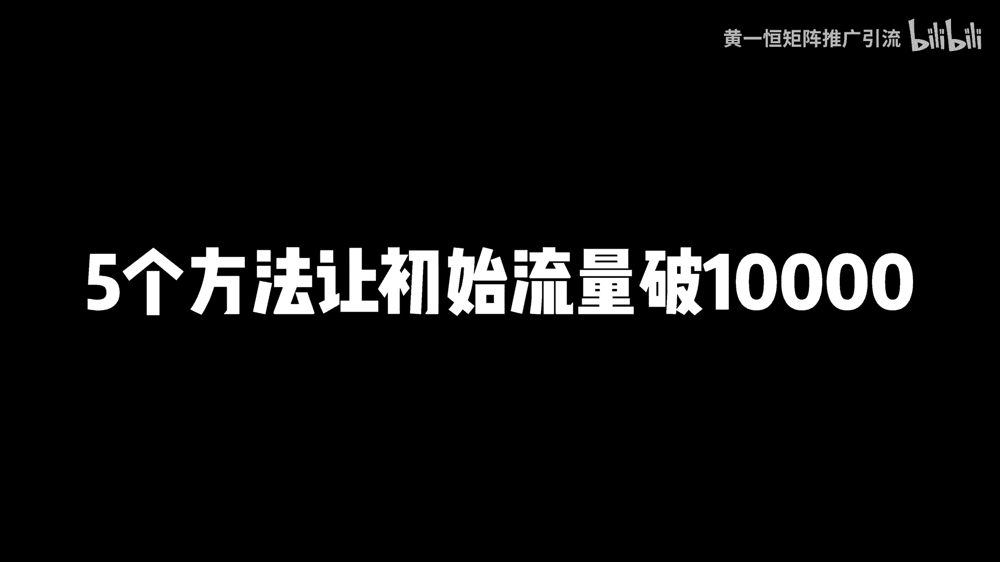
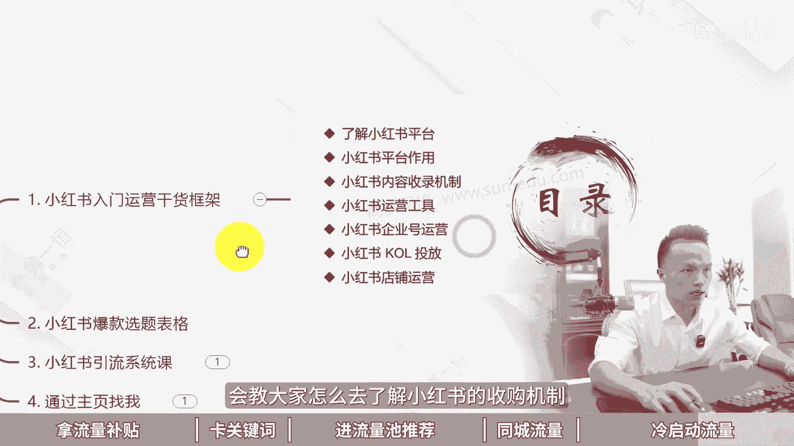

# 小红书笔记怎么发才有流量！亲测有效，5个方法让初始流量破10000！，小红书流量机制是怎样的，小红书流量上不去怎么办，小红书起号教程，小红书运营教程，小红书运营 - P1 - 黄一恒矩阵推广引流 - BV1ns421w7os

小红书账发流量又爆了，我们公司刚来实习生，我叫他去发小红书笔记，他发了一周，账号又99，加我们一起来看一下他怎么发的啊，用了五个流量密码，Nice，真是个人才，这个方法不错，新账号也能99，加一个视频。

教会你红书笔记怎么发才有流量，轻测有效，五个方法，让你的初始流量破1万。

详细教程在这里，记得先收藏一起来看，会告诉你如何拿流量补贴卡，关键词排名进流量池获取推荐流量，如何做同城附近流量以及做冷启动流量，首先来看怎么拿流量补贴，当我们在发布笔记的时候。

不要直接通过下方的加号发布，通过这里发布，它是没有办法获取到流量补贴，那如果我们通过创作中心笔记灵感，特别是针对新号，咱们可以获取到流量补贴，比如说我们进入到笔记灵感里面，针对新号。

它会有个订阅灵感中心的一个按钮，我们只要点击一下，立马就可以获得一张200的流量曝光券，这种曝光键呢它是有使用期限的，大家尽量在有效期里面使用，超过的话就会失效，那该如何操作，给大家演示一下。

我们打开投屏手机，点击我，然后找到左上角的三条杠，在这里面点击创作中心，然后找到下方的创作灵感，我们点击这里的按钮，进入之后，在这里面如果是新账号上方就会有个定义按钮，咱们订阅就可以领到流量券。

后期咱们在发布笔记的时候，该如何去进行发布呢，我们可以在这里面选择自己相应的分类，然后找到一些比较关联的灵感进行发布，通过这里面发布，我们就可以领到流量补贴，比如说这是我们自己在操作的时候拿到的。

流量补贴，很多都是一圈的曝光键，这1000的曝光键，它就能够给我们账号带来很多的流量，毕竟我们花钱，如果你5000个容量，大概也得花至少是100多块钱，这第一个第二个，当我们在操作的时候。

如果咱们的笔记出现违规或者出现散户通过，这时候呢我们可以进行申诉，申诉之后，如果是系统误方误拦截，平台就会给我们分发笔记，审核流量补贴件，这种也是非常多的，像我们在发布笔记的时候。

很多笔记我们都会拿去进行一个申诉，那么这个该如何操作，给大家示范一下，我们打开图片手机，然后返回到前面，返回之后，我们在下方点击这个帮助与客服，在这里面找到一个叫做笔记参数，如果咱们的笔记有问题。

在这里面选择相应的笔记就可以进行申诉，申诉完成之后，系统就会给我们分发相应的流量补贴券，这个流量补贴件呢还是非常多的，像我们每个账号基本上都能领到，至少超过五张以上的流量补贴件。

第二个我们还要学会卡关键词排名，因为现在很多用户啊，他在刷小红书的时候给大家模拟一下，比如现在我们是一个真实的用户，咱们打开之后在发现页称之为推荐列表，但是如果我有一个直接明确的需求。

我就会直接通过右上角的搜索框，在这里面进行搜索，比如现在我打算去给家里面安装净水器，我在这里面搜索净水器，它就会产生很多的下拉词，比如说我们找一个净水器怎么选，这里面就有很多的笔记。

为什么这些笔记能够排名在前面，就是因为他们卡的关键词排名，那如果我们在发布笔记的时候，为了获取到搜索流量，我们就可以布局好小红书的ISO排名，这样呢就可以让用户搜索关键词的时候，也可以找到咱们的笔记。

我们的笔记又多了一个流量，那这里该如何做呢，其实方法非常简单，我们只需要把自己的项目放在小红书里面，进行搜索，搜索完成之后，会在下拉框里面推荐很多的关键词，从这里面挑选一个关联性比较强的。

然后把它放置到布局到我们的标题以及话题，包括笔记内容里面，就会有一定的排名概率来看，第三个净流量池，拿推荐流量，当我们在发布笔记的时候，更多的还是靠推荐流量，那推荐流量怎么来嘞。

怎么能够获得几千上万的推荐流量，这里面有一个非常重要的就是选题高于一切，有的伙伴做了一个月，甚至做了两个月，发现它的流量都没破1000，这个到底什么原因，很大的一部分就在于选题。

所以能做多少粉丝能做多少流量，不在于咱们的方法，更多的在于我们的一个选题，如果选题做的比较好，流量自然比较大，所以选D的权重啊大于80%，那选题这一块呢，大家一定要学会一个方法，就是会看数据等于什么。

开卷考试随心而发，等于盲人摸象，也就是说，我们做的所有笔记，都要建立在别人的数据基础指标之上，不要自己会什么发什么，想到什么发什么，而是我们需要去看我们的对标账号，看我们的竞争同行，他们发什么报了。

我们再把这个选题拿过来修改，优化之后再进行发表，因为在小红书里面有个规律，火锅内容呢它还会再火，这里面有个公式，大家可以认真的把它记下来，70%的相似爆款乘以足够多的尝试次数。

就等于什么小红书的流量密码，那在我们操作的时候呢，最好是能够建立一个小红书的爆款选题表格，咱们做的每一个笔记，都需要从选题表格里面去进行一个筛选，而不是看到一个立马就做一个，当有了选题表格之后。

我们就可以从这里面挑选一些收藏比，整体比较高的，比如这里面这篇笔记，收藏比达到139%，也就是100个人点赞，会有139个人进行收藏，还可以选择一些评论比相对来说比较高的，毕竟评论越多。

我们或者推出来自然就越大，那么怎么去做一个这样的选题表格，大家如果不知道操作的，可以来找我，我把这个爆款选题表格的模板来分享给你，你套一下就可以进行使用，那么第三个就是我们的封面吸引力。

咱们在操作的时候，如果咱们没有什么经验，也不太懂这个设计，千万不要自己弄，方面，最好的办法就是直接找近期对标账号，在使用的方面，并且这个方面一定要数据指标比较好，如果你的对标账号他的数据非常差。

咱们就不用，如果他的数据反馈非常好，咱们一定要拿过来进行使用，而且方面呢没有办法说一个方面用很长时间，一般一个封面的周期差不多也就一个月左右，一个月之后我们要去更新迭代不迭代。

咱们发布的笔记基本上就很难获得高点击，很难进到流量池里面，那么第四个叫做同城附近流量，当我们在刷小红书的时候，刚才我们讲到了两种方式，那么第一种方式呢我们是通过发现的推荐来刷，第二种方式呢。

我们是通过搜索框搜索关键词来刷，第三种方式我们还可以刷这个同城，比如说我们点击发现右侧有一个附近附近，也就代表我们能够看到周边的一些小伙伴，他们发布的这个笔记，你可以看到啊，这里面这些都是附近。

那我们在发布笔记的时候，如果把这个位置选择一些流量比较大的地方，就可以获得更多的同城流量，那这该如何操作呢，咱们在发布的时候可以通过一个软件，比如说像我在操作的时候，如果我对一个城市不是很了解。

我会选择通过这个地图，在地图里面我们可以去打开这个图层，在图层里面选择上啊热力图，找到这个人流量热力图之后，这时候你会发现地图上面所有的，它都会显示颜色，那我们在选择发布位置的时候。

就可以尽量勾选一些颜色偏红的奇异，这种奇异呢人流量比较大，我们发布完之后，如果在这里面有人刷小红书，我们的笔记就可以获得什么，更多的一个曝光来看，第五个，很多伙伴做了前面四个决定，流量还是不够大。

那怎么办，其实我们也可以自己给他做一下冷启动，那人启动到底是怎么玩的，比如第一个，我们可以通过自己的私域流量池，导流到笔记上面，给笔记增加一些初始流量，从而撬动到平台的系统推流，那这种该如何操作呢。

比如说咱们如果有一些铁粉，你可以把你的笔记通过分享告诉铁粉，让铁粉去搜索我们的笔记标题，找到之后啊，进行一键三连提高，我们笔记的基本书籍，第二个粉丝群推广，当我们在操作的时候，可以准备几个素人号。

添加一些竞品的粉丝群，把自己的笔记分享到粉丝群里面，也可以获得一定的曝光，这个在操作的时候呢，咱们尽量的选择下班时间操作，因为上班时间当你把笔记分享出去之后，你的同行他也看到，立马就把这个消息撤回。

曝光量呢非常少，还被提掉了，大概如何操作呢，我们打开小红书，在小红书里面你可以去找到你的精品笔记，在他们的账号主页就给粉丝群，你可以去加很多粉丝群，他是不需要同意，可以直接进，有的群呢是需要对方同意。

进去之后，我们就可以通过下班的时间来进行分享，那么通过这五种方法，我们的初始流量就可以增加，就可以撬动平台更多的流量，那如果咱们想做好小红书，达到每天能够搞到100家的客户，那这种该如何做。

首先我们得对小红书有个系统的了解，这里面我给大家准备了一个，小红书的运营干货框架，会教大家怎么去了解小红书的收入机制。

有哪些运营工具，包括企业号怎么来进行操作都有，其次我们还给他准备了一个，小红书的爆款选题模板，我们通过这个模板，把里面的笔记换成这一行业的，咱们做的每一篇笔记，都要建立在别人的数据技术指标之上。

也就是我们会用工具会看数据，就等于什么开卷考试，第三个呢，大家如果想系统化的做小红书，因为咱们现在时间关系啊，视频拍太长，大家可能没有耐心看完，所以咱们只能做短一点，如果你想系统化的学习小红书。

这里面我有一个小红书的系统流课，会教大家怎么去，比如说小红书的前流程怎么设计，钩子怎么导流，常见问题以及变现都会给大家进行详细的分享，那这些怎么去获得呢，非常简单，可以通过主页啊来找我。

我就把这些资料来分享给大家好了，各位伙伴，我是黄一涵，只做落地推广方法，关于互联网推广，我还整理了18个平台的详细打法，教大家如何去进行推广引流，搞到客户，这些呢都是我原创的。

可以通过主页来领取进行学习，对照操作就能够搞到流量，如果觉得这个视频不错的，请大家一键三连，感谢大家支持。

