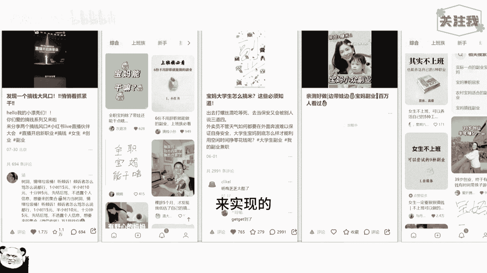
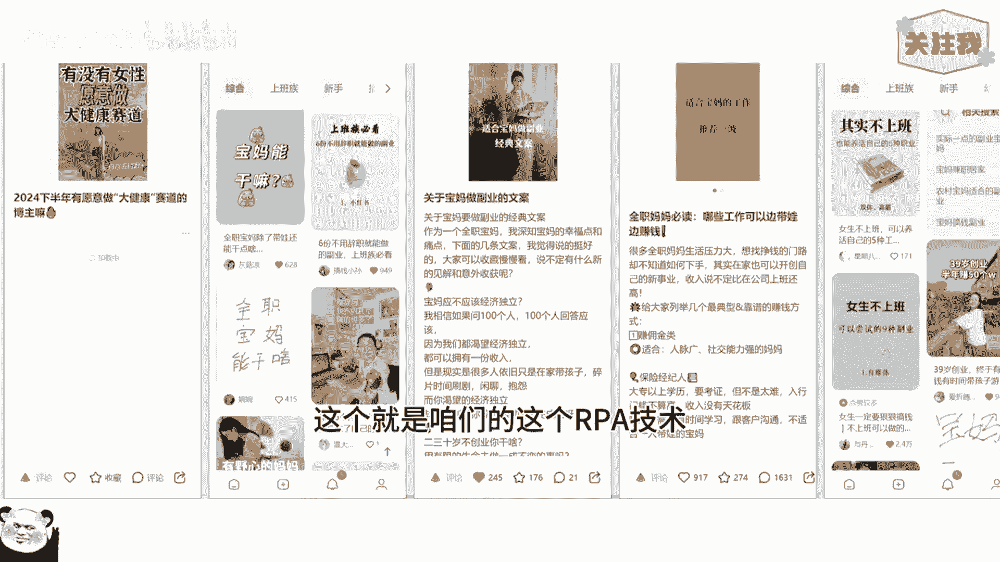
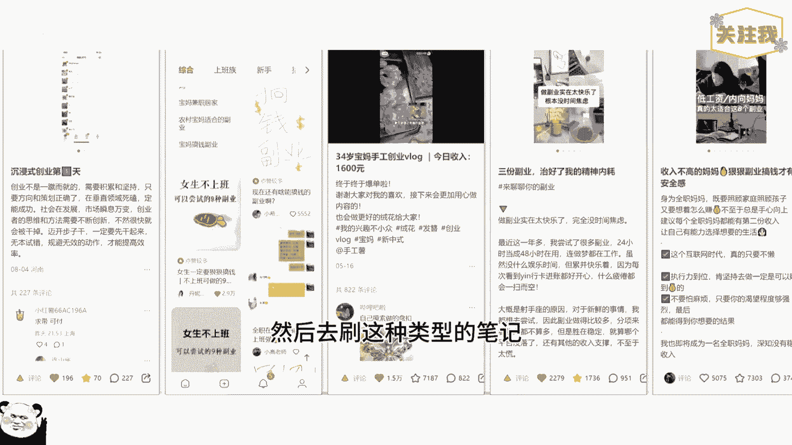

# 小红书群控自动养号技术，矩阵AI养号引流必备 - P1 - 渡鸦科技法叔说 - BV1mh4peNEah

Nice，今天给你们演示一下小红书全自动养号技术，咱们这个技术的话，主要是通过RPA自动化机器人来实现的。

一个模拟人在点赞，点关注以及关注博主等等这些功能，实现一个养号的一个目的，咱们新注册的账号的话，一般都要养一养，再去发作品的话，效果会更好，可以看到现在这些都是它自己在动，这个就是咱们的这个RPA技术。

就是模拟人在操作，然后我的窗口的话一般就放五个，刚好养的话，其实你可以一下养十个，20个都是没问题的，咱们这个都没有限制的，一天的话只需要养两三个小时就可以了，咱们这个只需要电脑来操作。

不需要手机也很方便，它会自动的去搜索你设置的关键词，然后去刷这种类型的笔记。

第一个就是刷垂直度，第二个的话就是养一养嘛，到时候你发作品的时候更容易爆，这个工具的话，主要是配合咱们社群的一个小红书，批量克隆爆款笔记这样一个工具来使用，在这里养了之后。

直接放到咱们这个克隆系统里面去发布作品哈，效果很好，需要这个工具的话。