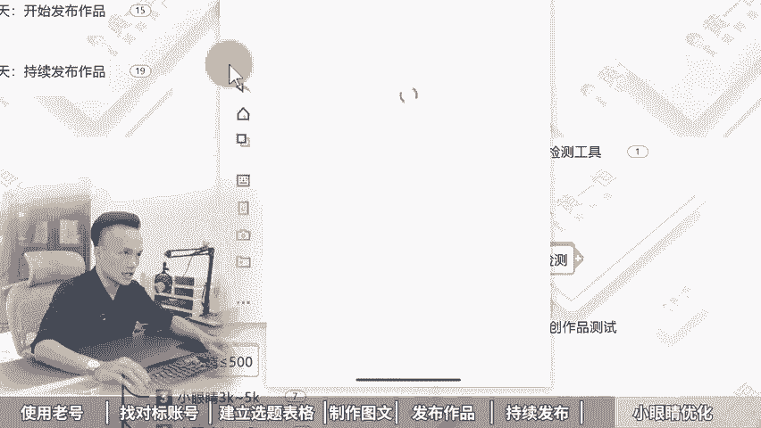

# 小红书起号正确的方法，7天快速起号法！ 分享小红书新号如何快速起号，小红书起号方法，小红书起号流程，小红书起号攻略，小红书起号教程，小红书七天起号，小红书新手起 - P1 - 黄一恒矩阵引流技术 - BV1NrtGerEzY

🎼太快了太快了，新手七号7天，小红书就报了几个账号，我们公司刚来随生，我叫他去做小红书推广，他做了7天，账号就报了一天加几百个人，牛逼，我们来看看他怎么做的。😡，🎼用7天瞧法，难怪这么快账上就爆了。

真是个人才。😡，🎼nice这个方法不错，还这个时间，明天它就可以转正了一个视频给你分享小红书起号正确方法。7天快速起号法。落地教材有点长，记得先收藏。一起来看，我给你分享第一天使用老号。

第二天找对标账号。第三天建立选题表格，第四天尝试制作图文，第五天开始发布作品，第六天持续发布作品，第七天对播放小眼睛进行优化。现在看第一天使用老号，使用老号来，最好是能够选择注册时间较长的账号。

比如说时间超三个月以上的老号，重账号本身有比较高的活跃度，而且已经过了观察脱敏期，发布内容之后，整体流量基本上都能达到500到1000左右。有的伙伴是昨天或者今天注册立马就去发布作品。

发不之流量就只有几十个，甚至有的完全没有流量。有的伙伴说我这种老号平常有发布一些生活记录或者你用的内容行不行？可以的，我们只需要把这作品隐藏掉。

重新发布锤子内容就可以了。因为你账号没打上标签，你发的其他的，他会打上这个什么新的标签。那为什么要去使用这个老号？首先新号的风控啊更加的严格。因为现在有很多专门的团队，他们在恶意的注册这种新号。

注售完之后呢去拿过去做什么截流啊，或者说打粉做什么机器号，做什么水晶号，这种账号的话，很容易就被限流，甚至你前期发布基本上没什么流量，而老号的话已经过了观察脱敏期，系统更倾向于老号来进行推牛。

比如说像我们自己为了测试，我们单独搞了一些账号。其中有两个呢就是新号，也就是今天注册今天去进行发布，结果印了一个星期一点起的都没有。而我们用的一个一年以上的老号。

这个老号在第三天4天的时候就开始进行爆货，流量直接就达到了什么几万的流量，什么原因就是因为账号是老号权重比较高。所以咱们在做的时候，很多同学在第一步上面就踩开看。那如何去准备老号？其实有这种办法。

你可以看一下身边的亲朋好友，他们有没有在使用这个小红书。如果有的话，你可以把他们的账号登到你自己的手机上面来，用一段时间之后呢，然后再换绑一个手机，让他们重新注册一个账号就可以了。

然后发布笔记满一个月以后，我们再换本上林业租注册卡，这个林业出注册卡，大家可以在各大平台搜索找到。接下来我们需要把这个资料给他做一下这个修改。那么修改呢，大家可以参考一下对标账号。

那么设置一下你的这个头像，昵称个性签名和背景图啊，围绕的赛道，围绕到行业来搜就可以了。千万不要啊去投机提交，打什么小广告，这种账号呢，你打广告的话，是很容易违规的。那么第二天我们需要去找对标账号。

那么第二天呢，我们需要通过搜索或者推荐去寻找50到100个这个什么对标账号。特别是最近半年起来的账号，关注那种粉丝5万以下内的账号，特别多留意一些那种低粉爆涨，什么叫低粉爆产。比如他的粉丝量只有几百个。

但是呢缺有一个作品达到几千个点赞。这种作品就是新奇的号，它也获得了非常好的数据反馈，拿过来做流量绝对不太差。这体给大家演示一下。首先我们可以打开这个投屏手机，在投屏手机的右上角搜索框里面。

我们这里面可以直接搜索关键词。比如说我是做净水器的，搜索完之后，这里面就有很多很多热门的选题，我们点击筛选，然后来找到这个图文，然后再点击一下。好，这里面就有我们很多的对标账号。比如这个账号两天前发布。

目前已经获得了400多个点赞，叫净水器显做扩大方，那帮姐妹们必。好，然后咱们打开这个账号，那么打开这一个账号之后，在这个账号里面可以看到啊，它是1个3。2万粉丝的号，粉丝的也是5万以下。我们可以去看看。

你会发现它的很多数据啊其实也是比较差的啊，就基本上有的都没有这个点赞。但是唯独这一个啊点赞比较高，也就代表这一个选题，它是这个账号里面的流量密码，数据是拉高了10倍百倍以上的。

另外我们也可以通过账号推荐去找更多的账号，什么叫账号推荐来，我们划到上方，当你点击这个关注的时候，在下方这里面它就会推荐一些跟这个账号标签比较相似的啊，这里面推荐了很多美食的账号啊。

这个账号相当于它是被打上这个美式的标签，看到这个标签啊打的不是很精准。还得以重新往下滑，然后来去找更多账号，这里咱们就不做详细演示了。目的就是为了方便给我们自己以后提供这个灵感。为什么？

因为咱们有的伙伴是想到什么发什么，会什么发什么，有什么发什么，这种就等于什么，随性而发，像发朋友圈一样，盲人摸像。而我们找了对标账号，特别是找50到100个，就有50到100个人。

他们在免费的帮你测试各种各样的选题。如果他们每个账号每天发一篇笔记，100个账号一天有100篇笔记，100篇笔记里面就有数据指标，通过赛码机制跑的比较好的。

我们把跑的好的选题拿过来调整修改下去发收据绝对没会太差，所以会看数据等于什么，等于开建考试。好，第三天我们要开始建立这个选题表格。那么选题的权重啊是高于一切的。前面呢是我们参考对标账号，哪些账号做的好。

哪些账号做的差。这里呢我们需要从账号里面挑选一些记己的选题，就住选题的权重他是大于80%的。所有发布的笔记，你要都。建立在别人的数据基础指标之上，这个什么意思？相当于你自己千万不要去测试。

测试的周期啊会拉得非常的长。而我们发布了20篇笔记，这20篇笔记就是别人测试爆，而且是近期反馈比较好的内容去发流量绝对不会太差。因为小红书火锅内容呢，它还是会什么还是会在火的。所以做小红书啊。

一个公式叫做70%的相似爆款乘以足够的城次次数就可以把小红书做起来。那具体怎么做？我们有几个方法，首先我们可以通过搜索选题法，也就是刚才给大家演示的，直接搜索关键词，从这里面把近期时间比较近。

数据反馈好的选题整理下来。这第一个第二来对标选题法，我们直接打开账号的主页，从账号的主页里面去挑那种什么数据反馈比较高的。哎，比如这里面有一个专门做净水器的。我们打开这个账号主页。

在账号主页里面往下方滑动。你看这里面有很多很多。那么有的呢只有一两个点赞，有的呢不到10个点赞，我们就可以。那种什么点赞比较高的。比如说在这个账号里面点赞量达到3位数。

4位数的这种选题就是什么流量选题咱们拿过来。那么第四个呢叫做下拉选题法。什么叫下拉选题法？比如说。咱们打开这个搜索框，在搜索框里面，我们搜索的关键词出现的这个关联词，我们就把它称之为这个嘛？

就个高频需求。比如说净水器怎么选，净水器反渗透，净水器。DIY净水器的这个压力桶，这就是当下用户关注度比较高的不高的，它是不会出现这个地方。也就是大家对这个比较感兴趣。那我们就是这一个在操作的时候呢。

最好是能够建立一个选题表格，帮助我们来做一下数据对比，毕竟我们要学会做开奖考试。比如说像我就做了一个选题表格。我把近期热门的流量比较大的，全部整理下来，那整理下来之后。

从这里面挑选一些收藏比评论比分享比比较高的。那么这种账号呢就是目前反馈比较好的，我们不是找一个做一个，我们是找10个20个30个，从这里面挑几个比较高的。比如说咱们来挑一个收集拉的比较高的。

像这一个它的收藏比达到了146，相当于100个人点赞会有147个人收藏。这种呢更加容易二次活。因黄老说老师这种书据比例我不会做怎么办啊？不会做没关系，你可以来找我。我把我的书籍表格来分享给大家，做一下。

共享，毕竟这也是互联网最大的优势。好来看一下第四天。第四天啊，家长们就可以开始尝试着去制作这个图文了。我们需要去找近期的爆款选题。爆款选题呢，我们可以从这个你前面如果你关注了100个对标账号啊。

那么有一个办法非常简单，我们只需要点开这个叫做关注的这个列表。在关注里面去刷好，这里面就会有一些。你看比如这一个啊它发布完之后，2000多点的三天前啊，说明数据反馈非常好，我们就赶紧把它抄过来。好。

这是一个方法。另外一个方法呢，你可以从选题库里面尽量挑选时间比较近的。比如最近7天内收藏比例比较高的，这种代表内容特别实用。为什么这种内容它比较容易火。因为我们就是专门对干货的一打开内容密密麻麻。

看不完，看不完太多了，太多了，没办法，只能收藏下来也会再慢慢看，它很容易吃货。然后我们需要参考这些选题，就是模仿制作啊，三条，并且这三条呢一定要做出来质量整理是比较高的啊。那么在模仿制作的时候。

大家可以配的上一个工具。比如说搞定设计，创客贴还原相机都可以。这里我用的就是搞定设计。咱们打开这个平台，在平台里面点击这个创建设计，在这里面找到小红书配图。

我们就可以去模仿着对方来进行制作制作的时候呢可以适当的对一些小的细节进行优。在用的时候，这个平台啊，我用的是一个个人免费版。大家在使用的时候，只要你不使用它的模板以及它的一些VIP字体。

也就是带这个皇冠图标的那你是可以完全免费使用的。像不用花钱，也可以用这个平台，这里一个小细节啊。那么其他工具大家如果熟悉呢也是可以的。好，这是第四天来看一下第五天第五天我们要开始去发布作品。

那发布作品的时候，怎样可以获得更多的流量，这里面几个小技巧。第一个我们需要通过这个创作中心，笔记灵感来进行发布。那这里面特别是我们刚注册的账号，或者是没有发布过笔记的账号。你以前没有领过流量补贴的。

这里面都可以领到。比如说新账号打开笔记灵感，它会有一个订阅按钮，订阅完之后立马会送你一张200的流量券，那么进入灵感中心之后呢，如果你后期都从灵感中心里面点击这个发布按钮发布，你可以获得大量的流量键。

像我们一个账号啊都获得了几千的流量键，这流量键，毕竟你单独。投这个呃薯条加热的话，那也得花什么好几百块钱。我给大家演示一下，怎么去找这个啊，咱们打开账号。

然后呢点击右下角的我在我这里呢找到左上角的三条杠，点击创作中心。那么在创作中心里面点击这个叫做什么叫做笔记灵感。然后呢在笔记灵感这里面，那么上方就会有订义按钮。我这个已经订义过，所以没有了。

在发布的时候呢，在这里面一定要找到跟你相关的。然后点这个发布就可以拿到平台给你的一个什么流量补贴。第二个，我们在发布笔记的时候啊，如果你做什么选题，一定要学会卡一个关键词。

这样的话可以获取到这个搜索流量，不及小红书的SO排名。比如说简天啊，咱们打开这个投屏手机。好，我们重新返回来。那返回来之后啊，我们在这个搜索框里面，我们点击一下点击完成之后呢。

那这里面它是会有很多的一些下拉词的。比如说我做的一个选题叫做净水器，那么直引机。好，这一个那我在发布的时候，我的标题里面就得包含这个净水器直引机。那么这样的话，当用户在搜索这个关键时候就可以找到这笔记。

因为目前小红书它有80%的用户打开之后，第一时间就是通过搜索框去干嘛去找这个内容。第三个是同城附近流量，咱们在做的时候啊，一定要发这个同城流量。毕竟在小红书的评价里面，你看啊它的发现页右边就是附近流量。

这个附近流量为什么会推荐给我？就是因为。他是我周边的一些。这种笔记。所以我们在发的时候呢，可以勾显一下位置，位置尽量选择一些流量比较大的位置。啊，这一步来也是什么？非常重要的。选择一些你们当地比较热的。

好，接下来看一下第六天瓷器的发布作品，那么作品这一块呢，我们要拉高作品的质量。质量这一块啊，在小红书上面什么样的笔记能够获得大量的数据反馈，流量能够达到5000万。我告诉大家，这对内容，什么叫对内容。

就内容太多太多了。我来给大家示范一下。比如说咱们搜这个净水器，搜索完之后，为什么有的笔记它特别容易火啊，我们直接看这个图文节省一点时间，好，咱们往下方划。

你会发现有一些笔记它的内容量其实整体是相对来说什么比较大的。像这种你可以发现啊，它三天前发布就有900个点赞，点进来之后来，它的这个内容其实是非常多的啊，这种就是典型的什么？对内容叫做什么憋爆款。

你要花更多时间来做，做出来之后来，流量绝对不会太差。好，这第一个第二个呢，保持每天发布。1到3个作品，如果你发三个，上午一个下午一个晚上发一个再多的话就不建议了。最少你得有一个。

然后前几天发布的几条作品呢，咱们在操作的时候啊，不要太在意这个小眼睛，小眼睛，哪怕200300500啊，都是没问题的。如果你发布完3天之后，小眼睛都没破败，就只那么几十个。这时候怎么办呢？

我们可以隐藏删除作品重新发布大概率的原因啊，如果你账号没有问题，基本上就是你的笔记里面可能有什么敏感词。那敏感词这一块呢，大家如果在做的时候，最好的办法是能够在发布笔记之前先检测一下啊。

避免那么出现这个敏感词。而且敏感词如果出现一次没什么影响。如果你出现5次10至20之后，你的账号直接就违规，甚至直接就完蛋了，直接挂掉了。那敏感词检测工具，大家如果不知道怎么去检测，你可以找我。

我把我用的免费的敏感词工具来分享给大家，让大家在发布之前都能够脱敏。接下来我们要持续的进发布作品。如果。已经发布了10条以上的作品，并且已经间隔了超过3天以上。

你去看一下你的小眼睛每篇笔记的小眼睛基本上都没有破300以上。如果偶尔有几篇破来，说明是正常的。如果全部都没有破300以上，建议大家放弃这个账号。这个账号基本上系统它是限制的，没有给你什么流量好。

接下来看一下第七天小眼睛播放的优化。首先如果这小眼睛啊是小于等于200的，那么基本上大部分的原因啊，都是作品有违规被限流。那么这种流量呢一般不是当天看是发布之后，三天之后你再来看会比较准确一点。

那么原印的话就是有违禁词，违禁词前面我们讲了有敏感词工具啊，那么大家可以找我，我把它分享给大家，有的是内容或者话题整体比较敏感。就有的行业这个赛道它就比较敏感，或者说是你的延创度太低的，你下去调整一下。

那解决办法呢，就是什么，我们可以通过这个帮助客服来给你的账号做一下检测啊，怎么操作，给大家投屏演示一下，咱们打开。账号，然后呢点击这个右下角的我好，在这里面找到左上角的三条杠，然后呢点击这个帮助与客服。

点击完成之后，这里面就会有一个叫做账号检测，你可以先检测一下，看看你的账号有没有出现什么问题。好，咱们点击一下啊，点击完成之后呢，你会发现他的这个账号，如果全部都是正常的，那就没问题。

如果这里面显示的账号有什么违规的话，那就需要去重点的做优化了。那么把那些违规的作品全部删除掉。另外你可以尝试着发布一条随手拍，也就是用手机啊拍一个，你觉得比较有看点的生活记录，发上去看看测试一下。

如果这条作品流量达到了500到1000，代表你这个账号是正常的。只不过你其他的作品里面会有这个敏感词。

那么第二个小眼睛如果是小于等于500，什么情况来？主要是作品的标签不精准。那么系统推送的人群啊不感兴趣，解决方案就是什么？我们需要搜索行业关键词，找那种低粉爆涨的同行，模仿。

并且联系发布3到7天的垂直作品，为账号打上这个什么精准的标签。那如果小眼睛是3000到5000的话，一般是作品没有看点，流量来得不到突破，无法吸引更多用户来进行观看。解决方案就是什么？黄金三秒抓住眼球。

利用热门话题深透度学做标题的方面的，用标题方面来什么吸引用户来点击，增加点击力获得更高的推牛。同时他要坚持不断开。如果小眼睛是1万到3万的话好，这种作品它是有这个小火的潜质的啊。

就是基本上已经马上就要小火了，我们可以持续的输出，复制3到5个同款作品，这个什么意思？就相当于我们把这个选题拿过来做成3到5份发布到你的账号里面，并且带上同款的话题。

你会发现这3到5个里面就会有一个流量能够突破1万到3万。那如果小眼睛是5万到8万的话，也就是账号的粉丝群体看同一种风格太多了。审美有点疲劳了，就大家都已经看力了。

毕竟这种平台都是喜新厌旧的那解决方案就是趁热榜啊，找那种大火的话题。就是为什么有的。话题能够达到500万点赞，就认因为他的话题确实比较热，我们需要输出耳目一心的话题，哎，吸纳这个兴粉。好。

这些我们就可以对账号优化。那如果咱们想去玩好小红书啊，其实最好的办法呢，还是能够做这个集增账号。一上来就做10个账号，用概念来唤取成功率，对抗品台的不确定因素，10个账号，一个账号一天加10个人。

10个账号，一天呀获给100家，也没什么太大问题。因为咱们这些视频呢没办法做太长太长，大家也没耐心看完，最主要的是咱们这个视频做太长的话，流量比较小。所以呢我给大家单独的准备了小红书的入门运营干货框架。

里面给大家分享小红书的收录机制，运营工具，旗号投放，还有KY的投放，同时呢还给大家准备的这个小红书的爆款选题表格，帮助大家去筛选收藏比评论比分享比比较高的笔记出来。

还给大家单独准备了小红书的系统流客有接近3个小时。里面也分享到小红书的全流程，一要怎么设计导流方法，以及常见问题，如果想变现，还有一些变现项目分享给大家。这些呢大家都可以通过来找我。

我把它签到资料分享给大家。好，给同学，我是黄一涵，只做落地推广方法。刚才给大家分享的小红书7天起效方法。如果我们想为了获取大量的流量和顾客，咱们得学会做多流量管道。

这里面我给大家准备了18个品台的详细打法，教大家如何做多流量管道。小红书呢就其中一个这些呢都是我原创的，可以通过主页人体进行学习。如果觉得今天视频比较不错的，请大家一键三连，感谢大家支持。

咱们下个视频来再会。