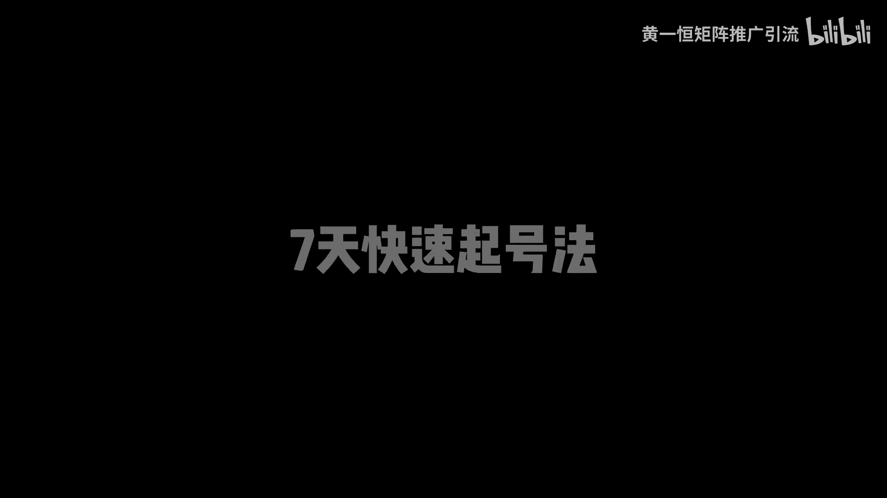
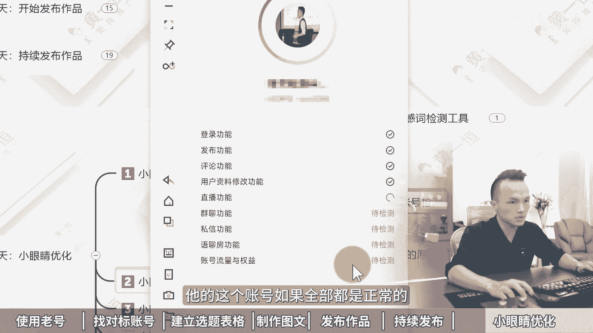

# 小红书起号正确的方法，7天快速起号法，小红书矩阵引流！2024版小红书运营教程，小红书运营规则和技巧，小红书起号教程，小红书起号攻略，小红书矩阵账号怎么做，小红 - P1 - 黄一恒矩阵推广引流 - BV1sK46eLE3u

太快了太快了，新手起号七天，小红书就报了几个账号，我们公司刚来实习生，我叫他去做小红书推广，他做了七天账号就报了，一天加几百个人牛逼，我们来看看他怎么做的啊，用七天巧号法，难怪这么快账号就爆了。

真是个人才，这个方法不错，还节省时间，明天他就可以转正了，一个视频给你分享小红书起号正确方法，七天快速起号法落地教程有点长。

记得先收藏一起来看，我给你分享，第一天使用老号，第二天找对标账号，第三天建立选题表格，第四天尝试制作图文，第五天开始发布作品，第六天持续发布作品，第七天对播放小眼睛进行优化，现在看第一天什么脑号。

什么老号呢，最好是能够选择注册时间较长的账号，比如说时间超三个月以上的老号，重账号本身有比较高的活跃度，而且已经过了观察脱敏期，发布内容之后，整体流量基本上都能达到500~1000左右。

一个伙伴是昨天或者今天注册，立马就去发布作品，发布完之后流量就只有几十个，甚至有的完全没有流量，有伙伴说我这种老号，平常有发过一些生活记录或者旅游的内容，行不行，可以的，我们只需要把这些作品隐藏掉。

重新发布垂直内容就可以了，因为你账号没打上标签，你发的其他的他会打上这个什么新的标签，那为什么要去使用这个老号，首先星号的风控啊更加的严格，因为现在有很多专门的团队，他们在恶意的注册这种新号。

注册完之后再去拿过去做什么节流啊，或者做打粉，做什么机器号，做什么水晶号，这种账号的话很容易就被限流，甚至你前期发布基本上没什么流量，而老号的话已经过了观察脱敏期，系统更倾向于老号来进行推流。

比如说像我们自己为了测试，我们单独搞了一些账号，其中有两个来就是新号，也就是今天注册，今天七点发布，结果印了一个星期，一点起色都没有，而我们用了一个一年以上的老号。

这个老号在第三天四天的时候就开始进行爆货，流量直接就达到了什么几万的流量，什么原因，就是因为账号是老号，权重比较高，所以咱们在做的时候，很多同学在第一步上面就踩着坑，那如何去准备老号，其实有多种办法。

你可以看一下身边的亲朋好友，他们有没有在使用这个小红书，如果有的话，你可以把他们的账号登到你自己的手机上面来，用一段时间之后嘞，然后再换绑一个手机，让他们重新注册一个账号就可以了，然后发布笔记。

买一个月以后，我们再换本上营业租注册卡，这个林业租注册卡，大家可以在各大平台搜索找到，接下来我们需要把这个资料给他做一下，这个修改，那么修改呢大家可以参考一下对标账号，那么设置一下你的这个头像昵称。

个性签名和背景图啊，围绕着赛道，围绕着行业来说就可以了，千万不要啊去投机取巧，打什么小广告，这种账号嘞，你打广告的话是很容易违规的，那么第二天我们需要去找对标账号，那么第二天呢我们需要通过搜索或者推荐。

去寻找50~100个这个什么对标账号，特别是最近半年起来的账号，关注那种粉丝5万以下类的账号，特别多留意一些那种低粉爆涨，什么叫低粉爆涨，比如他的粉丝量只有几百个，但是呢却有一个作品达到几千个点赞。

这种作品就是新起的号，他也获得了非常好的数据反馈，拿过来做流量绝对不会太差，具体给大家演示一下，首先我们可以打开这个投屏手机，在投屏手机的右上角搜索框里面，我们这里面可以直接搜索关键词。

比如说我是做净水器的，搜索完之后，这里面就有很多很多热门的选题，我们点击筛选，然后来找到这个图文，然后再点击一下好，这里面就有我们很多的主要账号，比如这一个账号两天前发布，目前已经获得了400多个点赞。

叫净水器，显作颇大，方，能帮姐妹们避坑好，然后咱们打开这个账号，那么打开这一个账号之后，在这个账号里面可以看到啊，他是一个3。2万粉丝的号，粉丝代也是5万以下，我们可以去看看，你会发现它的很多数据啊。

其实也是比较差的啊，就基本上有的都没有这个点赞，但是唯独这一个啊点赞比较高，也就代表这一个选题，他是这个账号里面的流量，密码数据是拉高了十倍百倍以上的，另外我们也可以通过账号推荐去找更多的账号。

什么叫账号推荐呢，我们划到上方，当你点击这个关注的时候，在下方这里面，它就会推荐一些跟这个账号标签比较相似的好，这里面推荐了很多美式的账号啊，这个账号相当于他是被打上这个美式的标签。

看来这个标签啊打的不是很精准卡，你可以重新往下滑，然后来去找更多的账号，这里咱们就不做详细演示了，目的就是为了方便，给我们自己以后提供这个灵感，为什么，因为咱们有的伙伴是想到什么发什么，会什么发什么。

有什么发什么，这种就等于什么随心而发，像发朋友圈一样盲人摸象，而我们找的对标账号，特别是找50~100个，就有50~100个人，他们在免费的帮你测试各种总共的选题，如果他们每个账号每天发一篇笔记。

100个账号一天有100篇笔记，100篇笔记里面就有数据指标，通过赛马机制跑得比较好的，我们把跑得好的选题拿过来调整修改项，激发数据绝对不会太差，所以会看数据等于什么，等于开卷考试好。

第三天我们要开始建立这个选题表格，那么选题的权重啊是高于一切的，前面呢是我们参考对标账号，哪些账号做得好，哪些账号做的差，这里呢我们需要从账号里面，挑选一些自己的选题，记住选题的权重他是大于80%的。

所有发布的笔记，你要都建立在别人的数据技术指标之上，这个什么意思，相当于你自己千万不要去测试，测试的周期啊，会拉的非常的长，而我们发布了20篇笔记，这20篇笔记就是别人测试报。

而且是近期反馈比较好的容器，发流量绝对不会太差，因为小红书火锅那种呢，它还是会什么，还是会再火的，所以做小红书啊，有个公式叫做70%的相似爆款，乘以足够的尝试次数，就可以把小红书做起来，那具体怎么做。

我们有几个方法，首先我们可以通过搜索选题法，也就是刚才给大家演示的直接搜索关键词，从这里面把近期时间比较近，数据反馈好的选题来整理下来，这是第一个，第二来对标选题法，我们直接打开账号的主页。

从账号的主页里面去挑那种，什么数据反馈比较高的啊，比如这里面有个专门做净水器的，我们打开他的账号主页，在账号主页里面往下方滑动，你看这里面有很多很多，那么有的嘞只有一两个点赞，有的嘞不到十个点赞。

我们就可以挑那种什么点赞比较高的，比如说在这个账号里面点赞量达到三位数，四位数的这种选题，就是什么流量选题，咱们拿过来，那么第四个呢叫做下拉选题法，什么叫下拉选立法，比如说咱们打开这个搜索框。

在搜索框里面，我们搜索的关键词出现的这个关联词，我们就把它称之为叫做啥，就做高频气球，比如说净水器怎么选，净水器，反渗透，净水器，DIY净水器的这个压力桶，这就是当下用户关注度比较高的，不高的。

他是不会出现在这个地方，也就是大家对这个比较感兴趣，那我们就做这一个在操作的时候呢，最好是能够建立一个选题表格，帮助我们来做一下数据对比，毕竟我们要学会做开卷考试，比如说像我就做了个选题表格。

我把近期热门的流量比较大的全部整理下来，那整理下来之后从这里面挑选一些收藏比，评论比，分享比比较高的，那么这种账号嘞，就是目前反馈比较好的，我们不是找一个做一个，我们是找十个20个，30个。

从这里面挑几个比较高的，比如说咱们来挑一个数据拉的比较高的，像这一个他的收藏比达到了146%，相当于100个人点赞，会有147个人收藏，这种呢更加容易二次火，有的黄南说。

老师这种书籍比例我不会做怎么办啊，不会做没关系，你可以来找我，我把我的书籍表格来分享给大家，做下资源共享，毕竟这也是互联网最大的优势，好来看一下第四天，第四天啊，接下来我们就可以开始。

尝试着去制作这个图文了，我们需要去找近期的爆款选题，爆款选题呢我们可以从这个你前面，如果你关注了100个对标账号啊，那么有一个办法非常简单，我们只需要点开这个叫做关注的这个列表，在关注里面去刷好。

这里面就会有一些，你看比如这一个好，他发布完之后2000多点赞，三天前好，说明数据反馈非常好，我们就赶紧把它抄过来好，这是一个方法，另外一个方法呢，你可以从选题库里面尽量挑选时间比较近的。

比如最近七天内收藏比例比较高的，这种代表内容特别实用，为什么这种内容它比较容易火，因为我们就是专门对干货的，一打开那种密密麻麻，看不完，看不完，太多了太多了，没办法，只能收藏下来以后再慢慢看。

它很容易啊，这货然后我们需要参考这些选题，就是模仿制作啊三条，并且这三条呢一定要做出来，质量整体是比较高的啊，那么在模仿制作的时候，大家可以配得上一个工具，比如说搞定设计，创可贴黄页相机都可以。

这里我用的就是搞定设计，咱们打开这个平台，在平台里面点击这个创建设计，在这里面找到小红书配图，我们就可以去模仿着对方来进行制作，制作的时候，在用的时候，这个平台呀我用的是一个个人免费版。

大家在使用的时候，只要你不使用它的模板，以及它的一些VIP字体，也就是在这个皇冠图标的，那你是可以完全免费使用的，像不用花钱也可以用这个平台，这里有个小细节啊，那么其他工具大家如果熟悉来也是可以的。

好这是第四天来看一下，第五天，第五天我们要开始去发布作品，那发布作品的时候，怎样可以获得更多的流量，这里面几个小技巧，第一个，我们需要通过这个创作中心，笔记灵感来进行发布。

那这里面特别是我们刚注册的账号，或者是没有发布过笔记的账号，你以前没有领过流量补贴的，这里面都可以领到，比如说新账号打开你笔记灵感，它会有一个订阅按钮，订阅完之后立马会送你一张200的流量券。

那么进入灵感中心之后呢，如果你后期都从灵灵感中心里面，点击这个发布按钮发布，你可以获得大量的流量件，像我们一个账号啊，都获得了几千的流量件，这流量件毕竟你单独去投这个呃，薯条加热的话。

那也得花什么好几百块钱，我给大家演示一下怎么去找这个啊，咱们打开账号，然后呢点击右下角的，我在我这里呢找到左上角的三条杠，点击创作中心，那么在创作中心里面点击这个叫做什么，叫做笔记灵感。

然后呢在笔记灵感这里面，那么上方就会有定义按钮，我这个已经订阅过，所以没有啦，在发布的时候呢，在这里面一定要找到跟你相关的，然后点这个发布，就可以拿到平台给你的一个什么流量补贴。

第二个我们在发布笔记的时候啊，如果你做什么选题，一定要学会卡一个关键词，这样的话可以获取到这个搜索流量，不及小红书的ISO排名，比如说锦鲤啊，咱们打开这个投屏手机好，我们重新返回来，那返回来之后啊。

我们在这个搜索框里面，我们点击一下，点击完成之后呢，那这里面它是会有很多的一些下拉词的，比如说我做的一个选题叫做净水器，那么指引接好这一个，那我在发布的时候，我的标题里面就得包含这个净水器，直饮机。

那么这样的话当用户在搜索这个关键时候，就可以找到这笔记，因为目前小红书它有80%的用户，打开之后，第一时间就是通过搜索框去干嘛，去找这个内容，第三个是同城附近流量，咱们在住的时候啊。

一定要发这个同城流量，毕竟在小红书的评价里面，你看啊，他的发现页右边就是附近流量，这个附近流量为什么会推荐给我，就是因为他是我周边的一些这种笔记，所以我们在发的时候可以勾选一下位置位置。

尽量选择一些流量比较大的位置，那这一步来也是什么非常重要的，选择一些你们当地比较热的好，接下来看一下第六天瓷器的发布作品，那么作品这一块呢，我们要拉高作品的质量增量这一块啊，在小红书上面。

什么样的笔记能够获得大量的数据反馈，流量能够达到5100万，我告诉大家就读内容，什么叫对内容，就内容太多太多了，我来给大家示范一下，比如说咱们收这个净水器，搜索完之后，为什么有的笔记它特别容易火啊。

我们直接看这个图文，节省一点时间好，咱们往下方滑，你会发现有一些笔记，它的内容量其实整体是相对来说什么比较大的，像这种你可以发现啊，他三天前发布就有900个点赞，点进来之后呢。

他的这个内容其实是非常多的啊，这种就是典型的什么堆内容，叫做什么憋爆款，你要花更多时间来做，做出来之后呢，流量绝对不会太差，好这是第一个，第二个嘞，保持每天发布1~3个作品，如果你发三个上午。

一个下午一个晚上发一个，再多的话就不建议了，最少你得有一个，然后前几天发布的几条作品呢，咱们在操作的时候啊，不要太在意这个小眼睛，小眼睛哪怕两百三百五百啊，都是没问题的，如果你发不完，三天之后。

小眼睛都没破百，就只有那么几十个，这时候怎么办呢，我们可以隐藏删除作品，重新发布，大概率的原因啊，如果你账号没有问题，基本上就是你的笔记里面可能有什么敏感词，那敏感词这一块呢，大家如果在做的时候。

最好的办法是能够在发布笔记之前，先检测一下啊，避免那么出现这个敏感词，而且敏感词如果出现一次没什么影响，如果你出现五次，10~20之后，你的账号直接就违规，甚至直接就完蛋了，直接就挂掉了。

那敏感词检测工具，大家如果不知道怎么去检测，你可以找我，我把我用的免费的敏感词工具来分享给大家，让大家在发布之前都能够脱敏，接下来我们要持续的去发布作品，如果你已经发布了十条以上的作品。

并且已经间隔了超过三天以上，你去看一下你的小眼睛，每篇笔记的小眼睛基本上都没有破300以上，如果偶尔有几篇破了，说明是正常的，如果全部都没有破300以上，建议大家放弃这个账号。

这个账号基本上系统它是限制的，没有给你什么流量好，接下来看下第七天小眼睛播放的优化，首先如果那小眼镜啊是小于等于200的，那么基本上大部分的原因啊，都是作品有违规被限流，那么这种流量呢一般不是当天看。

是发布完之后，三天之后你再来看会比较准确一点，那么大家可以来找我把它分享给大家，有的是内容或者话题整体比较敏感，就有的行业这个赛道他就比较敏感，或者说是你的原创度太低了，你需要去调整一下。

那解决办法呢就是什么，我们可以通过这个帮助与客服，来给你的账号做一下检测啊，怎么操作，给大家投屏演示一下，咱们打开账号，然后来点击这个右下角的，我好在这里面找到左上角的三条杠，然后呢点击这个帮助与客服。

点击完成之后，这里面就会有一个叫做账号检测，你可以先检测一下，看看你的账号有没有出现什么问题，好咱们点击一下啊，点击完成之后呢，你会发现他的这个账号如果全部都是正常的。

那就没问题，如果这里面显示的账号有什么违规的话，那就需要去重点的做优化了，那么把那些违规的作品全部删除掉，另外你可以尝试着发布一条随手拍，也就是用手机啊，拍一个你觉得比较有看点的生活记录，发上去看看。

测试一下，如果这条作品流量达到了500~1000，代表你这个账号是正常的，只不过你其他的作品里面会有这个敏感词，那么第二个小眼睛如果是小于等于500，什么情况呢，主要是作品的标签不精准。

那么系统推送的人群啊，不感兴趣，解决方案就是什么，我们需要搜索行业关键词，找那种低粉爆涨的同行模仿，并且连续发布3~7天的垂直作品，为账号打上这个什么精准的标签，那如果小眼睛是3000~5000的话。

一般是作品没有看点流量来得不到突破，无法吸引更多用户来进行观看，解决方案就是什么黄金三秒抓住眼球，利用热门话题深刻度学做标题党方面的，用标题方面来什么吸引用户来点击，增加点击率，获得更高的吹牛。

同时他要坚持不断开，如果小眼睛是1万到3万的话，好这种作品它是有这个小火的潜质的啊，就是基本上已经马上就要小火了，我们可以持续的输出复制3~5个同款作品，这个什么意思啊，就相当于我们把这个选题拿过来。

做成3~5份发布到你的账号里面，并且带上同款的话题，你会发现这3~5个里面就会有一个流量，能够突破1万到3万，那如果小奖金是5万到8万的话，也就是账号的粉丝群体，看同一种风格太多了，审美有点疲劳了。

就大家都已经看腻了，毕竟这种平台都是喜新厌旧的，那解决方案就是趁热榜啊，找那种大火的话题，就是为什么有的话题能够达到5100万点赞，就是因为他这话题确实比较热，我们需要输出耳目一新的话题。

哎希腊这个新粉好，这些我们就可以对账号优化，那如果咱们想去玩好小红书啊，其实最好的办法呢还是能够做这个集登账号，一上来就做十个账号，用概率来换取成功率，对抗平台的不确定因素。

十个账号一个账号一天加十个人，十个账号一天呀，互个100家也没什么太大问题，因为咱们这些视频呢没办法做太长太长，大家也没耐心看完，最主要的是咱们这个视频做太长的话，流量比较小。

所以呢我给大家单独的准备了，小红书的入门运营干货框架里面，给大家分享小红书的收录机制，运营功绩，旗号投放，还有KY的投放，同时他还给大家准备了这个小红书的爆款，选题表格，帮助大家去筛选收藏比，评论比。

分享比比较高的笔记出来，还给大家单独准备了小红书的系统，与游客有接近三个小时，里面有分享到小红书的全流程，一要怎么设计导流方法以及常见问题，如果想变现，还有一些变现项目分享给大家。

这些呢大家都可以通过来找我，我把它前道资料分享给大家好了，各位同学，我是黄一涵，只做落地推广方法，刚才给大家分享了小红书七天起号的方法，如果我们想获得更多的流量，咱们要学会打造，多流量管道。

这里面我给大家准备了18个平价的详细打法，教大家如何打造多流量管道，这些呢都是我原创的，可以通过主页来领体进行学习，如果觉得今天视频比较不错的，请大家一键三连，感谢大家支持。

