# 小红书起号比特小红书批量养号机的使用教程：小红书矩阵账号怎么做 - P1 - 不困笔记 - BV1ZptNe6EaN

好还是有很多人不会，我录制一个小红书批量养号工具的使用方式啊，首先你们会不出意外的话，会收到一个这样的文档啊，然后呢把这个下载下来，把小红书批量养号工具给下载下来，下载下来以后呢。

不要直接到那个C盘里面去，要到DE盘里面，一般的C盘里面呢是有那个电脑会自动保护啊，它不允许去啊，读你的本地文件，首先呢下载下来以后，我们就直接解压啊，截到自己的文档下面啊，然后打开。

当然你们打开可能没有这么多东西，就两个啊，就这一个和这一个啊，这两个啊，其他都没有的，然后呢把这个把这个OK双击打开啊，打开牙，他要要一段时间，我电脑这台电脑性能很差，OK就出来了啊，出来是这样的。

如果是啊，遇到报错啊，遇到报错啊，有的时候这个时候可能遇到两种报错。

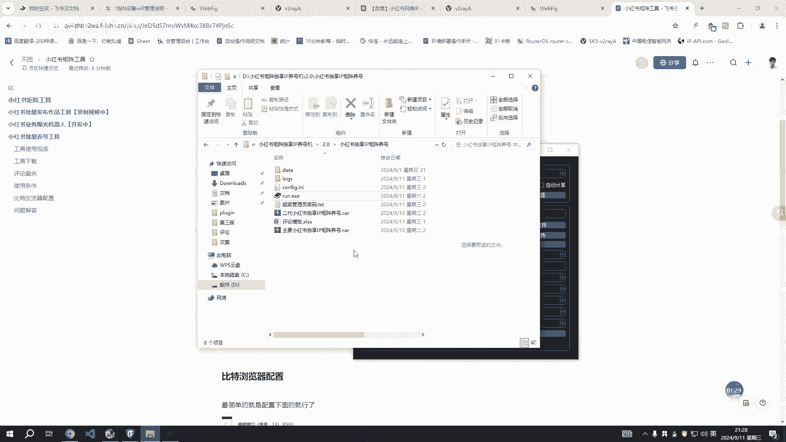

一种是这种这种的，就是你的电脑嗯，受到你本机的保护，不允许去读文件之类的啊，嗯这种就用D盘。

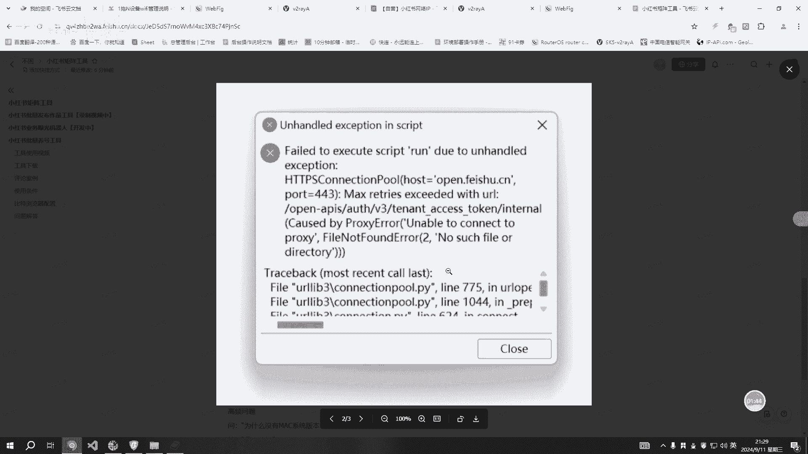

或者把你的杀毒软件之类的给关掉啊，暂时关掉嗯。

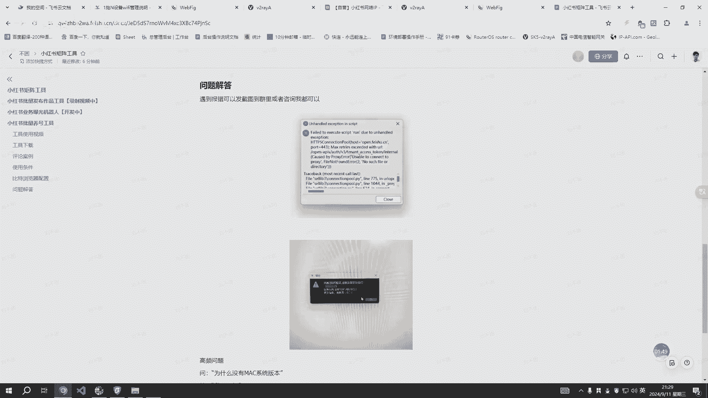

还有一种是这种，这种的话，你直接截图找我就可以了啊，这种暂时暂时必须找我才能解决的掉。

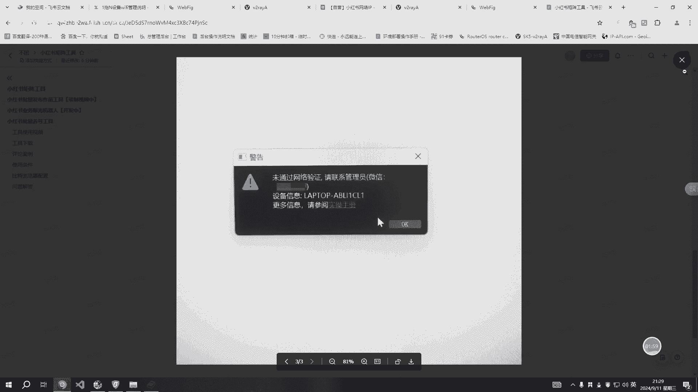

然后没了啊，这里还有很多人问为什么没有苹果版本的啊，这个我没有苹果版本啊，所以没有没有打鼓啊，嗯OK我们试一下，还有一个，还有很多人连比特浏览器都不知道怎么用啊。

比特浏览器呢自己去这里要自己去官方下载啊，我这里讲一下那个配置配置的话，创建窗口，创建窗口以后呢，前面东西都不用管了啊，如果你熟悉了啊，你再去管前面之类的，如果没有的话，你就直接直接这样就OK了。

一键生成一两个账号，本地一两个账号的话，你就一键生成就可以了啊，如果是说你本地有十个账号啊，十个20个或者之类的矩阵了，对不对，那么这个时候你就要去配置这个代理啊，配置这个代理嗯，选择这种。

你去跟你代理说，或者你自己配置网络环境也可以啊，嗯这种的话我我一般的话我本来用的是SK5的，然后这是代理的主机IP，这个是端口，这个是账号，这密码填上去，点击一键生成确定就可以了啊。

这种服务如果你不会搭的话，嗯你可以找直接买别的也可以啊，某淘某宝都可以都有啊，嗯OK然后配置完了以后就这样的看一下，这个我没配置啊，我是用的本地的，我是直接用本地的哈，这没有配置代理的啊。

这个就账号两个账号两个小时，小红书账号就是拿来做演示用的，然后呢嗯配置了端口以后，这里有几个端口呢，这个工具这个工具这里是两个窗口啊，如果你这里有十个，它免费是可以用十个十个窗口的，那么你这里可以写十。

这里有几个你就写几个，或者说你有五个有五个执行，大概两个也是可以的，但是你不能大于它啊，窗口的数量啊，这个是排列，就是打开窗口以后呢，它是有两个窗口，是不是，那么这里就是啧两列，是不是，这这是一列。

然后两列，然后这个是一行一行，对不对，就是相当于是一行两列这样的啊，这是关键词啊，这关键词关键词他就去打开窗口以后，打开那两个窗口以后，他会自己去搜这个职称的啊，然后这个是的评论的模板。

评论模板就选择刚才我们看到这个评论啊，评论模板，评论模板就是一条一行就OK了啊，你想想你的评论说什么话，那么你到这里一行一个一行一个就可以了哈，工具呢工具它是支持支持什么嘞。

支持这个随机评论和循环评论啊，循环评论意思就是就是评论这完这一行，第二条评论他就评定这一行是不是如果循环，如果他随机的话，那就是随机抽啊，比如你这里有30条评论，是不是让他随机抽的，也是OK的。

也是支持的，然后这个呢视频播放，就是我们在遇到小红书上面啊，他有那个视频播放的话，我先打开一个啊，打开一个有视频播放的话。

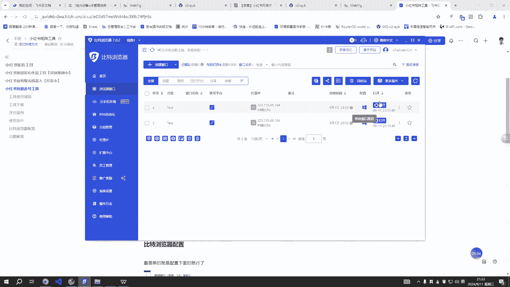

它是可以设置一个，他会去把你这个视频播放到13秒，对不对，他给你看13秒啊，停留时间的话就是这篇笔记，他会给你浏览这么多时间啊，这个时间是随机的，当然这个时间是可以改的啊，你想改多少就改多少。

OK都是可以改的啊，根据自己的习惯来，不过建议新号的话是阀值调，这个也差不多，然后这个的话也差不多吧，我自己测试一下是没问题的，然后这个事说一下概率啊，说下概率的话就是嗯我们小红书笔记的话，就这样的。

是不是1234567，对不对，4567，然后呢它是有概率进行打开的，模拟正常人的操作的话，他不可能每分笔记录去进行打开。

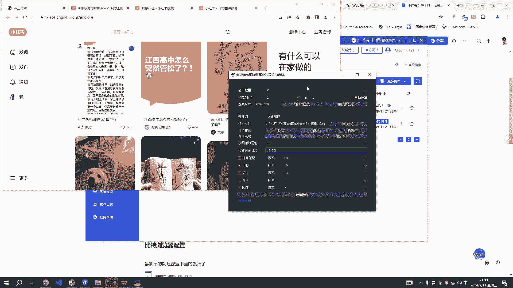

然后呢这里是有概率进行打开的啊，比如说打开一百一百篇笔记，他有68篇，有68，18%的概率是能够打开这么多笔记的，对不对，然后呢这下面都是概率啊，点赞啊，然后这个是关注星号的话，不要调的太高了啊。

这个概率越高，那么它的命中率就会越越高，对不对，型号的话建议建议嗯稳稳重一点啊，评论的话你勾选呢，你勾选它就有，如果你不勾选啊，你不勾选它，就是这些东西都是不生效的，不参与的，然后评论的话。

我这边测试了一下啊，如果你频率太高了，或者关注关注度太高了，他是有概率是进行封的，对不对，然后呢这边频率的话建议建议不要高于，不要高于十啊，不要高于十，新号的话调个2345都是OK的啊。

啊然后收藏这个随意啊，模拟正常人就差不多了啊，你自己去调一下这个比例嗯，其他的没有了，其他的没有了，这里还有一个牌论，牌论是嗯最新最新排列是最新和最热啊，都一样的，这里有啊，这就是关键词关键词搜索。

关键词搜索，然后，没了啊，接下来我们进行一个演示操作，演示操作啊，OK我先关一下关一下啊，然后比特浏览器的，先要把比特浏览器给进行打开啊，打开以后我们先调整好，对不对，先调整好。

把这个你要你是做哪个赛道的，你把这个名字关键字打上去，对不对，我们这里还可以，其实还可以进行多个关键词进行搜索的啊，只是像这样的啊，自称交易，成人成人教育，如果你有多个关键词，就是这样搜索啊。

成交易每页再加一，能力提升，能力提升技能，既然这样的啊，进行搜索就可以了，我这里的话就演示一个吧，这个东西你们自己去测啊，也是一个，然后随机评论最新，然后把模板选一下，模板选一下，九四第三版。

OK评论啊，评论就是刚才我打开的这个评论啊，打开这个评论啊，然后选中它就OK了，然后水平了，这个我调高一点，遇到视频的时候，他调18吧，读18秒啊，嗯十秒吧啊，因为有些视频他可能没有十秒，他没有死。

他多十秒都没有啊，大概就这个意思，然后开始执行，开始执行，先不用点啊，我们要点那个先排列浏览器啊，他会先优先点排列浏览器，它第二步才点这个执行，我们先把浏览器打开。

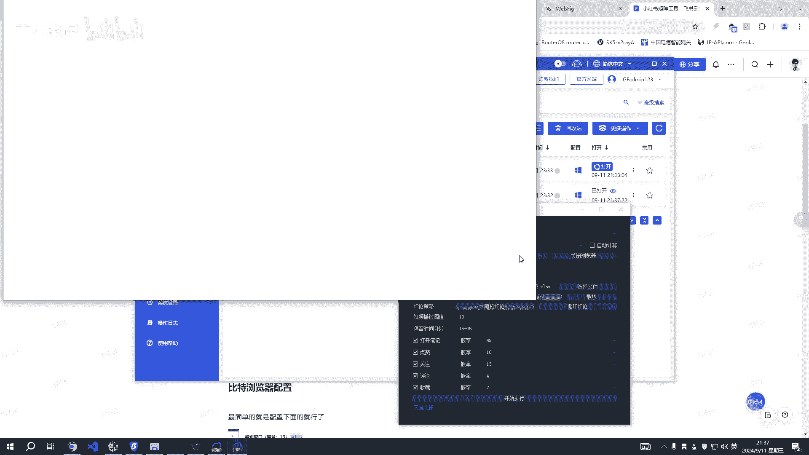

就是两个比的啊，如果是你有多个的话。

那么你自己把这个排序排好啊，就是比如说我要排五个，对不对，那么一列一列排五个，那么你这里就是写五一行，写五列啊，写五列，比如这里是十个，对不对，比如这十个，那么这里是两行，这两行。

那么这个页面就是这里是12345，然后6789十啊，这就是一个面，就十个，对不对，然后这里是二，然后这里是啊，这是一嗯，然后呢等这个全部比特浏览器，你电脑性能越好，那么这个东西循环就这个加载越快啊。

当然了还和你的你的如果你是用了多IP的话，那么还和你的网络的IPIP有关系啊，IP有关系啊，IP设置的有关系啊。

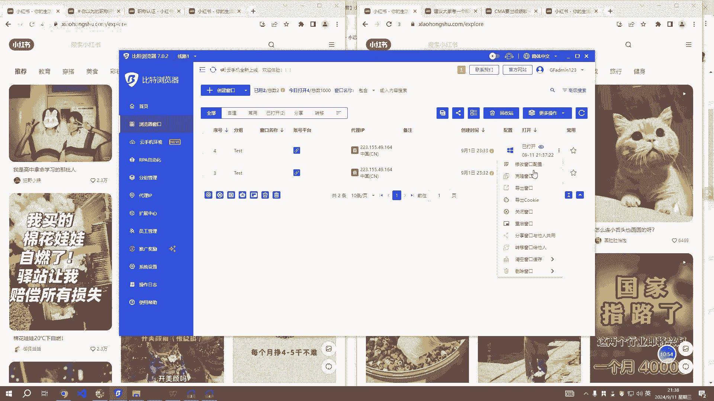

这里面的IP设置有关系嗯，OK然后我们再执行一下啊，开始执行，等下他会搜索这个关键词啊，我们开始执行，两个任务，还有这个运行的时候，运行的时候，他是模拟有一个鼠标在这里在这里动的啊。

所以我们我们在运行的时候，鼠标呢最好最好不要放到这个里面去，要不你会占用占用它的，占用它的，对不对，再用他的那个鼠标啊，相当于里面有两个鼠标了，然后这个时候呢我们鼠标可以放到这个上面。

当然了也可以放到其他地方去啊，也可以放到其他地方去啊，放这里放到空白地方都是OK的，我现在鼠标在右下角这里啊，他这里会一直循环到嗯，把网页上所有的东西，所有的所有的那个笔记。

你的关键词笔记上面的笔记全部浏览完一遍啊，大概一天一天浏览个开三次，开三次就差不多了吧，开三次啊，新号养号目前就是这样啊，做多号一定要一定要去弄那个IP啊，一定要弄IP，要不会会封的啊。

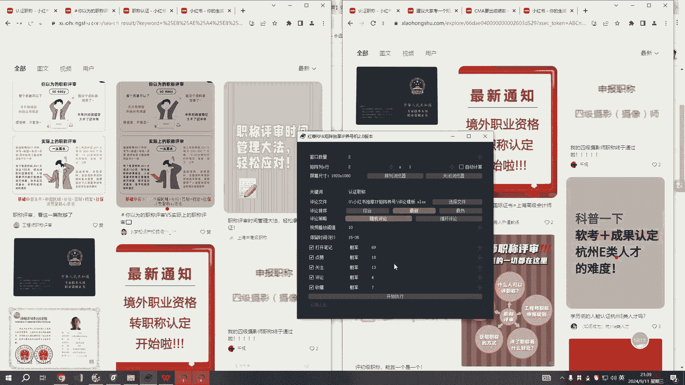

好我们来看一下那个这个嗯，这里都是可以进行下载的啊，你们可以进行下载，然后说一下啊，说一下那个嗯浏览器浏览器比特，然后你的系统系统是用win10或者11都可以啊，啊目前暂时苹果的不支持啊，max不支持。

然后配置这里讲了啊，这里讲了，然后这里报错，这里报错也讲了啊，OK然后批量发布工具的话，我录视频再发出来吧，要不问题点太多了啊，这个曝光机就是还在开发中啊，就这样这几天都会搞定它，等下视频会放到这里来。

有问题的话有问题啊，嗯没有遇到的问题的话，你们可以群里问我或者咨咨询，我都是可以的。

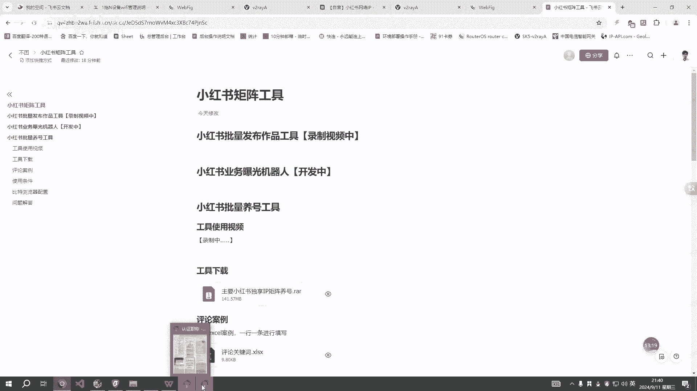

像这个还在这里运行啊，这个先停了啊，先停，目前这里还有一个bug，这个是没法去关闭浏览器的，这个后面发发的时候会把这个bug给修复掉啊，这个目前是没法进行关的啊，这个线程啊没有没有写到位。

这时候如果是想中断的话，目前只能只能点击插啊，然后去手动把这个窗口给关掉，后面的话把这个bug修复以后，就可以一键关闭了啊。

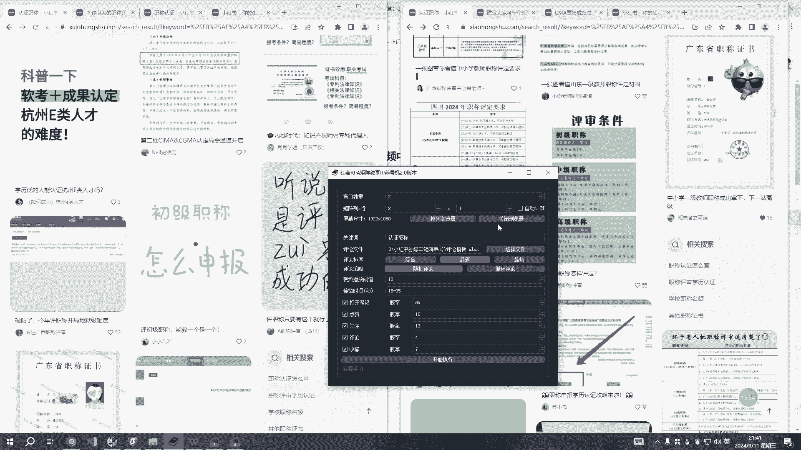

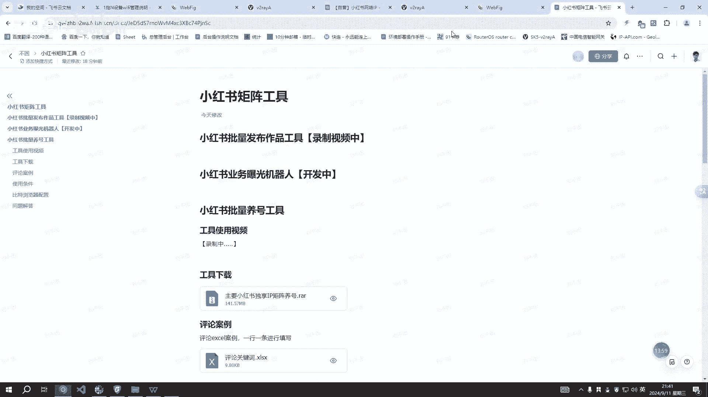