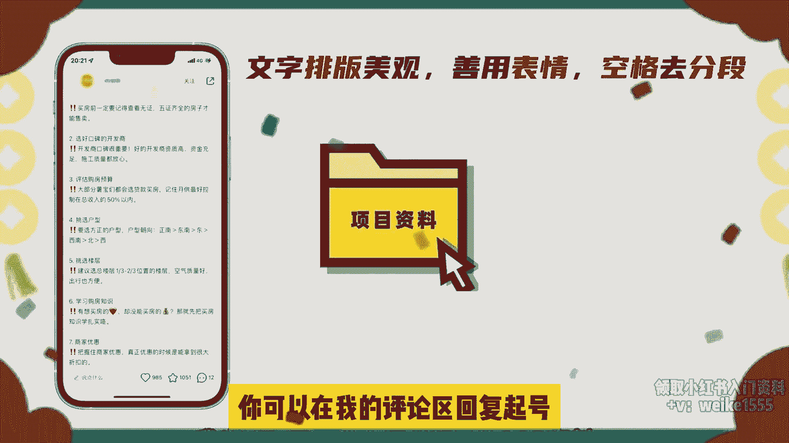

# 小红书起号流程，小红书爆款笔记公式拆解，用这个方法做小红书，再也不用担心流量了。 - P1 - 红书运营小子 - BV19tYseiEtT

分享小红书平台的万能起号法，我现实的一个朋友，在小红书做月子餐的高可单私域销售，依靠这个万能起号方法，几乎条条笔记破百赞，流量非常稳定，每个月变现好几个W，在小红书做爆款笔记是有固定公式的。

但新手做小红书往往都喜欢自嗨，发的东西就很随意，结果就是笔记的浏览量过不了100，想要在小红书快速起号，涨粉变现，就要掌握爆款笔记背后的爆款公式，然后去像素级模仿即可，这个爆款公式包括了爆款选题。

笔记模版跟文案组成，先说如何找爆款，选题，选题是做爆款笔记的第一步，也是最重要的一步，如果你的目标群体对选题不感兴趣，笔记做的再好也没人打开呀，那如何去选爆款主题呢，记好笔记，如图。

在小红书搜索你所在领域相关的关键词，筛选出三个月内发布的1000赞以上的图文笔记，如果没有，就找半年以内发布的1000赞以上的笔记，把他们的爆款选题拿为己用，再说说笔记模版跟文案确定的爆款选题后。

就要开始找爆款模板制作笔记了，我也给大家搜集了五个最容易出爆款的笔记，模板，适用于任何行业，一清单型封面，用好处标题加上干货知识做填充，笔记的文案内容，把每个知识点展开来细讲，用户看了会觉得干货感很强。

会忍不住收藏这种适用于笔记知识点较多，且每个知识点比较简短的内容，二资料型，由所在行业的资料截图加行业标题组成，比如提供各种表格，sop化流程，PDF资料等等，都可以用这种模板去做流量简单粗暴，效果好。

三攻略型，攻略型适用的范围非常广，它的特点是笔记的干货内容要非常细致，具体到每一步怎么操作，一个爆款选题，加上详细具体的执行方法，笔记很容易爆，四种草型，这种以产品为主，种草型模板能让用户的获得感很强。

所以笔记很容易爆，但种草型需要自己有一定的审美，能拍出好看的产品照片，这点非常重要，当然拍照你也可以像素级模仿爆款，图片跟文案里，加上产品的名称，卖点跟效果，五故事型，故事型五版起号也是非常之快。

先展示结果再详细分享你的经验方法，观众看到了结果就非常有幸福感，不过故事性对文案的要求要高一些，另外做小红书笔记，多图效果要大于单图效果，多个干货合集效果要大于单个干货的效果，文字的排版一定要美观。

善用表情，多用空格区分段，这样才是一篇符合爆款的笔记，老规矩，我也整理了一份小红书的实操教程等资料，你可以在我的评论区回复起号。

我分享给你，那今天的分享就到这里了。

