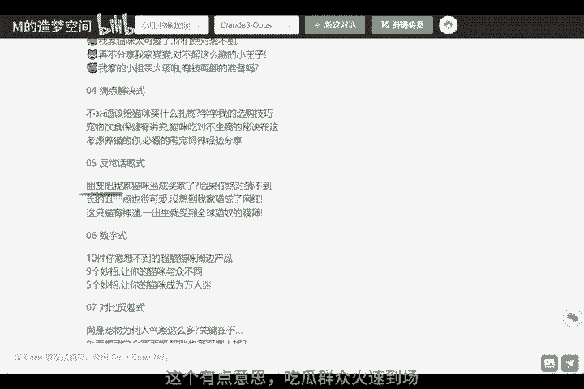

# 小红书起号运营，标题很关键！宝藏AI应用，给你流量密码 - P1 - M的造梦空间 - BV11D421A7o4

🎼听说你也开了小红书，浏览三个三位数，都要举杯庆祝too young too naive，人家动不动都是上万的，好不好？为啥标题不够辣眼睛咋整？一款小红书爆款标题助手只需5秒给你流量密码。

🎼今天历荐的这款AI助手，依靠世界最先进语言模型chatGPT的算法支持，提炼出了若干爆款标题公式。你只需告诉他文案主要内容，它就能针对性的给出数个吸睛标题，供你选择，眼见为实。

🎼文案是给办公室白领推荐这款空调毯，这里注意一下GPT3。5效果不好，我们要选择其他的语言模型。🎼冻成狗，哪款空调毯才能让我充实温暖，这个不错，可以引起情感共鸣。🎼继续安利一款防晒霜。🎼这个还不错哦。

对比反差。🎼际痛点。🎼炫耀我家小猫咪。

🎼这个有点意思，吃瓜群众火速道场。🎼有了这个爆款标题助手，是不是感觉爆款分分钟手到擒睐？🎼希望这个AI助手能帮助你创作出更多优质内容。

