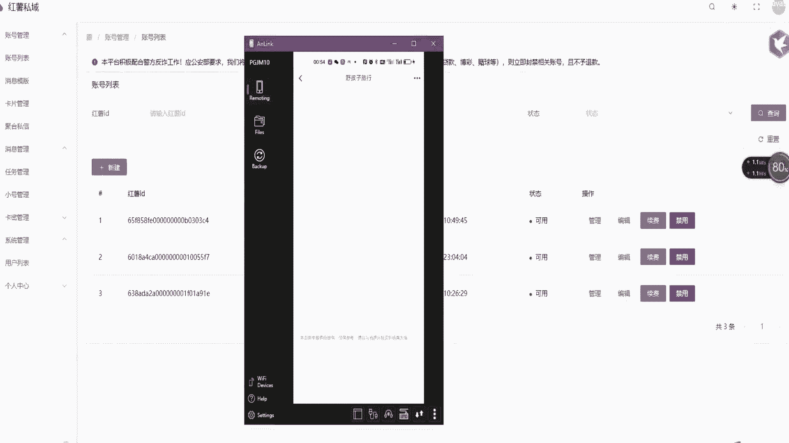
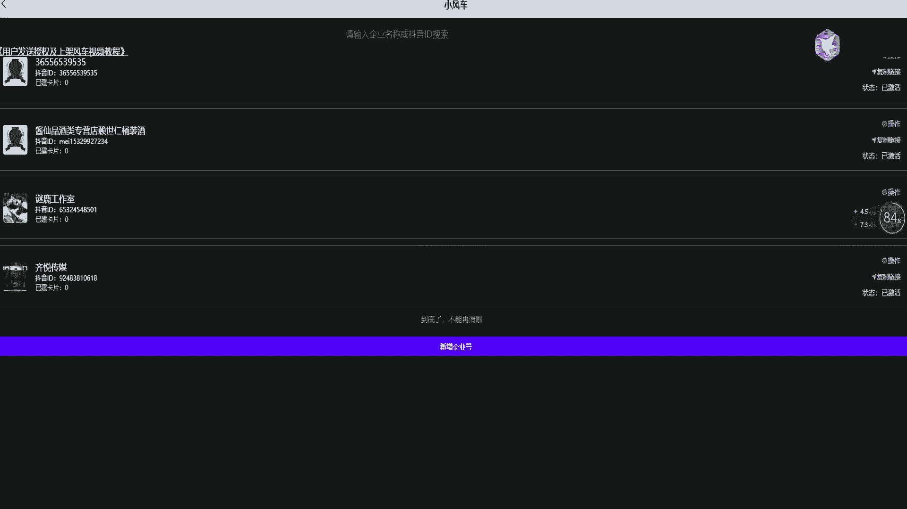
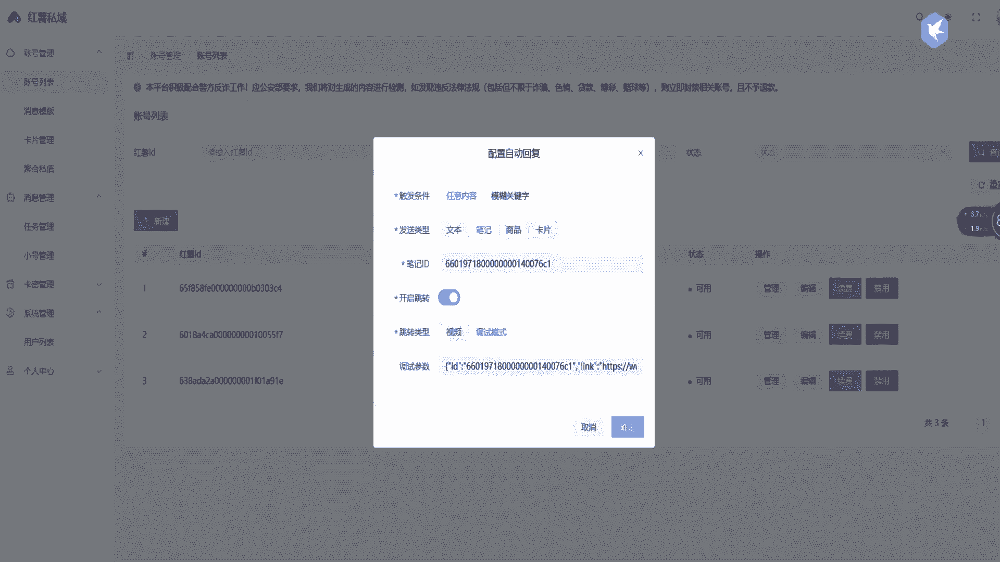
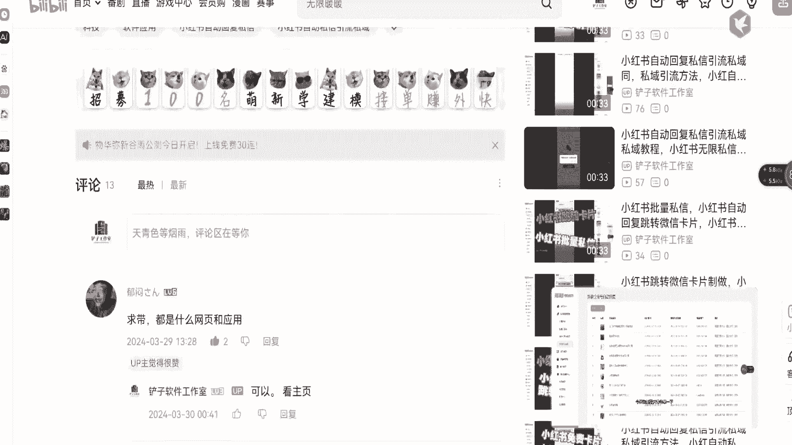

# 小红书跳转微信卡片免费生成方式 ，小红书批量无限私信是如何设置，小红书抖音跳转微信卡片，小红书跳转微信教程，小红书私域运营到微信教程，小红书自动回复私信回复 - P1 - 铲子软件工作室 - BV1Vz421Y7aa

这种小红书跳转微信的卡片是如何生成的，今天就来给大家讲解一下。

首先你需要搞到一个账号，点击账号管理，新建账号，输入账号，邮箱和密码卡片，你也得需要搞一个，点击确定你的账号就绑定到后台了，点击管理设置回复信息，你可以设置文本回复，笔记回复或是卡片回复，设置完毕后。

点击确定。

再点击启动你的自动回复就设置好了，有什么不懂的。

