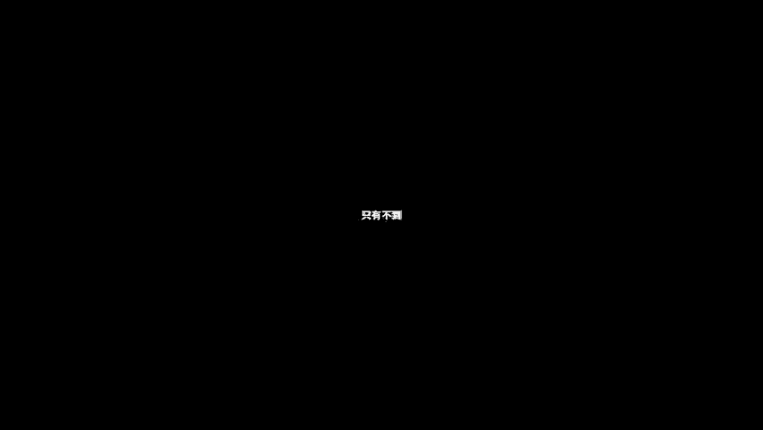
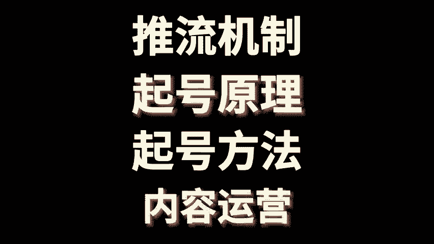

# 小红书运营从入门到精通，仅需搞懂这4步！ 分享小红书起号运营教程，小红书运营教程视频，小红书新手起号，小红书新号如何快速起号，小红书运营技巧，小红书运营课程！ - P1 - 黄一恒矩阵引流技术 - BV1f7szecE2f

真有不到百之的人搞懂了小红书的没有机制、喜好眼理，其他方法不能赢。我注册了几十个账号，发了上千遍P例测试，总结了这十几分钟的视频。😡。

🎼nice虽然有点长，但讲的很透，现在可观察能把这条视频看懂的人，压根就不缺什么流量。一个视频给你分享小红书运营，从入门到精通请析搞懂这是不落地教材有点长，记得先收藏。

一起来看我给你分享小红书的推流机制，其号眼理，其号方法，内容运营到底该如何来做。首先来看小红书推流机制。小红书是一个点击为王互动为后的平台，点击率直接决定我们观看量的下限。

比如说你发布笔记流量是2005001000035000，主要就取决点击率，而点击率呢最主要是由什么封面决定的，是完好方面，小红书流量根本就不差。点击率低的时候，连鼠条广告都没有办法正常进行。

而互动量决定我们观看量的上限。这里面呢比如说你发布完笔记之后，刚开始是一两千的流量。后面能不能突破5万10万，就取决于小红书的用户反馈算法，我们也称之为叫做CS分。

点赞1分，收藏2分，评论4分，转发4分，关注来8分。接下来小红书就需要打标签。发布完内容之后啊，系统会对你的笔记进行打标签，标签录为大标签，大标签呢大概有30多个，随时在更新。我们打开首页点击小三角。

这里面就会有很多的标签，这些标签啊都是流量比较大的，每个标签下面又分支为细的标签，就比如说现在我们点录音，录音里面呢，它又分为很多小的标签，比如说什么录音装备录音地，还有呢录音搭字录音经验。

这些就是小标签。接来看一下内容的分发机制。首先小红书它会根据兴趣标签来进行分发。比如说你近期的这个点击行为，互动行为，搜索行为都会决定你刷到内容。所以咱们如果打开这个首页，在首页这里面刷到内容。

这些内容就是你最近的一个什么兴趣爱好，还可以这么理解。然后呢，小红书有一个重定向。机制哎，这一个非常重要内容它会优先推送给给你产生互动过的用户。比如说有给你的笔记点过展的，收藏过的评论过的，关注过的。

他会优先看到。哎，这就是重定向低值。其实啊还有一个初次的分发曝光量。那么这个初次的分发曝光率呢，它是有流量成绩来决定的。是由最近30天的观看以及互动数据决定，如果你整个账号最近30天流量拉的比较高。

你发布完之后，基本上你的流量都是两三千。如果你最近30天整体流量都没超过500。那你想过500的难度也是比较大的。而流量的这个成绩啊，它主要影响的话，就是同的内容，它不同的流量成绩呢。

也会获得不同的曝光量。比如说有的账号发版之后150，有的账号是500，就是因为A账号它的流量成绩太低了。B账号流量成稍微高一些。甚至有的发布之后就可以获得一两千的流量。来看一下小红书的流量词推荐机制。

首先小红书有一个千次曝光得分。那么这个千次曝光得分是个什么东西呢？它是由CES得分除以曝光量再乘以1000计算出来的。那么CES前面讲过了，点赞收藏凭均转发这些数据。

那么当你的这个千字曝光得分比较高的时候，它就会进入到流量层里面。小红书共有8个流量池。当我们的千字曝光得分比较高的时候，就进入到下一个流量池。比如说最开始的初始流量池，大概只有200个流量左右。然后呢。

如果它的数据反馈比较高，就进入到基础流量池200到500。然后呢，再进入到三级流量池，500到5000万流量池5000到2万，潜力流量池2万到20万，热门流量池基本上就已经达到了这个20万到500万。

这种已经是上了大热门的。那爆款的话就是这种500万到1000多万，前占流量词基本上就是。红书大部分的活跃用户最近的都能刷准的笔记，这种已经能够达到1200万到3000万之间了。

这些呢都是由我们的千字曝光得分决定的。千字曝光得分也高，就能够进入到更大的流量池里面。那得分不足的时候呢，通常就会卡在200，没有办法进行扩散。这时候咱们就要返回来去优化一下。

看看我们到底是卡在什么地方。好来看第二个小红书的其号眼里，小红书啊一共有三个阶段，最开始当我们注册一个新账号会进入到观察期，那什么是观察期，你可以这么理解，新账号注册之后，系统不确定你的质量。

它会限制流量，通常表现为新账号发布的时候，流量很低，或者根本没流量，正常这个账号你去发可能会有2000流量，结果它只给了你200个流量，这就是系统的一个观察。它会识别风险，避免了违规内容。

所以咱们在操作的时候，如果是敏感行业，用户发布了违规内容就会导致账号被限制严重。直接方进。那操作的建议啊，大家做的时候，前期啊内容需要脱敏，避免是营销敏感内容，尽量发一些利他性的干货内容。

帮助账号快速的度过这个观察期，好，第二个阶段识别期。当过了观察期之后，有的快的一个星期慢的一个月，接下来会进行识别。什么是识别期。也就是说系统会识别你的内容到底是跟哪些标签相关，推荐给那些相关的人。

所以一个内容好与不好，他是企结推给什么人。比如说你喜欢录营，把录音的内容推给你，这就是好内容。如果推给你的对象推给老婆，他对这个完全不感兴趣，这个内容啊就是差的内容。所以呢我们要过识别期，最简单的办法。

就是发用户经常搜索的什么内容，帮助用户来快速的过识别。比如说现在如果我是做这个净水器的，那我在发任容的时候，我就尽量发这些搜索下拉库里面推荐的选题。重选题，更快的能够帮助我们的账号。来过这个识别期。

那咱们在操作的时候，它有两种标签，一种呢是内容标签，也就是我们发布版之后，这条笔记所对应的内容。第二个呢是用户的一个反馈标签。比如说用户看完的笔记之后，它会产生这个互动数据，比如点赞肯率收藏。

这时候又会产生用户的反馈标签，系统认定内容匹配度越高，那么就决定我们的这个推送力度呢占区越大。如果你的内容打上了这个比如说录营装备，刚好这个人对录营装备感兴趣，标签完全匹配。

流量就会进入到下一个流量池里面。那么操作方向呢就是专门做搜索流量，帮助账号快速的度过这个什么识别期。好，第三个才是入职期。那什么是入职期，内容发布版之后，前几天流量比较低，可能就只有两三百三五百。

隔了一个星期之后，隔了三五天之后，流量突然就变成了3000500一直在不断增加，内容就代表已经进入到了流量池里面，流量突然就增加。那怎么加速进入流量池的，有一个办法。投鼠条那投薯条一个好处。

它是可以强制触发人工审核，快速度过观察期。那么操作步骤啊就是我们分为两次投放。第一次呢咱们就投这个点赞收藏，拉高CS分。第二次投放的目的啊是为了啊增加我们的浏览量或者播放量。24小时你就调整一下。

那么投放次出来两次就可以了，没有必要投太多投鼠条的主要意义就在于什么？就在于强制过程，加速过观察器，提高出储流量，快速的拉高流量增长，帮助我们的账号打上标签，帮助内容打上标签，匹配给那些更加精准的人群。

好来看一下。第三个小红书的起消方法，有两个。第一个是搜索起法是目前行业里面做起来最简单的。核心的目的就是让系统识别也是做什么的，推送给那些相关人群，快速的获得用户的反馈标签。并且我们搜索完之后。

比如说现在啊我去做一个净水器怎么选。因为这个观键是需求非常明确。用户看完之后反馈也是非常明确的，很容易帮助我们账号来打上这个标签，所以咱们利用搜索流量。红书啊它的搜索流量占比可以说是达到了30%以上。

有60%的人打开小红书，首先第一时间就会进行搜索来解决问题。因为它是带着问题来的，操作步骤来，就是我们直接。在你的赛道里面搜索关键词，把这些下拉词全部整理下来，就发布这些选题相关的，就可以快速的起号。

那这里面呢有几个注意细节，大家一定要注意啊。首先在做笔记的时候，尽量优先选择收藏数大于点赞数的，更加容易卡关键的排名。那么如果你是去超爆款，洗稿内容呢一定要替换30%，避免被看白印。

标题呢一定要不按关键词。标题的权重是大于内容大于标签，大于话题的封面呢尽量照抄，点击里进验证啊，谁抄谁报视频笔记的话要复制文字，放到笔记内容里面，封辨系统识别内容呢不要带营销广告。

避免里头竖条都审核不过。好来看第二个方法叫做骗评论巧法。这个方法它其实是利用评论来拉高我们账户的得分。因为评论在CS里面，它是给到4分的，四分相当于一条评论顶得上四个人点赞，顶得上两个人收藏。

评论分呢是获取流量最快的一个方法。那我们就可以什么利用用户来提高我们账样的评论，这里面有一个最简单的办法，叫做极限二选一。

其实让用户看完之后做选择题A和B选一个一和二选一个你和我选一个那这里不会做的没关系，咱们直接打开小红书搜索关键词，极限二选。你看看一下啊，这里面有房间问题，衣服沙发项链每个赛道都可以玩啊，太多的。

你看听说感情也好的两个人口味相近，极限二选一。然后呢你再往下方来看极限二选一厕所地板砖到底选哪一个点进来看，你会发现有1700个人进行评论。这1700个人以。顶得上六七千个人进行什么点赞了。好。

再往下方滑你会发现各种各样的都可以有这个什么。啊，每个赛道都在玩汽车赛道的二选一，然后呢手着赛道的二选一。你看你打开看一下这个赛道，那么1000多个点赞，二选一，很多人都在晒自己的。

所以直接套用就可以了。还有一点简答题，直接问对方就可以了。说出你最喜欢的层次，说出你最喜欢歌，说出你家里面装的净水器，说出你家里面啊，那么最不好的一个电器。你看这些都是什么简答题。

核心点就在于什么降低用户的成本，让用户来直接就参与评论，不需要思考，不需要动脑筋，直接答案已经给他一制好了，就像我们做一个投票一样的，直接投票也就是什么搞定的。好，来看第四个小红书的内容运营。

在运营小红书的时候啊，我们可以分为流量型内容，流量型呢就是人量特别好啊，转换率来比较低，它属于宽口内容。比如说现在我们做装修的。我们在发布的时候呢，就可以选择那种比如说2024年最流行的装修风格。

这种选题啊，它的范围特别特别广。无论房止大小还是装修状状态。用户基本上都未感兴趣，接下来我们就可以发布这个什么营销型内容。那么营销型内容就是转换率特别高。但是呢流量稍微小一点，称之为叫做窄口内容。

比如说还是做装修。那咱们在发的时候，大面积差几方怎么装修。这种呢就是目标群进行限定了，只针对大户型，不是大户型，他就不会来看，咱们就吸引大户型，专门针对大户型来提供这个什么装修的一个啊风格。

还来看一下那种策略，咱们在做的时候两者配合。那么流量型内容来搞流量，增加曝光，拉高账位的基础权重。营销型动来做转换成交订单。这体在做的时候，我们可以用这个久浅一深钱的话它是为了触达潜在的用户，也就是。

触达想要气的用户。就比如说现在我们做旅游，做这个西藏旅游的那我在发笔记的时候，我就可以发这个西藏美食攻略西藏拍照自教学。因为这些只要是对西藏对旅游感兴趣的，大部分都会看。但时呢他的意向度是比较低的啊。

能够获得很大流量。接下来深的话就是转换目标客户。我们可以发一些国庆定制胡杨林小包团高奢纯安绝美。啊，这种比记就是只能够转换那些已经决定气的客户无法触达那些详细的啊。

详细的呢他只会看这种那么当这个阶段过了之候，他才会挑到第二阶段里面。咱们两者配合久浅是为了获得很大的曝光，一升的话是为了什么获取目标客户进行转换。好来看一下策略的应用。浅呢是流量内容引流，只浅不深啊。

有流量没有成交。所以说伙伴是越做越犯，泛着泛着呢跟自己行业完全不相关了，这就是错误的打法啊，深的话就是营销内容进行转换，只浅不深呢就会出现只能依赖已有的顾客没有办法获取到新的客户。好，各位同学。

这就是小红书整个的底层逻辑。如果咱们想更快的去玩好小红书，其实还有一个标。打法就是做小红书的集成账号，一个人做10个号，用概率来唤取成功率，用账号来对抗平台的不确定因素。

而且10个账号一个账号一天搞10个顾客，10个账号一天就能够搞100个顾客。这些呢我都给大家准备好了资料。首先有我们小红书的入门引干货框架，帮助大家了解小红书的收入机制，运营工具，啊。

企业号的运营以及KOY的投放，还有小红书的爆款选题表格。咱们在做选题的时候啊，千万不要盲人摸相，一定要学会开建考试，学会用工具，挑选这种收藏比评均比分享比比较高的优先性操作，这种呢更加容易爆。

比如这里面可以看到145的收藏比，100个人点赞会有145个收藏，这种就是收藏大于点赞的。而且咱们不是挑一个做一个，而是从10个里面挑一个挑两个来进行什么制作，更加容易报。

还给大家准备了小红书3个小时的系统引留客。有小红书的前流程、钩子设计导流方法，常见问题以及变缘项目，这些通通都已经打包好了。可以找我，我来分享给大家。好各位同学，我是黄一涵，只做落地推广方法。

刚才给大家分享了小红书的底层逻辑。如果咱们想获得更多流量更多订单，我们得学会做多流量管道。这里面我给大家准备的18个品台的详细打法。小红书啊，就是其中一个教大家如何打造多流量管道，这些呢都是我原创的。

可以通过主页来连接进行学习。如果觉得今天视频比较不错的，请大家一键三连，感谢大家支持，咱们下个视频来再会。

