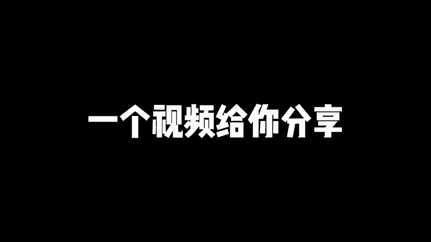
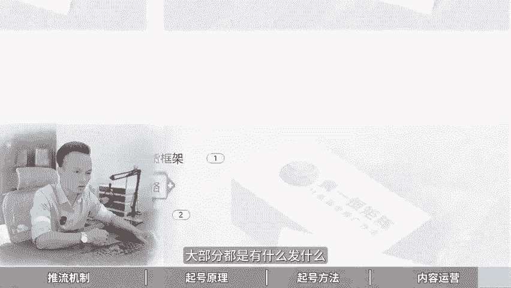

# 小红书运营底层逻辑，小红书从0到1起号完整运营攻略！ 分享小红书运营教程，小红书运营逻辑，小红书起号教程，小红书起号流程，新手小红书如何做，小红书起号运营教程 - P1 - 黄一恒矩阵引流技术 - BV1ks4qevELU

🎼这是一天时长高达十几分钟的小红书从0到1应周面。我花了7天时间制作这个思维导图，把我们操作几百个账号，几年的经验全部汇总在里面，一共包含4个部分，小红书推读机制、小红书起号原理、小红书起号方法。

小红书内容意营，合计知识点加在一起超过100多个。🎼尤其是最后几个非常会三观，请定要看完一个视频给你分享小红书运营底层逻辑。小红书从零到一起号完整运营攻略详细教程有点长，记得先收藏。一起来看。

我会给你分享小红书推流机制，起号眼理，起号方法，内容运营到底该如何来玩。首先来看第一个板块，小红书推流机制，小红书它是一个点击为王，互动为后的平台。什么意思？点击率它会直接决定我们观看量的下限。

这也是为什么有的伙伴发笔记发布完之后啊，基本上隔个一两天，流量都能达到5000到1万。而有的伙伴发布完之后呢，流量只能达到200到500，这就是点击率造成的，点击率它会决定用户是否看到你的这个内容。

点击率比较低的时候啊，甚至我们去投放这个薯条广告都没有办法正常进行下去，广告费都刷不出去。那点击率是由什么决定的呢？最重要的就是由这个封面决定的。所以咱们在做的时候，不管做哪个赛道。

我们的封面一定要设计的好。

些可以参照一些同行高点击的方面来设计。如果你封面设计的不好，你发不完之后流量就会非常的差。所以很多伙伴发笔记啊，账号没问题选题没问题。为什么发布完之后，流量只有200到500。

就是因为你的封面点击率太低了。另外一个是互动量，它会决定我们观看量的上限，什么意思？那么下线是比如说你发布完之后，如果你做的比较好。你发布完之后打底都是5000流量起步。

那5000流量发布完之后隔了一段时间一共获得了5万流量还是10万流量，这个叫做上限。那么上线的话，它主要是有这个互动来决定的，互动里面呢，它是有一个叫做用户的反馈算法，我们也称之为叫做CS评分。

那么这个CES评分啊，我是这样给他打分的啊，点赞数打一分，收藏数打2分，评论数打4分，转发量打10分，关注打8分。所以的笔记发布完之后有多少人给你点赞收藏评论转发关注。

就决定这篇笔记到底能够进入到多大的流量层面来。所以。咱们做小红书一定要学会玩点击，甚至有的人用了一些比较极端的方法去骗点击流量确实比较高。第二个呢就是我们发布内容的时候，要学会去打这个标签。

相当于平台发布完之后，他会点的内容打标签。如果内容做的不好，或者不够明确，标签打不上，流量就会非常的小。那这里面分为大标签和小标签啊，大标签的话，一共有37个大标签。也就是我们打开这个小红书啊。

点击最上方的小三角，在小三角里面，目前已经更新了接近40个左谓的什么这个大的一些标签。那么在每一个分类里面，比如说我们点这个录营，录营啊是一个大的标签，在录营下面它又分为比如说录营装备，录营地点。

录营搭字，录音的时间等等这些小标签。那么这个小标签的话，它是在每个类目下面都会有很多啊，这个呢是根据用户的信趣爱好来决定的。比如说用户他对这内容感兴趣。只要一多，他就会集合出一个标签出来。

接下来咱们来看一下第三个内容的分发机制。那么小红书它是一个兴息标签分发，什么意思？比如说为什么我打开首页会刷到这些内容？就是因为根据我近期的一个点击或者近期的互动行为。比如说你给别人啊能互动的。

或者点击的某个标签比较多的笔记啊，这段时间你就能够刷到这个你很多的笔记。比如说这段时间我在研究个录营啊，那我打开首页，它就给我推荐录营的笔记。另外小红书里面有一个重定向机制啊，什么叫重定向。

就是内容会优先推荐给以及互动过行为的用户什么意思？就比如说如果你点过我的两篇笔记。那么在后面呢你大概率更容易刷到我这个账的笔记，这就叫什么重定向机制。其次小红书的初自分发曝光量的话。

它是由我们的这个流量成绩来决定的。流量成绩你可以这么理解你发布完之后，为什么你的流量非常小，最抓的原因就是决定你最近30天的观看量互动量数据决定的啊，这也是前期我们在做的时候有一个观察期。

观察期过的时候，如果我们数据拉高了，比如说你最近一段时间发布的笔记啊，平均流量都在3000。好，这个报光量呢是就比较不错。那有多伙伴发不完之后，可能最近30天只有300，那么流量的。这个成绩的影响。

比如说同样的内容，不同的流量层绩，它会导致不同的曝光量。比如说A账号，哎，我们150的小眼睛，B账号500的小眼睛这是什么意思？比如说我们把同一个选题，同个内容，通过呃修改系统之后发布到两个账号里面。

有的账号流量高，有的账号流量差，就是因为它的这个成级呢会不太一样。来看一下第四个流量词的推荐机制啊，那么小红书前面讲的1个CES算法，它会根据这个反馈来进行推荐啊，决定我们的流量上限。

那么小红书在推理的时候，它其实一共是有8个流量词的啊，比如说刚开始会有个呃300到500，300到500过后之后会有个100到200000过之后大概有个8000到9000左右啊，那么高分内容呢。

它会推送到下一个流量池里面来。如果你的得分不足的时候啊，内容就可能卡在200里面没办法扩展。为什么没办法扩展？就是因为你的这个CES评分太低了啊，或者是我们前面讲到这个点击率太低了。

就可以从这个点上面来重点进行优化。接下来看第二个板块，小红。起号眼里。那么做小红书怎么去起号，它有3个，第个叫做观察期识别期和入职期。知少你伙伴少搞混淆的。我们来看下第一个就是观察期。观察期的话。

你可以这么理解。刚开始我们一个新账号注册完之后，系统并不确定你这个账号到底是来干嘛的，有可能什么是来捣乱的。所以它不确定你的用户质量啊，从而会限制你的这个流量，就类似于比如说原来我们疫情的时候啊。

你从外地回来，他不判断你到底有没有病啊，所以他给你隔离一段时间，隔离完之后呢，再给你放出来，大概就这意思。所以常见的现象就是什么新账号发布内容的时候流量很低或者没流量，这个是正常现象。

因为你还没有过这个观察期啊，那么系统呢他会去观测你啊识别风险，原来避免你的这个违规内容，所以咱们在做的时候啊，那么你就需要把这些敏感词稍微注意一下啊，敏感行业来咱们在发布的时候。

如果发布的违规内容就很容易导致啊，那么你的账号很难跳出这个观察期，流量都非常小。操作建议咱们在做的时候呢，初期发布的时候，内容需要进行脱敏。那怎么脱敏呢？我们需要避免发布一些营销内容，尽量不要发营销类。

相当于前期比如说第一个月半个月，你就尽量发一些这种干货型的逆他型内容，帮助账号更快的度过这个什么观察期。好，当我们账号度过了观察期。接下来我们就可以开始进入第二个阶段，就做识别期啊。

那么识别期一个笔记好与不好，他是企业推荐给什么人。比如说你喜欢录营，录营的笔记发给你，就是好笔记。那如果你发给你对象去看对象根本就对你不感兴趣，他就觉得这是个差的笔记，所以什么是识别期。

系统需要识别的内容类型，决定推送的对象。一旦匹配上就是精准流量，匹配不上就是泛流量。那么过识别器的方法呢，就是我们需要发用户经常搜索的一个内容来帮助用户进行一个识别。哎，这个什么意思啊？

就是我们打开这个投屏，在上方搜索框里面，比如说我们这里面搜索这个关键词啊，比如说我们搜这个录营。那么搜索完之后呢，这里面有很多的这些热门选题。我们发这些就更容易被系统所识别。

因为这些都是一些什么高频的需求。而且标签这一块啊，它是可以分为两个板块的啊，一个是内容标签，什么意思啊？就是根据你发布的内容，系统识别之后，他会打上一个标签，然后呢用户他刷到你的笔记之后，他会给你反馈。

比如说会进行点赞会进行互动，会进收藏类的。那么这个呢我们称之为叫叫做互动标签，所以系统认定内容匹配之后，就决定这个推送力度，推送完之后，哎，再根据用户的反馈来打标签。最后来得到一个什么啊标签。

你可以这么理解。所以咱们在操作的时候啊，那么我们可以做搜索流量，快速的什么过这个识别器，也就是我们做一个赛道，我们输入关键词之后。然来把这里面的这个什么这个关键词拿过来发发这一选题就能够快速的过识别期。

那么第三个叫做入职期啊，什么叫入职期，你可以理解为内容发布之后，前几天流量很低，随后流量增加，内容就是代表什么进入到流量池里面了，流量突然变成了比如说原来的500变成了23000，基本上你刷新一会啊。

那么流量就增加了几三百个真的很爽啊，隔一会看一下哇，又来了，隔一会看一下流量又增加了，这就是什么入词了啊，那么如果想加快入词。第一个我们可以去投这个薯条。因为薯条的话。

它会强制性触发你的比较进行人工审核。那人工审核它就会直接让你的账号跳过这个观察期，直接就进入到这个识别器里面来，相当于就在第一个阶段就省的时间啊，那么操作步骤呢就是我们分为两次投放啊。

第一次投放呢我们在投放薯条的时候啊，可以选择这个点赞收藏，来获取我们账号的这个什么CS平分。那么第二次我们在投放的时候呢，就可以24小时以后再投了，就投这个浏览量或者播放量。啊，两要次再投。

那么在投的时候不用投太多，投太多了也没什么效果。一般两次呢是刚好什么恰到好处，而且是什么比较微妙的。那么投诉它的意义就在于什么？那么强制过程加速过这个观察期，那么提高我们账号的初始曝光量。

拉动什么流量增长。啊，这就是我们讲到的第二个起号的原理。接下来看一下具节我们在做的时候，到底该如何去起号。咱们来看一下小红书的起号方法。那么首先我们可以通过这个搜索起号法是目前最简单的一个打法了。

那么核心目的就是让系统快速的识别到底是做什么的。那么系统呢就推给合适的人群获得用户反馈标签，有的用户反馈标签之后啊，我们的账号就获得个精准流量，所以咱们在做的时候可以利用这个搜索人来做。

因为小红书的搜索占比啊可以说达到30%以上，60%的用户呢打开小红书，首先就会什么进行一个搜索，那具体怎么操作，比如说我们以这个净水器为例啊。首先咱们啊打开这个小红书在这里面我们搜索关键词净水器。

那么搜索完成之后呢，这里面就会有很多多的下拉尺，那咱们把这些下拉词拿过来啊，进行啊做选题做内容啊，这就是什么搜索起号法。那这里面有6个注意细节啊。首先第一个就是尽量挑选到种搜藏数大于点赞数的内容呢。

卡搜入排名，这是第一个。第二个呢就是洗稿的时候，内容一定要超过30%甚至50%，避免背叛搬或者违规。第三个标题一定要卡上这个下拉尺。因为标题的权重是大于内容的，有的伙伴只在内容里面卡标题没卡。

就导致有排名，第是呢方便尽量照抄，因为点击里已经验证过的，你自己研究的方面，点击率非常差，毕竟点击你前面讲到，它决定我们流量的一个什么下线的。如果你发的是视频笔记要复制我们的视频内容啊，复制一部分出来。

方便系统识别，否则你光打个标题，有可能会识别不出来其实内容不要带营销广告啊，避免薯条不过程啊，就发那种内容干货型的这个笔记。那么第二个呢叫做它叫做骗评论起号法，也称之为叫做骗频起号法啊。

那么这是一个非常流氓的起号方法，利用评论。来获得这个得分。因为评论在CS里面我们回顾一下，他是可以获得4分的。如果一个用户进来之后给你评论，相当于等于什么4个人给你点赞，两个人给你收藏。

所以评论是获取流量最快的一个方法，那我们就可以去诱导用户来进行评论啊，这里面有个叫做叫做极限二选一。什极限二选一呢，就是让用户做AB选择题。

比如说我们打开小红书在上面搜索这个极限二选一可看到这里面就有很多很多美食美食房间、沙发穿搭甜品衣服、项链、音乐啊非常非常多。你可以看到啊，那么两款高纯度的这个仪让你选。

然后呢净水器让你选然后呢到底哪个性价比比较高。你看这些全部都是极限二选一极限二选一打开这篇笔记之后，你会发现它的特点就在于什么用户评论量非常高。你看这一篇笔记啊，一点4万的点赞。

就有3万多人在评论这3万多人全是选一全是选二，就是用户在选择的时候呢，它是没有这个难度的，就是直接输入一或者2就可以了。比如说你可以。这里面很多啊，比如扫地机器人二选一。然后呢，这个临时二选一。

我们点开之后可以看一下，你看2000多的点赞，5000多的评论啊，这个流量就拉的很高了啊。另外一个就问答题啊，问答题就比如说啊你让用户去。回答的问题，比如说说出你最喜欢的城市，或者说出你最喜欢的一首歌。

好，这些你都可以去参考一下。比如说我们返回来在搜索框里面重新搜索一下啊，你最喜欢的城市你可以看一下，那这里面就有很多人去给他互动，说出你最喜欢的三座城市。咱们看一下啊。

500多个点赞就有5000多个评论量，这个频论量是不是啊提高了这个10倍以上。那么核心点就在于什么？它能够降低用户的一个成本。所以呢咱们在做的时候，这个片频起法啊，真的是特别的好用，而且用起来贼猛。

好来看第四个板块，小红书的内容运营。那么小红书啊，我们在发内容的时候，到底该发什么？首先第一个我们可以发这个流量型内容。流量型内容就那种流量呢特别的好，流量特别的大，但是转换率比较低。

说简单点就是这种东西大都喜欢看，但是付费的人并不多，这种内容我们也称之为叫做宽口内容啊，就比如说现在如果我们是做这个装修赛道的做装修行业的。那咱们在做的时候，我们就可以发一些这种宽口内容。

比如说2024年最流行的装修方格，因为这种内容它是针对那种嗯小白，而且是刚接触这个板块的这种用户群体。那么数用范围广，无论是房子大小或者装修的状态，用户都会感兴趣啊，这就是什么宽口内容。

那接下来我们还需要发第二种叫做什么营销型内容。营销型内容就是转换率非常的高。但是你发放的流量比较小，说简单就是你发布完之后，你的流量可能只有啊10000但12000里面已经产生了很多的订单。

我们也称之为叫做窄口内容啊，再以装修为例。比如说我们。发装修的时候，大平层差啊，机方怎么装修啊，这种就是什么？他就定位的非常细，也只有用户他会买这种大平层才会来看这个内容的目标群体来做限定。

就针对这个什么大户型的用户啊才会来看。那这种用户流量不是很大。因为他更加细分，而且更加长稳，更加精准，但来的人呢更加的什么精准一点啊，另外我们在做内容策略的时候，我们可以两者可以配合在一起啊。

怎么配合呢？就是说流量内容做引流营销内容来做转换，具体我们可以用一个方法叫做久浅一深，什么叫久浅一生啊，浅的话就是触达我们的这个用户，什么意思啊？比如说现在我们为了获得更大的流量。

我们要做一些比较宽泛的选题啊，这个宽泛选题，他能够帮我们把这个池子给他搞得更广一点。比如现在我们做个理由的，我们就说西藏的美食供略或者西藏的这个拍照知识教学。那这些就非常泛啊，就是只要你对西藏感兴趣。

那么你都会刷到我这个内容。那既样我们做一些深的，就是为了转换。这个目标顾客。那这时候呢我们就需要做一些比较小的。比如说在西藏里面啊有一个小的一个板块啊，国庆定制那个湖。杨凌小包团高奢纯玩绝美。

你看这一个它就是知道这个胡杨陵气丸，但是呢它非常细分。比如说我们穿插一下啊，这些是让更多对西藏旅游感兴趣的。这些呢就是啊我们这里面有一个小包团，那你可以来这种呢，它就是只能转化。

以决定气的客户没有办法去触达那种详细的顾客，哎，就这样的，所以我们在做的时吧，发内容就可以结合这个模式来发久浅一深流量型内容和营销型内容配合一起来发。接下来看一下我们的这个策略应用啊。

那么浅的话就是流量内容来进行引流啊，只浅不深的话会出现一个情况，就是有流量，但是呢没有订单啊，深的话就是营销内容做转化。那么只深不浅呢就会出现一个情况，就是只依赖已有的客户啊，就很难去扩大我们的流量。

毕竟互联网里面一看钱是人干啥都能成。一看没有人呢啥都干不成。这个点呢，咱们得注意啊，那么这就是小红书的整个的引攻略。那咱们如果想玩好小红书啊，光学这些还不够啊，比如怎么去准备账号，怎么去做选题。

怎么去做笔记，怎么去发，能够获得更多的流量。这些呢我都给大家准备了一个人玩10个小红书账号，对一些大的赛个来说啊，基本上都能做到每天搞100个顾客。比如说小红书的入门引干货框架。

教大家了解小红书的内容速度机制运营工具，企业号的运营Q来投放，包括店铺的管理啊，还有小红书的爆款选题表格。咱们做的时候，大部分都是有什么发什么，会什么发什么，知道什么发什么发版之后。

就像朋友圈一样没人看。而我们要找那些用户喜欢看的，就是我发的每个内容都是你喜欢的啊，那你喜欢什么，我们就需要去做选题，挑选这种收藏比评论比分享比，并且找这种什么低粉高展高收藏的作品优先来发，更加容易报。

还有给大家准备的小红书的引流系统课。因为这个视频咱们没办法做太长，所太长大家们定要先看完。所以呢我准备了2到3个小时的系统课，小红书引流的。

流程、超级医药导流方法、常见问题、变缘项目这些呢都可以来找我，我把它分享给大家，咱们来做一下资源共享，这也是互联网的一个优势了。好，各位同学，我是黄一恒，只做落地推广方法。

刚才给大家分享了小红书的推流机制，其号眼厉，其他方法内容意义。如果想玩好小红书光靠这几个知识点，远远不够。这里面呢我给大家准备了18个平台的详细打法，教大家如何做多流量管道。小红书就是其中一个。

这些呢都是我原创的，可以通过主页领起来进行学习。如果觉得今天视频比较不错的，请大家一键三连，感谢大家支持。咱们下个视频呢再会。

