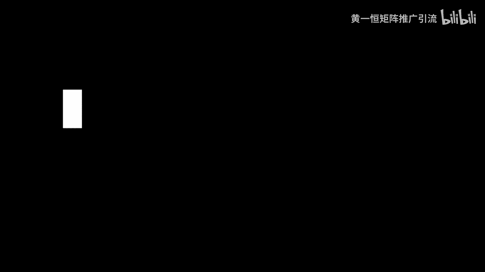
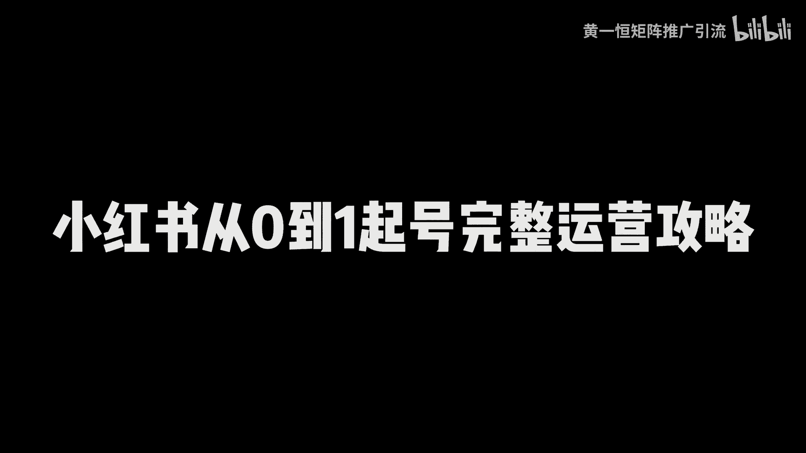

# 小红书运营底层逻辑，小红书从0到1起号完整运营攻略！小红书推流机制，小红书推流算法，2025版小红书运营教程，小红书起号攻略，小红书起号运营，小红书从0到1，小 - P1 - 黄一恒矩阵推广引流 - BV1MVpceYEsd

这是一篇时长高达十几分钟的小红书从0~1，硬攻略，我花了七天时间制作这个思维导图，把我们操作几百个账号，几年的经验全部汇总在里面，一共包含四个部分，小红书推流机制，小红书旗号原理，小红书起号方法。

小红书内容运营合计，知识点加在一起超过100多个啊，嗯尤其是最后几个非常毁三观，请一定要看完一个视频给你分享，小红书运营底层逻辑，小红书从0~1起号完整运营攻略。

详细教程有点长，记得先收藏，一起来看，我给你分享小红书推流机制，旗号原理，旗号方法，内容运营到底该如何来玩，首先来看第一个板块，小红书推流机制，小红书它是一个点击为王，互动为后的平台，什么意思。

点击率它会直接决定我们观看量的下限，这也是为什么有的伙伴发笔记发完之后啊，基本上隔个一两天流量都能达到5000到1万，而有的伙伴发布完之后呢，流量只能达到200到500，这就是点击率造成的点击。

你它会决定用户是否看到你的这个内容，点击率比较低的时候，甚至我们去投放这个薯条广告，都没有办法正常进行下去，广告费都烧不出去，那点击率是由什么决定的呢，最重要的就是由这个封面决定的，所以咱们在做的时候。

不管做哪个赛道，我们的封面一定要设计的好一些，可以参照一些同行高点击的方面来设计，如果你封面设计的不好，你发布完之后流量就会非常的差，说很多伙伴发笔记啊，账号没问题，选题没问题。

为什么发布完之后流量只有200到500，就是因为你的封面点击率太低了，另外一个是互动量，它会决定我们观看量的上限，什么意思，那么下限是比如说你发布完之后，如果你做的比较好。

你发布完之后打底都是5000流量起步，那5000流量发布完之后，隔了一段时间，一共获得了5万流量还是10万流量，这个叫做上限，那么上限的话它主要是由这个互动来决定的。

互动里面呢它是有一个叫做用户的反馈算法，我们也称之为叫做CES评分，那么这个cs评分啊，我是这样给他打分的啊，点赞数打一分，收藏数打两分，评论数打四分，转发量打四分，关注打八分，所有的笔记发布完之后。

有多少人给你点赞，收藏评论，转发关注，就决定这篇笔记，到底能够进入到多大的能量层面来，所以咱们做小红书一定要学会玩点击，甚至有的人用了一些比较极端的方法去骗点击，流量确实比较高。

第二个呢就是我们发布内容的时候，要学会去打这个标签，相当于平台发布之后，他会给你的内容打标签，如果内容做的不好或者不够明确，标签打不上，流量就会非常的小，那这里面分为大标签和小标签啊。

大标签的话一共有37个大标签，也就是说我们打开这个小红书啊，点击最上方的小三角，在小三角里面，目前已经更新了接近40个左右的，什么这个大的一些标签，那么在每一个分类里面，比如说我们点这个露营。

露营呀是一个大的标签，在露营下面它又分为比如说露营装备，露营地点，露营搭子，露营的时间等等这些小标签，那么这个小标签的话，它是在每个类目下面都会有很多啊，这个呢是根据用户的兴趣爱好来决定的。

比如说用户他对这内容感兴趣，只要一多，它就会集合出一个标签出来，接下来咱们来看一下第三个内容的分发机制，那么小红书它是一个信息标签分发什么意思，比如说为什么我打开首页会刷到这些内容。

就是因为根据我近期的一个点击，或者近期的互动行为，比如说你给别人啊，能互动啊，或者点击的某个标签比较多的笔记啊，这段时间你就能够刷到这个你很多的笔记，比如说这段时间我在研究这个露营啊，那我打开首页。

他就给我推荐露营的笔记，另外小红书里面有一个重定向机制啊，什么叫重定向，就是内容会优先推荐给与其互动过行为的用户，什么意思啊，就比如说如果你点过我的两篇笔记，那么在后面呢。

你大概率更容易刷到我这个账的笔记，这就叫什么重定向机制，其次小红书的初字分发曝光量的话，它是由我们的这个流量层级来决定的，流量成绩你可以这么理解，你发布完之后，为什么你的流量非常小。

最主要的原因就是决定你最近30天的观看量，互动量数据决定的啊，这也是前期我们在做的时候有一个观察期，观察期过的时候，如果我们数据拉高了，比如说你最近一段时间发布的笔记啊，平均流量都在3000好。

这个曝光量呢是就比较不错，那有多伙伴发布完之后，可能最近30天只有300，那么流量的这个成绩的影响，比如说同样的内容，不同的流量成绩，它会导致不同的曝光量，比如A账号哎，我们150的小眼睛。

B账号500的小眼睛，这是什么意思，比如说我们把同一个选题，同一个内容通过啊，修改系统之后发布到两个账号里面，有的账号流量高，有的账号流量差，就是因为他的这个层级呢啊会不太一样。

来看一下第四个流量池的推荐机制啊，那么小红书前面讲了一个CES算法，它会根据这个反馈来进行推荐啊，决定我们的流量上限，那么小红书在推理的时候，它其实一共是有八个流量池的啊。

比如说刚开始会有个啊300~500，300~500过后之后会有个1000到2000，2000过后之后大概有个8000~9000左右啊，那么高分内容呢，他会推送到下一个流量池里面来。

如果你的得分不足的时候啊，内容就可能卡在200里面，没有办法扩张，为什么没办法扩展，就是因为你的这个CES评分太低了啊，或者是我们前面讲的这个点击率太低了，就可以从这个点上面来重点进行优化。

接下来看第二个板块，小红书的旗号原理，那么做小红书怎么去起号，它有三个，第一个叫做观察期识别器和入职期，这是很多伙伴说搞混淆的，我们来看下第一个叫做观察期，观察期的话，你可以这么理解。

刚开始我们一个新账号注册完之后，系统并不确定你这个账号到底是来干嘛的，有可能什么是来捣乱的，所以他不确定你的用户质量啊，从而会限制你的这个流量，就类似于比如说原来我们疫情的时候啊，你从外地回来。

他不判断你到底有没有病啊，所以他给你隔离一段时间，隔离完之后呢，再给你放出来，大概就这意思，所以常见的现象就是什么新账号，发布内容的时候流量很低或者没流量，这个是正常现象，因为你还没有过这个观察期啊。

那么系统呢他会去观测你啊，识别风险来来避免你的这个违规内容，所以咱们在做的时候啊，那么你就需要把这些敏感词稍微注意一下啊，敏感行业来，咱们在发布的时候，如果发布了违规内容，就很容易导致啊。

那么你的账号很难跳出这个观察期，流量都非常小，操作建议咱们在做的时候呢，初期发布的时候内容需要进行脱敏，那怎么脱敏呢，我们需要避免发布一些营销内容，尽量不要发营销类，相当于前期，比如说第一个月半个月。

你就尽量发一些这种干货型的利他型内容，帮助账号更快地度过这个什么观察期好，当我们账号度过了观察期，接下来我们就可以开始进入第二个阶段，叫做识别期啊，那么识别器一个笔记好与不好，它是企业推荐给什么人。

比如说你喜欢露营，露营的笔记发给你就是好笔记，那如果你发给你对象去看，你对象根本就对你不感兴趣，他就觉得这是个差的笔记，所以什么是识别器，系统需要识别的内容类型决定推送的对象，一旦匹配上就是精准流量。

匹配不上就是泛流量，那么过识别器的方法呢，就是我们需要发用户经常搜索的一个内容，来帮助用户进行一个识别，哎这个什么意思啊，就是我们打开这个投屏，在上方搜索框里面，比如说我们这里面搜索这个关键词啊。

比如说我们搜这个露营，那么搜索完之后，来这里面有很多的这些热门选题，我们发这些就更容易被系统所识别，因为这些都是一些什么高频的需求，而且标签这一块啊，它是可以分为两个板块的啊，一个是内容标签。

什么意思啊，就是根据你发布的内容系统识别之后，它会打上一个标签，然后呢用户他刷到你的笔记之后，他会给你反馈，比如说会进行点赞，会进行互动，会进行收藏之类的，那么这个呢我们称之为叫做叫做互动标签。

所以系统认定内容匹配之后，就决定这个推送力度，推送完之后哎，再根据用户的反馈来打标签，最后来得到一个什么啊，标签你可以这么理解，所以咱们在操作的时候啊，那么我们可以做搜索流量快速的什么过。

这个识别器也就是我们做一个赛道，我们输入关键词之后，然后把这里面的这个什么这个关键词拿过来，发发这些选题就能够快速的过识别器，那么第三个叫做入池切啊，什么叫入池切，你可以理解为内容发布之后。

前几天流量很低，随后流量增加，内容就是代表什么，进入到流量池里面的流量突然变成了，比如说从原来的500变成了两千三千，基本上你刷新一会啊，那么流量就增加了几十上百个，真的很爽啊，隔一会看一下哇。

又来人了，隔一会看一下流量又增加了，这就是什么入池了啊，那么如果想加快入池呢，第一个我们可以去投这个薯条，因为薯条的话它会强制性触发你的笔价，进行人工审核，那人工审核它就会直接让你的账号。

跳过这个观察期，直接就进入到这个识别器里面了，相当于就在第一个阶段就省了时间啊，那么操作步骤来就是我们分为两次投放啊，第一次投放呢我们在投放薯条的时候啊，可以选择这个点赞收藏。

来获取我们账号的这个什么cs评分，那么第二次我们在投放的时间就可以，24小时以后再投了，就从这个浏览量或者播放量啊，两次投，那么在投的时候不用投太多，投太多了也没什么效果，一般两次来是刚好。

什么恰到好处，而且是什么比较微妙的，那么投鼠条的意义就在于什么，那么强制过程加速过这个观察期，那么提高我们账号的初始曝光量，拉动什么流量增长好，这就是我们讲到的第二个起号的原理。

接下来看一下具体我们在做的时候，到底该如何去起号，咱们来看一下小红书的起号方法，那么首先我们可以通过这个搜索，起号法是目前最简单的一个打法了，那么核心目的就是让系统快速的识别，到底是做什么的。

那么系统呢就推给合适的人群，获得用户反馈标签，有了用户反馈标签之后啊，我们的账号就获得了精准流量，所以咱们在做的时候，可以利用这个搜索人来做，因为小红书的搜索占比啊，可以说达到30%以上。

60%的用户来打开小红书，首先就会什么进行一个搜索，那具体怎么操作，比如说我们以这个净水器为例啊，首先咱们啊打开这个小红书，在这里面我们搜索关键词净水器，那么搜索完成之后呢。

这里面就会有很多很多的下拉尺，那咱们把这些下拉词拿过来啊进行啊，做选题，做内容好，这就是什么搜索起号法，那这里面有六个注意细节啊，首先第一个就是尽量挑选那种，收藏数大于点赞数的内容呢，容易卡收入排名。

这是第一个，第二个呢就是洗稿的时候，内容一定要超过30%甚至50%，避免被判搬运或者违规，第三个标题一定要卡上这个下拉词，因为标题的权重是大于内容的，有的伙伴只在内容里面卡，标题没卡，就导致了有排名。

就是呢封面尽量照抄，因为点击率已经验证过了，你自己研究个方面点击率非常差，毕竟点击率前面讲到，他决定我们流量的一个什么下限的，如果你发的是视频笔记，要复制我们的视频内容啊，复制一部分出来，方便系统识别。

否则你光打个标题有可能会识别不出来，其实内容不要带营销广告啊，避免薯条不过审啊，就发那种内容干货型的这个笔记，那么第二个呢叫做啥叫做骗评论，起号法，也称之为叫做片频巧法啊。

那么这是一个非常流氓的企划方法，利用评论来获得这个得分，因为评论在cs里面，我们回顾一下他是可以获得四分的，如果一个用户进来之后给你评论，相当于等于什么，四个人给你点赞，两个人给你收藏。

所以评论是获取流量最快的一个方法，那我们就可以去诱导用户来进行评论啊，这里面有个叫做叫做极限二选一，什么叫极限二选一呢，就是让用户做ab选择题，比如说我们打开小红书，在上面搜索这个极限二型。

你可以看到里面就有很多很多美食，美食房间沙发穿搭甜品衣服项链音乐啊，非常非常多，你可以看到啊，那么两款高纯度的这个乙油让你选，然后嘞净水器让你选，然后嘞到底哪个性价比比较高，你看这些全部都是极限二选一。

极限二选一，打开这篇笔记之后，你会发现它的特点就在于什么，用户评论量非常高，你看这一篇笔记啊，1。4万的点赞就有3万多人在评论，这3万多人全是选一，全是选二，就是用户在选择的时候嘞，他是没有这个难度的。

就是直接哎输入一或者二就可以了，比如说你可以看到这里面很多啊，比如扫地机器器人二选一，然后呢这个临时二选一，我们点开之后可以看一下，你看2000多的点赞，5000多的评论啊，这个流量就拉的很高了啊。

另外一个就问答题啊，问答题就比如说啊你让用户去回答你的问题，比如说说出你最喜欢的城市，或者说出你最喜欢的一首歌，好这些你都可以去参考一下，比如说我们返回来，在搜索框里面重新搜索一下啊。

你最喜欢的城市你可以看一下，那这里面就有很多人去给他互动，说出你最喜欢的三座城市，咱们看一下啊，500多个点赞就有5000多个评论量，这个评论量是不是啊提高了这个十倍以上，那么核心点就在于什么。

它能够降低用户的一个成本，所以呢咱们在做的时候，这个片平巧法啊真的是特别的好用，而且用起来贼猛好，来看第四个板块，小红书的内容运营，那么小红书啊，我们在发内容的时候到底该发什么。

首先第一个我们可以发这个流量型内容，流量起这种就那种流量呢特别的好，流量特别的大，但是转换率比较低，说简单点就是这种西大家都喜欢看，但是付费的人并不多，这种内容我们也称之为叫做宽口内容啊。

就比如说现在如果我们是做这个装修赛道的，做装修行业的，那咱们在做的时候，我们就可以发一些这种宽口内容，比如说2024年最流行的装修风格，因为这种内容它是针对那种嗯小白。

而且是刚接触这个板块的这种用户群体，那么适用的范围广，无论是房子大小或者装修的状态，用户都会感兴趣好，这就是什么宽口内容，那接下来我们还需要发第二种，叫做什么营销型内容，营销型那种就是转化率非常的高。

但是你发布的流量比较小，说简单就是你发布之后，你的流量可能只有啊一千两千，但一千两千里面已经产生了很多的订单，我们也称之为叫做窄口内容啊，再以装修为例，比如说我们在发装修的时候，大平层差啊。

机房怎么装修啊，这种就是什么他就定位的非常细，也只有用户他会买这种大平层，才会来看这个内容的目标群体来做个限定，就针对这个什么大户型的用户啊，才会来看，那这种用户流量不是很大，因为他更加细分。

而且更加长尾更加精准，但来的人呢更加的什么精准一点啊，另外我们在做内容策略的时候啊，我们可以两者可以配合在一起啊，怎么配合呢，就是说流量内容做引流，营销内容来做转换，浅的话就是触达我们的这个用户。

什么意思啊，比如说现在我们为了获得更大的流量，我们要做一些比较宽泛的选题啊，这个宽泛选题，它能够帮我们把这个池子给它搞得更广一点，比如现在我们做个旅游的，我们就说西藏的美食攻略。

或者西藏的这个拍照知识教学，那这些就非常泛啊，就是只要你对西藏感兴趣，那么你都会刷到我这个内容，那这样我们做一些深的，就是为了转换这个目标顾客，那这时候呢我们就需要做一些比较小的，比如说在西藏里面啊。

有一个小的一个板块啊，国庆定制那个湖杨林小包团，高奢唇完绝美，你看这一个他就是只到这个胡杨林气丸，但是呢它非常细分，比如说我们穿插一下啊，这些是让更多对西藏你有感兴趣的。

这些呢就是啊我们这里面有一个小包团，那你可以来这种来，他就是只能转化已决定器的客户，没有办法去触达那种详细的顾客，哎，就这样的，所以我们在做的时候，发内容就可以结合这个模式来发。

流量型内容和营销型内容配合一起来发，接下来看一下我们的这个策略应用啊，那么浅的话就是流量内容来进行引流，那之前不升的话会出现一个情况，就是有流量，但是呢没有订单而升的话就是营销内容做转化。

那么直深不浅来就会出现一个情况，就是只依赖已有的客户啊，就很难去扩大我们的流量，毕竟互联网里面一看钱是人，干啥都能成，一看没有人，那啥都干不成，这个点呢咱们得注意啊，那么这就是小红书的整个的影攻略。

那咱们如果想玩好小红书啊，光学这些还不够啊，比如怎么去准备账号，怎么去做选题，怎么去做笔记，怎么去发，能够获得更多的流量，这些呢我都给大家准备了，一个人玩十个小红书账号，对于一些大的赛道来说啊。

基本上都能做到每天搞100个顾客，比如说小红书的入门硬干货框架，教大家了解小红书的内容收录机制，运行功绩，企业号的运营KI投放，包括店铺的管理啊，还有小红书的爆款选题表格。

咱们做的时候大部分都是有什么发什么，会什么发什么，知道什么发什么，发完之后就像朋友圈一样没人看，而我们要找那些用户喜欢看的，就是我发的每个内容都是你喜欢的啊，那你喜欢什么，我们就需要去做选题。

挑选这种收藏比评论比分享比，并且找这种什么低粉高赞，高收藏的作品优先来发，更加容易爆，还有给大家准备的小红书的引流系统课，因为这个视频咱们没办法做太长，所以太长，大家没耐心看完。

所以呢我准备了两到三个小时的系统课，小红书引流的全流程，超级医药导流方法，常见问题，边缘项目，这些呢都可以来找我，我把它分享给大家，咱们来做一下资源共享，这也是互联网的一个优势了，好各位同学。

我是黄一恒，只做落地推广方法，刚才给大家分享了小红书的推流机制，旗号原理，旗号方法，内容运营，想玩好小红书，光靠这几个板块还不够，这里面我给大家准备了18个平台的详细打法，小红书就是其中一个。

教大家如何布局多流量管道，这些呢都是我原创的，可以通过主页来领取进行学习，如果觉得今天视频比较不错的，那一定请大家一键三连，感谢大家支持。

