# 小红书运营版教程 从零开始学小红书开店运营起号 (新手入门必学小红书教程) - P1 - 手机智控技术通 - BV1TZ421K7bb

还有谁。要说最近什么项目最火，那必须要提到小红书电商。最近几个月呢，几乎整个互联网都在讨论小红书电商。我关注的几个商业博主啊，包括一些付费社群都在讨论他。我朋友圈月入5位数甚至6位数的比比皆是。

这个项目在年初的时候，我其实就有让团队跟进测试，我还在市面上买了一些课程学习，到现在单人单店一个月能做个一两万块吧。今天我就用一个视频详细的给大家拆解一下，就是小红书电商到底怎么玩。

我会把整个小红书电商的流程，包括一些注意点，比如怎么开店，怎么选品，怎么做流量，一次性给大家讲清楚，你甚至都不用再去看别的相关视频和培训啊，你就跟着我的视频去按住做骥，就足够你在这个事情上开始盈利了。

视频的结尾呢我还会给大家准备一份资料，里面有我找的课程啊，对你运营小红书电商呢会有很大的帮助。有需要呢直接去拿就可以了。言归正传啊，整个项目的逻辑啊，其实也非常简单，它就三件事，第一个呢开店。

第二个选品，第三个流量。我们一个一个来讲，先说开店。呃，开店其实没什么好说的。那，首先就是打开小红书，然后点击左上角的菜单图标，再选择创作中心，然后点击更多服务这个选项，选择店铺，点击立即入住就可以了。

你就按他官方要求的提交资料入住就行了。我居然看到有人把小红书开店包装成一个项目拿出来卖。居然还有不少人买，这也是很奇特。这里跟大家说一下，小红书店铺的两种形式，个人店和企业店。

其中个人店有两种分别是个人店和个体工商户店，个人店只需要身份证加1000保证金就可以开通了。个体工商户呢还要多一个营业执照，企业店呢就多一点，企业店有三种呃，有包括那个普通的企业店有专卖店和旗舰店。

企业店都需要营业执照，而且还要缴纳600个年费。我们刚开始运营小红书电商的时候，你直接选择个人店就可以了。我们实测下呀，企业店和个人店一样，平台并没有对企业店有什么流量倾斜。唯一的区别是个人店。

你只能开一家，而一份营业执照，你可以开三个店，你一个店如果都没做好，你开再多的店都是没有用的。而且小红书电商啊，我觉得是。

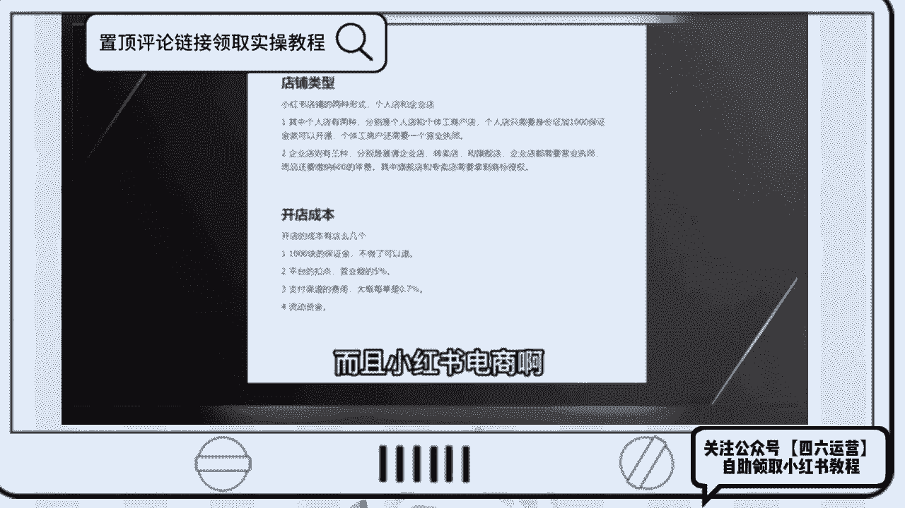

适合店群形式去做的。这是因为小红书的流量机制，它的电商自然流占比非常低。那你付再多的店再多的货有什么用呢？所以只要你看到有博主跟你讲什么小红书店群，我都觉得是在扯淡。小红书是要做矩阵的啊。

但不是店铺矩阵，而是账号矩阵。这个后面的流量获取那里，我会跟大家细说，开店的成本呢有这么几个。第一个就是1000钱的保证金啊，不做了可以退。第二个呢是平台的扣点营业额的5%。第三个呢是支付渠道的费用。

大概呢每单是0。7，第四个就是自己的流动资金啊，一开始大家做呢可以有无货源的方式去做？对资金要求也不高。你刚开始呢准备个20003000块完全够了。呃，开完店以后呢，我们下一步就是选品。

我们应该在小红书上卖什么呢？选品其实也简单。在其他平台上的爆款大概率在小红书上也能报。目前小红书呢，我是推荐三个渠道进行选品的。第一个是通过某东某宝上面找那种小红书平台调性的爆款产品。呃。

身边有做电商的朋友，他自己在某宝的店铺卖爆款，搬到小红书上。第一篇笔记就开始。第二篇笔记单量就已经破百了。第二个呢是通过某音的那个精选联盟。你在某音的精选联盟排行榜，你可以看到现阶段哪些品卖的好。

只要符合小红书用户调性的产品，直接搬运测试就可以了。第三个就是某多多的这个销量排行榜选择适合小红书的类目排行榜，从中选择相应的爆品搬运到小红书。整个选品的逻辑，就是我们要利用市场来帮助我们选品。

而不是自己在那瞎想，我们要借助大卖家的选品能力来弥补自己选品上的不足。所以我们只要判断一个东西啊，就是这些排行榜上的爆品是否跟小红书的人群有匹配的可能，如果有我就搬过来测一下，对吧？

相当于是借助了别人的能力来帮我们自己选品，这样反而是最快，而且是最稳妥的选品方式，肯定比你瞎测成功率要高很多。然后等你这个产品上架以后呢，就到了最重要的环节了。我们应该如何获取流量。

小红书它是个种草平台。你店铺九成以上的流量啊，都是来自你发发的笔记。这就是为什么我之前说小红书不要铺店群，而要做账号矩阵，尽可能多的发笔记好流量。它的通路就是。用户通过你的笔记然后对你推的产品产生兴趣。

然后到达你的店铺完成购买，你堆一堆店铺，对吧？你铺一堆店铺一就还不如多发笔记，多发几篇笔记的这个效果好。所以怎么在小红书上发笔记，对吧？就是你小红书电商是否成功的关键。小红书这个平台，你直接发硬广。

我觉得效果非常差，对吧？本来小红书的这个用户群体认知就比较高，你直接发广告没有办法获得信任的啊，更不要提转化了，你发笔记的时候，一定要用一个素人的角度，你知道吧？就是用户的角度去切入。

站在用户的角度去做种草内容，而不是官方视角，这才是真正有效的。呃，这种种草笔记怎么做，其实也很简单，就是去各大平台的商品评论里找。比如某音某宝某东的商品买家秀找到好看的素材，你直接copy下来用嘛。

对吧？文案呢在买家评价上去做修改。这些买家的评价呢就是商品用户的使用体验，天然的适合用来做这个中考笔记，而且可以说是取之不尽了啊。然后呃当你单个账号的SOB跑通了是吧？我们就可以开始举阵引流了啊。

通过批量上小红书账号批量发布笔记。给我们的店铺来引流来放大。

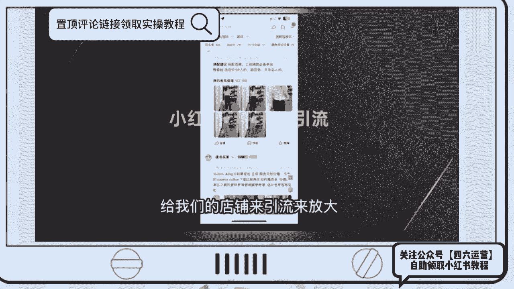

那基本上整个小红书的电商的运营啊，就是我上面分享的这些外面不管多少钱的培训啊，000块也好，000块、1万块也好，其实就是这些东西。有些培训可能还没有讲的清楚啊。根据上面几个点，我给大家准备了一份资料。

里面包括了小红书账号的起号运营的方法，以及一份小红书电商的视频课程。你如果打算经营小红书电商，你也不用看别的东西，就跟着这份资料走，足够你开始盈利了。有需要的啊，点赞加关注，在评论区回复红书电商。

我分享给你。😊。

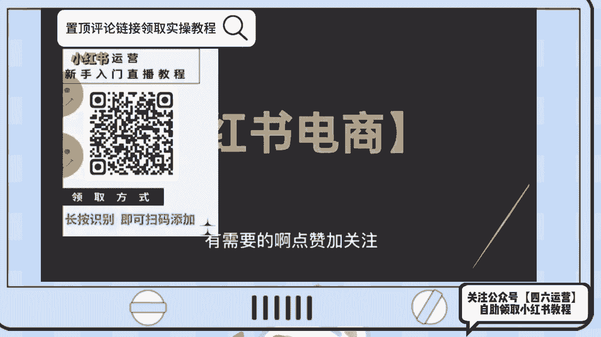

🎼要有自信啊，肯你是最好的，知道吗？这条视频是小红书实战系列的第三章节，也是目前B站上面小红书内容的天花板，希望提升自己变现效率的，希望当下快速起号的，一定要认真看完这条视频。

今天我们主要的4个学习目标分别是什么？第一个呢是我们了解账号拆解的5个维度。就是我们看到一个好的账号之后，唉，我们要怎么去拆解呢？我经常会发现就是说其实我跟你们的区别在哪里？就是我的眼睛比你们看的更细。

我能看到比你们更深的一些东西。所以这是第一个学习目标。第二学习目标呢就是你们通过今天的学习之后，对账号有自己的一个判断思路。第三个呢就是能够感受出不同账号，不同维度的一个水平差异。

以及最后你们能够明确自己现有的一个运营优势。在接下来的创作过程中去发光发亮。那么首先我们直接进入第一个章节，就是如何拆解一个账号。我们要知道一点，就是拆解账号是为了汲取经验。也就是说什么？

它其实是拿到结果的一个关键动作啊，大部分的情况下，我们讲找对标拆爆款，你能不能把账号拆明白啊，决定了你拿到结果的一个速度和效率。如果说你看不懂别人优秀的账号怎么做的。

那基本上的话你很难及时拿到一个结果啊，包括很多人他就发笔记，对吧？几十个小眼睛，一直几十个小眼睛，其实就是他压根就没看懂别账号怎么做起来的。所以说整个拆解的过程中呢。

我们就是可以从竞品账号中呢去博彩重裁，汲取他们的有效经验。那么拆解账号之前呢，我想先跟大家梳理一下，我们去做小红书的账号，它有哪一些变现的策略。首先啊内容创作常见的变现形式有哪些呢？大家能够想到的对吧？

比如说我们有电商带货，我们可以通过挂链去去卖产品。第二个我们可以接广告。第三个呢，我们可以引流到思域去做成交。第四个呢我们还可以通过一些平台的奖励政策去变现。那么不同的变现形式，它有什么区别。

究竟在赚谁的钱，我们来看几个案例。第一个案例，我们来看一下叫哇塞小毛，它呢就是发的这个在马路斑马线上拍的这个饰频的一个笔记啊，发了很多，然后我们来看一下这个能不能点击啊。🎼大家声音应该也能听到啊。

它就是很简单的一个产品的展示，去把这个账号做起来，这是第一个账号。第二个账号我们来看一下，那么他发的是一个银质的一个视频，95银卖价290，然后点赞收藏啊，评论啊，包括有一些数据。

那我们可以看到在这个购物车呢售价290啊，已售的数量呢账号也是290，这是第二个账号。那么第三个账号我们看一下它是一个很精致的一个手，然后展示了一个链子。

然后就讲到了它怎么样去用低成本的方式去在冬天保护自己的一个手。然后这边是妮维雅的一个链接。对于四个账号，那么他呢是一个讲要旅行的一个账号啊，但是我们可以发现，就是说他呢有一些这个活动啊。

就是说他其实发的内容是根据平台的活动来的。所以这四个账号，我们再拉到一起对比的话，我想跟大家说一个什么事情呢？就是其实我们每一个人包括来直播间的每一个小伙伴们，你们挣钱来方是不同的。

你们跟赚取钱人的身份和关系是不同的。那么第一个账号他卖的是19。8块的饰品，他其实在赚谁的钱，他赚的是陌生人的钱，对吧？我们买1个19。8块的一个东西不需要说我有多喜欢你，我有多信任你吧。

是不是只要我喜欢就会买。而第二个账号他把银饰卖到290块钱，有没有人知道这个290的银饰，它的毛利润有多少？你们猜一下。这款290的银饰，你们猜一下毛利有多少，34是56是7080的。猜一下。

我告诉大家啊，这个银饰的毛利应该有50到70，50到70的毛利一般是有60到70。那这种账号你能赚到陌认的钱吗？不太容易啊，因为这个款它只要一爆，就有很多人去超去返。所以如果你要找便宜的，一定能找得到。

但是还是会有290个人去愿意买，花290去买一个这个产品。那么他其实赚的谁的钱，赚的是粉丝的钱。🎼那么第三个是吧，我们很明显的知道啊，这是一个品牌国际品牌。所以呢他赚的是品牌方的钱。那么第四个账号哈。

它是100多万的粉丝，流量很大，所以它其实可以做一些平台的活动去赚平台方的钱。所以说拆账号前，其实我们先要思考他的账号是用什么样的一个变现策略。为什么？因为每个账号，它赚钱的收益来源是不同的。

也就决定了它账号的运营侧重点是不同的。那我们能够怎么去分类呢。所以说如何去拆解一个账号，这里啊我直接是从5个维度进行了一个拆解。因为大家的都是有基础的，所以我呢就会讲的快一点。如果说你们觉得有点跟不上。

你们就在评论区告诉我说，咱们放慢一点，好不好？这个就是我去拆解一个账号，我自己总结梳理出来的5个方向，但是我们会发现这5个方向，不管是内容能力，流量能力，行业深度运营思路还是营销能力，它都围绕着。

中心中心是什么？是他这个账号的账号定位。那我们来分别拆解一下这5个维度对应的一些能力。那么在尖尖上面，它对应的能力是什么？是内容创作能力。那在我们小时候语文考试的时候。

命题作文其实就已经能够初步体现我们的内容创作能力，对不对？因为命题作文，我们语文考试最后大家所看到的题目是一样的。比如说我们今天讲五一啊，我的五一是怎么过的。

那我们往往都能够在90分的考试时间内把作文写出来，而且大于等于800字，是不是？所以我们在那个时候就已经能够感知出是否自己有快速理清故事结构，写出高分卷的能力。如果说你有的话。

那你其实是有一个创作天赋的那这个时候可能有的小伙伴就想了，那老师我语文成绩不好，那怎么办？告诉大家没关系，为什么？因为我们在内容平台进行创作，跟我们B卷考试不同，它是开卷的所以我们如果掌握了借鉴的技巧。

这个创作难度就会降低很多很多。所以在内容能力这一块，那我们再去拆解一下。我把内容创作能力这里啊我还细分了啊5个能力。对应的。比如说目标客群的匹配度。那比如说我们今天要做一个账号，是吸引想做小红书的人。

那比如说像我对吧？我不交小白，不交宝妈，不交副业，对吧？我是愿意帮助真正能够在小红书有机会赚到钱的人去提升能力，然后把大家吸引到这里来，大家一起去交流去成长。那么如果说我的目的是不吸引小白，对不对？

是吸引真正专业的人，有能力的人优秀的人，那我吸引的人都是一些小白来说，大哥带带我，那这个目标客群是不是就不匹配，对吧？那同样的，比如说我们卖的这个视品是高端视频，是一万的客单。

但是你的客户都是吸引的预算都是有几百个客户，所以他的目标客群不匹配，这个是内容创作能力。那第二个呢就是你的内容获客效果。这句话怎么理解啊，我给大家举个很实在的例。就是有一个有一个客户，我有一个客户。

他是做那个在澳大利亚做工程机械的。那么像这种产品啊，它其实是会分前中后。举个例子，什么叫前中后呢？就是按照用户的购买时间。比如说你去思考一下啊，就是比如说某某某挖掘机如何就是说如何这个如何涂机油。

🎼那你觉得这样的内容是用户在购买前会去看的，还是说他已经是购买后才会去看这些东西。那对应的对吧？比如说像装修，对吧？比如说我们去研究这个比如说我们汽车行业吧，比如说汽车行业可能跟大家接近一点。

就比如说保时捷的车内保时捷的这些按钮对应是什么样的一个功能。那这样的一篇笔记是准备买保时捷的人会去看，还是说已经买了保时捷的，他才去看，因为仪表盘那么多按键，对不对？每个按键对应是什么功能啊。

以及这个保时捷的一些使用小技巧，这些东西是不是他购买后才会去看的。所以那这个东西跟内容获客效果有什么区别呢？就是如果说你的目标是在小红书上获取准备购车的用户。

那么你去发你就一定要意识到你这个内容性的是准备购车的，还是已经购车的。那准备购车的用户什么样的内容能吸引他。比如说比如说假设它是一个。🎼长沙的用户对吧？我在长沙啊，那湖南新能源汽车购贴补贴。

那最新的一个5月购车补贴力度很大。哎，那你如果想购车，你时候就对这个东西感兴趣了，所以有些内容是能够获取到意向客户的。有一些其实是已经消费完的客户，所以这里要考虑到内容的获客效果。

不是说你吸引到啊对汽车感兴趣的，这个就叫获客了。那同样的我们再去判定一个账号的内容创作能力的时候，还要去看它的一个内容制作形式，对吧？它是图片还是视频，还是Vlog啊，还是life夫的一个动图。

还要我们去评估它的一个内容制作成本，有的制作成本很低，可能合下来10块钱一条视频一张图文啊，有的一看这条视频制作周期至少是花了一个月可能时间成本各方面加起来大几千，甚至有的视频可做到几万块钱。

同样的还涉及到你的一个内容选题方向。那么这是内容创作能力上面。那么第二个就是流量获取能力。什么叫流量获取能力呢？第一个我们讲获取的叫泛流量，对不对？那么第二个我们讲的就是一个精准流量啊，精准流量。

那么刚刚啊其实也就讲到了，就是你能不能获取到准备，对吧？沿着你的消费节点。准备购车的一个用户和准备搞装修的一个用户，这个才叫精准流量。同样的啊什么是半流量。这个大家比较容易理解。那流量获取能力对应的啊。

其实还有什么？还有会跟标题相关啊，它的标题它的封面，它的选题的运营其实都会相关啊，那么第三个能力是什么？是营销心智能力，特别是做高客单的，一定要对这个能力有很充分的理解，那营销心智能力。

这里我觉得啊它有两个建立，第一个叫认可度的建立，第二个叫信任度的建立，什么叫认可度，就是你是否专业，比如说你们今天在听我的分享，对吧？你们会对我福克斯有一个标签啊，比如说0到100分，那我的专业程度。

你们认为有多少分，对吧？6070890啊，这是一个行业的认可度。但是当你们认可我之后。他等于信任嘛，他不等于信任，为什么？因为有一些人他可能也有能力，但是他的变现形式或者说变现方法其实是呃比较喝韭菜的。

所以说那我们还涉及到一什么，就是信任度的建立。那0到100分，对吧？你们对我的信任度有几分。所以我们去做高客单的消费的时候，比如说我要去买一辆车，一辆二手车。那我通过这个视频去看这个账号。

我觉得他非常了解这个行业啊，非常知道怎么去看一辆车，但是我觉得这个商家他偷奸耍滑，就他的言语之中，或者说他的表情，就是让我觉得他是一个尖商。那这种情况下，我们会愿意找他去加微信去他那里买车嘛。

是不是不会。所以营销心智，有两个，第一个是要建立用户对你的认可度，第二个是要建立用户对你的信任度。那么除此之外，还涉及到一个很重要的事情就是产品卖点的可视。化和产品卖点的可信度。

那么这里呢我在建材行业有一个案例啊，有一个商家案例，他做的事情什么呢？就是同样是装地暖。那它的能耗使用下来是会比别人低的。比如说在长沙地区，可能如果你普通装一套地暖。

一个季度三个月使用下来的费用可能是50006000块钱。但是它可以做到3000块钱以内啊，就正常100多平的房子。那么问题来了，你是这么说的，但是现在消费者对于商家而言，他天生有信任度吗？

他其实天生是带着质疑去沟通的那这个时候我们已经有了这个产品的卖点，对吧？就是这个卖点就是同样是装地暖，它的能耗比别人低。但是这一句话是打不动用户的。我们如何让用户信的。

就涉及到你要把这个卖点的可视化和可信度。那么这里大家思考一下，如果今天你们面临的是这样一个商家，你们会怎么去解决这两个问题。那我再给大家讲一下什么样的一个商家背景啊，就是在湖南长沙有一个商家啊。

他是做暖气地暖的。然后呢，大部分同行一个冬天使用下来的暖气费用呢是5000到600，就是一个月大概2000块钱，而它可以把费用做到1000块钱以内，一个冬天就3000块钱。它的使用费用比同行低。

那么基于这个卖点，我们怎么样去把它可视化和建立可信度呢？你们思考一下，我喝口水啊，我给大家讲解一下啊，给大给你们看一下呃，我是怎么去做的。因为我们讲的是一个月的费用能够控制在差不多1000块钱以内。

对不对？我既要解决可视化，又要解决可信度。那么接下来我给你们看的这个素材啊，就是基本上这一条素材帮这个删掉的成交率，就客户成交率至少是提升了20%。那么这条素材是什么？就是我选取了一户房间。然后呢。

充了1000块钱燃气啊，大家其实可以看到就是我箭头的这个位置，左上角这张图，它的燃气值是33初始值是3。那么这个燃气表充了多少钱呢？充了1000块钱的费用，所以我就让这个燃气表一直跑，对吧？

就我把电暖开起来。然后我们看1000块钱花完之后过了多少天。你只充了1000块钱，是不是意味着他画完这个表就停了。好，那为了我们去增加它的可信度，对不对？因为用户可能会质疑啊。

那你这个燃气我怎么知道你开了没开呀，对吧？我怎么知道你这个是不是有的房间开了，有的房间没开。所以呢我就把各个房间客餐厅、书房、主卧、儿童房和衣帽间都架了摄像头，而且我是就是24小时每一秒都记录了。

连续记录了35天，而且为了防止他们去质疑说啊，你你是开了部分房间有的没开，所以你会发现每一个这个画面中，我都有一个这个燃气啊，都有一个这个温度仪来向你证明啊这个燃气其实它是在一直开着一直使用的。

所以包括你们可以看到在视频变化的过程中，它是不是有黑天和白夜的一个交错。那么这个时候你们作为一个用户。对吧我让你看到了这样的一个视频和数据。并且我告诉你说，这一个视频你如果有质疑的话。

每一天我都可以调24小时的录像给你看啊。你要看任何一天任何一秒，我调给你，我想问一下大家能不能解决用户的质疑，回答用户的质疑啊。事实上，没有用户，他要去看这个调这个录像。

那我是不是解决了卖点的可视化和卖点的可信度，我充分站在用户不信任的情况下，找出了更多证明的方法。好，那接着又涉到了一个什么营销流程。我告诉大家，这样一条视频，这样一个素材，对吧？

我们花了一个月的时间做做拍摄，又花了将近呃一个星期的时间做压缩，对吧？压缩到5分钟。我想问一下大家。我应不应该发到小红书上面，你们思考一下。如果你是商家，你用了一个这么牛逼的素材，你发不发小红书。

你们可能会发啊。但是我告诉大家啊，这条素材至今是没有发到小红书上面的。为什么啊？因为我们涉及到一个营销流程。因为这条视频对于用户的震撼是很强的。所以我需要的是在账号过程中啊，像这种实体商家成交。

在账号过程中，我只需要让他做到对商家有意愿有好感，愿意加到微信上面来，然后通过微信到店，他做到店铺里再去看到这样一条视频的时候，是不是这种震撼感和冲击感就来了。那这个时候我们再去谈谈和签单。

是不是属于他对一个好感度极速，对商家好感度急速拉升的时候去签单。反之，如果说我把这条视频直接发布到小红书上面，他看到的时候，他也会觉得很牛逼。但是他加到微信之后，到店之后，他没有这种震撼感啊。

他没有这种强烈的认可度加分了，那么当场签单的这种意愿，是不是就不如前面的那种做法，这有点像什么？有点像我们去旅游的时候，比如我跟你说啊极关很好看，那么是我告诉你极观很好看，但是你没有看过实物。

然后你到了北极，你看到了极关，那个时候你是很震撼的。但是如果我提前啊我作为一个导游，我把极关的视频发给你看。我说兄弟，你看这个极关多好看啊，我们明天晚上去看极关。

然后你第二天晚上你看到的极关和这视频一样，你是不是就没有那种很惊喜的感觉了啊，它是一个的道理。所以我说营销心智的能力，还涉及到营销流程的设计。还涉及到什么选题方向。

因为不同的选题对用户的一个感受是不同的。那么接着我们讲第三个第四个维度啊，就是行业钻研的深度。有些东西它其实是一个表层的理解。比如说我们讲小红书啊，有人说我们要淘宝款，我们要拆解账号。

是不是这就是行业的一个表层。那么深层的理解。像我刚刚跟你们讲，我怎么样去搬一个实体商家拉伸，吸引金融客户去拉伸，用户签单的一个认可度，那么你们是不是能够感受到这种深层的理解，对营销深层的一个理解。

对用户深层的理解。所以这就是行业端业的深度不同，它就会有不同的体现。以及什么你不同对行业的深度理解不同。你的产品的优化也会不同啊。如果你越了解产品，你就越能够越了解这个行业越了解用户，你就能够优化产品。

我举个很实在的例子。以前我们的厨房啊，我告诉大家，是60厘米深啊，60厘米深，冰箱是多少呢？冰箱是65厘米。所以一般大部分老房子家里的冰箱是比厨房的。要突出来的。但是在23年。

美的推出了一款叫这个超薄冰箱，它就是解决这个问题，就是冰箱和橱柜能够在同一平面上了。那么这个其实就是要对用户和行业有理解啊，你就会优化反下来优化你的产品。同样的，基于行业深度的不同。

你还能够去优化你的成交流程啊。行业深度的理解不同，也会直接对你这个对你这个行业的客户心理的理解也是不同的啊，这里就不跟大家去具体展开。那再回到最后一个板块，我们去猜解账号，还涉叫什么。

就是账号的一个运营思路啊，运营思路。第一，你能看到它的多少运营细节。第二，它的变现模式啊，你能不能推演出来，他用的什么样的变现模式。第三，它获客的钩子是什么啊，比如说最常见的钩子，我们讲叫直钩。

什么叫直钩啊，就是我有什么什么资料啊，然后你加我可以领资料，这个叫直钩那对应的还有什么办法，就是我通过内容去，让你认可我啊，我不翻任何的资料，我就是让你觉得我牛逼啊，我专业我值得信任，你自然而然想加我。

那对应的它的这个能力是不同的啊，或者肯定是更强的。包括啊账号运营水平的一个判断。所以你们会发现啊整个账号，我们如果。要去做系统拆解的话，是可以拆到这五个方向的。那么接着我们进实操啊。

我们来看一下珠宝账号的一个案例的详细布习。首先我想问大家一个问题啊，在做账号采解前的一个思考。一年内的新账号与三年内的老账号有什么区别？

这个问题其实之前也跟大家提到过这个知识点就我们去拆解一年内的新账号和三年的老账号有什么区别？就是老账号，它其实早几年运营的过程中，它是有平台红利存在的，过早的一些获取流量的方式，获取客户的方式。

其实它可能当下已经失效了。比如说他们去搞这些红黑板啊，做美妆的，想要弄一些红黑板啊，把一些自己要卖的品牌和知名的品牌翻到红版，然后再翻一份黑板啊。这个东西可能在两三年前是有效的。但是到今天没效了。

两个原因。第一，平台打压这种笔记拉开的笔记。第二，用户他看作麻木了。他知道你在你在这么去套路它啊，所以说老账号他有一些这个方法是失效的。而新账号意味着什么？新账号能够快速做起来。

意味着他获取流量和客户的方法是单向有效的，所以这是大家在拆解账号中，尤其要注意的。很多我感觉我跟你们说，30%的人会犯这个错误，就是给我看对标账号一看，我就看这种已经5万粉10万粉做了好几年的账号了。

那凡是你把它作为你唯一的研究账号的时候。那你真的是会有点惨啊，这种老账号可以研究，可以学习，但不能只研究他这种老账号，它有些办法是失效的。那我问一下大家啊，我不说珠宝人，就是基于你们现在在做的赛道。

或者说你未来想做的赛道，我刚刚讲的5种能力，你觉得你应该着重关注这个账号的什么能力？在评论区告诉我，好吧，你们现在在做的赛道，或者说你即将想做的赛号，赛道这5个能力，你觉得你最应该关注哪个能力？

觉得是内容创作的能力打内容，觉得是流量获取能力打流量，觉得是营销新政能力打营销，觉得是行业钻研深度，就打行业，觉得是账号运营思路的大运营。还有人问没有对标账号怎么做啊，没有对标账号就做不起来。

开个我开个空调，有点热，没有对标账号就没法做，你就会走很多的弯路啊，大部分人认为是运营的能力啊，OK那我们接着往后去看，来先看第一个账号啊，先看第一个账号，运营思路是吧？啊。

那今天到最后给大家补一下运营思路的东西。第一个我们来看一下这个账号叫可燃冰啊，它是一个手啊，这个手是不是很漂亮。那我问一下大家，这个账号的优势在哪里？你们在脑子里想一下吧，就是这个账号是怎么做起来的。

我来看一下他的笔记啊，尝试一下心中是今天的手打几分啊，下面是平安扣，他的评论区是哇，下面好好看，求什么牌子啊，问，可以换你的手吗？啊，好喜欢姐姐的手，姐姐可以多拍点手的姿势，让我画画做参好吗？啊。

太绝了，我好喜欢。这个账号的优势是什么能力？优势是什么优势？是流量获取的能力，对不对？它通过手能够获取到流量，但是它的流量是什么？是放流量，是不是？所以这个账号的优势是流量获取的能力。

通过手那么这个账号呢，我们来看一下这个账号是23年9月开始运营的。然后在他23篇笔记的时候，他就做到了6000粉丝啊，然后这个数据我们来看一下啊，一开始其实也就是几十个蛋啊。

但是后面它基本上稳定到了小几百来看一下它的一个笔记详情，就是它设计的一款小戒指啊，一个平安扣加开口借圈。然后这个笔记的评论区呢，他置顶了这么一条评论，就是感谢大家喜欢啊。

一直以为水瓶座喜欢的东西很天马行空。但没想到这个设计居然这么多姐妹都喜欢啊，我已经在找料子了。如果遇到合适的，我会再做这个款式，但是我没办法预知时间和品质。如果啊大家能够有耐心的话，喜欢的话。

你可以在评论区啊，可以等一等我，然后这个评论区就是墩墩啊，墩墩墩墩蹲，我想问一下大家。这个账号看到这个的时候，有没有似曾相似的运营手法？我当时是不是有一篇就是洗红套装的笔记告诉大家。

我觉得未来双双十一之后会出一款性价比很高的这个喜红套装啊，然后就有很多人在那们蹲，他是不是一样的，所以这个账号他其实是在运营手法上面啊，在运营手法上面是有自己的一个理解的。那么再看第三个账号。

这个账号啊，它是干什么的呢？它是做这个一个很有个性的设计啊，我们来看一下，你会发现这个手镯，它是不是玉加黄金啊，我们看这张图更清晰，就黄金家玉啊，黄金家玉，他其实是一个什么逻辑啊。

他不是说他把产品设计成这样的，他是有一些用户，他可能在佩戴手镯的过程中，不小心把手镯摔碎了，那么这个时候是不是就不能戴了，而且很可惜。但是有一些手镯其实他是很有纪念意义的。

可能是妈妈送的可能是外婆送的很珍贵啊，那他就思考到这个用户。痛点，然后呢，他通过3D工艺把这种摔碎的手镯跟金精饰做结合，然后帮你做一个手作恢复。听到这里的时候，你们有没有觉得他这个设计和想法非常的棒。

如果说咱们有一个真正很心疼的镯子摔碎了，用这样的收复方式，大家愿不愿意接受，是不愿意？所以这个账号它其实从22年12月才开始勤更新的啊，然后24篇笔记也涨了1600多个粉丝，但是我们会发现什么？

我们会发现他是懂什么的，他是懂用户的，他是懂用户的，他发现一个很小的一个细分需求。那我们再看一下这篇笔记是22年12月份的一个笔记，讲的就是玉镯修复啊，那么这篇笔记有一个什么特点呢？

就是我们会发现他的评论区从23年1月1号的客户到23年9月啊，这个可是22年发的一个笔记啊，那我们会发现什么？就是其实哪怕你是一个超细分的赛道需求，平台都能够给你匹配精准的客户啊。

我们来看这个账号叫miss晶晶。那这个账号呢它是23年5月开始运营的111篇笔记做到了4000多的粉丝。我们来看一下它是一个偏什么的，它是一个偏搭配形式，是不是他的签名是S啊，然后主理人。

好物分享家珠宝经金师。我们来看一下他的一个笔记，他这里呢放了放了几款啊配饰。然后呢，他在问啊，就是如果是你来配长裙，你会选择哪一组搭配。然后评论区就是当然是图三绝美啊，然后怎么卖啊？然后图二图二啊。

图三询价。那我想问一下大家啊，你们刚刚那么多人说希望提升运营的这个方法。那么他运营他用这个账号，他这篇笔记用了什么样的运营手法去引导互动啊，是不是求助，对不对？姐妹们帮我选择一下1234。

就这个账号来我们再来看一下下一个账号啊，我们把它叫做玩版啊，那这个账号呢也是23年9月才开始运营的70篇笔记做了3100粉丝。那这个账号其实他最开始的数据啊，跟大家是很相似的啊。

像他这个账号一开始就是两个点赞，9个点赞，两个点赞，6个点赞啊，非常的相似，大部分人去发笔记，一开始就是这样，那么他是什么时候这个数据开始起来的呢？他是发了这。这条啊有点蕾丝的一个手链的时候。

那么再往后你会发现啊这篇数据。这篇数据这一篇数据，包括它置顶的这个1。7万的点赞的数据，现在的手链做的这么好看，不要命了。他是怎么样把账号做起来的？他其实是抓到了一个用户喜欢的风格，对不对？蕾丝风格。

所以。所以说我们再去拆解一个账号的时候啊，我们要去get到它的点，他到底是怎么做起来的。所以像这个账号他其实是没那么懂运营的，但是他知道我要不断的尝试它的优势在于什么？在于他有一条数据相对突出的时候。

64个点的时候，他捕捉到了用户可能对这种方向感兴趣。然后他不断的尝试啊，然后把这个账号拉起来了。那我再看这个账号，这个账号是FIORI啊，有没有做珠宝的。我告诉大家这个账号的客单是大几万啊。

甚至十几万的客单，应该是我们今天看的账号的比客单最高的。那么它是2年11月开始运营的账号，99篇笔记3200粉丝，我们可以看到啊，这个账号它就是简单的把手和产品的展示出来。

然后呢我们再看一下它这个一篇笔记啊。比如说这篇笔记拍卖级的品质9克拉的红宝石啊，有烧的缅甸的。但是你会发现啊，这篇笔就是23年4月发布的。然后23年10月份他告诉大家说这一款已经卖掉了。然后呢。

这篇也是一样的啊，一下子又又已售了啊已瘦了。所以基本上他的这个账号可以在。就是说3到6个月的周期把产品卖掉。那他是怎么样去建立专业度与信任度的呢？大家还记得吧？就在最开始我跟大家讲过。

如果你要做高客单的情况下，是一定要去考虑如何建立专业度和信任度的。但是在这个账号的笔记中啊，我们是不是没有发现什么太多的异常，他就是展示他的珠宝。而且还麦el是不是很神奇？那我们再回到他的主页。

我们看一下啊，它这里是顶层审美极致工业主理人F米米雅。那我们看一下米米娅这个账号他发了些什么内容。咪米娅的这号，他发的是啊顶层审美极致工业，美国宝石学院GIA各平台同名啊。

咨询还是个这个账号他发的什么东西？就是从2017年开始，他就在分享马尔代夫的一个奢华的生活啊，告诉你我是一个精致的女性。然后呢，她在220年开始去进修珠宝行业。

他把自己去考取美国宝石学院香港分校的一个学位啊，甚至到后面去从舒富比艺术学院啊，去进修整个的一个成长的过程记录了下来。那么这个时候是不是这个人设就很真实了，对吧？我从17年开始。

我就是一个能够在马尔代夫随便玩的一个人，对吧？去越南去日本玩，我本身就很有钱很有品质。然后你又可以看到我19年对吧？因为对珠宝的喜好啊，我去进修了这个行业，而且是去的专业的学校，然后再到不同的。

再到舒富比的艺术学院去。二次进修，所以本他这个账号就让你觉得哎这个人他像骗子吗？不像吧，他是不是第一，他是核信的吧，他不是骗子吧，他是真实的人，而且他是有这个成长路线的人。那他专不专业呢？

他的专业度是怎么证明的，是吧？他是通过不同的学习和进修和拿到这种学位来向你们证明的，所以这个账号他就是通过主理人的一个账号去建立的专业度和信任组。那我们再来看这个账号。

这个账号是今天应该是最牛逼的一个账号。这个账号是叫水晶国度啊，水晶国度它是23年11月开始运营的，22片比例8000粉。为什么我说他牛逼呢？先看数据2万赞的情况下增加了8000粉，转粉率是多少，40%。

非常恐怖。你们再看一下之前这个账号的转粉率是多少。这个320011。73200，这个转粉率不到20%十几。这个账号呢10%。但是他做到了40%的转粉率。那么这个时候我们就要思考为什么啊。

一旦你们看到这种转粉率特别高的，你们就要去思考为什么它为什么能够比其他的账号更吸引用户关注呢？我们来看一下它的定位是什么。它的定位是宝藏水晶全品类供应链。那他的目标是什么？他的目标都什么？

是卖给想要买水晶的个体嘛？还是说想做水晶生意的商家，还是做B端做批发的，对不对？做商家的给商家供货的。那我们来看一下他发了哪些内容。他置顶的这篇笔记是全球的水晶工厂，好多海外水晶都来自这里。

还记得我跟你说的吧？怎么去建怎么去建立你的这个可信度，怎么去建你的专业度，他通过这么多货柜的这个货柜的一个展示，来向你展示我有真实的工厂，我有这么多的产品啊，同样的，他还写了什么内容。你们去思考一下。

如果说你是一个要做水晶的人，要在海外做水晶的人。怎么样去把这个产品卖到7倍以上的价格，你感不感兴趣？我不讲你做水晶吧，哪怕你做服装，我们如何把30块钱的服装卖到200，感不感兴趣？你做教育的对吧？

我如何把300块钱的课程卖到3000，你感不感兴趣？所以他教了人家运营知识，以及什么水晶视频日出500单的英文话术。我要教你话术。如果你要做to C的生意，我把话术也告诉你。

还告诉你英文话术是不是这些商家想看的啊，以及年入年过千万GV的水晶独立站，他用了哪些手法，所以你会发现他的内容是围绕着他的目标用户群体，就是想在海外卖水晶的商家做全方位的内容输出，我先是证明我有货源啊。

然后我告诉你怎么去做独立站，怎么样去做话术，怎么样去跟客户讲这些能量，把水晶卖出更高的溢价，是不是都是这个客户群感兴趣的话题。所以我说为什么他能够有到40%的转款率。是因为他非常的了解用户和内容。

那我再看这个账号也有点意思啊，这个账号叫lady我们把那个lady。他呢是23年1月开始运营的账号，掌握了首部的流量密码。其实最开始呢他的这个手是很正常的啊，就正常的一个手。O给给你们看一下啊。

他最开始就是正常的一个人的手，但是呢数流量不咋好。然后呢，当他把手弄成这样的时候。弄成这样的时候有点像什么，有点像僵尸，是不是它的流量就开始起来了，所以他后面就把手都弄得跟个僵尸一样。

但是你会发现它的流量特别大啊，但是这种流量是半流量还是均准流量？是不是相对泛一点的流量？所以啊然后他还干了一个什么事情呢？就是香港一级源头珠宝批发商，然后他有一个明码标价号啊，艾特这个小号。来。

我们来看一下他的明码标价号，明码标价号啊，他一个手带三个戒指，一个手带三个戒指。但是你们会发现啊，在他的封面图里面，他并没有去标明这个戒指的价格。

我问一下大家为什么那些希望提升自己运营能力的小伙伴告诉我为什么他一个明码标价的账号，他不去直接在主页去标明这个价格呢，他点进去对不对？如果说一个明码标价号在封面你就已经标了价格了，他觉得他买不起了。

超过他预算了，他是不是根本就不会点了。所以这个东西就是为了什么？在他的视角就是为了提升点击率，你只有点进去翻后面的页，你才能够看到价格啊，那我们再看这个账号NA的账号啊。

他是0粉丝100的点赞1004000啊，分之多少不到30%，但是也2几大于25%也很高了，是不是那这个账号呢是23年4月份开始运营的56篇笔记4300粉丝，我们来看一下他的数据。

一开始就是很正常的跟大家的思想都一样，对吧？我把手拿出来，我把戒止30秒去拍，然后一看惨不忍睹8个点赞，22个点赞啊，这些点赞有很多肯定是在他粉丝已经起来之后再拉动的数据，所以他当时去发这些的时候。

其实应该也就是几个赞。但是后来哎当他把这个像这样的时候，调成这的时候，他的数据开始起来了，596002800对吧？从870，你会发现过渡从最开始一个非常正常的手但是流量不行引人到他用了一点点。

小小的调色或者说色调处理是82个点赞，然后705个点赞。然后他把这个处理加的更强了，然后达到了几百个点赞。所以这个账号这个账号数据优化起来的，是不是可以理解为他找到了一种变的一种调色模板啊。

通过这个调色的模板去把这个账号给相对把数据拉起来啊，其实他有一个小号，他有一个小号叫裸石鉴赏relax这个号，那么在这个号里面呢，我们会发现啊他的数据都很正常，要很普通，平平无奇，不但四个赞7个赞。

那我问一下大家，他为什么要单独开一个裸石鉴赏号呢？喜欢思考这种运营的小伙伴问一下大家，他为什么要单独开个裸石鉴赏号，是不是因为因为这种珠宝，它其实是客单相对比较高的，像对一个大的宝石可能三五万啊。

甚至超过10万啊，几十万的都有。那么他性的用户并不是都能够消费得起这些病的用户，所以接的客单可能是平均几万块钱。而这些裸石的客单就会相低一些啊，小几千啊，或者说1万左右。所以他单独开一个裸实的账号。

不是为了卖高客单，他是为了线下兼容，向下兼容，提升他这个粉丝的一个成交率GMV这个账号叫石蓝珠宝，这账好有点特点，他最开始呢也是啊数据很一般，7个赞10个赞啊，然后他有一天发了一个猫猫喵喵啊，喵喵。

然后把宝石放在前面，上班的模特又饿又困。然后这一个笔例是多少数据呢是108的点赞。然后呢，他就把猫猫当模特。哎，90多的点单，60多点赞100200啊，1001000。

我想问一下他他是怎么样把流量做起来的？他是不是给这个。产品给一个普通平平无奇的一个产品，找了一个模特，是不是找了一个模特。但是啊我跟你说，这个账号我后面感觉不对，为什么不对啊？老但你们如果手机看了。

你们可能有点吃力。电脑看的话可能清晰一点，就是太好看了，多少钱好好看，好喜欢啊，这个多少钱多少钱。🎼然后这个这个第二个笔记瓶的也是好喜欢这个戒指，好美的戒指，太好看了，想拥有啊。第三面笔记也是太好看了。

多少钱，这个怎么买好好看啊。第四个笔记下面也是猫猫好好看，戒指，好喜欢问价啊。这个戒指怎么出，我非常需要。我想问一下大家。当你们看到这些评论的时候，这个账号到底是不是能够精准获克的账号，能还是不能？

思考一下，我告诉大家，这个账号有问题啊。当然你们手机屏幕小的情况下，或者说你没横屏的话，不一定能看得到啊。就是我发现这些说好好看多少钱的账号，他的头像名字都是一样的。这个这个这个是同一个账号。

这个这个这个这个是同一个账号，这个这个这个是同一个账号。就是实际上这些看似都是客户的评论全部都是来自于福建和广东的IP做出来的。所以这个账好两种情况，第一，老板被运营忽悠了。🎼第二种。

老板被代运营公司忽悠了，所以这个账号它其实是不能够获取到精准客户的账号。但是如果你们在研究的过程中，你就仅凭它的评论出现了啊，多少钱好想买这样的批量评论，你认为这个方法是有效的。

然后你去按照它的方式去用猫托模特去拍。那恭喜你就被他带到了沟里去了。所以咱们做账号一定要系统性的拆解，把眼睛看细一点啊，很多时候你们就是说你们的一个成功的速度，真的就是取决于你们对账号拆解和研究的速度。

你少走少踩坑，你就走直径。那么第三个我们来讲一下，就是怎么样去建立有效的一个数据库。因为我们开始讲到有这么多的内容，对不对？有我们要去可以去研究它的内容创作能力，流量获取能力，营销心智能力。

还有专用深度以及账号运营速度等等等等啊，这些内容我跟你说。你们今天肯定消耗不完啊，包括我啊也是不断的去梳理，才能够把这些东西给列出来的。所以说你们可以回头反复去看啊，当然了。

这个东西也不一定是完全啊最全的啊，它可能还能往下加，可能还能往下加。那这个东西大家都可以有自己的一个想法啊，但是我觉得大致划分这5个方向是没问题的。那么在我们接着拆解账号的这个过程中呢。

我们还是回归到我们要去建自己的一个数据库啊，因为什么？因为优秀的账号就可以作为自己的一个对标账号。那我们怎么去做收集和运用呢？啊，在最开始我跟你们去分享我的内容创作方法论。12字证言的时候，我就讲到过。

对吧？找对标拆爆款多尝试要坚持。那么拆爆款这里拆完了，我们就要建数据库。那数据库怎么去建呢啊，这里再跟大家摸索一遍，就是几种方法，第一个方法就是关注10到20个值得学习的对标账号。

定期我们去翻看它的账号主页是否有一些报文出现。如果有的话，剩下答铁，可以跟他做相似，或者说做结合的内容。第二个呢就是说小红书去建立至少3个。文件夹分别是对应的标题灵感、封面样式和选题方向。然后呢。

我们将日常刷到的笔记有收获者进行分类和收藏。那么第三个啊就是可能适合团队。比如说你们有一个团队在做这个事情啊，公司的话，那么你们是可以在小红书的右上角啊去创建一个群聊啊。然后呢，比如说你建立的这个群。

就是啊优秀封面分享群。那么大家都可以在这个群里去分享优秀的封面啊。然后这样的话有个好处，就是未来你的公司到了新的运营。他进到这个群里，他也是可以看到历史消息的啊，这是一个好处。好。

第四个就是大家在做这个账号的过程中啊，要明确自己账号带到的一个运营重点。那么我们刚刚所讲到的去拆解账号的5个维度，它围绕的一个中心是什么？这个中心是不是就是账号的定位？那什么是账号定位？

其实我觉得也就是五个方向了，就是用什么样的一个表达形式。从什么角度去创作内容，吸引什么样的客户，卖什么样的产品，跟什么对手竞争。尤其是卖什么样的产品，这一个点，其实我不管你做什么行业。

我觉得大概也就是三个方向。要么我们卖的就是高品质的对吧？比如说快递的话，我们对应的就是顺丰，我贵，对不对？好，要么我们就是性价比啊，那可能中通申通啊，性价比，那什么是价格优，对吧？就是价格最便宜的。

比如说几步，你卖珠宝，它是这么分，你卖汽车它也是这么分啊，你卖食品它也是这么分，那基本上很多赛道都可以这么分，对吧？包括你去做这种服装的对吧？我做品质的，我的版型好，面料好啊，或者说我是做性价比的啊。

或者我的就是便宜啊，它就是三个维度，你擅长的一个还有是什么？你跟什么对手竞争。竞争难度的一个分析啊。我们去做一个行业，做一个赛道，还是要对对手有一个客观的评估。当你在做调研的时候，你发现每个人都好厉害。

那么恐怕这个赛道咱就不太好做啊。因为从筛选项目的逻辑里啊，有一个常识，对吧？就是很多人告诉你，我们要选。选高客单高毛利，高复购是不是啊？听上去好有道理，客单要高，对吧？比如说一单1万啊。

高毛利1万能赚7000啊，完了还能高复购半年买一次，有没有这样的项目啊，有，但是轮得到你嘛？你能做的最好嘛？所以就是越优秀的项目，里面的人才就越多。所以说你们再去做账号做上账号选择的时候。

还是要把你的这个竞争难度做分析。你是全国市场竞争，还是全球市场竞争还是本地市场竞争。这个要去思考的。好，那我们再回到我们开始看到的一些账号啊，比如说这个大猪小猪。我们在对应它的账号定位。

它是用什么样的表达形式，图片对不对？那么他是从什么角度去创作的内容，产品的实拍展示和产品的合体展示。他吸引什么客户就是小百元的翡翠。所以他看似他做的是翡翠，但是他其实把翡翠饰品化小百啊。

不是几千就是小几百就能买到的东西。它卖什么样的产品，就是价格优的饰品，对不对？把翡翠卖到几百块，它跟什么就是竞争全国竞争，那他的竞争对手是翡翠吗？仅仅只是翡翠吗？它其实竞争对手是饰品，对不对？

那饰品那么多的情况下，它作为一个翡翠的饰品是不是就有它的独特性和差异化了。对啊，像这个账号我觉得就是说它的内容能力我觉得三颗星营销能力三颗星，运营思路五颗星啊，五颗星行业深度三颗星，流量能力四颗星。

所以我们再去做账号研究的时候，其实你可以去就我们所会讲的取长补短，就是每个账号其实都有值得学习的地方。但是你首先得知道它的优势到底在哪里。比如说你们觉得说自己的短板是运营的思路上面。

那我们就去找到一些运营比较好的账号，然后去看他用了哪些手法。不管你是做什么行业，你引导收藏的，引导点赞的引导评论的，他都是有固定的套路可循的？所以我们可以去做一个收集。那么像这个账号啊。

像这个NA还是这个账号，他用什么样的一个形式，图片加视频啊，它是有图片有视频的。从什么角度创造内容，它就是很简单的产品实拍的一个展示，他吸引什么样的客户，一个账号吸引中上品质的财宝。

一个账号吸引的是评价裸式的客户，卖什么样的产品，卖一些国外的奢华款加裸式跟什么对手竞争，跟全国竞争啊，他卖裸实的话呢，就是跟其他宝石商人。那么像这个账号他的内容能力，我给三颗星营销能力两颗星。

为什么流量能力四颗星为什么营销能力两个星。因为我是不是跟大家反复强调过，我们如果做高客单的产品销售，我们需要建立什么？需要建立我们的。用户对我们的认可度，用户对我们的信任度。但是他的账号两个账号都没有。

他没有任何一篇去建立。就是说用户认可多信任度的笔记。所以我说他的营销能力是偏弱的那他最强的这个账号体现在哪里？在流量获取能力啊，它通过这种模板化的这种色调的调升方式啊，获取了一个相对稳定的一个流量。

是吧？它是这个优势。那么接着这个账号啊，就是我们看到的最高客单的，能够把几万甚至上十万的保石6个月在小红书上卖掉的。那么它是用什么样的表达形式，图片加视频，从什么角度上这种产品实拍。

新手么购物中高端在什么产品，它其实是中高端财宝里的性价比跟什么都有竞争，它其实是全球竞争。因为它本身小红书就有全球的用户，然后他自己的IP就是全国在到处挑的，所以它是全球竞争。那么这个账号牛逼。

我觉得在哪？营销能力，对不对？他通过这个主理人的账号，把他的这种人设认可度，这种专业度给你拉满了。然后呢，他的内容能力啊，四颗星啊，行业深度、流量能力，其实流量能力也没有拉满，对不对？

运营思路也没有说呃很多的运营细节。比如说引导评论啊，引疗互动啊，这些你都没看到啊，但是他怎么样去立人设建立人认可度的信任度啊，他是很强的。所以说啊再回到这5个点上，就是一个账号。

我们是可以去看到它的5种能力的。每种能力又对应的有很多的子能力。那么你们在创作的过程中，你们缺是什么啊？所以说就是要咱们就要基于自身的产品定位需要重点提升什么能力？如果说你的产品就是卖19。9块的视频。

低一客单的，你赚的是陌生的钱。那么这种这种营销能力啊，它是没那么重要的。你不需要人家对你的认可度？反之啊如果说你做高客单的这个营销能就比较重要的啊。那同样的啊，那么你们要重点提升什么能力啊。

像刚刚我在问的过程中，更多的大家讲到的是这个运营的能力。那么你们就去思考，对吧？运营有哪些细节啊，它怎么样去提升。那么今天的分享整体就到这里，那么大家有什么问题可以在评论区我们来沟通。然后呢。

我跟大家讲一个产品的一个预热。因为我的志向很明确，我就道做一家咨询公司。但是说在接下来我会去做一个产品，叫做封面标题，封面标题的一个提升的一个训练营。为什么我要去做这个事情啊？

就是为什么我不认可那种4980的东西啊，我要去做这种封面标题的训练营呢？是因为4980的这种陪跑，他看似很信引任，对吧？他告诉你怎么做内容，他告诉你怎么做思域。他告诉你怎么找供应链的到底怎么做产品。

但是你觉得4980通过一个月或者两个月的时间，你真的能把这些技能学会嘛，真的能够都掌握到自己身上并且赚到钱嘛，其实95%的人是做不到的。5%的人能做到，他也不是因为通过这门课，他做到的。

是他本身基本能力就很强。这是我个人比较排斥这种4980陪跑的原因，他其实落地性比较差。那为什么我要去做这个封面标题的训练营呢？是因为我在实际操作的过程中，我知道在小红书的这个平台相同的一篇笔记。

我们通过封面的不同的选择，或者说通过标题的优化，提升它的吸心率。这个流量实际上是有可能翻10倍的，这个是真实的案例啊，就是一篇笔记，它就是可能10个点赞，10个收藏，它用的是比如说B做封面。

但是用了A做封面之后，它这个流量确确实实翻了10倍啊，这个是有实力的。那么在我自己做福克斯专修笔记这个账案过程中，我也有这样的优化动作。就是我发了一篇笔记之后。

我觉得哎这个数据没有达到我想要的那我换一个封面起来了啊，包括这个事情我干了很多次，很多商家我都给了这样的一个建议。他都看到了效果。所以我觉得封面标题这种专项的训练，是能够真真正正帮助大家获得流量提升的。

所以我想去做这个事情。那么我去做这个事情，我还会做一个什么动作呢？就是我会去简化你们把封面做好的一个难度。就是目前市面上有两种做封面的方式。第一种是什么？就是很多博主，他不是学设计出身的。

所以他就会用这种美图秀秀也好，或者说搞定设计也好等等。啊，他就教你们用一些简单的图片加一些文字去做封面，这是一类博主啊，这种就是呃手机软件类的博主，还有一类其实像我这一类的，我是什么？

我是因为我是学设计出身的，所以我是会用电脑软件，会用PS的。所以对于我而言，意味着什么？市面上的任何一篇笔记，任何一张封面图，只要我觉得我喜欢，我一定能百分百把它复刻出来。

所以我能做很多你们做不了的封面。相信在你们的过程中，在你们自己创作过程中，你们也遇到这样的问题，就是我可能知道有一些封面，它数据很好，我也能找到它是爆款。但是我做不出来呀，我只能用这些手机软件去做。

所以这里就卡住了，是不是？所以我想通过这个封面标题训练营去把一些爆款的封面做成模板，那么我会做一些PS的模板，就是电脑版的，我已经我会把这些爆款封面，它模板化，同样的啊也会有一些封面。

它通过手机如果能做的，把它手机模板化。所以说我的这个封面标题训练营，我会干什么，大概我目前的设定是这样子的。就是啊21天的一个直播加79天的这个陪伴啊，等于100天的服务。

那么这个100天我干些什么事情呢？首先会有六场的直播课去跟你们讲封面的。一个原理啊，封面标题的拆解，标题的原理和标题的拆解提升。这些讲完之后，第五节课我会教你们怎么样去套这个电脑的模板做模板训练。

第六节课我来讲手机的模板怎么去套怎么去使用，所以基本上就是把封面和标记的原理给你们讲透，方法给你们讲透，再把一些比较好的封面给你们模板化啊，让你们可以创造出超越自己现有能力的一些东西。

那么在这个过程中呢，我还会去做一些什么事情呢？就是会针对你们的行业啊，比如说你们有意向，对吧？你觉得这个事情好像听的很不错，确实是你们单向要用的。那么你们可以叫我报名，这个我会限额啊，我大概会限20人。

因为我去做这个事情其实也不是完全奔着赚钱去的。因为这个东西的定价，我大概会定到呃999，就是专门的封面标题训练你定到999。当然如果要定一个原价的话，我觉得可能是1688。那么我想帮这20人干什么事情。

就是做我刚刚所说的，就是提升封面和标题的理解。因为确实假如说他这个封面标题太深了，以及去给你们生产电脑的模板和手机的模板，让你们能够创造出超越现有水平的封面。

也就意味着说我觉得是能够至少是百分之七八十的人都能够看到自己的流量是有提升的啊。这个流量提升好的情况下，比如说我们从500到5000差的情况下，我觉得也可以。

到500到700800或1000这样的一个提升。因为还有一些方法也会给到你们。但是我想告诉大家啊，我希望是什么样的人，就是我是筛选制的啊，我不是说你有钱你就能来报，我是筛选制的，我要什么样的人。

后不要什么样的人。我要的人是你觉得说哎这个东西它是你需要的对吧？你现在急需提升这个封面和标题能力。你觉得我的运营，我的内容其实都ok了，只是说有些封面我就实做不出来啊。第一个，你认可这个学习方向。

第二个呢就是你还是需要自己有这种拆解账案的能力和分析的能力啊，你要自己去有一个优化的意识。

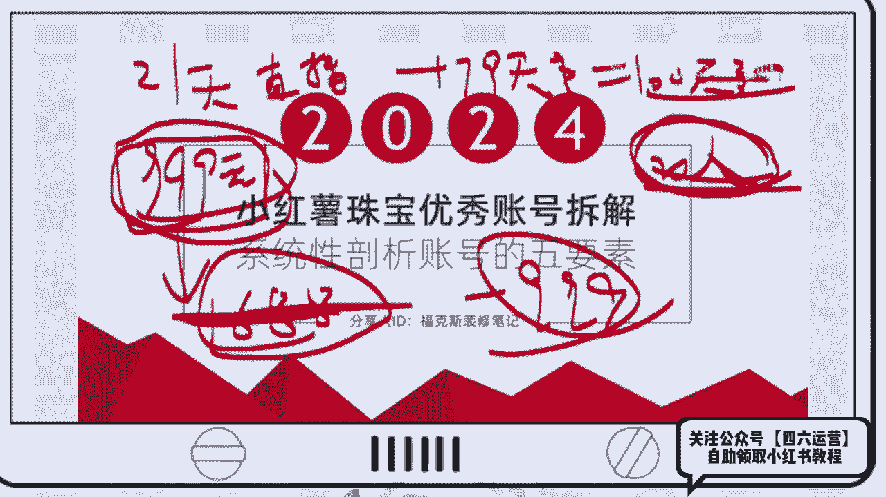

那么第三个就是我希望你们明白啊，我们去做的这个是封面标题的专项训练。那么在接下来的79篇陪伴当中，我们围绕的就是封面和标题，到时候我们会有一个小群，但是在这个群里我们就不聊其他的相关的东西啊。

我们就围绕着封面标题去了，聊其他的就聊散了，聊乱了啊，这是三个点。那什么样的人呢，我觉得呃就是说是呃不适合这个训练营的，就是你希望说就是呃随便就是前面的六节直播课，你都不想听，我不想学任何的封面原理。

我也不想学任何的标题技巧，我就想着说老师你给我一个模板，我套了之后流量就直接就能报啊，就能翻别翻翻多少倍啊，这种就是躺着的规范的那这个不适合你啊。因为再好的一个封面模板，他其实也要对应到你们去用。

你知道用什么样的标题啊，去调整你的新行词。所以说这个模板加上我跟你的逻辑，它是一整套体系的。好吧啊，对会对我还是会我会给你们去布置作业，还会去给你们去做这个你们的作业的一个拆解和优化。

当然这个就是部分的作业的优化啊，它不是说每一个都给你们去做，所以我是很严谨的去做一个训练营。那么这个训练营我希望做到什么程度呢？我希望做到的是全行业的天花板。而且我有信心做到这个天花板，为什么？

因为我告诉大家，在这么多讲小红书的老师里面，真正学设计毕业的没几个人，我是正儿八经学设计毕业的。所以我能够做出任何我看中的封面，而且我能把它模板化。

这是我的先天优势是我从高中开始学美术到四年大学所掌握的知识积累，这是别人不可能能给你的所以大部分95%的老师都只能教你去套一些简单的模板，而我能够把这件事做好。所以我希望要做就做到天花板。

第二个就是对会教PS但是我教的不是说整个PS你怎么去设计，而是教你如何用PS去套这个模板。就是比如说我给了一个模板给你，那我会去教会你说怎么去用这个模板，让你能够做出封面。相当于说什么？

就是比如说你设计这个模板。我举个例子啊，我举个实际的例子，举个实际的例子，我们去看小红书的账号。像这种模板。

需要我教，对不对？这个就是属于你们自己都能做的，就是直接加盘字。但是像这个是不是你们就有一点难度了。那这个如果我帮你们模板化的话，可能5分钟就出来了。那我再给你们找一个难一点的啊。比如说像这种对不对？

像这种如果说你要用PS去设计这个模板的话，要多长时间呢，我觉得一个小时是要的。但是我帮你模板化之后，你知道PS的基本原理之后，你有了这些文字之后，你套在导出需要多长呢？10分钟。

所以就是我是会去帮你们找一些有流量的封面，甚至会针对咱们要做的一个行业，包括像这些封面，是不是它就开始有点难度了。那么我都会基本上就是说你们学会怎么去套它。

基本上就是10到20分钟你们就可以产出这样的封面了啊，像这种封面对吧？可能手机它就没那么好做了。我再给你们看啊，还有什么样的封面，就你们能做的，我肯定不存在去教你们怎么做。

我要做的就是把一些你们做不出来的，简单化，让你们有希望把它做出来。当然了，还有一些配色的原理啊，像这种封面，可能你拿手机它就很难去操作了，但是我们通过简单的PS的使用是可以做出来的啊。

像这种封面是不是它其实很吸引用户的，但是你用手机能做出来吗？做不出来。

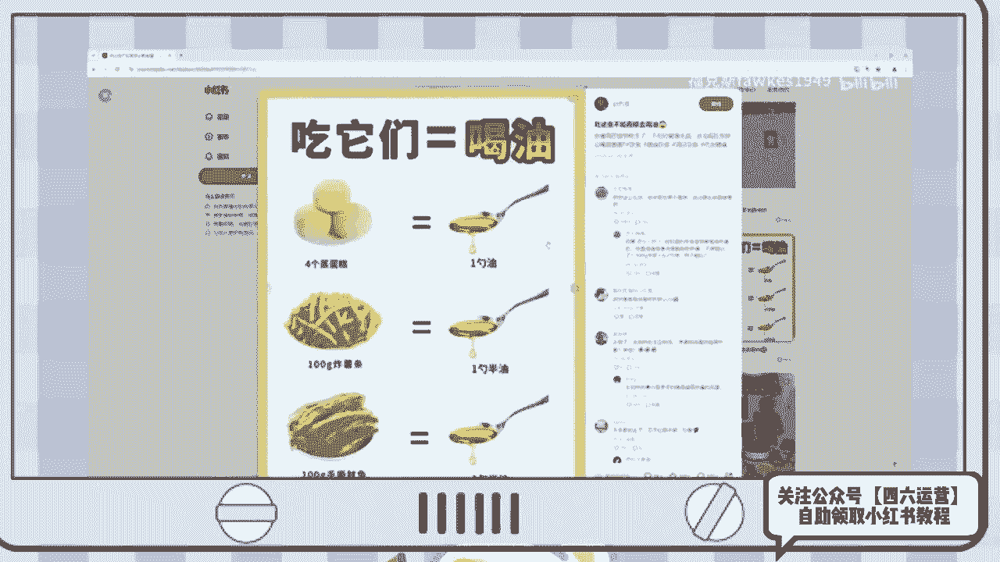

那我们是可以把它模板化的。如果大家就是说确定要来参加这个训练营的，你可以告诉我你做什么行业，我至少会针对你的这个行业，你可以给我提供三套模板。就如果说你已经在你这个行业找到了三个模板封面。

就是模板是很就是数据很OK的，但你做不出来的。我帮你把这个三个模板标准化。在未来79天这个过程中，我还会去持续收集一些新增一些封面模板，给大家去套用整个的这个模板数量。🎼我觉得是会大于等于60套的。

就是拥有60套别人做不出来的模板。而且这些模板是有流量数据证明的模板。像这种封面就是属于你用手机去做，它很难做的。但是其实我如果把你们模板化的话，也是啊20分钟这个封面可以出来，它就看的很清爽。

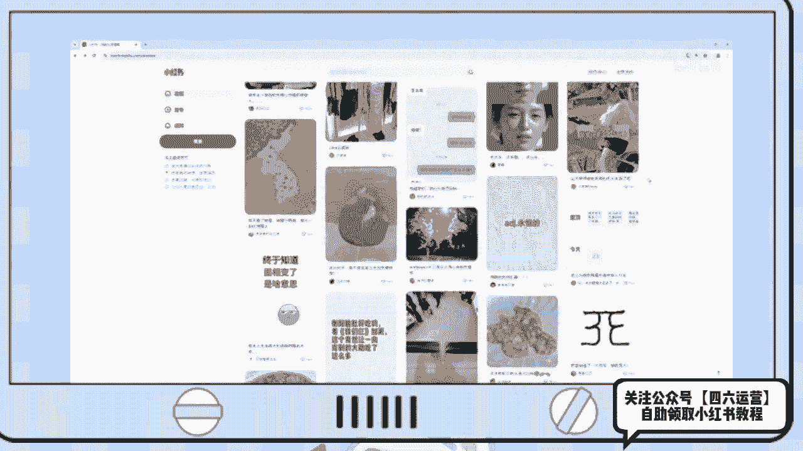

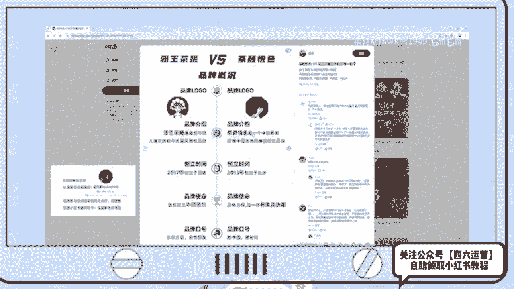

包括还会跟你们讲一些什么东西啊，包括像这种封面也是一样的，也是属于说你们就是手机很难做出来的封面。但是如果你有对应的素材和文字的话，20分钟这个模板就出来了。所以说我觉得我做的这个事情是很有意义的。

就是我不会帮助到那些想躺着就能把流量爆发的人，我会真正帮助到那些想提升的人，而且只要你们真正去稍微把这些基础消化掉。然后我把这些模板给到你们，这个数据真的是会见效很快的。

就是大家是19年用小红书还是20还是2122，还是23年才用小红书，还是没用小红书，可以告诉我一下。然后我针对大家的情况来决定说我的内容的一个速度啊，现在是8点16分啊，我们预计一个小时可以讲完。

然后剩下的时间啊，我们进行一些简单的答疑。OK好，有19年有2有22202223年的啊。OK好，50%的人啊应该是用来小红书有一段时间的啊。啊，也有刚开始用的啊。好的，我大概大概清楚了一个情况。

那我简单的做个自我介绍吧。呃，我的。我用的网名啊叫福克斯装修笔记，是某top一电商平台的一个认证讲师。那我应该我相信大家应该也猜得到top一是哪个电商平台啊，因为我们自己出去讲课的话。

正常来说是要报备的。然后这一次呢我们去组织咱们的这个小红书的一个淘金互助计划呢，也是属于一个临时起义，就觉得说市面上有很多那种打韭菜的是吧？卖个9991299啊，包括1个chedGDP啊。

卖个2000多。我们觉得反正这不是我们的风格吧。然后。这一次组织啊，我们是相当于说是无组织无预谋的。就是大家觉得说可以去给大家做一点事情。因为不管是我也好，还是戴老师也好，还是大一老师也好。

我们其实三个人都是在不同的城市。而且有自己不同的公司，而且是纯实战派的。呃，我上一次分享是什么时候呢？是。上一次我去带这种带队去做这种新平台研究，是20年的时候做视频号。那个时候有一个学员叫小七。

他后来成为了视频号保险行业的一个扛把子也是非常不错的那我跟大家分享一下，就是在我上一次带队20年带队的这个过程中，呃，我最后的一个感受啊，就是往往能够出结果的人，是他提前就有自己的变现方式。

或者说商品的人。因为他自己有变现的产品，他对自己的产品足够了解，他对这些东西呢。就有更强的一个欲望和目标去做。但是呢针对咱们啊有一些小白的这个同学是吧？可能之前没有在电商上去卖过东西。

或者说没有在自媒体去做个账号，没有赚过钱。那么对于你们而言，我说真心的啊，我觉得就是说可以降低一下咱们的一个目标。因为我们看到的，就是说像以我为例啊，我可以用二十几篇笔记做出1万粉丝的账号。

这是基于我十年来的一个内容积累，就是我可以很快的去了解到一个平台，他要什么。我可以很快的去判断这个类目能不能做要怎么做谁做的方式离前更近。这都是需要基本功的。所以说接下来呢那我就不浪费时间了啊。

马上进入正题啊，感觉大家进来的差不多了。那么我们今天讲的主题是小红书运营的一个底层逻辑。我们怎么样从0到1来做出1万粉的账号？那么先是我们来看一下啊。今天讲4个。大块。第一个是了解小红书的一个平台。

第二个是小红书平台的一个底层逻辑。第三个是小红书用户的一个使用逻辑，以及我是怎么样从零起号月破百万的啊，我是大概是平均去年应该是做了将近1000万的一个线下的成交额。

那今天我会弱化这块部分会主要跟你们讲，账号和平台怎么去做。然后整个的这个内容绝对是纯一线的实战干货，我敢说这个东西你们在外面应该是很难很难听到的。因为大部分就是说公司比较大的话。

这个老板他不会是自己一线的操盘手，他操盘有别人，而我的账号是我自己从选题到内容到全流程是我一个人独立完成的。虽然公司有人，但是我做小红书是属于2019年是属于先行研究。

所以我是没有用用任何公司资源做出来的。

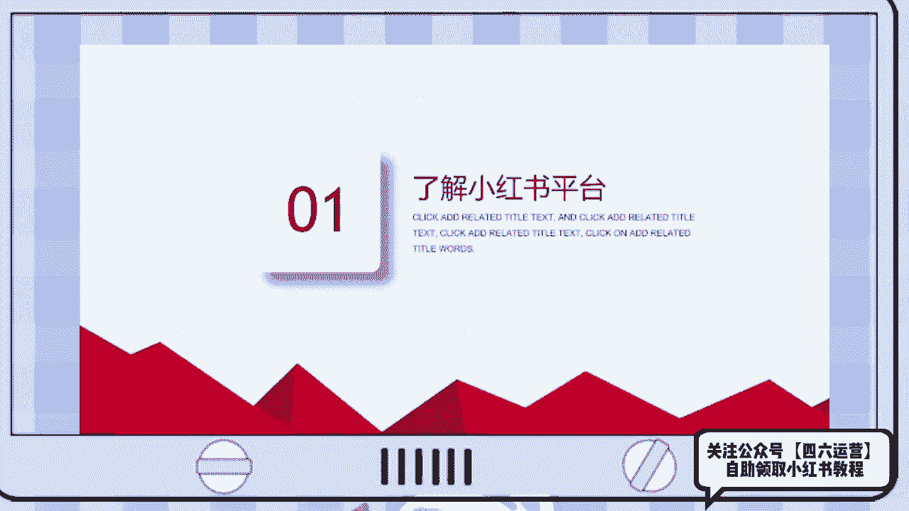

那我们先了解一下小红书的一个平台啊，就是说先看一下小红书平台的一个官方定位啊，这这张图是小红书官方的图片，它的描述什么？是生活方式平台和消费决策的入口。凭借真实向上多元的社区氛围。

小红书已成为年轻人不可。替代的啊入口。所以小红书给自己打的标签真实是排第一的，向上啊，社区以及消费者觉对入口。那这个第二个呢它是讲到了高净值啊，高净值人群超一亿的月活用户70%的一线和这些一些东西啊。

但这些数据是中间的。我们把官方的这个资料说成人话是什么意思呢？就是在目前现阶段的这个网络平台当中啊，我们可能会刷抖音，可能会刷快手或者B站知乎啊，甚至微博。那我们会在这些平台上去接触很多很多的信息。

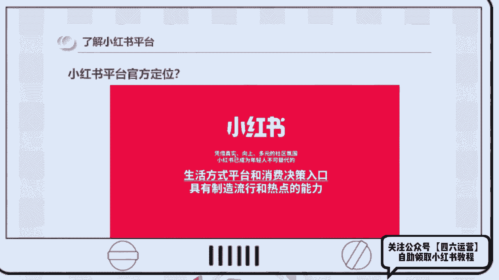

那我们小红书和他们之间是发生什么关联的呢？就是因为他们从这些平台上啊，从这些平台上收获到信息之后，他们。在穿梭到小红书来进行一个研究，通过小红书进行浏览啊，然后进行一个影响决策。

要么他们会在小红书进行拔扫。因为小红书它自己有官方商城啊，要么他们会直接在其他的平台进行一个购买，这是小红书的一个决策时刻。好，那我就跟大家用说人话讲啊，就是小红书这个平台它到底是怎么火起来的呢？

其实它是经历了抖音的一个4近将近4年的一个增长。因为抖音在它这个四年的一个野蛮生长时期，它的变现方式其实是经历过N种样式的迭代。我不知道你们有没有人刷到过啊，最开始的抖音快手变现。他们是主播只要有粉丝。

你在直播间你开直播就有几千几万人在线，这个时候就已经开始有商家。比如说比如说啊比如说你们是主播，你们的直播间有几千人上万人，而我是一个卖面膜的商家啊，我就会告诉大家，我非常非常的喜欢你很喜欢看你的内容。

我的这个面膜，在天猫旗舰店卖199啊，在京东卖199，但是针对你直播间的粉丝，我拿出几百单来做福利，只要多少钱，只要39。9块。那个时候是抖音最开始的一个变现模式，就是商家直接打版，打版之后直接卖货。

然后。主播给这个商家挂人，我想问一下，大家有经历过这个时刻的人吗？有经历过的打个有好吗？有经历过这种卖货的吗？叫打连麦卖货。那再往后走，抖音开始推出一个小黄车，就可以进进行一个通过小黄车去购物。

那这个时候它是什么玩法呢？他们就有很多的人啊跑到这种源头的水果产地啊，大爷大妈啊，下跪说，求求大家了，我的苹果直销啦，橘子直销了呀，就用感情牌啊，用视频去吸引大家去下单啊。

但是这些东西现在是不被允许了啊。那么再往后走，像一些美妆的，他们又研究出一个什么样的一个玩法呢？就是一次性投放上百个达人账号。比如说啊我老婆她买的那个酒酿面膜，我记得买过酒酿面膜，买过那个薏米茶。

买过那个号称是协盒的美白美白的那个小瓶瓶的，后面都上新闻了啊，协盒说根本他们就没出过这个产品。那么这个操盘的打法，就是可能你通过一个博主，对吧？你说这个美白能这个东西能美白，可能你不信。

那O我买通100个博主甚至几百个博主，我让你9点钟刷视频，A说它有用，B也说它有用，C也有用，刷的越多之后就造成一个从重心理去进行一个收割。而这一系列下来啊，就有不少人收到货之后，他就会发现什么？

就会发现自己踩坑了。然后也就开始变得谨慎。那怎么样防止大家上当呢？所以这个时候其实小红书的价值就开始体现了。因为小红书它的定位是种草的一个分享社区，而且它的算法对普通人很友好。

有大量心地善良的人在里面分享，包括面膜的使用感受啊，防晒霜的一个真实效果对比图啊等有效信息。所以小红书就相当于它为大众提供了一个产品好坏的一个体验的一个分享平台。你们如果片面点的去理解。

也可以理解为它是一个避坑平台。但是然后又由于前期有很多的海外购物经验分享，小红书，它的前身是做海外购物分享的，积累了一批高素质、高学历、高消费能力的用户，高素质高学历就决定了他们的语言表达会更加的客观。

他们拍照的能力和展示的能力都更强。所以他们给用户的感觉，会比商业的博主要更加的真诚啊，可信度更高，也就慢慢积累下一批女性用户为主的用户。那么抖音和小红书如果。我说在我的视角里，我们去做一个对比。

就是抖音，现在是专业的玩家居多里面呢鱼龙混杂啊，有正有正向的啊，也有玩套路的，而套玩套路的是层出不穷，而小红书呢，它更倾向于普通人真诚分享的平台，里面信息的密度是比较大的。

你可以筛选出有用的避坑指南生活方式。所以其实就让我想到啊，就像我们以前用淘宝是吧？最开始我们在淘宝上买衣服啊，可能只需要有衣服在上面挂着。就会有人去买。那再往后唉。

商家觉得说好像好评这个东西对消费者决策起到关键的作用。那可能他们就会在好评上面啊，比如说我搞100个买家秀，自己弄100个账户去。说这个衣服有多好看，穿上去效果有多好，但是消费者他也不傻呀。

他发现说唉我买回来衣服和好评里面的衣服不一样，怎么办啊？消费者就开始不看好评，我们开始看差评啊。那有的商家又变聪明了，你看差评是吧？那我就在差评里面去做文章，通过差评去让你认可我的产品品质。

比如说啊比如说一个一个一件卖一件衣服是吧，他可能说给的是一个差评，但他说虽然衣服质量还可以，价格也合适，但是配送太慢了，这个差评我给定了。像这种的语句，看似它是一个差评。

实际上它还是向你传递了用户的真相认可。所以商家和消费者他一直在博弈。而大部分人我们在抖音如果说去买到了这种不好的商品，你去曝光它，其实拿到的流量是很有限的，而小红书这个平台不一样啊。

如果说你在上面买了什么不好的产品不好的体验，第一，素人的流量权重和大大的博主可以说几乎没有太大的区别。第二，小红书它有搜索流量，因为我们是基于什么基于我们在某些短视频平台刷到了这个产品。

比如我刷到一个是吧？这个又刷到一个什么面膜啊，号称能够美白。那这个时候因为我之前上过当了，所以我这一次我就希望说我在小红书平台再去搜一下。而这个时候当他搜这个面膜的时候，可能他就进来一个测评的帖子。

那测评的帖子可能就告诉他这个。面膜不如另外一个面膜啊，然后这个消费者的心质就被影响了。所以小红书它基本上就是给我觉得片面的理解啊，就是避坑平台，它的内容就类似于说豆瓣的电影评分啊。

以及大众点评的一个美食评分一样。那虽然到今天为止啊，平台里也会有很多的素人分享。但是同时也参杂了很多的这个商家啊冒充信息。但是这个平台整体来讲还是非常有这个使用价值的。那小红书平台的一个底层逻辑啊。

就是我在做小红书平台的时候的底层逻辑。首先我们去做一个东西，一定要了解一个平台他要什么平台要的东西，你给他他自然就给你流量。那么我想问大家一个问题啊，假设现在你们啊是一个开淘宝开天猫旗舰店的。

现在你手下有5个有5个客服来回复这个客户的咨询，你店里有2000，现在每天有2000个咨询啊。你会怎么去分配，是平均分配2000个除以5个人，每个人平均分配400个，还是怎么分配，还是说不平均分配。

你们可以告诉我吗？你们思考一个问题啊，现在你们的身份是天猫旗舰店的一个老板，你有5个客服啊，然后有2000个客户咨询，你们怎么分配是吧？这同学很配合啊，这个是平均分配。这个其他的啊其他的朋友啊也可以啊。

继续去多互动。因为我知道你们的水平就决定了我后面讲的一个东西的重点和速度。啊，有人说不理能下单的不会多问啊，这个兄弟，你在跟我开玩笑，你一个开天猫旗舰店的，你说2000多个客户咨询，你有5个客服。

你跟他跟我都不理啊，有人说按需求比例，有人说按能力分配，有人说平均分配。好的，那如果说这五个是新人的话，那基本上来说的话，第一轮肯定是先平均分配。但是你们往后走，你们会发现一个结果。

就是每个人的能力是不一样的那我们可以看到，那通过一个星期的数据下来，那我们现在发现了张三他的成交是4000块钱，李四是3000块钱，往五是8500块钱，照六是6500，升期是1000。

我想问一下你们接下来你们准备平怎么分配呢？我相信啊。假设你们是一个老板的话，你们是不是会希望王五能够拿到更多的客户？因为王五的销售额是8500元。他是张三对吧？和李四的dubble。所以。

这就是我们啊假设我们开店的一个商业逻辑。那。到了小红书平台，你们就去思考小红书平台，其实对于小红书而言，我们他手上拿到的东西是什么？他手上拿到的是反客，对吧？我们打开手就变成反客了。然后呢。

他手上会有多少呢？会有新增笔记。那你觉得他分配笔记怎么分配呢？他就像我们去开店铺一站。他前期比如说我们现在同一时刻这一分钟有500篇笔记，新到诞生了，他一定是给这500篇笔记啊。

一个平均的一个初始流量值。然后通过初始流量值的一个数据表现，再次再去决定二次分配和三次分配。所以那我就想问一下大家第二个啊问题就是小红书平台它最想要的东西是什么？你们有想过吗？

是用户停留还是新增还是成交额？你们可以在评论区啊可以在评论区。告诉我。你们觉得小红书平台最希望要的是什么？我来看一下啊，这道题这道题挺有技术难度的。所有打停留的啊停留的是正确答案，停留的是正确答案。

因为我现在用的词是什么？是最希望要的是什么？为什么我告诉你，用户停留是最关键的啊。因为不管是小红书也好，抖音也好，快手也好，微信也好，他们都在干一件事情，就是要争取用户的时间。为什么？

因为你后面所有的成交额，你的这个电商的变现，广告的变现都是要基于用户在使用你这个软件。包括你们所说的用户新增，新增看上去很重要。但是你要明白，当我们愿意用1个APP愿意一。新增只是早和晚的问题。

如果1个APP你一天只用2分钟，或者说你一个星期你都不想打开一次，你觉得这样的新增有意义吗？所以我们就想到以前是吧，我们以前看电视的时候。还记得吧？以前电视台的核心关键数据是要啥？是要收视率，对不对？

收视率电视台有了收视率，它就可以去插播。广告植入对吧？可以接一些大品牌的一个广告。所以对于。这种平台也好，其实不管小红书、抖音、微信、淘宝，他们都是希望有用户停留，有用户停留才有切可能。

那这里又有一个问题就是。我们希望用户停留。那就需要有好的内容让用户去停留下来。但是小红书的平台，它是一个机器。如何让机器去判断内容的好坏呢？啊，我们都说内容未完，你们有想过没有？

如何让机器去判断这个笔记的好坏呢？如何让机器去判断笔记的好坏？机器一篇笔记灌输下去，其实它是没有办法啊算法机器是没有办法完全去识别出内容的好坏的，它只能通过一些数据。

所以我们能够看到的点赞、收藏、评论、转发。这四个东西其实就是一个用户的反馈。对于机器而言。系统推荐。两篇笔记啊，A笔记和B笔记各500个。报关A笔记获得了100个点赞，B笔记获得了10个点赞。

那机器就有理由判断A笔G更受用户欢迎，能理解吧？我相信你们都能理解的。好，所以说整个来讲，小红书平台它其实就是基于。用户停留的需求啊，用户时长的需求通过机器去判断你的内容是否是用户喜欢的。

能够让用户留下来的。因为我们自己是不会在我们不喜欢的内容去浪费时间的。所以那整个来讲的话，大的方向啊我跟大家分享一下，就是小红书平台现在有哪些红利呢？第一个是流量红利。

因为小红书目前的月活应该是两个亿左右啊，我估的。然后23年刚刚上线了网页版。这个流量红利就意味着说，如果小红书未来的月活能够在接下来23年、24年达到5亿的话，它有两倍的流量buff。

就是你做相同的事情，它是有两倍的流量buff。如果小红书能够到7。5到8亿的用用户，就有3倍的buff，是你做相同的事情。这也是为什么我会去在。119年去做抖音，我们做11抖音是19年6月份。

我做小红书是21年10月份。我永远因为作为一个老互联网人，我永远是要抢平台的前瞻视角前这个流量加成的。所以说抖音我我们现在有在做，我们还会接下来还会去做。但是现在的抖音的流量已经肩顶了。

所以我们其实早做和晚做同样的一个项目，差距不大了，没有流量红利了。那第二个点，我们讲的是素人红利，就是小红书平台对于素人笔记的其实是很友好的。而且最近小红书平台。

他把这个广告的门槛从1万粉下调到1000粉也可以开通。这是你能感受到它不是去捧这种大博主的一个心态。第三个叫搜索红利，就是笔记在小红书的笔记，它可以获得长期且持续的搜索访问量。

3000小眼睛的笔记拿到100万。小眼镜，这是我实际的我的后台数据。这个等一下你们后面呃可以给大家看一下啊。第四个就是电商红利。小红书今年对于电商有很多的动作，类似于早期的小红车的推出。

包括最新拿到的信息。小红书的这个本地团购也在内测了。就是你通过笔记可以直接上架。本地的一些优质商家。所以我觉得就是说对于一些小白而言啊。你这一次可以把你的目标定到，你知道怎么样去做内容，做有效的内容。

然后电商这个东西你可以。就是说你不要把自己的要求拉太高啊，在这一次，因为后面还有本地团购等着你。这个你们可以看一下，我有一个习惯，就是我会统计我每一篇笔记，每一天的一个最后的一个数据。

这一篇的话是截取的一个曲线，它是从。这应该是几百的播放，到了几万多多播放。而且这张图是我应该是去年截的，现在应该还是继续往上走的。这个我没有去拿数据最好的图片。所以说小红书最牛逼的地方是什么？

就是它的长尾流量是我见过最牛逼的。长尾流量是我见过最牛逼的，没有之一。包括你们可以看到右边啊它的搜索我的笔记，我的搜索量是77，所以都是搜索进来的，搜索流量就越的精准。那么总总结一下，就是小红书平台。

快手，它们的差异在哪里呢？快手抖音啊，我觉得它可能更倾向于之前的优酷土豆是用户一个欣赏观看视频的一个工具。而小红书呢它有点类似于百度加知乎的一个结合体。我们在百度可以查到怎么去。一些比较啊更深入的东西。

比如说iphone怎么去拆机，而小红书它有百度加知乎的一个这种掉线的一个感觉。我们接着往后走啊，那么小红书我们要去做的话，我们了解了平台之后，我们要还要了解用户的一个使用逻辑。可以看一下这张图啊。

这张图是我去研究用户的一个一个流程图，我们可以发现说小红书平台，你打开之后，对吧？它给你推荐的是4篇笔四篇笔记啊，四个封面，对不对？四个封面，那么我们的行为轨迹是不是要么你就有有兴趣，你就点进去。

要么你没有兴趣你下滑了。而点进去的里面，要么就是看完所有内容啊，要么你就是看完离开了，是不是？那还有第三个什么思考一下，思考一下，动一下你们的大脑，我们打开小红书啊，我们小红书给我们推送了4篇4张封面。

我们要么点进去看完，要么我们看完离开了，还有一个选项是什么？有没有人能够想得到啊？今天的内容，你们能够动起你们的脑子。我相信会让你们可能是今年收获最大的一个小时。看一半啊，这个这个朋友没有名字。

但是我觉得回答的很漂亮。就是还有一个选项就是没有看完离开了没有看完离开了。没有看完，离开了啊。所以说看完所有内容之后的路径，他又选择没有互动离开以及有互动离开，以及进入个人主页。啊，以及接下来的路径。

所以这是我去研究用户，其实我就是研究我们自己。那你们有没有这样的一个思维是吧？我们再往后走。那么小红书平台做账号和抖音它到底有什么不同呢？第一个就我们刚刚所说到的啊。

它的其实是属于信息的推荐方式就已经不同了。因为抖音打开软件，它是直接推送一条内容并自动播放的。你们不感兴趣，你们就会去刷到第二条。而小红书打开软件，它是推荐4条内容，它没有自动播放的。

你们不感兴趣就直接下一条了。所以就意味着是什么？说明抖音的开头很重要，因为抖音是自动播放，而小红书的封面标题非常重要。如果你的封面标题不行，对不起，我我一一个我都不会点进去看，我直接下面四个了。

所以说小红书的标面标题封面非常重要，大家现在应该能。这个解这个拆解，你们该能意识到封富标题的非常重要性啊。那么你们去思考一下，或者说啊你们有女朋友的，有男朋友的对吧？或者你们的同事。

你们去研究一下你们的同事，他在耍小红书的时候。给他四篇笔记，他是怎么样去阅读的一个顺序，他是从。一看到二看到三看到四，还是他打开手机扫一眼啊，直接滑了，还是说打开一眼扫一眼直接点了。就我个人而而言。

这四篇笔记我是不会按顺序1234去看的，我是扫一眼的，扫一眼也就意味着说。一秒钟的时间，4篇笔记，其实每一篇笔记连半秒都不到。所以说这个封面标题非常之重要。那么小红书平台啊做和抖音还有一个什么区别？

其实他们的账号的运营方法也是不一样的。抖音平台，你们去运1个IP，其实主要还是要去博这个系统的一个推荐流量啊，用想办法去破圈。而小红书他是因为社群属性和搜索流量大，他还可以通过账户笔记为形象展示。

去他人评论去吸引目标用户啊，像右边这个案例啊，是我前几天刷到的。就是这个人。在这篇笔记啊这篇笔记讲的是啥呢？这篇笔记讲的是。就是没有听妈妈的话，拿着家里的钱去开店就压力很大啊。他就在评论区说。

我也是对家里报喜不罢忧。开奶茶店最多负债500万，不敢跟家里说，每次问只能说还行，因为奶茶店太卷，最后去做压，结果没想到一年把负债还清，还把生意发展到全国，就意味着他这个其实传递了一个什么信息，一年。

他是负债500万一年还清，就意味着说什么说他一年赚了500万。然后下面还有一条评论，不过你们家味道确实不错，就是价格高，不知道是不是一样，对吧？还有一个用户好评。看到没有？所以如果说我想问一下大家。

如果是你们。看到了这一个人，你们会不会点他的头像会打会好吗？不会打不会。如果这篇笔记是你们刷到了，你们会不会点他的头像去看一下，因为他负债500万。啊，一年还清会对不对？那我想问一下你。

你们点了他的头像，进了他的主页和他发一篇笔记，你们看完了进他的主页是不是达成了同样的一个目标，就是把你吸引到了他们的主页里面去。是不是？所以这就是小红书的一个魅力。它可以通过评论区去吸引用户。

不是只能够通过内容去吸引用户。啊。那那也就意味着说对不对？比如说是不是就我以服装举例啊，我们用服装举例，我们换位思考一下。假设这篇笔记它讲的不是开店亏钱的事啊啊，或者说我还是开店开店亏钱啊，就是呃。

找爸妈借了10万块钱啊，开开童装店。啊，开不下去了。会不会小红书会不会有这样的笔记，肯定会有就是那些开童装店开不下去的。那么是不是可以在评论区去说。现在实体店的东西卖那么贵，怎么可能开得下去？

我在我在朋友群里买的一件小朋友的T恤，才6。9块钱，而且跟实体店29。9块的质量差不多。谁还愿意去实体店买东西？我想问一下大家，这一句评论区有没有杀伤力？是不是你们就可以理解啊。

同样的小红书他现在还干了一个什么事情。今年啊我发现他把群聊的一个这个好友数就是一个人可以进群的上限，已经我现在已经建到15个群了。之前我只能建5个群，现在能建15个群。

那也就意味着说他的这个玩法会更加的多样化了，包括他还可以他他有一个官方页面，招募群友，你建群之后，他他给你提醒你，你可以发布笔记招募群友。所以这个玩法就有很多种方式了。好，那我们就问。

那么接下来我们的问题就来了。那我们的笔记封面如何脱颖而出呢？已经知道每次打开推荐四篇笔记，我们怎么样把封面做到超越他人呢？尽可能高的拿到点击呢？啊，这里我插一个问题啊，我插一个问题。

就是平台能够给你们的给普通人的唯一的一个。数据你们知道是啥吗？就假设啊我们200个人全部发笔记，他能够唯一给的东西是啥，你们知道吗？他能够唯一给的东西叫这个。叫报关。啥意思啊？

就是把我们的笔记推送到别人的手机上面。这个动作让你的手机。看到这四篇笔记，这个动作叫曝光，就是平台唯一能做的，就是让你们的笔记出现在别人的手机屏幕上面，他只能做到这一步，他没有办法让。

看到你这个笔记的人点进去，他也没有办法让他点赞。所以很多时候你们的小眼睛是由什么决定的？是由你们的点击率决定的。假设平台给这四篇笔记都给一000的报关。都给一000的报关。

假设这篇笔记1000的报关里有200个人看。就会显示你们的左下角就会显示小眼睛。其实这个叫。小眼睛它是属于阅读数，但是平台给你的不止200，他可他可能给了你1000，明白吗？明白吗？同样的。

这只猫它可能也给了1000个曝关，但是因为这个猫比较吸引人，所以它有300个小眼睛，那就是30%的点击率。所以你的眼睛只有200，你的眼睛，别人有300，不是说平台给了它300给了你200。

而是你的点击率会影响。好啊，那我告诉大家，我是怎么样去提升我的封面呢？接下来的这个方法，如果大家看了有用，就在评论区回复有用，好不好？我的选择是啊，这是我的一个封面。我的选择是我做出来我的封面之后。

我把很多个封面放到一起，我把我的放上去，看我是不是最能跳出来的那一个。我把我的封面放在这个手机的示意图上，看下跳能不能跳出来。我把我的封面放在这四个里面，能不能跳出来。有用答有用好吗？有用答有用。

因为我跟大家说了，我们这一次的三位老师全是实战派老师。我不会去跟你们说什么啊，标题的三个方法啊，这个吸引人的三个方法，我讲的就是我在用解确实有用的东西。接下来还有更多的干货啊，咱们继续。啊。

大家也可以在去。继续啊，咱们继续。好，那么问题来了啊，就是笔记封面我们如何脱颖而出呢？啊，这是我今天从网页版上啊截图的十几个。那么。划重点来了，就是在之前啊在在今今年啊网页版推出来之前。

我们要思考的是啥？我们要思考的是四篇笔记啊，我们要思考的是四篇笔记，我们怎么脱颖而出。但是网页版出来之后，网页版的推送是是多少？是是这样推送的是我是黄红框里面的一个推送啊，我是把两个拼到一起了。

那就意味着说每如果说你要考虑到小红书后面的流量，它如果是手机端进入，你是四进一。它如果是网页版刷的话，你是十5进一，是不是对你的封面要求更高了。那么这一张图，我为什么截给大家看啊，我想跟大家讲一个点。

改一个点。就是。以网页版的一个阅读质感。我把这个。同样啊这种在备忘录打字啊，这种算很简单一个展现形式，这篇笔记算一号笔记，这一篇算2号笔记，这一篇算3号笔记，这一篇算4号笔记。

你们认为1234里面哪一个是如果你们选择这种表现形式会会认可的方式？1234，你们更认可哪一种方式？二、对不对？为什么？因为二不仅它的标题更加的显眼，它还画了一个红圈，做视觉引导。而一是吧，一的字。

三的字啊都是属于字都有点看不清了。四还好一点，在网网页版的视角里，四的字还是比较清晰的，而二的标题更加的清晰，而且它还用了这个用了这个红色，对不对？这就是我们把就是东西好坏是怎么来的？我告诉你们。

封面好与坏，标题好与坏。就像什么？就像我们。😡，给我们的对象拍照一样。你拍一张照片可能就只能拍出50分。那我们怎么样保证自己的对象能够选出好看的照片，是不是咱上来先给他干个100张。

是不是你在100张里面选，你总能选出好看的嘛？所以我们去做小红书，做封面，我们。😡，两种方法，一种是我们去看100个封面，找出我们觉得好的去学习，还是我们做100个。去选一个呢，肯定是看嘛，对不对？

然后。讲到这个服装啊，我今天还去找了一下服装的例子，就是我们如果去研究账号啊，我们要去向有结果的人的学习。因为我已经告诉大家，标题和封面非常的重要。那什么叫有结果的人呢？

我觉得第一个你要看他的数据是否稳定啊，像这个账号。他前前面的数据还是比较稳的啊，点赞都在100以上，可能最近的流量不行，但是它能够连续几篇拿到100点赞的这种账号，它其实一定是对平台有内容理解的。

如果一个人对平台的内容不理解，他的数据就会变成什么，可能突然他有一条100点赞1000点赞的。但是再往后他无法连续，他无法连续，就是优秀的人他的下限是更低的。

就是我们没有人能够说我一定能写出一万点赞的笔记，但是优秀的人他的下限可能就是100。但是如果说你对平台没有那么了解，那你的笔记完全就是开概率。那这个账号他的特点在哪？因为你们要讲要可能有人会选择做服装。

那我给你们简单讲一下，就是。第一它的定位，它是专门研究篮球穿搭。细分是吧？第二个。他是。小众篮球穿搭。第二个，为什么我说这个账号有用？是因为我们通过他的评论区，你去看是会有人找他要链接的啊。

求第一套裤子的链接，它不是简单的说，我给你点个赞我，点个收藏，我走了，你会在评论区看到有人要要是什么，是代表购买欲，是不是？好，那我还找了几篇其他的这个衣服去看啊。像这个账号也是比较有特点的。

这个账号它的一个拍摄角度是非常固定的，而且它的数据也很稳定。这个账号数据也很稳定啊，然后这个账号人家更直接了，蹲价格侠，价格侠什么意思呢？就是谁谁去了店铺翻到件衣服的价格，告诉我。

这个直接就是考虑到价格层面了，能考虑到价格层面，说明什么？说明这个衣服他已经心动了。那么我们再往后看第三个啊，这个账号它叫野生塔塔。这个账号它也是很固定的一个商品，对不对？我们讲的账号定位清晰。

它的账号定位是什么？账号定位就是这种它这个叫什么叫JK是吧？学生日常的这种风格，然后他的目标客户也很清晰是吧？就这种感觉很相似啊，他的效果有没有有人家会问他群子哪家的啊，他说海胆举例子。好。

那接下来问题来了，其实这三个账号，它的变现方式是不一样的。是不一样的，你们来看一下啊。这个。人家是告他是告诉别人，我的裙子在这家店铺买的这一个也是告诉别人我在哪里买的这个衣服。而，这一个呢。

这一个是发链接。谁。我先问一下大家啊，就是篮球啊和这个黑衣服。啊，这个水手服你们觉得这三个哪个更赚钱？或者说哪个的运营水平更高。你们有这种感感觉吗？就运营水平来讲啊，是打篮球的高，还是黑衣服的高。

还是水手服的高？有人说篮球啊，有人说第二个，有人说第三个。啊，你们觉得篮球是吧？其实我我我讲我的个人观点啊，我讲我的个人观点，可能我会觉得黑衣服的高一些。就就变现手法啊，就变现手法。

这个篮球它是卖衣服嘛，是吧？它可能是没有上线的。但是就这个账号定位而言，就账号定位而言，我觉得黑衣服的。呃，段位高一点。因为第一个他的这个数据。更加的稳定是吧？篮球它是稳定稳定100家。

那也意味着黑衣服一篇是他的十0篇。第二个，黑衣服的这个。质感更高级，单价应该也会更高一些。这是我我的个人观点啊，我的个人观点啊。就是黑衣服的整个调性，它就不是简单的说我要卖衣服这一件事情本身。

它是我在卖衣服的这个事情里面，我去选择更高客单，更高预算。更有钱的这个客户群体。而且我告诉你们，这三个账号里面。有两个账号其实是有模板的，这个水手服，它就是在走。

就是在出快出门的这个位置拍这个黑衣服它就是在这个位置拍，而这个篮球它是户外户内，包括这个停车场都拍。所以从这个拍摄的一个。这个角度和拍摄一个成本啊，我们可能拍一条这个成本。是差不多的。

但是你做篮球的这个账号，它是一直在想我今天在哪拍，明天在哪拍。而这两个剩下的黑衣服和水手服，它是有模板的。它是我只要有新衣服，我就知道在哪拍了。而且它的这个模板是持续有数据的。

这也是为什么我说黑衣服的它这个运营水平更高。他的拍摄模板更加的明确，不用每天去抠脑袋，我明天怎么拍它的数据更加的稳定，它的质感更加的高。至于他变现手法是挂店铺也好，还是挂链接也好。

其实他有了这个运营能力，只是他自己喜，只是看他自己想怎么玩而已。他想轻松一点，他就挂店铺啊，他想复杂一点，他觉得赚钱多是卖衣服，他其实完全可以挂链接的，他的运营能力是最高的。

那么最后啊第三个板块来讲讲我是怎么样去起号去月报百万的啊，这个其实是讲的是怎么样去做成交。那可能针对大家来讲，我我因为我是擅长去往思域导的，我成交会讲少一点，我会讲这个账号的运营思路。

然后啊总共总共我分了四个步骤，第一个步骤就是我要掌握平台的规则。我第一步一定是了解平台。第二步是什么？是获取种子客户植入钩子哈，让人把别人从这个网络上调到思域里来。因为我是擅长思域啊。第三个呢是。

做成交。那第四个什么是做复购，分了四步很明确的。那么我要做这四步的时候，那我要研究我自己了。我作为一个用户，我用小红书APP的原因是什么呢？那我前面跟大家讲了是避坑啊，是查资料。

比如说小红书已经牛逼到什么程度，我告诉你，如果你是一个女生啊，她可以牛逼到你到长长沙来游玩，你去哪几个打卡点，他都给你标出来。他不是哪几个景点，他去哪几个打卡点，拍什么样的机位的照片好看。

他都能给你标出来。所以小红书它是有价值的，有干货的，有攻略的啊，这是第一个。第二个。当你看到笔记的时候，你点进去是为什么啊？这些问题比较多，我不一一展开，但是是我去做的时候会想的问题。

那么第三个就是当你看完笔记后，你点赞收藏评论的原因是什么？我会经常问自己的。比如说我一个我比如说我给这个笔记点了个赞，那我想一想为什么要给点赞，我点个收藏，我想为什么要收藏。那么再看一下数据层面啊。

其实最开始的数据我是跟大家啊，我是跟大家没啥区别的。可能一开始就10个赞，20个赞，这很容易，对不对？30个赞。然后我通过我刚刚给你们看的啊，我对封面的一个优化方法之后。

我马上把数据拉到了上百的点赞收藏，上百的点赞收藏，而且是稳定的，对不对？这个158这个191这个176，这也是也是几个月前截的图啊，现在的这些数据肯定更高了。但是你们发现没有？我又从。

100多优化到了上千点赞。啊，后面我就开始上千点赞了，收藏加点赞肯定是过千的啊，这个图都是半年前的了吧，应该至少是。我做了什么，你们知道吗？我告诉大家，我就做了两个字，一件事。这个叫做迭代。

就是我没有认为自己找到了100多200多点赞的一个方法，我就觉得我很了不起。我在想办法去做的更多。所以我选择了这个方法，其实我就已经有效了。但是我又尝试了这种方法，我没有要封面，我换了一个样式。

那这个样式数据起来之后，我就持继续用了数据更好的样式。那我问一下大家，你们有没有想过，为什么后面的这个会比前面会数据更高呢？你们能不能想的明白，假设你们是一个观众啊？你现在你们现在不要单子里是一个运营。

你现在就当你是个观众。为什么你们为什么后面的这个数据会比前面的会更高？告诉大家啊，我后面我去复盘，我去分析的是。后面的比前面的这种内容含量会更高。就是戴老师前几天说的一句话叫意图胜千言。

这个封面的信息量比这个封面的信息量要大。信息量来讲的话，这个是小，这个是中，这些的信息量是大，这是密密麻麻的一个表格。所以这个信息量是最大的。同样的还有一个问题是什么？是因为它的信息量非常之大。

所以它不点进去根本看不清。能理解吗？他可以看到标题，标题它可以看得清净水方案、净水器啊、浴霸，但是它看不清型号，我看不清型号，我又想知道这个东西的结果我怎么办？我是不是要点进去。能理解吧能理解吧。

因为看不清，所以他要点进去，这是我后面复盘的。所以。点赞提升的秘籍啊，我跟你说，绝对绝对只有8个字。就是真诚分享友好互动，你们自己去看小红书的这个这个官方啊，他们有很多账号，就跟你讲8个字。

真诚友好分享互动啊，真诚分享友好互动。但是啊从流程上来讲，我们可以猜四个动作，分别是点赞、收藏、转发、评论。那我想问一下大家啊。你们知道点赞撬动点赞的秘诀是什么吗？你们知道撬动收藏的秘诀是什么吗？

你们知道撬动转发的秘诀是什么吗？你们知道评论的秘诀是什么吗？我来告诉大家。两个好不好？我跟你们说两个，你们自己带着两个回去思考。撬动收藏的秘诀是什么？你们看一下我的这个账号啊。

看一下我的账号其实有一个特征是收藏比点赞高的。你看这篇笔记啊，6800的点收藏6300的这个。点赞。包括像这篇啊，1300的收藏6660的点赞，基本上你们随便看1900的点赞3100的收藏。

你看到今天啊我的数据优化结果是什么样的，是。我的数据结果是这样子的。就是你可以看到我快速的从上百个点赞收藏优化到大几百，直到全部啊接近很多都是上千的。数据像这一篇啊，4400的点赞，9500的收藏。

你们知道收藏的秘诀是什么吗？我告诉大家。收藏的秘诀是我想问大家一个问题，两个选项。A啊A拍一个视频是他做饭的一个过程。比如说他做了一道长沙的特色菜啊。查到车他是啥呢？这个。反正有茶色菜。

我一下子没想明白啊。我想一下啊，比如说剁椒鱼头吧，香菜啊，它A做拍了一个剁椒鱼头的制作过程给你们。B。拍了一个剁椒鱼头的制作过程加菜谱，你们觉得这两个是过程的收那个点收藏的人多，还是有菜谱的收藏人多？

Yeah。啊，我告诉大家，一定是过程加菜谱的人多，为啥？因为制作过程我看一遍，我记住了，所以这个视频跟我以后没有关系了。但是这个菜谱他可能有多少克啊，他有更精确的一个东西。

所以说我们会有一部分人他去收藏这个菜谱。能理解吧？所以就是说你的信息量是他当时那条视频无法消化完的，所以他就要收藏。如果说这个东西它当时消化完了，对不起，它就没有收藏的必要了。听懂掌声好不好？

听懂打个掌声好不好？再讲一遍啊，你的内容如果是他看完他就知道的。比如说啊我今天告诉你怎么在支付宝上领5块钱红包，他看完他就知道的，他不会再跟你收藏了，他跟你说拜拜了。你的内容是啥？你是。😡。

支付宝一个月有5次领取红包的机会，这种东西人家就收藏了，为啥？因为他一天他记不住啊，所以他就他觉得收藏，所以收藏最后是干嘛？最后是吃灰的。但是你们就要把握收藏是怎么来的？是他单条视频，他觉得有用。

他又记不住消化不掉，所以他要放到收藏夹里去。收藏的秘密讲完了，我再给你们讲评论的事啊，我们刚刚讲了撬动评论，我给你看一个我做的一个案例啊，这篇笔记。我置顶了一条评论啊，我这边笔记什么时候发的。

是2021年11月份发的，2021年11月份发的。那么在2022年3月，我置顶了一条评论，是有一个观众，他看了我的笔记，然后他在说我买的这个锅炉。啊，出现了问题，商家不负责任，品牌不负责任。啊。

他问我应该怎么维权，那你看我的回复是什么？我的回复是我帮你置顶，希望后面的姐妹能帮忙顶一下，争取厂家早日帮忙处理。所以你们可以看到这一篇笔记，他的这一条的点赞有300多，剩下的只有30多。

我想问一下大家。数据是不是就拉动了？那我是不是也是在真诚的帮助别人？因为我这篇笔记每天有三四千的访问量。因为我会统计数据。所以我在真诚的帮助他，那么其他的人看到了也愿意帮助他。所以他们给他评论点赞。

这是不是拉动的数据？来，我们再来看一条。再来看一条啊，像这一篇。4800的点赞，7900的收藏。这一篇有多少评论呢？有1200条评论。是啥呢？是这一条是这一条评论，我在22年7月份的时候。

我21年发的比较，我在22年7月份的时候，我发了一条，就是说我家装修延期了。我家装修延期了。然后如果大家希望知道后面哪一台喜烘套装性价比高的话，你们可以留言。我收到再回复。为什么我会这么去说这一句话。

是因为我发现我发了这一条之后，有很多人在下面评论说蹲洗衣机蹲洗衣机，所以我把那一条评论置顶了。所以如果你们可以看到他有大量的人在下面就评论一个字，就是蹲，因为我跟他们说什么。

我说你们想知道我最后买了什么，你们就在在我评论去回复一个蹲，对吧？你们评论了，我就我就告诉你，所以我后面啊也是。做到了是不是他们问我，我就告诉他们了。那我问一下大家，如果我不去把评论区。😡。

我不去做这个动作是吧？我啥也不说话，他们会在评论区去打蹲吗？😡，我这一条笔记1200个评论蹲应该有三四百，这是不是拉动评论区的数据？

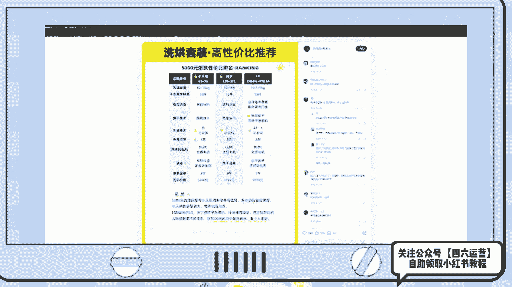

能理解吧？还有其他的啊还有其他的一些细节，我就不一一展开举例了，我们继续去讲。

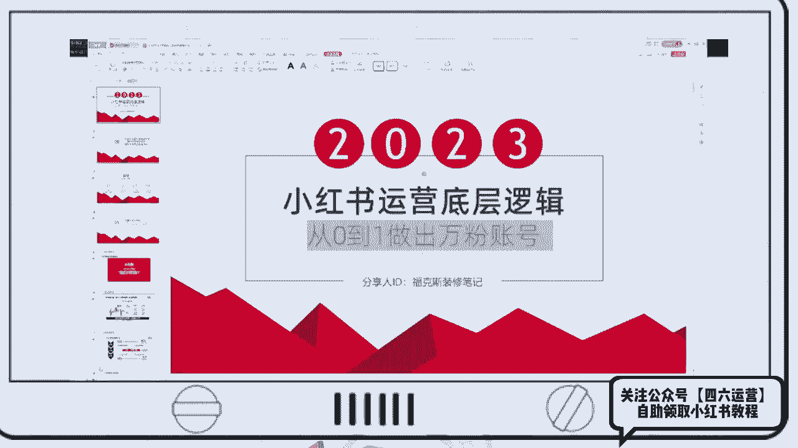

所以到第二步啊，就是。第二步是啥了？就是我们通过我们的内容，是不是获得了报关，我们怎么样去获取这个客户啊？第一步是获得笔记和获取报关。第二步是获取我们的目标用户去添加我们的微信啊。因为我是思域玩法。

我下面讲的私域玩法，但是同样的原理是一样的。比如说我做私域的玩法，我思考的就是。当被一篇笔记被人家被吸引了之后啊，他什么情况会进入主页场更多。然后什么样的内容跟账号，人家会认为不可信不靠谱啊。

什么样的情况你会希望和作者取得联系啊。这些问题都是在我做的过程中，我就会反推的，我会我会自己带入。就比如说我看了十篇笔记，有谁是我想关注的，有谁是我一看这个账号，我就觉得这个人靠谱可信。

有谁的账号是我一看，我就觉得这个人有可能是个骗子，不能信。像刚刚那个我问一下大家啊。你们觉得刚刚那个卖鸭脖的。😡，还记得吧？前面那个搞家加盟的，在别人评论区说自己从负债500万到赚了500万的。

你们觉得那个人是好人还是马扁，告诉我好不好？前面那个卖鸭脖的，你们觉得他是好人还是马扁，他说他自己负债500万一年赚回来。他是好人还是马扁？😊，啊，你们说的是马扁是吧，为啥呢？因为。嗯。

因为第一这个数据太浮夸了。第二，它的主页内容就是搞加盟的。加盟这个东西码扁的概率很大。是不是？所以你们就会感觉说你是会想看，但是他这种东西吧，其实对。对一些有过认知的人，或者说清楚加盟套路的人。

是会让他觉得不可靠的。好，那我们再往后思考，就是什么样的情况让你加微信，你也不会加。以及私信加微信领取资料和主页网盘置顶饭资料，你们会如何取舍？哎，其实这个其实这个问题啊和这个和这个。

我这个戴老师他的操作是一样的。如果你们当时你们有没有想过啊，如果当时你们通过他的抖音账号进了他的粉丝群，他说你们要加个人微信才能发资料。你们一定是有一些人不会去加他的。那戴老师是怎么做的？他是你们进群。

他把链接二维码对吧？发到群里面了，然后只相当于直接把资料给你们了。所以有的时候你会发现说强制别人加微信，再给资料和你只要进去，我就给你。我没有说我要强制链接你的意思，是不是后者更加让人家能够看到真诚。

是不是同样的，你们又可以带着这个思维往后面去思考什么样的情况，你去看小红书笔记的时候。你看着看着，你会打开淘宝店去搜索店铺或者关键词。是不是是吧？你看有人有有人说他说真不想嫁人，是不是？所以就是。

我们要思考的轨迹是什么？我们要思考的轨迹是人心，要思考的轨迹是人心。而不是套路。因为戴老师是真心对你们的，他压根就没想加你们，他就是觉得说我知道小红书怎么做了，我想分享他分享了。哎。

我有一些资料我可以整理给你们，我给你们了，对吧？我想去带一群人去尝试做小红书这个事情，那么谁愿意来谁就来，所以他是真心的，所以我们今天会相遇在这里。所以那到我这后面你知道做思域的话，你还会遇到什么问题？

就是那你加了人之后，你怎么做好友管理，对不对？你要不要建群，群里面的人谁是值得帮助的，每个人的想法都是不一样的。就即便是。咱们的100多个人群，对不对？你会发现啊。有人有不同的价值观的。同样的一个群。

它的利和弊是什么？啊，微信群邀集好友拒绝还是通过这些就是我在做这件事做这个事情的过程中会经常思考的问题。我之所以能思考出答案，能做出答案，是因为我先把这些逻辑想明白，想明白之后再决定我要怎么去做。

然后我再问大家一个问题啊，这三个问题会跟大家相关，精准的用户推给商家，没有成交是谁的问题。是用户的问题还是商价的问题，还是博主的问题？模组把精准的用户推给商家，没有成交是谁的问题？你们能弄明白吗？

Yeah。没错啊，是山架的问题。这里我给大家分享一个事情，就是我在最开始去做这个跑模型的时候啊，就是首先啊我这个装修的过程中，我所添加的粉丝，我是真诚的对他们的。

所以我在做的事情是帮他们找到好的产品去压了价格去给他们做成交，并且我跟他们讲的很明确，我自己的成交价，你不要问我，我肯定比你低，但是我做到一点，我不赚你们的钱。

就是比如说这个市场这个事情这个东西人家商家正价卖1万啊，我可以帮你们谈到9千09千0，但是你不要问我是多少钱买的，因为我也不想骗你，所以我对他们也是真心的。那这个地方我想给大家分享一个什么事。

就是说精准的用户给到商家没有成交，是商家的问题啊，这个大家答案都是对的，那我也不再去展开。所以如果说你们在小红书拿到了精准的流量，你挂了产品没有成交，那就一定是。产品的问题明白吧？啊，以及我也会去思考。

那装修时我们喜欢的东西跟我们想花钱买的东西有什么区别？这句话翻译一下是啥？翻译一下就是比如说我们现在去逛商场去买衣服，买鞋子。我们最后买回来的是我们最喜欢的那一件吗？同学们。很多时候不是。

因为我们最喜欢的衣服，可能你一摸一看吊牌1500一双鞋子，你一看1200。但是我们其实是带着预算去买东西的，可能我最喜欢的是1200。但是我看到有一双鞋只要六七百，它在我的预算内。

所以我会选择买预算范围内的，是不是？所以我会深刻的去研究说我搞装修的过程中，我到底看中了什么，我买了什么，为什么？那为什么我要去思考？因为我要做的是用户成交。不是所有看上的就一定会买。

而我要研究的是成交了什么东西，为什么会成交？而那些容易被别人看上的喜欢的而又成交率很低的。那对我而言就不是好的产品。那还有一个问题啊，就是装修用户想花钱买产品。那为什么要在我推荐的商户这里买呢？

这是不是跟你们的问题有点像小红书的用户在小红书刷笔记，不是只有你们在挂车，为什么要在你们的笔记下面买呢？这个逻辑你们是要想明白的，所以我想的很明白，我告诉我粉丝群的人。我帮你们找的是好产品。

而且我把找产品的这个过程，我有告诉他们。比如说我星期一到哪里看到什么东西，我发给他发到群里，星期二我看到什么，发到群里，星期三我发了什么发到群里。然后我告诉大家，我选哪一个，以及我能拿到的价格是多少。

所以我不是说。因为装修啊跟你们卖的这些东西都不一样，它是一个非常高客单，而且非常。复杂的东西。所以我会把整个的这个选品的过程去分享给他们。然后会明确的告诉他们，这个东西A比B比C的东西它好在哪？差在哪？

然后再去告诉大家，我为什么买A，然后价格是多少？所以在这个过程中啊，像成交的突破，其实对我来说就已经很简单了啊。像这一个粉丝的话，他基本上他家里。这个这个这个这个。啊，这个应该是五六个东西。

跟着我一起买了4个东西。在我看来它是很赚的，因为他没有花任何的时间，我跑油都不知道跑了多少箱油。而且还没赚钱，他还买的比市场价低。而且这个事情我能做成，其实我还是完成了小红书的这个调性，就是真诚分享。

我是真诚的在做事情。我没有说我是因为谁给的佣金高，所以我去帮谁卖，我一定是找到好的东西。然后去告诉他们。啊，这个包括这个成交也是一样的啊，这里啊跟大家讲一个细节，就是当我在21年10月份启动账号的时候。

到22年4月份啊，我整个这个这张图这个PPT是去年4月份那个。年年审过的下个月哦呃5月18号要去杭州，是第三年了。那个展示的认证。我在2月份的时候成交了20万，我在3月份的时候成交了170万。

4月份成交118万。这个数价我觉得不重要，重要的我觉得是这个玩意。这个玩意。为什么我要在4月份的时候去开我前面的成交证明，你们能想到吗？就是当我有了成交之后，我为什么要在4月份的时候去开成交证明。

你们能明白能理解吗？大家思考一下。为什么我会在4月份的时候去开一个成交证明？因为我要借力打力。这个其实跟你们做小红书也好，跟你们以后做任何东西都是有关联的。什么意思？其实真正的山寨不是说你拿很多的钱。

你拿很好的资源去跟别人去拼。真正的三战是什么？我们作为小白起家的，我们作为小白起家的人，包括你们你们要在这个互联网上去赚到钱，你们往往是是以小博大，你们是田忌赛马。

要在局部劣势中去战去产生战争的一个赢家。讲人话就是你要在你没有就三家是什么？他可能是你一万单，我给你多少价，你5000单，我给你多少价，对吧？比如说我们去。信巴买榴莲是吧？你能拿100吨。

我给你多少钱一斤，比如说给你251斤，你只有11000单，那我给你28，你只有100单，我给你31斤，是不是这样的？那真正的山寨，你们要掌握到我如何只有100单的情况下，我要争取到他给我一万单的价格。

为什么要这样子？因为你只有把价格压低了，你有利润空间了，像你们做电商，你有利润空间了，你人做钱人做事的动力是跟你赚多少钱有关系的。你你一个月下来。你上班赚3000，你做小红书赚100。

你第二个也没动力了。你一个月赚3000，你做小红书，一个月赚500你这个月嗷嗷的。所以说真正的山战是你在用小资源的情况下去撬动商家的。好政策。所以说我去开这个证明是要给后面的商家看的。

我已经做到这个成绩，你的这个东西我预估我能做几百万，你干不干？所以说我这个门窗的价格是怎么谈的？我上来我就跟他说，我1000个平方，你能做什么价？😡，我说我家有几套别墅，100个平板，你给我什么价？😡。

好，他就给我一个价格，我说我告诉你，我没有两套别墅，我只有30个平方，但是我有一个小红书账号，你相信我按这个价格给我，我给你再找970个平方。然后给他做到了。

所以这其实是跟大家穿插了一个真正的你在落地过程中的一个商业经验。那你们去做这个小红书是不是一样的。是不是可以拿到自己的一个基础的成交，再去网上去做？那包括思域的复购怎么去做，是不是怎么去做福利真诚。

我去看工地对吧？两款瓷砖一和2就是大家会在一和二之间抉择，你可以理解为两个口红的颜色，我会去拍两个照片去分享给别人。所以人家会把我的内容分享给他妈妈看啊，把他的同事啊。

分享分享给包括我看的东西我都会做很多的东西去分享给他们，就是真诚分享，友好互动。那么最后总结一下啊，就是我觉得作为电商商家一个小红书的一个破冰流程呢，你们要明确内容是有区别的。有的内容是吸引眼球的。

有的内容是调动思维的，有的内容是有下单欲望的这是三种不同的内容。我们到网页上看一下，好吧。

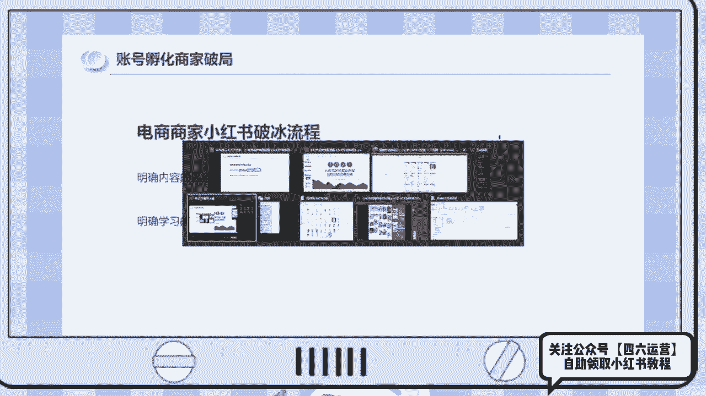

给大家看一下啊，客户怎么来的，给大家展开一下，好吧，这篇笔记。这篇笔记就加了。200号人。来给你们看一下，怎么带你们看一下，记得啊内容的三种形式，内容是有吸引眼球的调动思维的和有下单域的。

如果说你的目标。是去。卖货，那你就要做有下单域的内容。嗯。哎，我们看一下啊。来问你们吧。像这种是吸引眼球，这个茅台是吸引眼球的，还是调动思维的，还是下单域的？

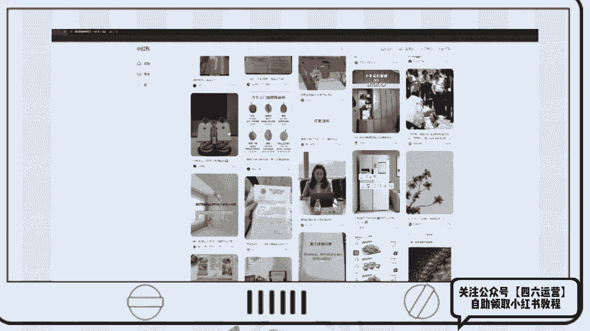

这个茅台它就两片茅台。是吧啥也没写。然后有出互动，有数据，这种属于吸引眼球下单月。还是调动思维啊？

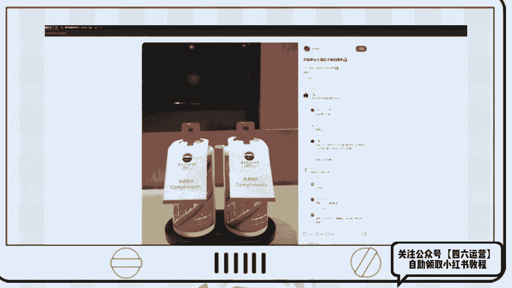

眼球是吧，眼球思维下单这个吸引眼球的。啊，这个呢。2。4万拿下20件家具。这个是眼球思维还是下单月？下单吗？我想问一下大家。这个地方。哪里有下单？哪里有下单？😊，你假设你是一个读者，你从他的评论去看。

哪有别人想找他下单的这个欲望。没有的，有思维，就是人家会去看他里面的东西，有字啊，比如说618双十一的一个购买时间，但是没有找他下单的。是不是他的评论区你们可以看吗？没有没有人找他买。这个是思维。

这个是没有下单的。就是用户对于这个作者来说是没有下单的。这个啥眼球思维下单域。给他找一个。找一个这个有下单域的啊。啊，这种这种这个这个是啥眼球思维下单域。这个啊第一次退茶位费成功结算。

这个是眼球思维下单月。这个是思维啊思维。就是如果你们看了这篇笔记之后，你们会去思考它的这个东西做法对不对？然后这个做法你有没有必要学，你学了有没有用，这个是思维。来，我们要找到。有下单域的东西。

因为你们要卖东西，你们要知道什么叫下单域。如果这个东西都没没有下单域，你做了之后，他没有成交，那太太正常了。看我吧，告诉你们什么叫下单域。随便看。眼球四维下单月能看见这个小字吗？

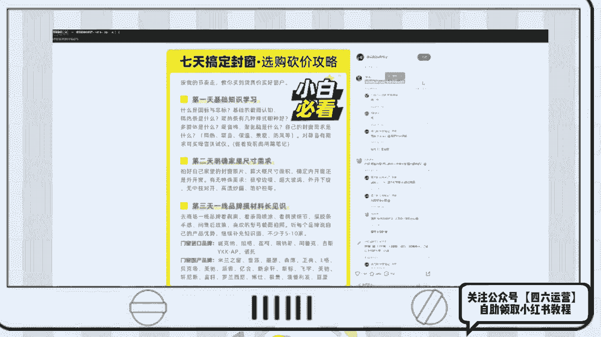

我只想知道结论，长沙买哪家。我只想知道哪里可以安装，同长沙求推荐。

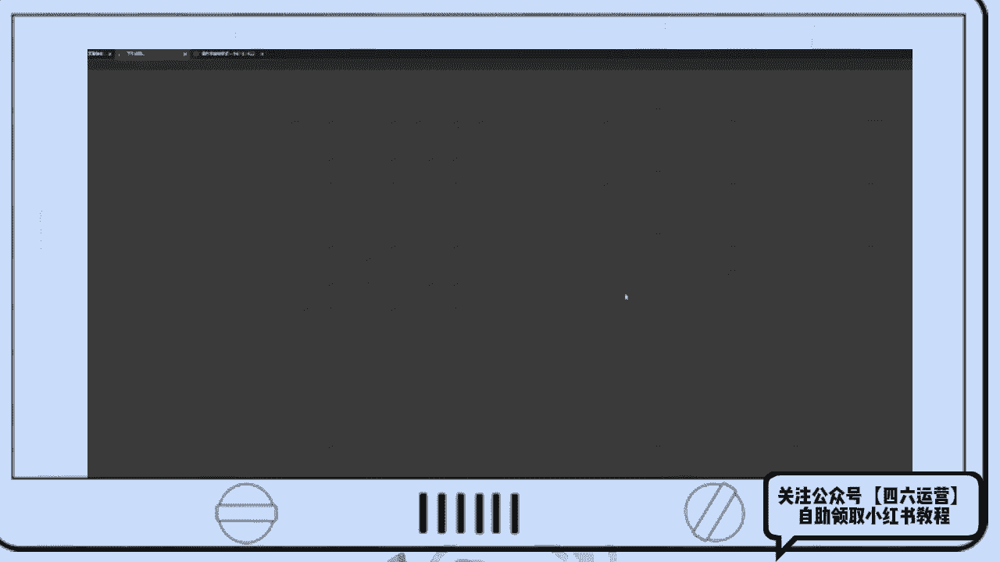

求推荐。求推荐。求推荐。求推荐已关注求推荐求推荐。求推荐。求分享。求推荐。求推荐。求推荐。再看这一篇。我只想知道结论，长沙买哪家。啊，这是同一篇。看这一篇好吧。Yeah。博主同长杀，麻烦拉我进群。

你选好了吗？选哪家，我看吐了，拿不定主意。同长沙想进群。求笔记。再给你们看一下啊。

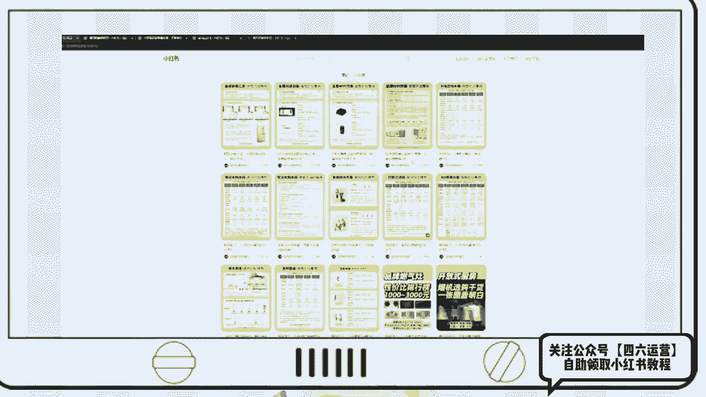

这一篇。求推荐求推荐求推荐啊。所以你们要有意识的去区分吸引眼球调动思维和下单域。如果说你们赚的钱，你们是要赚陌生人的钱，那你们就是下单域。如果说你们想赚粉丝的钱，那么你们需要有调动思维的力和有下单域。

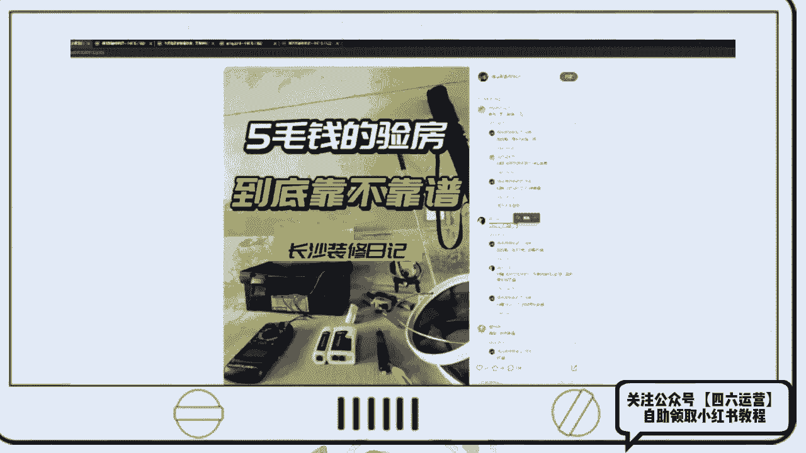

然后接下来你们还要干嘛？你们还要明确学习的账号，明确运营的方向和明确运营的结果。还记得我给你们看的三个卖衣服的吧。如果不管你们自己要做什么，其实就是。四句话，找对标拆爆款多尝试，要坚持。这12句话。

我做任何一个平台，其实就是靠这12个字，先找对标。装修就研究装修，水果研究水果衣服，研究衣服，视频研究视频拆爆款。你要去去猜到别人的这个东西为什么会爆啊，这个东西反正后面还会有老师去分享具体的东西。

但是你知道就是四个是，第三个是多尝试，第四个是要坚持。然后我想问一下大家。告诉我你们这一次的目标是什么，好吗？做出一篇100点赞的笔记，是你们这次的目标，你是小白，你就评论100点赞。

如果是1000点赞就评论1000点赞啊，你们的目标就是只要做出一篇这样数据的笔记就行了。如果你们的目标是做出100粉丝的账号就打100粉丝，1000粉丝就打100粉丝，做100成交就打100成交。

10千成交，就做0千0成交，100利润就打100利润，10千0利润就打1000利润，大家定一下自己的目标，好吗？看一下大家的目标啊。大家都给自己定一下目标，我看一下你们的目标，然后也给后面的这个分享啊。

来确定大家的一个。方向嗯。好的好的，你们打着啊，因为我到时候会去把这个数据啊，我会去分析一下这个尽量啊去帮助大家达到自己的一个目标，好吧，好吧。然后希望大家知道，龟兔赛跑赢的不是兔子，是龟。

有的人他很聪明，但是他可能觉得说。这个事情对他来讲太简单了，他不愿意去做，反而真正出结果的人是坚持不断迭代往后走的人。好，接下来问答环节。大家有问题就提问啊。我讲了75分钟。稍微差了点时。

大家有问题都可提问啊。有人问啊，怎么让人关注涨粉啊，这个问题就是说。当你的内容是对别人有价值的时候。其实这么理解吧这么理解，我这个问题我这么回答你啊，你的问题是怎么让人关注涨粉，你打开你的小红书。

打开你的小红书，打开你的关注列表，你扪心自问，你问你自己，你为什么要关注他？再看第二个人，你为什么要关注他？再看第三个人，你为什么要关注他，你把列表分析完，分析你自己，你心里会有答案。

第二个是一天几篇笔记发布，这个看你自己看你自己。就是内容的发布数量啊，我觉得这个没有固定的一个要求的。你像我如果去写这种原创内容，我基本上我真的三四篇三四天我才能干一篇出来。这个自己把控就好了。

Yeah。啊，有人说做了一个多月，出了三单全退了，又暂停了。这就是我后面说的嘛。要尝试，其实很多时候。你能够出三单，其实就已经代表说你对产品对内容是比不出单的人要强的。这个时候那你要去找这个问题在哪？

出三单退三单是什么原因造成的？就我你可以看到我做这个事情全流程的过程中，我问了自己很多的问题，每个问题我心里都有答案。啊，黑梦问怎么让人产生互动性？互动信我刚刚你你如果后面来的，你看一下回放吧。

我大概在五六十分的时候，我拿我的账号说了，怎么样去调动收藏，调动评论。互动什么？互动就是点赞、收藏、评论、转发、收藏和评论，我都已经给你们看了实际我是怎么做的。啊，有人说我开店一周。

现在每天还有十几二十个的赞。浏览量也是有个几百个，但是一直不出单，不知道该不该换品。这个你就是你要去看具体的东西啊，你这个我没有看到具体的笔记，具体的商品我没办法判断，你也要去查你的这个类目，你不出单。

究竟是你的价格比别人卖的都高。还是说就是说你先确定你的产品有没有问题。如果你看了小红书，同样的产品，你觉得你的质量比它好，或者说相同质量，你的价格比它。就是合适一点，或者说价格也差不多。

你觉得你的产品没问题的情况下，那你再把你的这个报关和笔记内容放大一点。啊，有人问做人社贷的产品必须是一个行业吗？我这么回答你这个问题。对于这个东西啊，我这么回答你。看你这个人的销售能力有多强。

销售的最高境界。是别人相信他这个人，不管他卖什么产品都会去买。你就想一个道理啦。不管是罗永浩也好，还是董雨辉也好，没有说他只能卖一种产品的。销售的最高境界是卖人，卖产品是前期。啊。

有人说我们卖水果怎么有那么多内容？找对标。你在小红书，你去搜产品也好，搜水果也好，搜这个方式也好。其实你们去它是有无限种方法的。包括助理今天在群里买了，你卖水果，你只能去发水果吗？可不可以？

假设我是一个开水果店的，我可不可以发我的，就是说创业日记啊，我开了一个店啊，今天卖了多少单，明天卖了多少单。可不可以发创业日记？我可不可以用另外一种形式，一种心态啊。就是不要把思维局限在啊。

我是卖香蕉的，我就天天拍香蕉，天天拍香蕉。你去小红书搜一下香蕉，你看一下什么样的东西有下单域，只要是有下单域的内容，都是你可以研究的内容。刚开始。小眼睛数多少是正常的。个人理解啊个人理解小眼睛。

我觉得你新发一篇内容。200左右的小眼睛是正常的。如果说你的东西你一发只有100个小眼睛，然后你接着发几篇都只有100个甚至40个、50个。我的经验啊是这个账号的权重是比普通账号要低的。

我会建议你直接注销，重新注册。因为我曾经有一个后面有一个账号，就是这样的，搞了搞了两次，就是一发就是100个、50个、60个。我注销重发注销重发。我第三次我发一篇就在就拍了个窗户，200个小眼睛之后。

我再发同样的内容，那篇笔记点赞加收藏就过百了。Yeah。好，有人说怎样找到适合自己的对标账号？我觉得你们去思考对标账号啊。第一个是。要思考几个问题。第一个是这个账号它是否能够达到你的目标。你的目标。

如果我就是100个点赞，或者说100个粉丝，那只要他能够内容能够吸粉，能够有人互动，那就已经是属于你能够借鉴的对标账号了。如果你的内容是希望卖掉东西的那你就一定要找有下单域的账号。

下单域可以从评论区可以看出来。有下单域的账号里找到之后，比如说你找10个20个里面，再从这一20个账号里面找它的内容，你也能够创作出来的。然后第三个是这个内容它可以持续更新的。再然后。

你不是说然再然后你可以持续去。找你这个赛道的东西，你可以去继续去迭代你的内容。它不是说你一定是固定的一个东西。怎样才能输出更高质量的内容和优化？嗯嗯嗯。我觉得啊你能够输出更高质量的内容和优化。

一定是你对用户要看什么更加。更加理解，又或者说嗯你可以去看，比如说你要去讲一个知识点吧。嗯，举个例子的fabing这个单词。FA。M I LY。那我们同样是英语老师同样是英语老师。

我们去讲单词FLFAMILY。那我不管别的老师怎么讲，我会告诉你怎么去记住这个单词。faly是家庭的意思。F代表father爸爸and motherother，妈妈，I love you。

所以爸爸妈妈我爱你，就是family家庭。那么我用这样的一种方式去讲解family这个单词。是不是一下就比那种纯讲单词的高级多了？那这种内容就会比纯简单词接好。那我会我是怎么来的呢？

是因为我看到了这一条，我当时就觉得这个老师真牛逼。我记得很清楚，我相信我今天告诉你们，family等于father and mother I love you，你们这一辈子都会记住。😡。

最好的内容就是多刷多看多借鉴。更高质量的内容啊，如果你没有原创高质量内容的能力，你就多看看了你就有灵感。好，有人说小红书开店红利能有多久？嗯嗯。其实红利这个词呢它是一个大盘数据，真正你能够赚到钱的人。

其实红利一直存在，因为消费需求是没有改变的，因为人永远有需求。那平台红利的话，我觉得就是到他这个日活月活见顶的时候，我自己啊个人判断我估摸着小红说这个APP我爸妈还是不会去用的。

他们虽然会用抖音会用微信还是不会去用的。所以13亿人减去老老一辈的，我估计到六7亿的这个用户没问题。还有两倍的增长没啥问题吧，2到3倍。有人说权重是经验吗？还能在哪里看到？呃，账号权重是这样的。

不用过于神话。我简单跟你们说一下账号权重什么逻辑啊，就是。我们大家去发内容都是正常权重。但是如果说我的粉丝，我的账号有1万粉丝，也只意味着说我的起始曝光比你们多给一点而已。但后面大家还是公平的。

但是如果说你的账号数据异常，比如说人家发都有2300个条件金，你一发就只有100个几十个，这个就属于账号异常。就这三种情况，一种是大账号有一点点基础的加成。第二个是正常账号，大家其实都没啥区别。

第三个就是异常账号，没有其他的更多的选量了。啊，有人说听完我的接下来怎么做？接下来大义老师还会再去给你们讲详细的定位和内容啊。

我们今天讲的主题是小红书平台运营的底层逻辑和我是怎么样从0到1把账号做到永万粉丝的。啊，有人说小眼睛正常200浏览情况下是发布比就后24小时吗？对，就你发完一天有个200眼睛，你这个账号就是正常的。

然后有人说需要养号的吗？养号这个东西呢严格意义上来讲是个伪命题，但是你可以养一养养号的作用在什么，在告诉平台你要看什么和不看什么。就是比如说我们你像我我做装修。那我就会去看一些装修相关的东西。

比如说设计师，比如说设计方案，而不是去看那个。这个小姐姐是吧，你越看的越多，小姐姐，他越给你推小姐姐，就是还是要让自己在使用这个平台的过程中，自己做的这个类目还是要占据25%到30%的阅读量吧。

我觉得其他的你想看什么还是可以照照常看的。好吧。那我看大家没有什么太多的问题了。那今天的分享就到这里，感谢大家啊，接下来还会有大益老师去给大家分享账号定位以及更多的实战干货。

这一次所有的三位老师全是实战牌，没有一个理论牌，好吧，谢谢大家。😊。

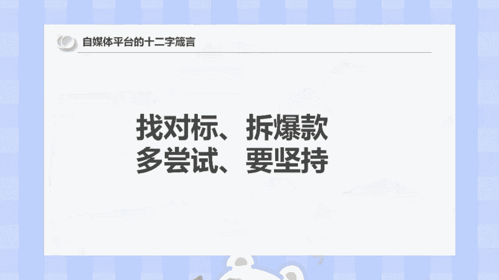