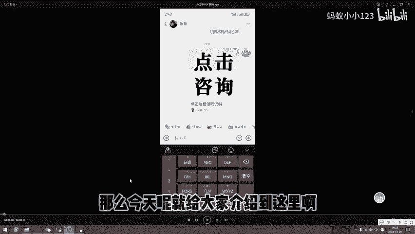

# 小红书运营：私信卡片方法，把客户安全转到私域！ - P1 - 蚂蚁小小123 - BV1dT4ueVEJa

大家好啊，今天给大家讲解一个小红书比较安全的引流方法。因为现在小红书的账号是非常珍贵的。你封进了之后呢，既不可以换绑，也不可以注销。它不像之前那样了啊，所以说大家一定要珍惜好自己的小红书账号。

不要随意的进行引流。可能看到有些客户来咨询我们之后呢，我们会迫不及待的想把我们的联系方式发给他。那么怎么发呢？今天给大家讲解一个安全的方法。首先来给大家展示一下啊。

好，这个方法呢就是我们的私信卡片跳转微信，非常的安全。大家可以看一下我们的演示。首先如果说有用户来咨询我们的话呢，我们会给他发一个类似的卡片。大家看到了吧？好，发送卡片，它点击之后呢会出现这样一个情况。

哎，首先跳转到小红书的官方网页。这一步呢是为了防止小红书官方检测的。好，那么等一会儿呢就会跳转到我们的小程序，然后跳转出我们的二维码。这个时候呢用户可以识别二维码，添加到我们。非常的方便啊。

基本上弹出二维码之后呢，客户加我们的概率呢是非常高的。那么目前这个方法呢，它这个举报是不成立的。我们测试过很多次了，非常的安全。就是价格稍微有点贵呀。大概是300块到500块1年。

因为它这个跳转的链接呢是需要服务器承载的。所以说呢它的价格呢目前来说稍微高一些，但是呢非常的安全好用，并且直接发联系方式啊，或者说以其他的办法把联系方式发给我们的客户啊，这样呢会安全很多。

大家有需要的话呢，可以完全利用一下这个方法，目前来说是非常好用的。我们亲测呢举报也是不会被封号的。大家如果说需要这种卡片的话呢，完全可以在网上定制啊，也可以来找我。好，那么今天呢就给大家介绍到这里啊。

非常的简单好用。感谢大家的学习和观看。

