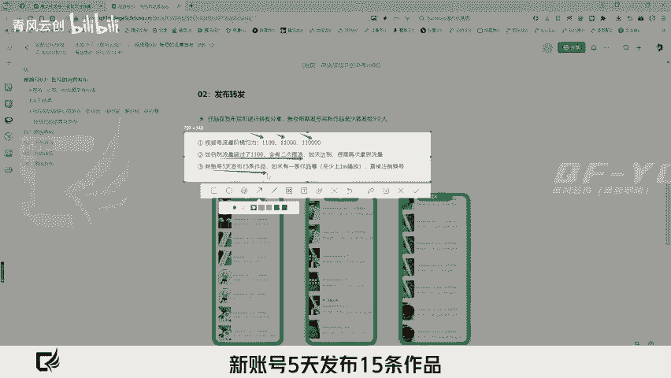
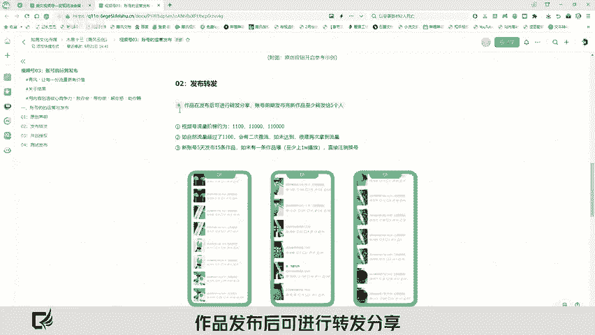
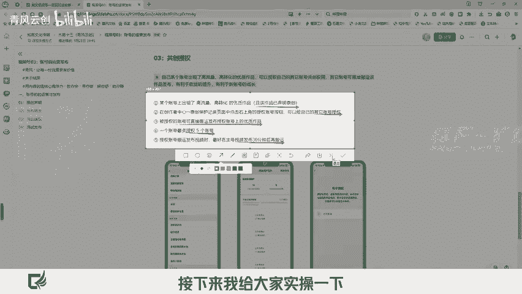
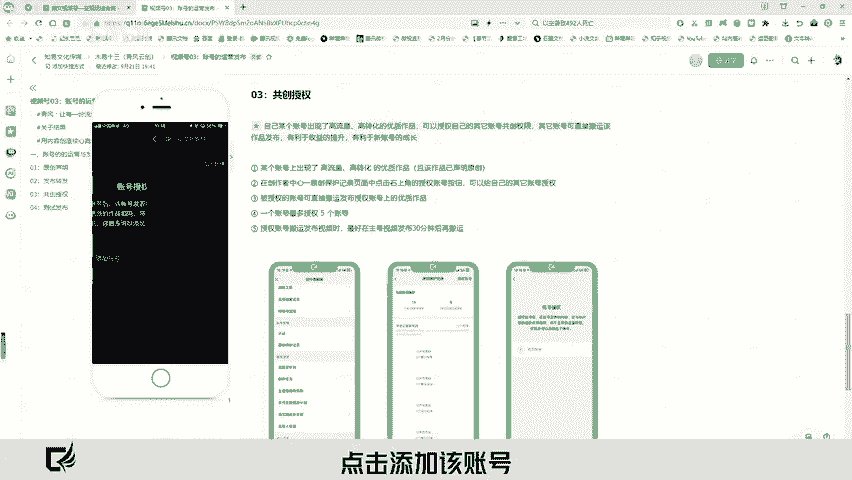
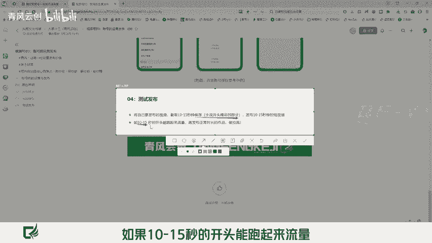
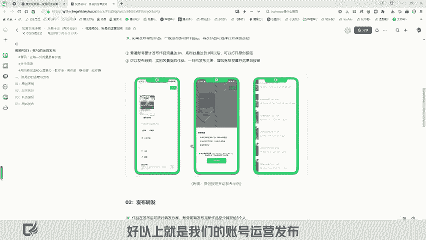

# 小说推文教程『视频号』的运营技巧 - P1 - 青风云创 - BV1ExyAYfEQf

🎼hello大家好，欢迎您访问清风学院用内容打造核心竞争力，让每一份流量各为价值。本期课程我将分享视频号运营发布。大家在发布作品后，是不是总觉得自己的流量一般，作品只有基础流量且拿到的结果较少。

甚至我们做了半个月根本没有结果。那么账号出击如何做好运营发布，才可以快速打破流量缺口，进而提升咱们的转化率。首先我从第一点开始，原创声明给大家讲一下，如果你的原创度较低，尽量不要开通原创按钮。

作品处理的较细，拼接的素材较多的情况下才可以开通。第二点，初击发布原创作品，一般发布到3条作品后，再次发布作品才可以打开咱们的原创按钮。那么打开原创需要达到以下两种条件。其中之一，第一。

普遍账号累计发布作品流量达到1万或者粉丝达到100以后才可以打开原创按钮。第二，可以发布咱们的自拍实拍风景类的作品一日内发布3条，增加咱们的账号权重，开启咱们的原创按钮。那接下来我给大家实操演示一下。

首先，打开我们自己的视频号，点击右上角找到发表视频，点击选择我们的成品视频点下一步。😡。

🎼点击完成，接下来往下滑，我们就可以看到原创声明，只要将这个按钮打开，同意我们的声明原创就可以了。好，以上就是我们的原创声明。接下来我们来讲发布转发视频号流量阶梯约为三个阶段，第一个阶段呢是1100。

第二个阶段是100。第三个阶段呢是11万。那如果自然流超过了1100会有二次推流。那如果没有达到的话，很难再次拿到流量。那第三点，新账号5天发布15条作品，如果有一条作品至少达到1万以上的播放。

那直接注销换号作品发布后可进行转发分享，账号前期发布完作品至少要转发给5个人。以上就是咱们的发布转发。那么接下来我们来说一下共创授权。当自己的某个账号出现了高流量高转化的优质作品。

咱们就可以授权自己的其他账号进行共创授权，那么其他账号呢也可以搬运该作品发布，有利于咱们的收益提升，更有利于新账号的成长。我把共创授权总结了以下5点。首先第一，某个账号上出现了高流量高转化的优质作品。

注意了，且该作品以声明原创。第二点，在创作者中期。😡。

原创保护页面记录当中找到右上角的授权按钮，可以给自己的其他账号进行授权。第三点，被授权的账号可以直接搬运发布授权账号上的优质作品。第四，一个账号最多授权5个账号。第五，授权账号搬运发布视频时。

最好在主号视频发布30分钟后再次进行搬阅。接下来我给大家实操一下，如何打开咱们的授权按钮。打开我们视频号点击右上角向下滑找到创作者中心，点击进入，找到创作者服务，点击更多向下滑有原创保护记录，点击进入。

在右上角点击授权账号，点击添加该账号。好，以上是我们的共创授权。接下来我们说一下测试发布。第一，将自己要发布的作品呢，截取10到15秒钟进行保存。这个内容呢为小说开头精彩的部分，发布我们的短视频作品。

第二点，如果10到15秒的开头能跑起来流量，再发布我们正常时长的作品做拉里。好，以上就是我们的账号运营发布，感谢各位朋友们的耐心聆听，清风陪伴日入过万，我们下期再见。😊。

